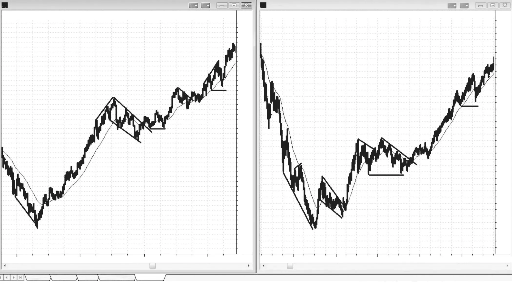
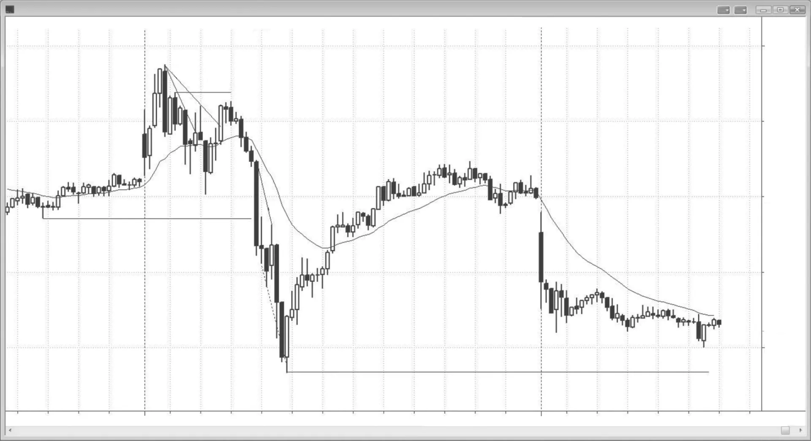
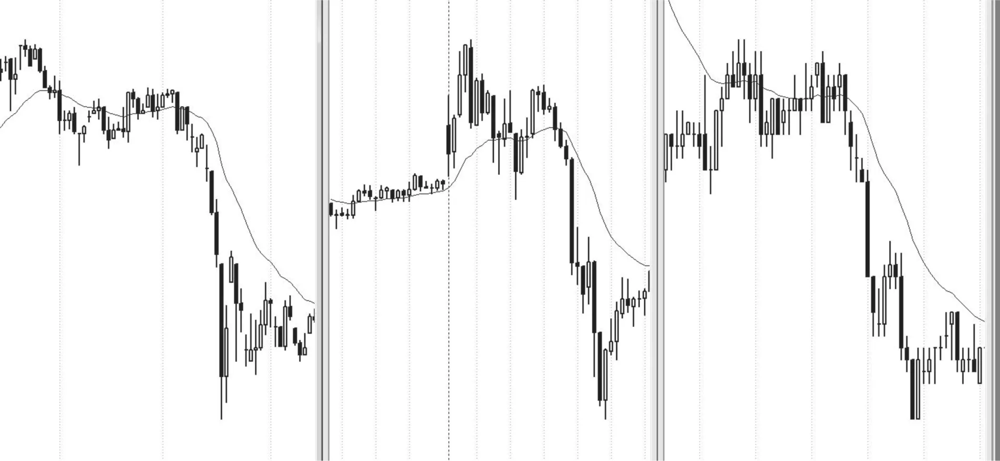

## 导论

<!-- Source PDF pages 33–66 -->
<!-- Introduction -->

<!-- PDF page 33 -->

之所以没有其他由交易者本人撰写的、关于价格行为的全面著作，是有原因的。那需要数千个小时，而与交易本身相比，经济回报微薄。不过，我的三个女儿如今都已离家读研究生，我有了需要填补的空白，而这项工作一直令人非常充实。我最初计划更新《逐根K线解读价格图表》（Reading Price Charts Bar by Bar，John Wiley & Sons，2009）第一版，但深入之后，我决定改为详尽阐述我如何看待并交易市场。从比喻上说，我是在教你如何拉小提琴。靠此谋生所需的一切都写在这些书里，但你必须亲自投入无数小时去学习这门手艺。在我的网站 www.brookspriceaction.com 上回答了交易者提出的数千个问题之后，我认为自己找到了更清晰表达想法的方式，这几本书也应当比那一本更好读。较早那本书侧重解读价格行为，而本系列则围绕如何用价格行为来交易市场。由于篇幅增长到第一本书四倍以上的字数，John Wiley & Sons 决定将其拆成三本。第一本讲价格行为基础与趋势；第二本讲震荡区间、订单管理与交易数学；最后一本讲趋势反转、日内交易、日线图、期权，以及适用于所有时间框架的最佳交易形态。许多图表也出现在《逐根K线解读价格图表》中，但多数已更新，关于图表的讨论也大体重写。那本书约 12 万词中，只有大约 5% 出现在本系列约 57 万词里，因此读者几乎不会感到重复。

我撰写这三本系列的目标，是说明为什么经过精心挑选的交易具有出色的风险/回报比，并给出从这些形态中获利的方法。我希望材料对专业交易者和商学院学生都有吸引力，也希望刚起步的交易者能找到一些有用的想法。人人都看价格图表，但通常只是匆匆一看，且带着特定或有限的目的。然而，每张图都蕴含惊人的信息量，可用于做出盈利交易，但

<!-- PDF page 34 -->

其中许多信息只有在交易者花时间仔细理解图上每一根K线在告诉他们机构资金在做什么时，才能有效使用。

大型市场中 90% 或更多的交易由机构完成，这意味着市场本身就是机构的集合。几乎所有机构长期都是盈利的，少数不盈利的很快就会出局。既然机构是盈利的，而它们就是市场，你所做的每一笔交易，对手方都是一个盈利的交易者（机构集合中的一部分）。没有一家机构愿意做一边、另一家愿意做另一边，交易就无法发生。个人的小成交量交易，只有在某家机构也愿意做同一方向时才能成交。若你想在某一价位买入，市场只有在一家或多家机构也想在该价位买入时才会到那个价。你也无法在任何价位卖出，除非有一家或多家机构愿意在那里卖出，因为市场只能到达既有机构愿意买、又有机构愿意卖的价位。若 Emini 在 1,264，你持有多头，保护性止损卖单设在 1,262，你的止损只有在也有机构愿意在 1,262 卖出时才会被触发。这对几乎所有交易都成立。

若你交易 200 张 Emini 合约，你就是在以机构规模交易，实质上就是机构，有时能把市场推动一两个 tick。但多数个人交易者，无论交易得多么愚蠢，都没有能力推动市场。市场不会去追杀你的止损。市场可能测试你保护性止损所在的价位，但与你的止损无关。它只会在一家或多家机构认为在那里卖出在财务上合理、而另一些机构认为在那里买入有利可图时，才测试那个价。每一个 tick，都有机构在买、也有机构在卖，而且它们都有已被证明能通过这些交易赚钱的系统。你应始终顺着机构资金的多数方向交易，因为它们控制着市场走向。

一天结束时，你看当日图表打印稿，如何判断机构在白天做了什么？答案很简单：市场上涨时，机构资金的主体在买；市场下跌时，更多资金进入卖出。只需看图上任何一段上涨或下跌，研究每一根K线，你很快会发现许多可重复的模式。随着时间推移，你会开始在实时中看到这些模式展开，那会给你下单的信心。有些价格行为很微妙，因此要对各种可能保持开放。例如，有时市场在向上推进，某根K线会跌破前一根K线的低点，但趋势仍继续向上。你必须假定大资金在那根前一根K线的低点及以下在买入，许多有经验的交易者也在那样做。他们恰好在弱势交易者止损离场、或另一些弱势交易者因相信市场开始下跌而做空的地方买入，

<!-- PDF page 35 -->

一旦你习惯于“强趋势中常有回撤、大资金在买回撤而不是卖回撤”这一想法，你就会处于做出一些你以前认为完全错误的出色交易的位置。不必想得太复杂。若市场在上涨，机构就在持续买入，哪怕在你认为该带着亏损止损离场多头的时候也是如此。你的工作是跟随它们的行为，不要用过多逻辑去否认眼前正在发生的事。它看起来是否反直觉并不重要。重要的只是市场在上涨，因此机构以买入为主，你也应如此。

机构通常被视为聪明资金，意思是它们聪明到能靠交易谋生，且每天交易巨额成交量。电视仍用“机构”指传统机构，如共同基金、银行、经纪行、保险公司、养老基金和对冲基金；这些公司曾占大部分成交量，且主要按基本面交易。它们的交易控制着日线图和周线图的方向，以及许多大的日内波段。大约十年前，多数交易决策和交易本身由非常聪明的交易者完成，但现在越来越多地由计算机完成。它们有能即时分析经济数据并据此立即下单的程序，整个过程无需人参与。此外，另一些公司用基于价格行为统计分析的计算机程序交易巨额成交量。计算机生成的交易如今可占当日成交量的 70%。

计算机非常擅长做决策；下国际象棋和在《危险边缘！》中取胜，都比交易股票更难。加里·卡斯帕罗夫（Gary Kasparov）多年里做出了世界上最好的国际象棋决策，但一台计算机在 1997 年做出了更好的决策并击败了他。肯·詹宁斯（Ken Jennings）被誉为有史以来最伟大的《危险边缘！》选手，但一台计算机在 2011 年彻底击败了他。计算机被广泛接受为机构交易最佳决策者，只是时间问题。

由于程序使用客观的数学分析，支撑与阻力区域应趋于更清晰界定。例如，随着更多成交量基于精确数学逻辑交易，等幅运动投射应更精确。此外，随着程序在日线图上买入小回撤，可能出现更持久的窄通道倾向。然而，若足够多的程序在同一关键价位退出多头或做空，抛售可能变得更大、更快。变化会剧烈吗？大概不会，因为同样的总体力量在一切都手工完成时就已在运作；但随着更多情绪被从交易中移除，仍应有某种向数学完美的靠拢。随着这些其他公司对市场运动的贡献越来越大，传统机构也越来越多地用计算机分析并下单，“机构”一词变得模糊。对个人交易者来说，更好的是把机构想成任何以足够大成交量对价格行为有显著贡献的实体。

由于这些买入与卖出程序产生了大部分成交量，它们是每张图表外观最重要的贡献者，并为个人投资者创造了大部分交易机会。是的，知道思科系统（Cisco Systems，CSCO）财报强劲并在上涨是好事；若你是想持有数月的投资者，就按传统机构的做法买入 CSCO。但若你是日内交易者，就忽略新闻、看图表，因为程序会创造出纯粹基于统计、与基本面无关却提供绝佳交易机会的形态。基于基本面下单的传统机构，决定了股票在未来数月的方向与大致目标，但越来越多地，用统计分析做日内和其他短线交易的公司，决定了通向该目标的路径以及这波行情的最终高点或低点。即便在宏观层面，基本面充其量也只是大致的。看看 1987 年和 2009 年的崩盘。两者都有剧烈抛售与反弹，但基本面并未在同样短的时间内剧烈变化。两种情况下，市场都略微跌破月线趋势线，并从该线急剧反转向上。市场因感知到的基本面而下跌，但下跌的幅度由图表决定。

在所有时间框架和所有市场中，有一些大形态反复出现，如趋势、震荡区间、高潮和通道。也有大量可交易的较小形态，仅基于最近几根K线。这些书是全面指南，帮助交易者理解图表上看到的一切，从而有更多机会做盈利交易并避开亏损交易。

我能传递的最重要信息是：专注于绝对最好的交易，避开绝对最差的形态，使用至少与保护性止损（风险）一样大的止盈目标（回报），并努力增加你交易的股数或合约数。我坦率承认，我对每个形态背后的理由都只是我的看法，我对某笔交易为何有效的解释可能完全错误。但这无关紧要。重要的是，解读价格行为是一种非常有效的交易方式，而我仔细思考过为何某些事情会以那样的方式发生。我对解释感到自在，它们在我下单时给我信心；然而它们与我是否下单无关，因此对我来说是否正确并不重要。正如我能在瞬间改变对市场方向的看法，若我遇到更合逻辑的理由或发现逻辑漏洞，我也能改变对某一形态为何有效的看法。我给出这些看法，是因为它们似乎说得通，可能帮助读者更自在地交易

<!-- PDF page 36 -->

<!-- 本页正文已并入相邻页中文段落或为纯图页 -->
<!-- PDF page 37 -->

某些形态，也可能在智识上有启发，但任何价格行为交易都不需要它们。

这些书写得非常详尽、难以阅读，面向希望尽可能多地学习解读价格图表的认真交易者。然而，这些概念对各个层次的交易者都有用。书中涵盖了罗伯特·D·爱德华兹（Robert D. Edwards）与约翰·麦基（John Magee）（《股票趋势的技术分析》，Technical Analysis of Stock Trends，AMACOM，第 9 版，2007）等人描述的许多标准技巧，但更侧重单根K线，以展示它们提供的信息如何显著改善交易的风险/回报比。多数书在一张图上只指出三四笔交易，暗示图上其他一切都不可理解、无意义或风险过大。我相信，日内发生的每一个 tick 都有可学之处，每张图上的出色交易远不止那几个显而易见的；但要看到它们，你必须理解价格行为，不能把任何K线视为无关紧要。我通过显微镜做了数千台手术才学到：最重要的东西有时可以非常小。

我逐根K线读图，寻找每一根K线告诉我的任何信息。它们都很重要。每根K线结束时，多数交易者会问自己：“刚才发生了什么？”对多数K线，他们的结论是此刻没有值得交易的东西，因此不值得费力去理解。他们选择等待更清晰、通常也更大的形态。仿佛他们相信那根K线不存在，或把它当作个人交易者无法交易的机构程序活动而打发掉。在这些时段他们不觉得自己是市场的一部分，而这些时段构成了一天的绝大部分。然而，若看成交量，他们所忽视的那些K线，与他们据以下单的K线成交量一样大。显然有大量交易在发生，但他们不明白这如何可能，实质上假装它不存在。但这是否认现实。交易始终在发生，作为交易者，你有义务理解它为何发生，并想办法从中赚钱。学习市场在告诉你什么非常耗时且困难，但它给你成为成功交易者所需的基础。

与多数蜡烛图书籍——多数读者感到必须死记形态——不同，我的这三本书给出了为何特定形态对交易者是可靠设置的理由。有些术语对市场技术分析师有特定含义，对交易者则不同，而我完全从交易者视角写作。我确信许多交易者已经理解这些书中的一切，但大概不会以我同样的方式描述价格行为。成功交易者之间没有秘密；他们都知道常见形态，许多人对每一个都有自己的名字。他们都在差不多同一时间买入和卖出，捕捉同样的

<!-- PDF page 38 -->

波段，并且都有各自进场的理由。许多人凭直觉交易价格行为，从未觉得有必要说明某一形态为何有效。我希望他们喜欢阅读我对价格行为的理解与视角，并因此获得一些能改善他们本已成功的交易的洞见。

多数交易者的目标，是通过与自身性格相容的风格最大化交易利润。没有那种相容，我认为几乎不可能长期盈利交易。许多交易者想知道需要多久才能成功，并愿意在一段时间甚至几年里亏钱。然而，我花了十多年才得以成功交易。我们每个人都有许多顾虑和分心之事，因此时间会不同，但交易者必须克服多数障碍，才能持续盈利。我曾有几个必须纠正的主要问题，包括抚养三个出色的女儿——她们总是占据我的思绪，以及作为父亲我该做什么。随着她们长大并更独立，这解决了。然后我花了很长时间才接受许多性格特质是真实且不可改变的（或至少我得出结论：我不愿意改变它们）。最后还有信心问题。我在许多事情上一直自信到近乎傲慢，认识我的人会惊讶这对我竟是困难的。然而内心深处，我曾相信自己永远找不到一种我愿意多年愉快使用的、持续盈利的方法。于是我买了许多系统，编写并测试了无数指标和系统，读了许多书和杂志，参加研讨会，聘请导师，加入聊天室。我与自称为成功交易者的人交谈，但我从未见过他们的账户对账单，怀疑多数人能教但很少人——如果有的话——能交易。通常在交易中，懂的人不说，说的人不懂。

这一切都极其有用，因为它展示了在成功之前我需要避开的所有东西。任何非交易者看图表，总会认为交易必定极其容易，这正是其吸引力的一部分。一天结束时，任何人看任何图都能看到非常清晰的进场与出场点。然而，在实时中做则难得多。人天生想在精确低点买入，且永远不希望交易回头。若回头了，新手会平仓止损以避免更大亏损，导致一连串亏损交易，最终毁掉账户。使用宽止损在某种程度上解决了这个问题，但交易者很快会撞上几次大亏，进入亏损状态，并害怕继续用那种方法。

你是否该担心，把这些书中的信息公开会造就大量优秀的价格行为交易者，他们在同一时间做同一件事，从而消除推动市场到达你目标价所需的后进者？不会，因为机构控制着市场，它们已经拥有世界上最聪明的交易者，而这些交易者已经知道这些书中的一切，至少凭直觉知道。在每一刻，都有一个极其聪明的机构多头，在与一个极其聪明的机构空头所下的交易对手方。由于最重要的参与者已经知道价格行为，有更多人知道也不会使天平向一边或另一边倾斜。因此，我不担心我所写的会让价格行为失效。正因为那种平衡，任何人拥有的优势永远都极其微小，任何小错误都会导致亏损，无论一个人读图有多好。虽然不理解价格行为很难靠交易赚钱，但仅有那种知识还不够。交易者学会读图之后，还要花很长时间才能学会交易，而交易与读图一样难。我写这些书是为了帮助人们更好地读图、更好地交易；若你两者都做得好，你就配得上把别人账户里的钱放进自己的账户。

我们都看到的形态之所以会以那样的方式展开，是因为在一个有无数交易者、出于成千上万不同理由下单、但控制性成交量基于合理逻辑交易的有效市场中，就是会呈现出那种外观。它看起来就是那样，而且一直如此。同样的形态在全世界所有市场的所有时间框架中展开，若要在如此多不同层面上瞬间全部被操纵，简直不可能。价格行为是人类行为的表现，因此实际上有遗传基础。在我们进化之前，它很可能大体保持不变，正如我看过的 80 年图表中它一直未变。程序化交易或许略微改变了外观，尽管我找不到支持该理论的证据。如果说有什么，它会让图表更平滑，因为它没有情绪，并极大增加了成交量。既然大部分成交量由计算机自动交易，且成交量如此巨大，非理性与情绪行为在市场中可忽略，图表是人类倾向更纯粹的表达。既然价格行为来自我们的 DNA，在我们进化之前它不会改变。

当你看图 I.1 中的两张图时，第一反应可能是它们只是普通图表，但请看底部的日期。这些来自大萧条时代和二战时期的道琼斯工业平均指数周线图，与我们今天在所有图表上看到的形态相同，尽管今天大部分成交量由计算机交易。

若人人突然都变成价格行为剥头皮交易者，较小形态可能会暂时略有变化，但随着时间推移，有效市场会胜出，所有交易者的投票会提炼成标准价格行为形态，因为那是无数人合乎逻辑行为的不可避免结果。此外，现实是很难交易得好；虽然基于价格行为交易是稳健方法，在实时中成功做到仍然非常困难。

<!-- PDF page 39 -->

<!-- 本页正文已并入相邻页中文段落或为纯图页 -->
<!-- PDF page 40 -->

图 I.1
价格行为并未随时间改变

长期来看，不会有足够多的交易者在同一时间都做得足够好，从而对形态产生任何显著影响。只需看看爱德华兹与麦基。世界上最好的交易者几十年来一直在使用那些想法，它们继续有效，原因相同——图表之所以看起来那样，是因为那是充满大量聪明人、使用大量方法和时间框架、都在尽力赚最多钱的有效市场不可改变的指纹。例如，老虎·伍兹（Tiger Woods）并没有隐瞒他在高尔夫中的任何做法，任何人都可以自由模仿他。然而，很少人能把高尔夫打得足以靠此谋生。交易也是如此。交易者可以几乎知道一切该知道的东西，却仍然亏钱，因为以持续赚钱的方式运用所有这些知识非常困难。

为何这么多商学院继续推荐爱德华兹与麦基，而他们的书本质上相当简化，大体用趋势线、突破和回撤作为交易基础？因为有效，而且一直有效，也将永远有效。既然几乎所有交易者都有能获取日内数据的计算机，许多那些技巧可以改编用于日内交易。此外，蜡烛图额外提供关于谁在控制市场的信息，从而带来更及时的进场和更小的风险。爱德华兹与麦基的重点是整体

<!-- PDF page 41 -->

趋势。我使用同样的基本技巧，但更密切关注图上的单根K线以改善风险/回报比，并大量关注日内图表。

对我来说显而易见：若有人能足够好地读图，恰好在行情启动且不会回头的精确时刻进场，那么该交易者将拥有巨大优势。他会有很高的胜率，少数亏损也会很小。我决定以此为起点，而我发现：什么都不需要添加。事实上，任何添加都是干扰，会降低盈利能力。这听起来如此明显而容易，以至于多数人难以相信。

我是日内交易者，完全依赖日内 Emini S&P 500 期货图表上的价格行为，并相信很好地解读价格行为对所有交易者都是无价技能。初学者往往有根深蒂固的信念，认为还需要更多，或许是某种很少人使用的复杂数学公式，才能给他们恰好需要的优势。高盛（Goldman Sachs）如此富有而精巧，其交易者一定有超级计算机和强力软件，确保所有个人交易者注定失败。他们开始看各种指标，并调整参数以定制得恰到好处。每个指标有时都有效，但对我而言，它们混淆而不是阐明。事实上，甚至不看图表，你也能下买单，并有 50% 的正确概率！

我并非因不了解指标的微妙而否定指标和系统。多年来我花了超过 1 万小时编写和测试指标与系统，那大概远多于多数人的经验。这种对指标和系统的广泛经验，是我成为成功交易者的必要部分。指标对许多交易者有效，但最好的成功来自交易者找到与自身性格相容的方法。我对指标和系统最大的问题是，我从未完全信任它们。在每一个形态处，我都看到需要测试的例外。我总想从市场中榨取最后一分钱，若能加入新花样使系统更好，就从不满足于系统的回报。你可以不断优化，但由于市场总在强趋势与窄幅震荡区间之间来回切换，而你的优化基于最近发生的事，市场一旦转入新阶段，它们很快就会失效。我太控制欲强、强迫、不安、观察敏锐且不信任，以至于长期无法靠指标或自动化系统赚钱，但在许多方面我都处在极端，多数人没有同样的问题。

许多交易者，尤其是初学者，被指标（或任何其他他们想相信会保护他们、并以给他们很多钱来显示对他们作为人的爱与认可的更高力量、大师、电视专家或通讯）所吸引，希望指标告诉他们何时进场。他们没有意识到，绝大多数指标基于简单的价格行为，而我在下单时，根本无法想得足够快以处理几个指标可能告诉我的东西。若有多头趋势、回撤，然后涨到新高，但上涨有很多重叠K线、许多空头实体、几次小回撤，以及K线顶部明显的影线，任何有经验的交易者都会看出这是对趋势高点的弱势测试，若多头趋势仍强本不该如此。市场几乎肯定在转入震荡区间，也可能转入空头趋势。交易者不需要振荡指标来告诉他们这些。此外，振荡指标往往让交易者寻找反转，并更少关注价格图表。在多数有两三次持续一小时或更久的反转的日子里，这些可以是有效工具。问题出在市场强势趋势时。若你太关注指标，你会看到它们整天形成背离，并可能反复逆势进场而亏钱。等你接受市场在趋势中时，当天已没有足够时间挽回亏损。相反，若你只看柱状图或蜡烛图，你会看到市场明显在趋势，不会被指标诱惑去找趋势反转。最常见的成功反转，首先以强动能跌破趋势线，然后回撤测试极值；若交易者太关注背离，往往会忽视这一基本事实。在没有先前逆势动能冲击并跌破趋势线的情况下因背离而交易，是亏损策略。等待趋势线突破，再看对旧极值的测试是反转还是旧趋势恢复。你不需要指标告诉你这里的强反转是高概率交易，至少对剥头皮如此，而且几乎肯定会有背离，那为何还要把指标加入计算使思考复杂化？

一些专家推荐时间框架、指标、波浪计数与斐波那契回撤和延伸的组合，但到下单时，他们只有在出现良好价格行为形态时才会做。此外，当他们看到良好价格行为形态时，就开始寻找显示背离的指标、不同时间框架的均线测试、波浪计数或斐波那契形态来确认眼前所见。实际上，他们是价格行为交易者，只在一张图上完全按价格行为交易，但不愿坦然承认。他们把交易复杂化到一定程度，肯定错过许多、许多交易，因为过度分析使他们没有时间下单，不得不等待下一个形态。把简单变得如此复杂，逻辑上说不通。显然，添加任何信息都可能导致更好的决策，许多人或许能在决定是否下单时处理大量输入。仅因简单意识形态而忽视数据是愚蠢的。目标是赚钱，交易者应尽一切所能最大化利润。我根本无法在准确下单所需时间内很好地处理多个指标和时间框架，而我发现仔细解读单张图对我远更有利可图。此外，若依赖指标，我发现自己在价格行为解读上变懒，并经常错过显而易见的东西。价格行为远比任何其他信息重要；若为了从别的东西获取信息而牺牲它告诉你的一部分，你很可能在做糟糕的决定。

初学者最沮丧的事情之一是一切都如此主观。他们想找到一套保证盈利的清晰规则，并讨厌某一形态在某一天有效、在另一天失败。市场非常有效，因为有无数非常聪明的人在玩零和游戏。交易者要赚钱，必须持续好于大约一半的其他交易者。由于多数竞争对手是盈利的机构，交易者必须非常出色。只要存在优势，它很快就会被发现并消失。记住，必须有人在做你交易的对手方。他们不会花太久就弄清你的神奇系统，一旦弄清，就会停止把钱给你。交易的吸引力部分在于它是优势非常小的零和游戏，而能发现并利用这些微小、转瞬即逝的机会，在智识上令人满足、在财务上有回报。这可以做到，但非常辛苦，需要不懈的纪律。纪律只意味着做你不想做的事。我们都有智识好奇心，天生想尝试新事物或不同事物，但最优秀的交易者抵制诱惑。你必须坚持规则、避免情绪，并耐心等待只做最好的交易。在一天结束看打印图时，这一切看起来容易做到，但在实时中逐根K线等待、有时一小时一小时地等待，则非常困难。一旦出现出色形态，若你分心或陷入自满，你就会错过，然后被迫等得更久。但若你能培养耐心和纪律去遵循稳健系统，利润潜力巨大。

有无数方式靠交易股票和 Emini 赚钱，但都需要运动（嗯，做空期权除外）。若你学会读图，每天无需知道某家机构为何启动趋势、也无需知道任何指标在显示什么，就能捕捉大量这些盈利交易。你不需要这些机构的软件或分析师，因为它们会向你展示它们在做什么。你只需搭它们的便车，就会盈利。价格行为会告诉你它们在做什么，并让你以紧止损早期进场。

我发现，在下单时把需要考虑的东西减到最少，能持续赚更多钱。我只需要笔记本电脑上的一张图，除 20 周期指数移动平均线（EMA）外没有任何指标，

<!-- PDF page 42 -->

<!-- 本页正文已并入相邻页中文段落或为纯图页 -->

<!-- PDF page 43 -->

<!-- 本页正文已并入相邻页中文段落或为纯图页 -->
<!-- PDF page 44 -->

它不需要太多分析，每天能澄清许多良好形态。有些交易者可能也看成交量，因为异常大的成交量尖峰有时出现在空头趋势末段附近，接下来的一两个新摆动低点往往提供有利可图的多头剥头皮。日线图上抛售过度时，有时也会出现成交量尖峰。然而，它不够可靠，不值得我关注。

许多交易者只在交易背离和趋势回撤时考虑价格行为。事实上，多数使用指标的交易者不会在没有强信号K线时交易，而若背景正确，许多会在强信号K线上进场，即使没有背离。他们喜欢看到大反转K线上的强收盘，但实际上这相当罕见。理解价格行为最有用的工具是趋势线和趋势通道线、先前高点和低点、突破与失败突破、蜡烛图实体与影线的大小，以及当前K线与前几根K线的关系。尤其是，当前K线的开高低收与前几根K线的行为如何比较，大量说明接下来会发生什么。图表提供的关于谁在控制市场的信息，远超多数交易者所意识到的。几乎每一根K线都提供关于市场走向的重要线索；把任何活动当作噪音而忽视的交易者，每天都在错过许多盈利交易。这些书中的多数观察直接与下单有关，但有一些只与简单而好奇的价格行为倾向有关，其可靠性不足以作为交易依据。

我个人在 Emini、期货和股票交易中主要依赖蜡烛图，但多数信号在任何类型图表上也可见，许多甚至在简单折线图上也明显。我主要用 5 分钟蜡烛图说明基本原则，但也讨论日线和周线图。由于我也交易股票、外汇、国债期货和期权，我讨论如何用价格行为作为这类交易的基础。

作为交易者，我把一切都看作灰色地带，并不断以概率思考。若某一形态在形成中并不完美，但与可靠形态相当相似，它很可能表现也相似。接近通常就足够接近。若某物像教科书形态，交易很可能以类似教科书形态交易的方式展开。这是交易的艺术，需要多年才能善于在灰色地带交易。人人都想要具体、清晰的规则或指标，以及聊天室、通讯、热线或导师精确告诉他们何时进场以最小化风险、最大化利润，但长期来看这一切都无效。你必须对自己的决定负责，但你首先必须学会如何做决定，这意味着你必须习惯在灰色迷雾中运作。没有任何东西会像黑白那样清晰，而我做这事够久，足以体会：任何事，无论多么不可能，都可能且将会发生。就像量子物理。每一个可想象的

<!-- PDF page 45 -->

事件都有概率，你尚未考虑的事件也有。它没有情绪，某事为何发生的原因无关紧要。盯着今天美联储是否降息是浪费时间，因为联储做的任何事都既有看涨解释也有看跌解释。关键是看市场做什么，而不是联储做什么。

若你想一想，交易是零和游戏，而在零和游戏中，规则不可能持续有效。若它们有效，人人都会用它们，然后就没有人站在交易的另一边。因此交易就无法存在。指导原则很有帮助，但可靠规则不可能存在，而这通常让刚起步、希望相信交易是只要找到恰到好处规则集就能非常盈利的游戏的交易者非常困扰。所有规则有时都有效，且通常刚好有效到足以骗你相信只需稍加调整就能始终有效。你在试图创造一个会保护你的交易之神，但你在自欺，在寻找一个只有艰苦方案才有效的游戏的轻松方案。你在与世界上最聪明的人竞争；若你聪明到能拿出万无一失的规则集，他们也聪明，然后人人都面对零和游戏困境。除非你灵活，否则无法靠交易赚钱，因为你需要跟着市场走，而市场极其灵活。它能向各个方向弯曲，且比多数人想象的久得多。它也能每隔几根K线反复反转，持续很久很久。最后，它能且会做介于两者之间的一切。永远不要为此沮丧，只把它当作现实接受，并把它当作游戏之美的一部分加以欣赏。

市场倾向于不确定性。在一天的大部分时间里，每个市场上下等距运动的方向概率都是 50–50。我的意思是，若你甚至不看图就买入任何股票，然后下一个“一单取消另一单”（OCO）订单，在进场上方 X 美分处以限价单止盈，或在进场下方 X 美分处以保护性止损出场，你大约有 50% 的正确概率。同样，若你在一天中任何时候不看图就卖出任何股票，然后在下方 X 美分处下限价止盈、在上方 X 美分处设保护性止损，你大约有 50% 的赢面和约 50% 的输面。显然的例外是 X 相对于股价太大。你不能在 50 美元股票上让 X 为 60 美元，因为你亏损 60 美元的概率为 0。你也不能让 X 为 49 美元，因为亏损 49 美元的概率也微乎其微。但若你为 X 选取在你的时间框架内合理可达的值，这大体成立。当市场是 50–50 时，它是不确定的，你无法理性地对其方向有意见。这是震荡区间的标志，因此只要你不确定，就假定市场处于震荡区间。图上有短暂时段方向概率更高。在强趋势中，

<!-- PDF page 46 -->

它可能是 60% 甚至 70%，但这不能持续太久，因为它会趋向不确定性和 50–50 市场，多头和空头都感到有价值。当存在趋势和某种程度的方向确定性时，市场也会趋向支撑与阻力区域，它们通常是某种等幅运动距离之外的地方，而那些区域无一例外是不确定性回归、震荡区间形成的地方，至少短暂如此。

交易日内永远不要看新闻。若你想知道新闻事件意味着什么，眼前的图表会告诉你。记者相信新闻是世界上最重要的东西，发生的一切都必须由他们当天最大的新闻故事引起。既然记者在新闻行业，新闻就必须是宇宙中心、金融市场中一切发生的原因。当股市在 2011 年 3 月中旬下跌时，他们将其归因于日本地震。对他们来说，市场在三周前买盘高潮之后就开始下跌无关紧要。2 月末，当我在日线图上看到长期多头行情之后连续 15 根多头趋势K线时，我告诉聊天室成员市场很可能会有显著回调。那是异常强的买盘高潮，是市场做出的重要表态。我不知道几周后会发生地震，也不需要知道。图表在告诉我交易者在做什么；他们正准备退出多头并发起空头。

电视专家也无用。市场每次大动时，记者总会找到某个自信、有说服力、曾预测到它的专家并采访，让观众相信这位权威有不可思议的预测市场能力，尽管未说出的现实是同一权威在过去 10 次预测中都错了。然后权威做出某种未来预测，天真的观众会赋予其意义并让其影响交易。观众可能没意识到：有些权威 100% 时间看多，有些 100% 时间看空，还有些总是挥杆打全垒打、做出离谱预测。记者只是冲向与当天新闻一致的那一位，这对交易者完全无用，事实上是有害的，因为它能影响他们的交易，让他们质疑并偏离自己的方法。在这些重大预测上，没有人能持续正确超过 60%，仅仅因为权威有说服力并不使他们可靠。有同样聪明、有说服力却持相反观点的人没被听到。这就像看审判却只听辩方论点。只听一边永远有说服力，也永远误导，很少比 50% 更可靠。

机构多头和空头一直在下单，因此对市场方向始终存在不确定性。即使没有突发新闻，

<!-- PDF page 47 -->

商业频道整天播放采访，每位记者为她的报道挑选一位权威。你必须意识到，就市场在接下来一小时左右的方向而言，她有 50–50 的机会挑对。若你决定依赖权威做交易决定，而他说市场中午后会下跌，结果却一路上涨，你会寻找做空机会吗？你该相信这位华尔街顶级公司非常有说服力的首席交易员吗？他显然年薪过百万，他们不会付那么多钱除非他能正确且持续预测市场方向。事实上，他大概能，他大概是好的选股者，但他几乎肯定不是日内交易者。相信因为他管理资金每年能赚 15% 就能正确预测接下来一两小时的市场方向，是愚蠢的。算一算。若他有那种能力，他每天会赚两次或三次 1%，或许一年 1,000%。既然他没有，你就知道他没有那种能力。他的时间框架是数月，你的是数分钟。既然他无法靠日内交易赚钱，你为何要基于一个已被证明作为日内交易者失败的人来做交易？他已经通过自己不是成功的日内交易者这一简单事实向你表明，他无法靠日内交易赚钱。那立刻告诉你，若他做日内交易，他会亏钱，因为若他在这方面成功，他会选择去做，并赚远多于他现在所赚的。即使你为复制他基金的结果而持仓数月，听从他的建议仍然愚蠢，因为他下周可能改主意而你永远不会知道。一旦进场，管理交易与下单同样重要。若你跟随权威并希望像他一样一年赚 15%，你需要跟随他的管理，但你没有能力这样做，用这种策略长期你会亏损。是的，你会偶尔做出出色交易，但你也可以随机买入任何股票做到。关键是该方法在 100 笔交易中是否赚钱，而不是前一两笔。听从你给孩子的建议：不要自欺地相信电视上看到的是真的，无论它看起来多么精致、有说服力。

如我所说，会有权威把新闻看作看涨，另一些看作看跌，记者为她的报道挑选一位。你会让记者为你做交易决定吗？那太疯狂了！若那位记者能交易，她会成为交易者，赚比做记者多几百倍的钱。你为何要让她影响你的决策？你可能只是因为对自己的能力缺乏信心，或在寻找会爱护并保护你的父亲形象。若你容易被记者的决定影响，你就不该做那笔交易。她选择的权威不是你的父亲，他不会保护你或你的钱。即使

<!-- PDF page 48 -->

记者挑中了方向正确的权威，该权威也不会陪你管理交易，你很可能在回撤中被止损出局。

金融新闻台存在不是为了提供公共服务。它们是为了赚钱，这意味着需要尽可能大的观众以最大化广告收入。是的，它们想报道准确，但首要目标是赚钱。它们完全清楚，只有好看才能最大化观众规模。这意味着它们必须有有趣的嘉宾，包括一些会做出离谱预测的、另一些学究气且令人安心的、还有一些只是外表吸引人的；多数必须有某种娱乐价值。虽然有些嘉宾是出色交易者，但他们帮不了你。例如，若他们采访世界上最成功的债券交易者之一，他通常只会笼统谈论未来数月的趋势，且只会在已下单数周之后才说。若你是日内交易者，这帮不了你，因为月线图上的每一个多头或空头市场，在日内图上都有差不多一样多的上涨与下跌，每天都有多头和空头交易。他的时间框架与你非常不同，他的交易与你所做的无关。他们也经常采访大型华尔街公司的图表分析师，他的资历虽好，却会基于周线图发表意见，而观众却想在几天内获利了结。对图表分析师来说，他推荐买入的多头趋势即使在接下来几个月跌 10% 仍完整。观众却会在那之前就止损，永远无法受益于三个月后的新高。除非图表分析师针对你的具体目标和时间框架，否则他说的都无用。当电视采访日内交易者时，他会谈论已经做过的交易，信息太晚，帮不了你赚钱。等他上电视时，市场可能已在反方向走。若他在仍持有日内交易时说话，他会在两分钟采访结束后很久仍继续管理交易，且不会在直播时管理。即使你进入他在做的交易，当市场不可避免地转向对你不利，或市场按你的方向走而你考虑止盈时，他不会在那里。在任何情况下看电视寻求交易建议，即使在非常重要的报告之后，都是亏钱的确定方式，你永远不该这样做。

只看图表，它会告诉你需要知道的一切。图表是会给你钱或从你那里拿走钱的东西，因此交易时你永远只应考虑它。若你在场内，甚至不能信任最好的朋友在做什么。他可能在大量卖出橙汁看涨期权，但

<!-- PDF page 49 -->

私下却有经纪人准备在更低处买入十倍的量。你的朋友只是在试图制造恐慌、把市场打下去，以便通过代理人以好得多的价格建仓。

朋友和同事会随意给你意见，你可以忽略。偶尔会有交易者告诉我他们有一个很棒的形态，想和我讨论。我一说不感兴趣，几乎总会让他们生气。他们立刻觉得我自私、固执、封闭；说到交易，我确实如此，可能更甚。赚钱的技能在外行人看来通常是缺点。我为什么不再读关于交易的书或文章，也不和其他交易者谈他们的想法？正如我所说，图表告诉我需要知道的一切，任何其他信息都是干扰。有几个人被我的态度冒犯，但我认为部分原因是：他们把东西当作对我有帮助的东西来呈现，实际上是在做交换，希望我回报以辅导。当我告诉他们不想听任何别人的交易技巧时，他们变得沮丧和愤怒。我告诉他们，我自己的方法都还没完全掌握，也许永远不会，但我确信，完善我已经知道的，会比把非价格行为方法纳入交易赚多得多。我问他们：若詹姆斯·高威（James Galway）送给马友友一支漂亮的长笛，并坚持马友友开始学长笛，因为高威靠吹长笛赚很多钱，马友友该接受吗？显然不该。马友友应继续拉大提琴，那样会比同时开始吹长笛赚多得多。我不是高威也不是马友友，但概念相同。价格行为是我唯一想演奏的乐器，我坚信掌握它会比吸收其他成功交易者的想法赚多得多。

图表——而不是电视上的专家——会精确告诉你机构如何解读新闻。

昨天，好市多（Costco）当季盈利上涨 32%，高于分析师预期（见图 I.2）。COST 跳空高开，在第一根K线测试缺口，然后 20 分钟内上涨超过一美元。随后漂移回测昨日收盘。它有两次突破空头趋势线的反弹，都失败了。这形成双顶（K线 2 和 3）空头旗形或三重顶（K线 1、2 和 3），市场随后暴跌 3 美元，跌破前一日低点。若你不知道那份报告，你会在 K线 2 和 3 失败的空头趋势线突破处做空，并在 K线 4 下方再卖，那是跌破昨日低点后的回撤。你会在 K线 5 大型反转K线上翻多，那是跌破昨日低点后的第二次反转尝试，也是对陡峭空头趋势通道线底部突破的高潮反转。

<!-- PDF page 50 -->

**图 I.2**
**忽略新闻**

或者，你可能因看涨报告而在开盘买入，然后担心股票为何在崩塌而不是像电视分析师预测的那样飙升，你很可能在第二次跌向 K线 5 时以 2 美元亏损卖出多头。

任何在很少几根K线内覆盖大量点数的趋势——意味着大振幅K线与彼此重叠很少的K线的某种组合——最终都会有回撤。这些趋势动能如此之强，回撤后趋势恢复并测试趋势极端的概率占优。通常会超越极端，只要回撤没有变成相反方向的新趋势并延伸超过原趋势起点。一般而言，若回撤回撤了 75% 或更多，回撤回到此前趋势极端的概率会大幅下降。对空头趋势中的回撤来说，到那时，交易者最好把回撤看作新的多头趋势，而不是旧空头趋势中的回撤。K线 6 大约是 70% 回撤，然后市场在次日开盘测试高潮性空头低点。

市场仅仅因新闻跳空高开，并不意味着会继续上涨，无论新闻多么看涨。

如图 I.3 所示，在雅虎（YHOO）两张图（左日线、右周线）K线 1 开盘之前，新闻报道微软有意以每股 31 美元收购雅虎，

<!-- PDF page 51 -->

**图 I.3**
**看涨新闻也可能下跌**

市场几乎跳空到那个价格。许多交易者以为这必定是板上钉钉，因为微软是世界上最好的公司之一，若它想买雅虎，一定能做到。不仅如此——微软现金如此充裕，若需要可能愿意提高报价。结果雅虎 CEO 说公司更像值 40 美元一股，但微软从未还价。交易慢慢泡汤，雅虎股价也随之蒸发。到十月，雅虎比交易宣布前低 20%，比宣布当日低 50%，并继续下跌。所谓强基本面加上认真收购者的要约，不过如此。对价格行为交易者来说，空头市场中的巨大上涨很可能只是空头旗形，除非随后有一系列更高低点与更高高点。它之后可能有多头旗形然后更多反弹，但在多头趋势得到确认之前，你必须意识到更大的周线趋势更重要。

唯一如其所示的是图表。若你弄不清它在告诉你什么，就不要交易。等待清晰。它总会到来。但一旦清晰出现，你必须下单、承担风险、遵循计划。不要切到 1 分钟图并收紧止损，因为你会亏。1 分钟图的问题是它用许多入场、更小K线因而更小风险来诱惑你。然而你无法全部做，

<!-- PDF page 52 -->

你会挑拣，而这会导致账户死亡，因为你总会挑太多坏樱桃。当你在 5 分钟图上入场时，你的交易基于对 5 分钟图的分析，对 1 分钟图长什么样没有任何概念。因此你必须依赖你的 5 分钟止损与目标，并接受这一现实：1 分钟图会经常对你不利并打到 1 分钟止损。若你看 1 分钟图，就无法把全部注意力放在 5 分钟图上，好交易者会把你账户里的钱拿进他的账户。若你想竞争，必须把所有干扰和图表以外的输入减到最少，并相信若你这样做会赚很多钱。它会显得不真实，但非常真实。永远不要质疑。保持简单并遵循简单规则。持续做简单的事极其困难，但在我看来，这是最好的交易方式。最终，随着交易者对价格行为理解越来越好，交易会变得压力小得多，实际上相当无聊，但利润多得多。

虽然我从不赌博（因为概率、风险和回报的组合对我不利，我永远不想与数学对赌），但在不交易的人看来，与赌博有一些相似之处。赌博是机会游戏，但我更愿把定义限制在概率略微对你不利、长期你会输的情况。为何这一限制？因为若没有它，每项投资都是赌博，因为总有运气成分和全部亏损的风险，即使你买商业地产、买房、创业、买蓝筹股，甚至买国债（政府可能选择使美元贬值以缩小债务实际规模，那样你从债券拿回的美元购买力会远低于买入时）。

有些交易者使用简单博弈论，在一笔或多笔亏损交易后加大仓位（这称为交易中的马丁格尔方法）。21 点算牌者与震荡区间交易者非常相似。算牌者在试图判断数学何时在一个方向走得太远。具体而言，他们想知道牌堆剩余牌是否可能面牌过多。当点数表明很可能如此时，他们基于面牌将以更高比例出现、提高赢面的概率下单（下注）。震荡区间交易者在寻找他们认为市场在一个方向走得太远的时刻，然后反向下单（fade）。

我曾几次在网上不带真钱玩扑克，寻找与交易的异同。我很早发现一个对我来说的交易破坏者：我因运气带来的固有不公而持续焦虑，我永远不想让运气成为成功概率的大成分。这是巨大差异，使我把赌博与交易看作根本

<!-- PDF page 53 -->

不同，尽管公众看法相反。在交易中，人人拿到同一手牌，游戏始终公平，长期来看，你完全因作为交易者的技能而获得回报或惩罚。显然，有时你可以正确交易却亏损，由于所有可能结果的概率曲线，这可以连续发生几次。存在真实但极微小的可能：你交易得好却连续亏 10 次甚至 100 次或更多；但我不记得上次看到多达四次好信号连续失败是什么时候，因此这是我愿意承担的机会。若你交易得好，长期应赚钱，因为这是零和游戏（佣金除外，若选择合适经纪商佣金应很小）。若你比多数其他交易者更好，你会赢他们的钱。

有两类赌博不同于纯机会游戏，两者都与交易相似。在体育博彩和扑克中，赌徒试图从其他赌徒而不是从庄家那里拿钱，因此若他们明显优于竞争对手，可以创造有利于自己的概率。然而他们支付的“佣金”可能远大于交易者支付的，尤其在体育博彩中，vig 通常是 10%，这就是像比利·沃尔特斯（Billy Walters）这样极其成功的体育赌徒如此罕见的原因：他们必须至少比竞争好 10% 才能打平。成功的扑克玩家更常见，正如电视上所有扑克节目所示。然而，即使最好的扑克玩家也赚不到最好交易者所赚的，因为他们交易规模的实际上限小得多。

我个人觉得交易没有压力，因为运气因素如此之小，不值得考虑。然而有一件事交易与玩扑克共有，那就是耐心的价值。在扑克中，若你耐心只在最好的手上下注，你会赚多得多；交易者在有耐心等待最好形态时也赚得更多。对我来说，这种长时间空闲在交易中容易得多，因为在缓慢时段我能看到所有其他“牌”，寻找微妙的价格行为现象在智力上很刺激。

赌博中有一句在所有领域都成立的重要格言：没有好牌不要下注。在交易中同样成立。在下单之前等待好形态。若你没有纪律、没有健全方法就交易，那么你在依靠运气和希望获利，你的交易毫无疑问是一种赌博。

一个不幸的类比来自非交易者，他们假定所有日内交易者——以及就此而言所有市场交易者——都是成瘾赌徒，因此有精神疾病。我怀疑许多人是成瘾的，意思是他们做交易更多是为了刺激而不是利润。他们愿意做低概率下注并亏大笔钱，因为偶尔赢时感到巨大兴奋。然而，多数成功交易者本质上是投资者，只是

<!-- PDF page 54 -->

像买商业地产或小企业的投资者一样。与任何其他类型投资的唯一真正差异是时间框架更短、杠杆更大。

不幸的是，初学者偶尔赌博很常见，而这总是让他们亏钱。每个成功交易者都基于规则交易。每当交易者因任何原因偏离那些规则时，他们是在基于希望而不是逻辑交易，然后就是在赌博。初学者常常在刚亏了几笔后发现自己在赌博。他们急于回本，愿意冒一些险来实现。他们会做平时不会做的交易，因为急于拿回刚亏的钱。既然他们现在做的是自己相信是低概率的交易，且因对亏损的焦虑与悲伤而做，他们现在是在赌博而不是交易。赌输之后，他们感觉更糟。不仅当日进一步亏损，而且因面对自己没有纪律坚持系统这一现实而特别难过，而他们知道纪律是成功的关键要素之一。

有趣的是，神经金融研究者发现，即将下单的交易者的脑扫描图像与即将吸毒的成瘾者无法区分。他们发现雪球效应和无论行为结果如何都要继续的增强欲望。不幸的是，面对亏损时，交易者承担更多风险而不是更少，常常导致账户死亡。沃伦·巴菲特在不知道神经科学的情况下清楚地理解了问题，如他所说：“一旦你有了普通智力，你需要的是控制那些让别人在投资中陷入麻烦的冲动的性情。”伟大的交易者控制情绪并持续遵循规则。

关于赌博的最后一点：人们有自然倾向假定没有什么能永远持续，每一种行为都会回归均值。若市场有三或四笔亏损交易，下一次肯定是赢家。就像抛硬币，不是吗？不幸的是，市场不是那样表现的。当市场在趋势中时，多数反转尝试会失败。当它在震荡区间中时，多数突破尝试会失败。这与抛硬币相反，抛硬币概率始终是 50–50。在交易中，刚刚发生的事情会一而再再而三继续发生的概率更像 70% 或更高。由于抛硬币逻辑，多数交易者在某个点开始考虑博弈论。

马丁格尔技术在理论上有效，在实践中不行，因为数学与情绪冲突。那是马丁格尔悖论。若你在每次亏损时加倍（甚至三倍）仓位并反转，理论上你会赚钱。虽然若你仔细选交易，5 分钟 Emini

<!-- PDF page 55 -->

图上连续四次亏损不常见，但它们会发生，甚至一打或更多次，尽管我不记得见过那么多次。无论如何，若你舒适交易 10 张合约，但只从 1 张开始，并计划在每次亏损时加倍并反转，连续四次亏损会要求下一笔 16 张合约，连续八次亏损会要求 256 张合约！在四次或更多次亏损之后，你不太可能下比舒适区更大的交易。愿意最初交易 1 张合约的人永远不会愿意交易 16 或 256 张，而愿意交易 256 张的人永远不会愿意只用 1 张启动这一策略。这是该方法固有的、不可克服的数学问题。

由于交易有趣且有竞争性，人们自然会把它与游戏比较；因为涉及下注，赌博通常是首先想到的。然而，远更恰当的类比是国际象棋。在国际象棋中，你可以精确看到对手在做什么，不像纸牌游戏中你不知道对手的牌。此外，在扑克中，你拿到的牌纯属偶然，但在国际象棋中，棋子位置完全由于你的决定。在国际象棋中没有隐藏，只是你的技能与对手的技能比较决定结果。解读眼前并判断接下来可能发生什么的能力，对棋手和交易者都是巨大资产。

外行人也担心崩盘的可能，因为这一风险，他们再次把交易与赌博联系起来。崩盘在日线图上是非常罕见的事件。这些非交易者害怕自己在极端情绪事件期间无法有效运作。虽然“崩盘”一词一般保留给日线图，并用于约 20% 或更多、在短时间内发生的空头市场，如 1927 和 1987 年，但更有用的是把它想成只是另一种图表形态，因为那会去除情绪并帮助交易者遵循规则。若你去掉图表的时间与价格轴，只关注价格行为，日内图上经常发生的市场运动与经典崩盘的形态无法区分。若你能越过情绪，可以从崩盘中赚钱，因为与所有图表一样，它们显示可交易的价格行为。

图 I.4（来自 TradeStation）显示市场可以在任何时间框架崩盘。左边是 1987 年崩盘期间 GE 的日线图，中间是非常强劲盈利报告后 COST 的 5 分钟图，右边是 1 分钟 Emini 图。虽然“崩盘”一词几乎专门用来指日线图上短时间内约 20% 或更多的抛售，且在过去一百年中只被广泛使用两次，价格行为交易者寻找形状，同样的崩盘形态在日内图上很常见。由于崩盘在日内如此常见，无需使用该词，因为从交易角度看，它们只是带有可交易价格行为的空头波段。

<!-- PDF page 56 -->

**图 I.4**
**崩盘很常见**

顺便说，同样的形态出现在所有时间框架上这一概念，意味着分形数学原理可能对设计交易系统有用。换句话说，每个形态在更小时间框架图上细分为标准价格行为形态，因此基于价格行为分析的交易决定在所有时间框架都有效。

## 如何阅读这些书

我试图把三本书中的材料按对交易者应有帮助的顺序分组。

**第 1 册：《交易价格行为趋势：严肃交易者逐根K线技术分析价格图表》**

- 价格行为与蜡烛图基础。市场要么在趋势中，要么在震荡区间中。这在每一个时间框架都成立，甚至下到单根K线，它可以是趋势K线或非趋势K线（十字星）。
- 趋势线与趋势通道线。这些是可用来突出趋势与震荡区间存在的基本工具。
- 趋势。它们是每张图上最显眼、最有利可图的组成部分。

<!-- PDF page 57 -->

**第 2 册：《交易价格行为震荡区间：严肃交易者逐根K线技术分析价格图表》**

- 突破。它们是从震荡区间向趋势的转换。
- 缺口。突破常常创造几类对交易者有帮助的日内缺口，但只有在你使用宽泛定义时这些缺口才明显。
- 磁体、支撑与阻力。一旦市场突破并开始运动，它常常被吸引到某些价格，这些磁体常常设置反转。
- 回撤。它们是从趋势向暂时震荡区间的转换。
- 震荡区间。这些是大体横盘的价格活动区域，但每一段都是小趋势，整个震荡区间通常是更高时间框架图上趋势中的回撤。
- 订单与交易管理。交易者需要尽可能多的工具，需要理解剥头皮、波段交易、分批加仓与减仓，以及如何用止损单和限价单入场与出场。
- 交易数学。所有交易都有数学基础；当你看到事物为何按它们的方式展开时，交易会变得压力小得多。

**第 3 册：《交易价格行为反转：严肃交易者逐根K线技术分析价格图表》**

- 趋势反转。它们提供任何类型交易中最佳的风险/回报比，但由于多数失败，交易者需要有所选择。
- 日内交易。既然读者理解了价格行为，就可以用它交易。关于日内交易、交易第一小时以及详细例子的章节会展示如何做。
- 日线、周线与月线图。这些图有非常可靠的价格行为形态。
- 期权。价格行为可以有效用于期权交易。
- 最佳交易。有些价格行为形态特别好，初学者应专注于这些。
- 指引。有许多重要概念可以帮助交易者保持专注。

若你遇到不熟悉的术语，应能在本书开头的术语表中找到其定义。

有些书显示使用市场所在地时区的图表，但如今交易是电子化和全球性的，那不再相关。由于我在加利福尼亚交易，图表使用太平洋标准时间（PST）。所有图表都用 TradeStation 创建。由于每张图都有许多尚未涵盖的值得注意的价格行为事件，我在“对本图的深入讨论”下、主要讨论之后立即描述许多它们。即使你

<!-- PDF page 58 -->

第一次读时可能觉得难以理解，在第二次阅读这些书时你会理解。你看到的标准形态变体越多，在实时展开时就越能发现它们。我也通常指出图上的一两笔主要交易。若你愿意，第一次阅读时可忽略那些补充讨论，然后在完成这些书之后再看图，那时深入讨论会可以理解。由于许多形态是重要概念的出色例子，即使尚未涵盖，许多读者在再次阅读这些书时会感谢有这些讨论。

在出版时，我在 www.brookspriceaction.com 每天发布 Emini 收盘分析，并在交易日期间提供实时图表解读。

三本书中的所有图表将在 John Wiley & Sons 网站 www.wiley.com/go/tradingtrends 上以更大格式提供。（见书后“关于网站”页。）你可以放大看细节、下载图表或打印。当描述长达数页时，有图表打印稿会更容易跟随解说。

## 强度迹象：趋势、突破、反转K线与反转

以下是强趋势中常见的一些特征：

- 当日有大跳空开盘。
- 有趋势化的高低点（摆动）。
- 多数K线是趋势方向的趋势K线。
- 连续K线的实体重叠很少。例如，在多头尖峰中，许多K线的低点在前一根收盘处或仅低 1 tick。有些K线的低点在前一根收盘处而不是其下，因此试图在前一根收盘处以限价单买入的交易者无法成交，必须更高买入。
- 有无影线或任一方向小影线的K线，表明紧迫感。例如，在多头趋势中，若多头趋势K线在其最低 tick 开盘并向上趋势，交易者在前一根收盘后就急于买入它。若它在最高 tick 或附近收盘，交易者因预期新买家会在K线收盘后立即入场而继续强势买入。他们愿意在接近收盘时买入，因为害怕若等K线收盘，可能不得不高 1 或 2 tick 买入。

<!-- PDF page 59 -->

- 偶尔实体之间有缺口（例如，多头趋势中某根K线的开盘可能在前一根收盘上方）。
- 以趋势起点的强趋势K线形式出现突破缺口。
- 当突破回测不与突破点重叠时出现度量缺口。例如，多头突破后的回撤不跌破发生突破的那根K线的高点。
- 当有强趋势K线且其前后K线之间有缺口时出现微型度量缺口。例如，若多头趋势中强多头趋势K线之后那根的低点在趋势K线之前那根的高点处或上方，这是缺口、突破回测和强度迹象。
- 没有大高潮出现。
- 没有许多大振幅K线出现（甚至没有大趋势K线）。常常最大的趋势K线是逆势的，把交易者困进寻找逆势交易并错过顺势交易。逆势形态几乎总是看起来比顺势形态更好。
- 没有显著的趋势通道线超调发生，轻微的只导致横盘调整。
- 趋势线突破后有横盘调整。
- 出现失败楔形和其他失败反转。
- 有连续 20 根均线缺口K线序列（连续 20 根或更多不触及均线的K线，在第 2 册讨论）。
- 几乎找不到有利可图的逆势交易。
- 回撤小、不频繁，且大多横盘。例如，若 Emini 平均波幅是 12 点，回撤很可能都小于三或四点，市场常常连续五根或更多K线没有回撤。
- 有紧迫感。你发现自己等了无数根K线等好的顺势回撤，却永远不来，而市场仍缓慢继续趋势。
- 回撤有强形态。例如，多头趋势中的 High 1 和 High 2 回撤有强多头反转K线作为信号K线。
- 在最强趋势中，回撤通常有弱信号K线，使许多交易者不做它们，迫使交易者追赶市场。例如，在空头趋势中，Low 2 做空的信号K线常常是两或三根多头尖峰中的小多头K线，有些入场K线是向下外包K线。它有趋势化的“任何东西”：收盘、高点、低点或实体。
- 反复的两段式回撤设置顺势入场。
- 没有连续两根趋势K线收在均线相反一侧。

<!-- PDF page 60 -->

- 趋势走得很远，突破多个阻力位，如均线、此前摆动高点和趋势线，且每个都超越许多 tick。
- 以逆势尖峰形式的反转尝试没有跟随，失败，并变成趋势方向的旗形。

多头突破具备以下特征越多，突破越可能强：

- 突破K线有大多头趋势实体和小影线或无影线。K线越大，突破越可能成功。
- 若大突破K线的成交量是近期K线平均成交量的 10 到 20 倍，跟随买入和可能的等幅运动的机会增加。
- 尖峰走得很远，持续数根K线，并突破多个阻力位，如均线、此前摆动高点和趋势线，且每个都超越许多 tick。
- 当突破K线的第一根正在形成时，大部分时间靠近其高点，回撤很小（小于增长中的K线高度的四分之一）。
- 有紧迫感。你觉得必须买入但想等回撤，却永远不来。
- 接下来两或三根也有多头实体，大小至少是近期多头和空头实体的平均。即使实体相对较小、影线突出，若跟随K线（初始突破K线之后那根）很大，趋势继续的概率更大。
- 尖峰增长到五到十根，回撤不超过一根左右。
- 尖峰中一根或多根的低点在前一根收盘处或仅低 1 tick。
- 尖峰中一根或多根的开盘在前一根收盘上方。
- 尖峰中一根或多根收在其高点或仅低 1 tick。
- 多头趋势K线之后那根的低点在趋势K线之前那根的高点处或上方，创造微型缺口，这是强度迹象。这些缺口有时成为度量缺口。虽然对交易不重要，根据艾略特波浪理论它们可能代表更小时间框架艾略特波浪 1 高点与波浪 4 回撤之间的空间，可以触及但不重叠。

<!-- PDF page 61 -->

- 整体背景使突破很可能，如回撤后趋势恢复，或在强势突破空头趋势线上方之后对空头低点的更高低点或更低低点测试。
- 市场最近有几个强多头趋势日。
- 震荡区间中买盘压力在增长，表现为许多大多头趋势K线，且多头趋势K线在区间中明显比空头趋势K线更突出。
- 第一次回撤只在突破三根或更多K线之后发生。
- 第一次回撤只持续一或两根，且跟随的不是强空头反转K线。
- 第一次回撤不到达突破点，也不触及保本止损（入场价）。
- 突破反转许多近期收盘与高点。例如，当有空头通道且形成大多头K线时，该突破K线的高点与收盘在五根甚至 20 根或更多K线的高点与收盘上方。被多头K线收盘反转的K线数量大，比被高点反转的相似数量更强。

空头突破具备以下特征越多，突破越可能强：

- 突破K线有大空头趋势实体和小影线或无影线。K线越大，突破越可能成功。
- 若大突破K线的成交量是近期K线平均成交量的 10 到 20 倍，跟随卖出和可能向下等幅运动的机会增加。
- 尖峰走得很远，持续数根K线，并突破多个支撑位，如均线、此前摆动低点和趋势线，且每个都超越许多 tick。
- 当突破K线的第一根正在形成时，大部分时间靠近其低点，回撤很小（小于增长中的K线高度的四分之一）。
- 有紧迫感。你觉得必须卖出但想等回撤，却永远不来。
- 接下来两或三根也有空头实体，大小至少是近期多头和空头实体的平均。即使实体相对较小、影线突出，若跟随K线（初始突破K线之后那根）很大，趋势继续的概率更大。
- 尖峰增长到五到十根，回撤不超过一根左右。

<!-- PDF page 62 -->

- 当空头突破跌破此前显著摆动低点时，低点下方的移动足够远，使若在该摆动低点下方 1 tick 以止损单入场的剥头皮交易者能获利。
- 尖峰中一根或多根的高点在前一根收盘处或仅高 1 tick。
- 尖峰中一根或多根的开盘在前一根收盘下方。
- 尖峰中一根或多根收在其低点或仅高 1 tick。
- 空头趋势K线之后那根的高点在趋势K线之前那根的低点处或下方，创造微型缺口，这是强度迹象。这些缺口有时成为度量缺口。虽然对交易不重要，它们可能代表更小时间框架艾略特波浪 1 低点与波浪 4 回撤之间的空间，可以触及但不重叠。
- 整体背景使突破很可能，如回撤后趋势恢复，或在强势跌破多头趋势线之后对多头高点的更低高点或更高高点测试。
- 市场最近有几个强空头趋势日。
- 震荡区间中有增长的卖盘压力，表现为许多大空头趋势K线，且空头趋势K线在区间中明显比多头趋势K线更突出。
- 第一次回撤只在突破三根或更多K线之后发生。
- 第一次回撤只持续一或两根，且跟随的不是强多头反转K线。
- 第一次回撤不到达突破点，也不触及保本止损（入场价）。
- 突破反转许多近期收盘与低点。例如，当有多头通道且形成大空头K线时，该突破K线的低点与收盘在五根甚至 20 根或更多K线的低点与收盘下方。被空头K线收盘反转的K线数量大，比被其低点反转的相似数量更强。

最知名的信号K线是反转K线；多头反转K线至少应有收盘高于开盘（多头实体）或收盘高于中点。最好的多头反转K线具备以下不止一项：

- 开盘在前一根收盘附近或下方，收盘高于开盘且高于前一根收盘。
- 下影线约为K线高度的三分之一到一半，上影线小或不存在。
- 与前一根或前几根重叠不多。

<!-- PDF page 63 -->

- 信号K线之后那根不是十字星内包K线，而是强入场K线（实体相对较大、影线小的多头趋势K线）。
- 收盘反转（收在上方）不止一根K线的收盘与高点。

空头反转K线至少应有收盘低于开盘（空头实体）或收盘低于中点。最好的空头反转K线具备：

- 开盘在前一根收盘附近或上方，收盘远低于前一根收盘。
- 上影线约为K线高度的三分之一到一半，下影线小或不存在。
- 与前一根或前几根重叠不多。
- 信号K线之后那根不是十字星内包K线，而是强入场K线（实体相对较大、影线小的空头趋势K线）。
- 收盘反转（收在下方）不止一根K线的收盘与极端。

以下是强多头反转中常见的若干特征：

- 有强多头反转K线，大多头趋势实体，小影线或无影线。
- 接下来两或三根也有多头实体，大小至少是近期多头和空头实体的平均。
- 尖峰增长到五到十根，回撤不超过一根左右，并反转此前空头趋势的许多K线、摆动高点和空头旗形。
- 尖峰中一根或多根的低点在前一根收盘处或仅低 1 tick。
- 尖峰中一根或多根的开盘在前一根收盘上方。
- 尖峰中一根或多根收在K线高点或仅低 1 tick。
- 整体背景使反转很可能，如在强势突破空头趋势线上方之后对空头低点的更高低点或更低低点测试。
- 第一次回撤只在三根或更多K线之后发生。
- 第一次回撤只持续一或两根，且跟随的不是强空头反转K线。
- 第一次回撤不触及保本止损（入场价）。
- 尖峰走得很远，突破多个阻力位，如均线、此前摆动高点和趋势线，且每个都超越许多 tick。

<!-- PDF page 64 -->

- 当反转的第一根正在形成时，大部分时间靠近其高点，回撤小于增长中的K线高度的四分之一。
- 有紧迫感。你觉得必须买入但想等回撤，却永远不来。
- 信号是过去几根内的第二次反转尝试（第二次信号）。
- 反转始于对旧趋势的趋势通道线超调的反转。
- 它在反转显著摆动高点或低点（例如，跌破此前强摆动低点并向上反转）。
- High 1 和 High 2 回撤有强多头反转K线作为信号K线。
- 它有趋势化的“任何东西”：收盘、高点、低点或实体。
- 回撤小且横盘。
- 此前有对更早空头趋势线的突破（这不是多头力量的第一个迹象）。
- 测试空头低点的回撤缺乏动能，表现为有许多重叠K线且许多是多头趋势K线。
- 测试空头低点的回撤在均线或旧空头趋势线处失败。
- 突破反转许多近期收盘与高点。例如，当有空头通道且形成大多头K线时，该突破K线的高点与收盘在五根甚至 20 根或更多K线的高点与收盘上方。被多头K线收盘反转的K线数量大，比仅被其高点反转的相似数量更强。

以下是强空头反转中常见的若干特征：

- 强空头反转K线，大空头趋势实体，小影线或无影线。
- 接下来两或三根也有空头实体，大小至少是近期多头和空头实体的平均。
- 尖峰增长到五到十根，回撤不超过一根左右，并反转此前多头趋势的许多K线、摆动低点和多头旗形。
- 尖峰中一根或多根的高点在前一根收盘处或仅高 1 tick。
- 尖峰中一根或多根的开盘在前一根收盘下方。
- 尖峰中一根或多根收在其低点或仅高 1 tick。
- 整体背景使反转很可能，如在强势跌破多头趋势线之后对多头高点的更低高点或更高高点测试。

<!-- PDF page 65 -->

- 第一次回撤只在三根或更多K线之后发生。
- 第一次回撤只持续一或两根，且跟随的不是强多头反转K线。
- 第一次回撤不触及保本止损（入场价）。
- 尖峰走得很远，突破多个支撑位，如均线、此前摆动低点和趋势线，且每个都超越许多 tick。
- 当反转的第一根正在形成时，大部分时间靠近其低点，回撤小于增长中的K线高度的四分之一。
- 有紧迫感。你觉得必须卖出，但想等回撤，却永远不来。
- 信号是过去几根内的第二次反转尝试（第二次信号）。
- 反转始于对旧趋势的趋势通道线超调的反转。
- 它在显著摆动高点或低点区域反转（例如，升破此前强摆动高点并向下反转）。
- Low 1 和 Low 2 回撤有强空头反转K线作为信号K线。
- 它有趋势化的“任何东西”：收盘、高点、低点或实体。
- 回撤小且横盘。
- 此前有对更早多头趋势线的突破（这不是空头力量的第一个迹象）。
- 测试多头高点的回撤缺乏动能，表现为有许多重叠K线且许多是空头趋势K线。
- 测试多头高点的回撤在均线或旧多头趋势线处失败。
- 突破反转许多近期收盘与低点。例如，当有多头通道且形成大空头K线时，该突破K线的低点与收盘在五根甚至 20 根或更多K线的低点与收盘下方。被空头K线收盘反转的K线数量大，比仅被其低点反转的相似数量更强。

## K线计数基础：High 1、High 2、Low 1、Low 2

多头趋势或震荡区间中回撤已结束的一个可靠迹象，是当前K线高点至少延伸到前一根高点上方 1 tick。这引出一个有用概念：计算这种情况发生的次数，称为K线计数。在多头趋势或震荡区间中的横盘或向下移动中，第一根高点高于前一根高点的K线是 High 1，它结束横盘或向下移动的第一段，尽管这段可能变成

<!-- PDF page 66 -->

更大回撤中的小段。若市场没有转成多头波段，而是继续横盘或向下，把下一次出现高点高于前一根高点的K线标为 High 2，结束第二段。

多头趋势中的 High 2 和空头趋势中的 Low 2 常被称为 ABC 调整，其中第一段是 A，形成 High 1 或 Low 1 入场的方向改变是 B，回撤的最后一段是 C。从 C 的突破在多头 ABC 调整中是 High 2 入场K线，在空头 ABC 调整中是 Low 2 入场K线。

若多头回撤在第三段后结束，买入形态是 High 3，通常是楔形多头旗形的一种。当空头反弹在第三段结束时，它是 Low 3 做空形态，通常是楔形空头旗形。

有些多头回撤可以进一步增长并形成 High 4。当形成 High 4 时，它有时以 High 2 开始，而这个 High 2 走得不远。它随后又有向下两段和第二段 High 2，整个移动只是更高时间框架上的 High 2。另一些时候，High 4 是小型尖峰与通道空头趋势，其中第一次或第二次向下推动是空头尖峰，随后的向下推动处于空头通道中。若 High 4 未能恢复趋势且市场跌破其低点，很可能市场不再形成多头趋势中的回撤，而是处于空头波段。在下单之前等待更多价格行为展开。

当空头趋势或横盘市场在横盘或向上调整时，第一根低点低于前一根低点的K线是 Low 1，结束调整的第一段，它可以短至那单根K线。后续出现称为 Low 2、Low 3 和 Low 4 入场。若 Low 4 失败（在 Low 4 做空被触发后，某根K线延伸到 Low 4 信号K线高点上方），价格行为表明空头已失去控制，市场要么变成双向、多空交替控制，要么多头获得控制。无论如何，空头能证明他们重新获得控制的最佳方式是以强动能突破多头趋势线。
