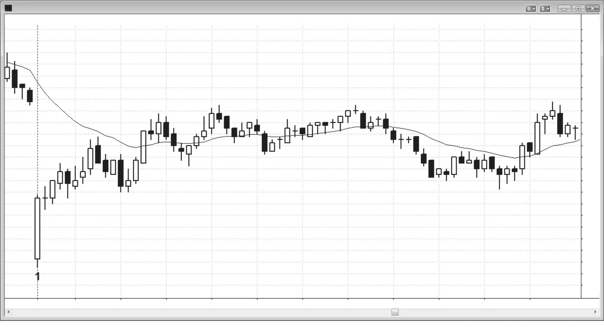

## 第一部分 价格行为

<!-- Source PDF pages 67–86 -->
<!-- PART I Price Action -->

<!-- PDF page 67 -->

对交易者最有用的价格行为定义也是最简单的：它是任何类型图表或时间框架上价格的任何变化。最小的变化单位是 tick，每个市场的 tick 值不同。顺便说，tick 有两个含义。它是市场能做出的最小价格变化单位，对多数股票是一美分。它也是当天发生的每一笔成交，因此分时成交表上的每一条记录都是一个 tick，即使价格与前一笔相同。每次价格变化，那次变化就是价格行为的一个例子。价格行为没有普遍接受的定义；由于你始终需要尽量意识到市场提供的、即使看似最不重要的信息，你必须有非常宽泛的定义。你不能忽视任何东西，因为非常常常最初显得次要的东西会导向出色交易。

仅定义本身不会告诉你如何下单，因为每一根K线都既是潜在做空信号也是做多信号。外面有交易者会寻找做空下一个 tick，因为他们相信市场不会再高 1 tick；另一些人会买入它，相信市场很可能不会再低 1 tick。他们可能在看同一张图，一个交易者看到多头形态，另一个认为有更强的空头形态。他们可能依赖基本面数据或无数其他原因形成意见。一边会对，另一边会错。若买家错了，市场低 1 tick，然后又一个，再一个，他们会开始考虑自己的信念可能错了。在某个点，他们将不得不亏损卖出仓位，使他们成为新的卖家而

<!-- PDF page 68 -->

不再是买家，这会进一步把市场打下去。卖家会继续进入市场，要么作为新空头，要么作为被迫平仓的多头，直到某个点有更多买家开始进来。这些买家会是新买家、获利了结的空头、以及现在亏损并必须买入回补的新空头的组合。市场会继续上涨，直到过程再次反转。

对交易者来说，全天反复面对的根本问题是决定市场是否在趋势中。即使他们在看单根K线，也在决定在那根K线期间市场是否在趋势中。那根K线是趋势K线——开在一端附近、收在另一端附近——还是震荡区间K线，实体小并有一根或两根大影线？若他们在看一组K线，他们在试图决定市场是在趋势中还是在震荡区间中。例如，若它在向上趋势，他们会寻找在高点或低点买入，甚至在行情顶部的突破上买入；而若它在震荡区间中，他们只在区间底部寻找买入，并在区间顶部卖出而不是买入。若它处于任何传统形态中，如三角形或头肩顶或底，它就在震荡区间中。给它贴上那些标签之一并无帮助，因为重要的只是市场是否在趋势中，而不是他们能否发现某个常见形态并给它贴标签。他们的目标是赚钱，他们能辨明的最重要的一条信息是市场是否在趋势中。若在趋势中，他们假定趋势会继续，并寻找趋势方向入场（顺势）。若不在趋势中，他们会寻找与最近走势相反的方向入场（fade 或逆势）。趋势可以短至单根K线（在更小时间框架上，那根K线内可以有强趋势），或者在 5 分钟图上可以持续一天或更久。他们如何做这个决定？通过解读面前图表上的价格行为。

重要的是理解，多数时候下一个 tick 上涨的概率是 50%，下跌的概率是 50%。事实上，在交易日的大部分时间里，你可以预期市场在上涨 X 点之前下跌 X 点、或在下跌 X 点之前上涨 X 点的概率是 50–50。概率在一天中有时漂移到大约 60–40，这些短暂时段提供好的交易机会。然而，市场随后很快回到不确定性和 50–50 市场，多头和空头大体平衡。

由于有如此多交易者在交易并使用无数方法，市场非常有效。例如，若你在当天任何时候不看图就市价买入，并把止盈目标设在高 10 tick，把一单取消另一单（OCO）保护性止损设在低 10 tick，你有 50% 的获利概率。若你最初改为卖出，并同样使用 10 tick 止损和止盈，你仍有 50–50 的机会在保护性止损亏 10 tick 之前靠空头赚 10 tick。若

<!-- PDF page 69 -->

你选 20 或 30 tick 或任何 X 值，概率相同。有明显例外，如你为 X 选了非常大的值，但若你基于近期价格行为为 X 选合理值，该规则相当准确。

在强趋势的尖峰阶段，趋势在接下来几根K线中继续的概率可能是 70% 或更高，但这只短暂发生，一天中很少超过一两次。一般而言，当强突破趋势运动正在形成时，若你为 X 选的值小于当前突破的高度，在远离 X tick 的保护性止损被触及之前能以 X tick 利润出场的概率是 60% 或更好。因此若多头突破迄今已走了四点（16 tick）且非常强，你为 X 选八，那么你大概有约 60% 的机会在八 tick 保护性止损被触及之前以八 tick 利润出场。

由于固有的高不确定性，我经常用“通常”“很可能”“可能”等词描述我认为至少 60% 情况下会跟随的情况。这对读者可能令人沮丧，但若你要以交易为生，这就是最好的情况。没有什么接近确定，你始终在灰色迷雾中运作。你将看到的最佳交易将始终用这些不确定词语描述，因为它们是对交易者所面对现实的最准确描述。

一切都是相对的，一切可以在瞬间变成完全相反，甚至无需任何价格运动。可能你突然看到当前K线高点上方七 tick 处有一条趋势线，于是不再寻找做空，而是寻找买入以测试趋势线。通过后视镜交易是亏钱的确定方式。你必须继续向前看，不要担心刚刚犯的错误。它们对下一个 tick 完全没有影响，因此你必须忽略它们，只是不断重新评估价格行为，而不是当日的盈亏（P&L）。

每一个 tick 都会改变每一个时间框架图表的价格行为，从 tick 图或 1 分钟图到月线图，以及所有其他类型的图表，无论图表基于时间、成交量、tick 数、点数图还是其他任何东西。显然，单 tick 运动在月线图上通常无意义（除非例如它是某个图表点的一 tick 突破并立即反转），但在更小时间框架图上它变得越来越有用。这显然成立，因为若 1 分钟 Emini 图上平均K线高三 tick，那么一 tick 运动是平均K线大小的 33%，可以代表显著运动。

价格行为最有用的方面是市场突破（突破越过）图上此前K线或趋势线之后发生什么。例如，若市场升破显著此前高点，且随后每根K线形成的低点高于前一根低点、高点高于前一根高点，那么这一价格行为表明市场很可能在随后某根K线上更高，

<!-- PDF page 70 -->

即使短期内回撤几根K线。然而，若市场向上突破，然后下一根是小内包K线（其高点不高于大突破K线的高点），再下一根的低点低于这根小K线，失败突破并反转向下的概率会大幅增加。

小形态演化成更大形态，可导致同方向或反方向的交易。例如，市场常见从小旗形突破达到剥头皮利润，然后回撤，形态随后演化成更大旗形。这个更大旗形也可能向同一方向突破，但也可能向相反方向突破。此外，一个形态常常可以同时被看作几件不同的事。例如，一个小更低高点可能是更大三角形的第二个更低高点，也是甚至更大头肩顶的第二个右肩。你应用的名称无关紧要，因为若你正确解读K线，随后运动的方向会相同。在震荡区间中，常见同时设置相反形态，如小空头旗形和更大的多头旗形。你交易哪个形态或用什么名称描述它并不重要。重要的只是你对价格行为的解读；若你解读得好，你就会交易得好。你会做最有道理的形态；若你不太确定，你会等到确定。

长期来看，基本面控制股票价格，而该价格由机构交易者设定，他们是做长期交易的交易者中成交量最大的；高频交易（HFT）公司成交量更大，但是日内剥头皮交易者，可能不会显著影响日线图方向。价格行为是机构探寻价值过程中发生的运动。每一个时间框架上每一根K线的高点都在某个阻力位；每一根的低点都在支撑位；收盘在它所在的位置而不是高或低 1 tick，因为计算机有理由把它放在那里。支撑与阻力可能不明显，但由于计算机控制一切且它们使用逻辑，一切都必须有道理，即使常常难以理解。短期计算机算法和新闻决定路径与速度，但基本面决定目的地，而且越来越多的基本面分析也由计算机完成。当机构觉得价格太高时，它们会出场或做空；当它们觉得太低（好价值）时，它们会买入。尽管阴谋论者永远不会相信，机构不会开秘密会议投票决定价格应该是什么，以试图从不设防、善意的个人交易者那里偷钱。它们的投票本质上是独立且秘密的，以买入和卖出的形式出现，但结果显示在价格图表上。它们永远无法隐藏自己在做什么。例如，若它们中有足够多的在买入，你会看到市场上涨，你应寻找做多方式。短期内，机构可以操纵股票价格，尤其若它交易清淡

<!-- PDF page 71 -->

。然而，与机构在其他交易形式中能赚的相比，那样做赚少得多，它们不想在小利润上浪费时间。这使操纵的担忧可忽略，尤其在成交量巨大的股票和市场中，如 Emini、主要股票、债务工具和货币。

每个机构彼此独立运作，没有一个知道任何其他在做什么。事实上，大型机构有许多交易者彼此竞争；他们常常在不知情的情况下站在交易的两边，而他们不在乎。每个交易者遵循自己的系统，对九楼某个人在做什么不感兴趣。此外，图表上的每一次运动都是基于总成交美元的合成；每个交易者由不同因素驱动，有交易者在每一个时间框架上交易。许多交易者甚至不使用图表，而是基于基本面交易。当我说市场因某个原因做某事时，它从来不只因一个原因做某事。我给出的任何原因只是运动背后无数原因之一，我指出那一个原因是为了洞见一些主要交易者在做什么。例如，若市场开盘小幅跳空高开，快速跌到均线，然后全天反弹，我可能说机构想更低买入，在场外等待，直到市场跌到支撑区域，然后它们相信不太可能再低。那时，它们大举买入。事实上，那可能是一些机构交易者使用的逻辑，但其他人会有无数其他理由在那个价位买入，其中许多理由与你面前的图表无关。

当我看图时，我在每一个 tick、每一根K线、每一个波段持续思考多头情形和空头情形。在一天的大部分时间里，一笔交易赚一定数量 tick 的机会与亏同样数量的机会差不多。这是因为市场始终在寻找价值与平衡，一天大部分时间多头和空头都对持仓感到舒适。有时概率可能是 60–40 偏向一个方向，在非常强的趋势中概率可以短暂是 80–20 甚至更高，但在一天的多数 tick 之后，概率大约 50–50，不确定性、价值与平衡占主导。艾伦·格林斯潘（Alan Greenspan）说过，作为美联储主席他大约 70% 的时间是对的。这很有揭示性，因为他对自己是否正确有如此大的影响，却只能把胜率提到 70。若你在永远无法交易足够大成交量以提高成功机会的交易中，70% 赚钱，你做得极其好。每当电视上的权威以确定口吻说市场会上涨，然后用人身攻击斥责持不同意见的嘉宾时，你知道那个人是傻瓜。他的傲慢表明他相信自己的预测能力至少 90%，但若那是真的，他会富到不屑上电视。因为多数剥头皮只有约 60% 的确定性，

<!-- PDF page 72 -->

那另外 40% 的可能值得大量尊重。你应始终有计划以防相反情况发生，因为它会经常发生。通常更好是出场，但有时更好是反转。始终最重要的是意识到，你相信会发生的事的完全相反会在约 40% 的交易中发生。值得注意的是，有些交易者如此善于读图和下单与管理交易，以至于他们可以 90% 的时间赢，但那些交易者很少。

电视分析师总是有令人印象深刻的头衔，做出非常有说服力的论证，看起来令人钦佩，听起来像教授，并显得毕生致力于帮助你。然而，这一切都是幌子，你永远不应忘记这只是电视。电视的目的是为拥有节目和网络的公司赚钱。那些公司的股东完全不关心你是否从节目上的交易建议中赚钱。网络根据收视率选择分析师。他们想要能吸引观众以便卖广告的人。他们总是选择魅力十足、看起来对你的财务福祉如此真诚和关心、使你感到不得不观看并信任他们的人。他们可能是真诚的，但这并不意味着他们能帮助你。事实上，他们只能伤害你，通过误导你相信他们能解决你的财务问题并减轻你照顾家庭时感到的压力。他们在出售虚假希望，是为了他们的利益，不是你的。记住，没有人靠看电视致富。

许多电视分析师基于基本面分析提出交易建议，然后用技术术语描述交易。这在外汇交易者中尤其如此。他们会隔离一个事件，如某个国家即将召开的央行会议，预测结果会是什么，并基于该预期结果推荐交易。当他们描述交易时，他们总会清楚地表明交易完全是技术性的，与基本面无关。例如，若 EUR/USD 处于多头趋势，他们总是会得出结论：会议会使欧元相对美元更强，并推荐买入回撤，把保护性止损放在最近摆动低点下方，追求大约为止损两倍大的止盈目标。没有人需要了解那次会议就能下那笔交易。他们只是在推荐多头趋势中买入回撤，交易与他们的分析或即将召开的会议无关。真正因巨大成交量而影响市场方向的人，如政府和银行，对即将召开的会议以及任何公告可能的影响知道得远更多，而这已经反映在价格中。此外，这些机构关心许多与会议无关的变量。这些电视权威只是试图用分析基本面的巨大智力能力给听众留下印象。他们想把自己看作特别聪明、有洞察力。现实是他们在享受假装专家，但在说废话。他们基于基本面的预测能力是纯粹猜测，有 50% 正确概率。他们的技术分析却是健全的；若交易成功，完全由于他们的读图，与基本面分析无关。股票权威也经常对基本面做出荒谬解读，如告诉听众明天买入 GS，尽管它已处于空头趋势六个月，因为它的 CEO 很强，他会采取行动结束空头。好吧，那个 CEO 上周、上个月和六个月前就在那里，而 GS 却无情下跌！为什么它明天或未来几周应开始反弹？尽管电视上那个以卖广告而不是帮你赚钱为工作的狂欢节叫卖者像教授一样宣告，根本没有基本面理由。另一个权威可能推荐 ADM 或 POT，因为非洲发展很快，非洲人生活质量提高会创造对农产品的需求。好吧，它上个月和六个月前就在快速增长，今天没有什么不同。每当你听到权威基于他自豪地认为是深刻洞察提出建议时，远更好的是假定他是傻瓜，上电视只是为了娱乐以便为网络赚广告费。相反，只看图表。若市场在上涨，寻找买入。若在下跌，寻找卖出。这些电视分析师总是听起来好像他们那一条基本面信息会控制市场方向。市场远更复杂，因数百个原因运动，其中多数电视分析师无法知道。基本面已经反映在价格行为中，你只需看图就能理解机构——它们远比电视上的小丑聪明，且交易足够多美元以控制市场方向——如何看待基本面。它们分析所有数据，不只是一小块，并基于彻底的数学分析下单，而不是某种异想天开、简单化的音响片段。跟随它们，不要跟随电视上的权威。它们会清楚地向你展示它们相信什么，且无法隐藏。它就在你面前的图表上。顺便说，基本面分析本质上是一种技术分析，因为基本面交易者基于图表做决定。然而，他们的图表是关于盈利增长、债务增长、收入、利润率和许多其他因素。他们研究动能、斜率和趋势线，因此他们其实是技术分析者，但自己不那样看，许多人也不信任仅价格的技术分析。

价格为何上移 1 tick？因为在当前价格有比挂卖更多的量被挂买，且那些买家中有一部分若需要愿意支付甚至高于当前价以成交。这有时被描述为市场买家多于卖家，或买家在控制，或买盘压力。一旦所有

<!-- PDF page 73 -->

<!-- 本页正文已并入相邻页中文段落（PDF 抽取跨页合并） -->
<!-- PDF page 74 -->

可能在当前价格（最后成交价）成交的买单都成交，剩余买家将不得不决定是否愿意高 1 tick 买入。若愿意，他们会继续在更高价挂买。这个更高价格会使所有市场参与者重新评估对市场的看法。若继续有比挂卖更多的量被挂买，价格会继续上移，因为在最后价格卖家提供的合约不足以填满买家订单。在某个点，买家会开始挂卖部分合约以部分止盈。此外，卖家会把当前价格视为做空的好价值，挂卖多于买家想买的量。一旦卖家提供更多合约（要么是想回补部分或全部多头合约的买家，要么是试图做空的新卖家），当前价格的所有买单都会成交，但一些卖家将无法找到足够买家。买价会下移 1 tick。若有卖家愿意在这个更低价格卖出，这将成为新的最后价格。

由于成交量控制市场方向，初学交易者总是想知道市场深度能否给他们交易优势。若他们在价格阶梯上下单，可以看到当前价格上下数个 tick 每个 tick 的成交量。他们想既然信息在那里，一定有某种方式用它获得优势。他们忘记市场由计算机算法控制，程序员也在追求每一种可想象的优势。当游戏围绕在一秒的几分之一内快速处理大量信息，试图一天一千次赚一两个 tick、胜率仅 55% 时，个人交易者每次都会输。交易者无法知道他们看到的是真实的，还是一台计算机为困住其他计算机而设的陷阱。你听不到很多专业交易者谈论把市场深度纳入决策，是有原因的。因为它没有帮助。即使交易者能足够快地处理它，优势与他们从读图中能有的优势相比也很小。他们会被分心，最终错过许多风险相当但回报和胜率更大的其他交易，因此赚更少钱。只打你知道能赢的仗。

由于多数市场由机构订单驱动，合理的问题是：机构是否基于价格行为入场，还是它们的行为导致价格行为。现实是，机构并非都在逐 tick 盯着苹果（AAPL）或 SPDR S&P 500 交易所交易基金（SPY），然后在看到 1 分钟图上两段式回撤时启动买入程序。它们白天有大量订单要成交，并努力以最佳价格成交。价格行为只是许多考虑之一，有些公司会更依赖它，另一些依赖更少或完全不依赖。许多公司有决定何时以及买多少卖多少的数学模型和程序，所有公司整天继续从客户接收新订单。

<!-- PDF page 75 -->

交易者在白天看到的价格行为是机构活动的结果，远更少是活动的原因。当有利可图的形态展开时，交易期间会发生一系列不可知的影响交汇，导致交易获利或亏损。形态是已经在进行中的运动的实际第一阶段，价格行为入场让交易者能尽早跳上波浪。随着更多价格行为展开，更多交易者会朝运动方向入场，在图表上产生动能，并导致更多交易者入场。交易者——包括机构——因每一种可想象的理由挂买单和卖单，这些理由大体无关紧要。然而，有时一个理由可能相关，因为它会让聪明的价格行为交易者从被困交易者那里受益。例如，若你知道保护性止损很可能位于某根K线下方 1 tick，并将导致刚买入的交易者亏损，那么你应考虑在同一价格以止损单做空，因为你有很好机会在他们被迫出场时从被困交易者身上获利。

由于机构活动控制运动且它们的成交量如此巨大，且它们下多数单的意图是持有数小时至数月，多数不会寻找剥头皮，而是会捍卫原始入场。若 Vanguard 或 Fidelity 必须为其共同基金之一买入股票，其客户会希望基金在日终持有股票。客户买共同基金并不期望基金做日内交易并在收盘时全部变成现金。基金必须持有股票，这意味着它们必须买入并持有，而不是买入并剥头皮。例如，在初始买入之后，它们很可能还有更多要买，会利用任何小回撤加仓。若没有回撤，它们会在市场上涨时继续买入。

一些初学交易者想知道：市场直线上涨时谁在买入，为何有人会市价买入而不是等回撤。答案很简单。是机构努力以最佳可能价格成交所有订单，并在市场继续上涨时分多批买入。此外，大量这类交易由机构计算机算法完成，程序完成后会结束。其他公司在动能强时持续买入的程序，只在动能放缓时停止。若一笔交易失败，远更可能是交易者误读价格行为的结果，而不是机构改变主意或在启动程序几分钟内赚两三个 tick 利润。程序基于统计，趋势继续在统计上很可能。趋势会继续，直到到达某个技术点，概率表明它已走得太远。并非存在所有软件编写者都会同意的某条单一趋势线或等幅运动目标。图表上实际上有无数关键技术点。当足够多的它们在同一区域发生时，市场转向。一家公司的程序会用一些，另一家公司会用另一些。若足够多公司在同一大致区域押注反转，

<!-- PDF page 76 -->

反转会发生。那时，数学偏向反转；机构会部分止盈，量化分析师（quant）公司会持反向仓位。这些算法会继续反向交易，直到市场再次超调，那时数学偏向反转，量化交易者会再次反向押注。

若机构聪明、盈利，并对每一个 tick 负责，它们为何会在多头趋势中买入最高 tick（或在空头趋势中卖出最低 tick）？因为那是它们的算法一路上涨都在盈利地做的事，有些被设计为继续这样做，直到明确多头趋势不再有效。它们在最后一次买入上亏损，但在所有更早交易上赚到足够多以抵消那次亏损。记住，它们所有系统 30% 到 70% 的时间会亏损，而这就是那些时候之一。也有高频交易公司会一直剥头皮到多头趋势的最高 tick，甚至只为 1 tick。高点总是在阻力位，许多高频交易公司会在阻力下方 1 或 2 tick 买入以试图抓住最后 1 tick，若它们的系统显示这是有利可图的策略。其他机构买入是作为另一市场（股票、期权、债券、货币等）对冲的一部分，因为它们认为通过下对冲风险/回报比更好。成交量不是来自小个人交易者，因为在主要转折点他们贡献的成交量不到 5%。

意识到机构对价格行为负责的唯一重要性是：它使基于价格行为下单更可靠。多数机构不会做日内进出，使市场在你每一次入场后反转。你的价格行为入场只是搭它们活动的便车，但与它们不同，你在剥头皮部分或全部交易。

顺便说，若剥头皮交易者使用的止损大于止盈目标，必须 70% 或更高的交易赢才能盈利。很少交易者能持续 70% 时间赢，因此多数交易者永远不应使用大于止盈目标的止损。然而，当交易者看到潜在利润至少与风险一样大、且对形态至少 60% 有信心时，他们可以考虑做该交易。多数交易者应从寻找利润至少是风险两倍的波段交易开始。成功概率通常只有 40% 到 50%，一天只有几次机会，但长期盈利的机会更大。有时波段形态有 60% 或更高的成功机会，但这些通常在强突破期间。对多数交易者来说很难做，因为分析交易的时间有限，且K线大、因此风险更大，但数学往往是交易者会有的最好情况。

有些公司做日内交易的成交量可观。然而，要让它们的交易盈利，市场必须朝它们的方向移动许多 tick，而

<!-- PDF page 77 -->

价格行为交易者会看到运动的最早部分，允许他们尽早入场并确信成功剥头皮的概率高。那些公司若试图剥头皮四或八 tick，不能让市场对它们不利 15 tick。因此，它们只会在觉得不利运动风险小时入场。若你在图上读到它们的活动，你同样应对你的交易有信心，但始终在市场中设止损，以防你的解读错误或其他机构以相反方向交易淹没当前运动。

常常有回撤精确到 tick 测试入场K线的极端。例如，若有多头入场，买家常常在该入场K线收盘后把保护性卖出止损放在其低点下方 1 tick。相当常见看到回撤正好跌到该入场K线低点但不再低 1 tick。这意味着止损没有被扫，一定有机构规模的成交量在保护止损。由于它是图上如此明显的价格，它们基于价格行为做这种买入。

在 5 分钟 Emini 中，有某些价格行为事件会改变聪明交易者的看法。例如，若多头趋势中有两段式回撤（ABC），市场随后交易到前一根高点上方，许多买家会在那根前一根高点上方 1 tick 做多（High 2 多头入场）。若市场随后交易到两段式回撤低点下方，人人会假定市场很可能至少还有一段向下。若你是机构交易者并买入了那个 High 2，你不想它失败，会一路向下到那个关键保护性止损价上方 1 tick 再买入。那个机构在用价格行为支持其多头。

## 高频交易

重要的是意识到，每日股票、期货、交易所交易基金、货币、商品和期权成交量的一大部分且不断增长的部分，正由高频交易（HFT）公司执行，它们有由称为 quant 的量化分析师设计的算法。多数程序员有数学、定量分析、工程、编程或物理的硕士或博士学位，最好的因他们的努力年薪 100 万美元。有些算法持仓不到一秒，另一些一两个小时。每一种可想象的策略都被使用，包括基于对海量数据复杂金融分析的模型，到简单的统计偏差。每个想法必须有健全逻辑，回测必须确认有效。有些程序员在白天调整程序，以便在接下来几小时获得优势。许多程序在纳秒（十亿分之一秒）世界中运作，每一种

<!-- PDF page 78 -->

能减少接收数据与订单成交之间延迟的硬件与软件进步都被采用。最快的编程语言和操作系统也被用来减少延迟。由于它们的优势非常小且数亿美元处于风险中，HFT 公司往往保密、隐蔽，并充满聪明人。

CBS 的《60 分钟》在 2010 年 10 月做了一期关于 HFT 的报道，称多达 70% 的成交量和每天超过十亿股股票正由 HFT 程序交易。这有些误导，因为 HFT 公司只是算法交易世界的一部分。还有为更长期交易设计的其他程序，也是那 70% 的一部分。瞬时高频交易软件和更长期程序交易软件都由量化分析师创建。这些 quant 是数学家，设计 HFT 程序的人对图表或基本面毫不关心，只对基于统计分析的短期市场倾向感兴趣。他们多数甚至不关心 5 分钟图，他们的交易与你白天看的任何图无关。在报道中，《60 分钟》采访了 Tradeworx 的负责人，这是一家由数学家和 quant 组成的小型 HFT 公司，在其 4,500 只股票篮子上每天交易 4,000 万股。这意味着该公司平均每只股票每天 10,000 股。由于交易者常常每笔只赚一美分或不到一美分，他们只持仓几秒到几分钟，仓位规模可能非常小。计算机完成所有交易，因为他们交易的机会只存在不到一秒，人类太慢无法捕捉。因为他们交易 4,500 家公司，其中一家按规模和大概平均日成交量排第 4,500。这意味着他们交易的一些公司一天只成交几十万股或更少。若他们在那家公司交易 10,000 股，另有 50 家 HFT 公司也交易 10,000 股，那将是一天 500 万股。因为这超过该公司总成交量，Tradeworx 很可能常常每笔交易 1,000 股或更少。交易者显然不是在每只股票上交易 10,000 股，但那是他们的平均，基于他们交易的 4,000 万股和 Tradeworx 的 4,500 只股票篮子。他们可能在日成交量巨大的公司中交易更大成交量且更频繁，但仍必须在许多股票上交易非常小的成交量。许多公司的目标是每笔剥头皮一美分或更少，持仓几秒到几分钟。

他们的程序完全基于统计。交易中的优势始终非常小，但若它有很高数学确定性且你一天使用数千次，理论上会产生持续利润。这与赌场赚钱的原理相同。在多数游戏上，它们的优势只有 3% 或更少，但它们超过 99% 确定优势是真实的而不是仅仅

<!-- PDF page 79 -->

巧合。若赌场只有一个顾客，他在单次下注押 10 亿美元，赌场有 47% 的概率因那次下注破产。然而，当每天有数千赌徒下小注时，赌场持续赚钱的概率压倒性高。对 HFT 公司同样成立。

这位 quant 提到的一个假设策略是：在 4,500 只股票篮子上，对过去一周跌 5% 的每只股票买入 5 美元，对过去一周涨 10% 的每只股票做空 10 美元。赢家数量只比输家略多，但当你足够频繁地交易有轻微优势的系统时，你可以产生持续利润，就像赌场一样。他说他的公司有时连续亏两三天，但从没有过亏钱的月份。一位被采访者提到，有一家公司据报道连续四年每天赚钱。你必须假定它们测试能想象的每一种策略，基于所有可用数据，包括价差、成交量、相关市场和整体市场；若测试显示它们有优势，它们就会交易它，直到它不再测试良好。

这些公司比其他所有人早几毫秒获得订单流信息，每月花数万美元尽可能靠近交易所以尽快获得信息，并运行最快的可用计算机。它们能买到的每一额外毫秒都增加优势。它们的计算机每秒下单并取消数千单以感知即将到来的市场方向，然后用这些信息尽可能早进出。技术在快速变化；由于计算机化交易控制多数成交量，它控制多数价格行为，这很可能永远如此。对个人交易者的一个重要好处是，巨大成交量使流动性高，允许交易者以小价差进出，降低交易成本。

道琼斯公司现在有一个名为 Lexicon 的新闻服务，向订户传送机器可读金融新闻。Lexicon 扫描道琼斯所有关于股票的报道，并把信息转换成算法可用于在不到一秒内决定买卖股票的形式。其他算法在更长时间框架上运作，分析股票表现和财报，以及新闻源，以做交易决定。有些使用差分进化优化软件生成数据，再用来生成其他数据。它们可以继续精炼数据直到达到某种数学确定性水平，然后结果被用来自动买卖股票。有些订单如此巨大以至于需要时间下单，算法交易软件把订单拆成小块，以向试图利用初生趋势的交易者隐藏交易。掠夺性交易算法试图揭开算法交易程序试图隐藏的东西。人人都在

<!-- PDF page 80 -->

寻找优势，越来越多公司用计算机寻找优势并下单。

交易者不可能及时分析一份报告及其所有含义，以便在 5 分钟图上下单。计算机处理信息和下单远快于个人交易者，这在报告发布后给它们对个人交易者的巨大优势。当交易者的对手有巨大优势时，他处于大劣势，意味着他没有优势。由于他的优势永远不可能很大，且他应只在有优势时交易，当没有优势时应避免交易，尤其当竞争者有特别大的优势时。然而，他仍可从报告中赚钱。由于如此多公司现在有计算机快速分析报告并基于该分析下单，交易者所要做的只是能读图，看所有那分析的共识意见是什么。计算机会向你展示报告对市场意味着什么，你所要做的只是同一方向交易。顺便说，计算机在日终也有额外优势。当交易者已交易数小时时，他们自然变得疲劳、更慢，并抗拒做交易。计算机从不疲劳，在当天最后几秒与开盘时一样有效。若交易者不在最佳状态——在最后一小时常常如此——他们的优势更少或没有，只有当他们和形态都强时才应做交易。

若你想一想，HFT 公司面临的一个固有问题是它们可能杀掉下金蛋的鹅。它们的交易基于统计，尽管多数在许多年中测试，它们当然会关注市场过去几周的行为方式。若足够多公司因近期价格行为做调整，就不会有足够成交量站在它们交易的另一边，结果它们无法按算法意图交易，赚不了那么多钱。它们甚至可能亏钱。这种失衡导致价格行为变化。例如，若近期日波幅收缩到长期平均的约三分之一，它不能那样持续太久。最终人人会弄清如何从小日子上赚钱，他们很可能都在做同样的事。在某个点，不会有足够钱站在它们交易的相反一边，要么它们无法成交，要么必须接受更差入场。无论哪种情况，那会改变市场行为。

许多正在为机构客户成交大订单的机构交易者对高频交易者愤怒，但我怀疑很多是嫉妒。这些机构交易者曾经在食物链顶端，对市场中所有显著运动负责。不再如此。他们看到 quant 持续赚更多钱，且是以完全无视传统机构交易者认为构成华尔街基石的基本面的方式。他们恨这些闯入他们游戏的暴发户，

<!-- PDF page 81 -->

无视他们的规则和他们珍视的一切，有好得多的业绩记录，获得最多敬畏，并可能成为最优秀年轻新交易者更想去工作的地方。很可能他们部分客户资金正被分流到 HFT 和其他程序交易公司，这威胁他们部分收入。然而，目标是赚钱；我很高兴有增加的流动性，我喜欢现在常见的所有强波段。我甚至喜欢这些 quant 创造的窄幅震荡区间，但它们交易起来压力更大。

流动性意味着股份在公平价格上的即时可得性，这意味着高频交易者实际上在帮助机构交易者在其交易上获得好价格。这种流动性过去由订单对冲者（做市商）提供，但他们的角色很大程度上已被 HFT 公司接管。顺便说，正如有对 HFT 公司的抱怨，过去也有对做市商不公平做法的抱怨。一个大抱怨是，当市场崩盘时他们未能站在交易的另一边，而这正是多数交易者拼命需要有人站在交易另一边的时候。还有关于暗池、闪电交易、交叉网络、抢跑以及计算机化交易几乎每一方面的其他抱怨，但多数不公平做法很可能会被联邦政府最小化，长期不应给个人交易者造成问题。

quant 在为市场提供流动性并为所有交易者缩小价差，但若足够多程序同时做同样的事，它们的程序有时能在几分钟内促成大行情。这些剥头皮程序可能对白天波段没有太大影响，波段更多是为客户成交机构订单的结果。长期来看，基本面统治，但从接下来几秒到几分钟，程序交易常常控制市场，且可能与所讨论市场的基本面无关。基本面决定未来数月的方向和目标，但数学家决定市场到达该目标将遵循的路径。由于算法基于统计，它们事实上可能因市场惯性而增强支撑与阻力以及趋势。市场倾向于继续做它们正在做的事，因此程序编写者会检测反复出现的行为，并编写利用这一点的程序。由于趋势很可能继续，程序会继续持顺势仓位，这可能使趋势更可靠且回撤更小。此外，震荡区间的多数突破尝试会失败，在有如此多成交量押注它们会失败的情况下，它们甚至可能更可能失败。

尽管市场有惯性，在某个点当前价格行为会变得过度。例如，若日线 SPY 处于多头通道，已 45 天未触及均线，且过去 10 年只发生过一次，当前行为极其异常。任何极端的东西都不能

<!-- PDF page 82 -->

持续太久，因为最终它会在每一种可想象的过度度量上显示为过度，而过度就是机会。市场不善于判断多远才够远，但非常善于知道市场何时到达过度。一旦足够多公司决定存在过度，它们会把它看作优势，并押注向均值回归。它们会押注市场会回到它一直做的事。在那个 SPY 多头的情形中，强空头会做空，并在远离均线的天数变得更极端时更高处加仓。此外，强多头会看到异常行为，开始止盈，并不再寻找买入，直到市场至少回撤到均线。市场可以在任何类型行为上到达极端，如连续空头趋势K线的数量；连续日波幅为平均一半或两倍的天数；低点、高点或收盘高于前一根的连续K线数量；以及你能想象的几乎任何其他东西。外面有机构关注任何形式的极端行为并会 fade 它。此外，极端行为最终会在每一个可想象的指标上显示为极端，因此基于指标做决定的交易者也会开始押注行为会结束。是的，极端最终会结束，但除非你对自己的解读非常有信心，不要 fade 趋势，因为市场维持异常行为的时间可以比你维持账户的时间更长。

<!-- PDF page 83 -->

**图 PI.1**

**两段式回撤**

图 PI.1 以及书中所有图表可在 www.wiley.com/go/tradingtrends 下载，你可以放大图表看细节。

两段式调整是趋势方向交易的可靠形态。K线计数在后面章节（第 2 册）详细讨论，但由于 ABC 形态几乎出现在每张图上，这里值得简要讨论。如图 PI.1 所示，K线 3 是强势上涨到 K线 2 之后的第一段向下。这使它成为 ABC 回撤的 A 段。小幅上涨到 K线 4 高点是 B 段，向下到 K线 5 低点是 C 段。由于多数回撤不是清晰的 ABC 形态，常常只有一段，另一些有三或四段，有一种替代方式描述正在发生的事很有用。把四段式回撤标为 ABCDE 太别扭，没有用。相反，当多头波段中有回撤时，如图 PI.1 中到 K线 3，第一根升破前一根高点的K线是 High 1 多头入场。K线 4 是一个例子，K线 7 之后那根也是。若回撤继续向下第二段，如到 K线 5，那么 K线 5 之后第一根升破前一根高点的K线会是 High 2 入场。K线 5 之后那根是 High 2 多头入场的例子，K线 9 之后那根也是。K线 5 和 9 是 High 2 买入形态或信号K线。若多头旗形中有第三段向下，入场会是

<!-- PDF page 84 -->

图 PI.1

High 3 买入入场；若然后有第四段向下且市场转上，入场会是 High 4 多头。当市场处于空头波段时，如从 K线 10 向下的运动，第一段向上是 ABC 调整的 A 段。K线 12 或其前一根是那 A 段。从小幅向上那段的回撤是 B 段，即 K线 13。然后第二段向上是 C 段，结束于 K线 14 之前那根。这是横盘 ABC，在 ABC 回撤中 C 段不超越 A 段很常见。K线 13 是 Low 1 做空入场，因为它是空头旗形中第一根交易到前一根低点下方的K线。K线 15 是 Low 2 做空入场K线。

大段本质上无法阻挡，但小价格行为由一些逐 tick 观察或设计为基于小价格运动交易的程序的机构交易者微调。例如，一些 Emini 交易者会尝试以一点利润——即四 tick——剥头皮出场。若他们刚买入，市场通常必须移到信号K线高点上方六 tick。他们大概在信号K线高点上方 1 tick 以买入止损单入场，止盈限价单在入场价上方四 tick。通常除非市场交易到限价单上方 1 tick——即信号K线高点上方六 tick——否则不会成交。有时当市场只是不断打到五 tick 但不到六（潜在五 tick 失败）时，会突然有 250 张 Emini 合约成交，而价格不向下跳。一般而言，在今天的 Emini 市场中，任何超过 100 张合约应被视为机构。即使只是大型个人交易者，他很可能有机构的洞察力，且由于他交易机构成交量，他与机构无法区分。由于价格仍挂在五 tick，几乎可以肯定那 250 手订单是机构买入。因为若机构在充满紧张多头的市场中卖出，市场会快速下跌。当市场上涨五 tick 时机构开始买入，它们预期它会走得比仅高 1 tick 更远，通常在一分钟左右价格会冲过六 tick 并向上波段至少更多。机构在高点买入，意味着它们认为市场会更高，并很可能在上涨时买更多。此外，由于四 tick 剥头皮如此经常有效，很可能有机构剥头皮对白天多数剥头皮施加巨大影响。

交易者密切关注关键时间框架收盘前的几秒，尤其是 3、5、15 和 60 分钟K线。在成交量K线图的关键成交量上也是如此。例如，若许多交易者跟随 10 年期美国国债期货合约的每K线 10,000 股图，那么当K线即将收盘时（它在自K线开始以来至少成交 10,000 股的任何规模第一笔交易上收盘，因此K线很少正好 10,000 股），可能有一阵活动以影响K线的最终外观。一边可能想展示使K线显得更看涨或更看跌的意愿。最简单地说，强多头趋势K线意味着多头拥有该K线。在强趋势中非常常见，

<!-- PDF page 85 -->

图 PI.1

反转K线在 5 分钟K线收盘前最后几秒完全反转其外观。例如，在强空头中，可能有一个看起来非常强的多头反转K线的做多形态在设置。然后，在K线收盘前还剩五秒时，价格暴跌，K线收在其低点，困住许多预期多头趋势反转K线的抢先做多者。当逆强趋势做逆势交易时，务必等待信号K线收盘后再下单，然后只在你交易方向上该K线之外 1 tick 以止损单入场（若你在买入，在前一根高点上方 1 tick 以止损单买入）。

学习如何解读价格行为的最佳方式是什么？是打印图表，然后寻找每一笔有利可图的交易。若你是剥头皮交易者，在 5 分钟图上寻找 AAPL 50 美分或 GOOG 两美元，那么找到白天每一个可能获得该利润的移动。几周之后，你会开始看到一些形态，允许你在风险大约相同的情况下做那些交易。若风险与回报相同，你必须远超过 60% 时间赢才使交易值得。然而，许多形态有 70% 或更好的成功率，许多交易允许你在等待止盈目标到达时，把止损从信号K线极端下方上移到入场K线极端下方，从而降低风险。此外，你应尝试进入有很好机会远超过止盈目标运行的交易，因此应只部分止盈。事实上，最初你应只专注于那些入场。把止损移到保本，然后让剩余部分运行。你很可能每周至少有几笔交易运行到初始目标的四倍或更多，然后才设置反转入场形态。

斐波那契回撤与延伸是价格行为的一部分，但由于多数只是近似且多数失败，它们只偶尔对交易有帮助。例如，新趋势中的第一次回撤常常回撤第一段的约 62%，但不够经常到足以在那里下限价单入场。那个限价单会让你朝市场相反方向入场。例如，若市场在下跌而你试图买入你希望成为更高低点的东西，风险/回报比不够高，压力太大，不宜例行这样做；然而有例外情况，那时它是合理策略。若斐波那契数字是好的，它会与本身可靠、可独立于斐波那契测量或任何指标交易的图表形态相关联。

艾略特波浪理论也是一种价格行为分析，但对多数交易者不可交易。波浪通常在理想入场点之后许多许多K线才清晰，且每一瞬间有如此多相反解读，对多数活跃日内交易者需要太多思考，不确定性也太大。

<!-- PDF page 86: no extractable text (likely figure-only) -->
