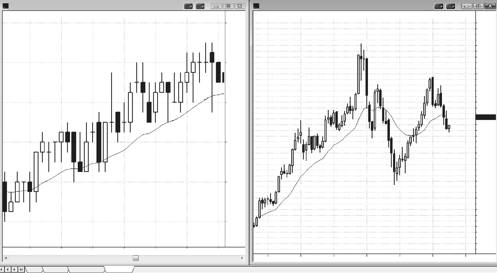
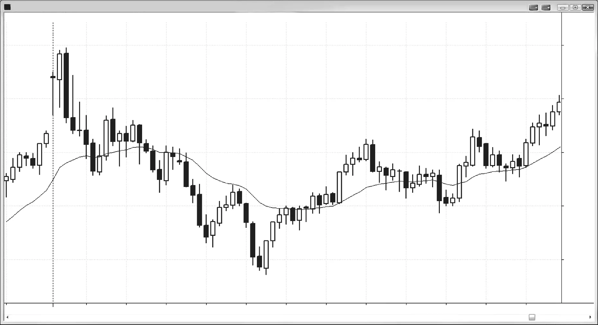
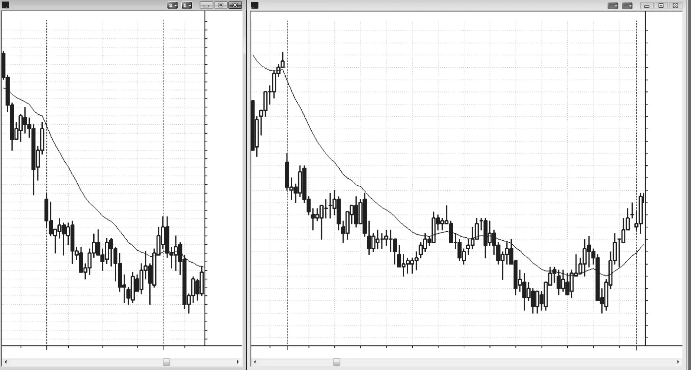
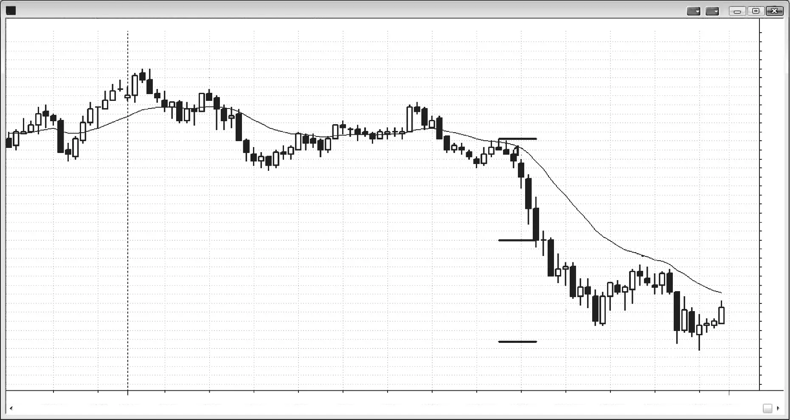
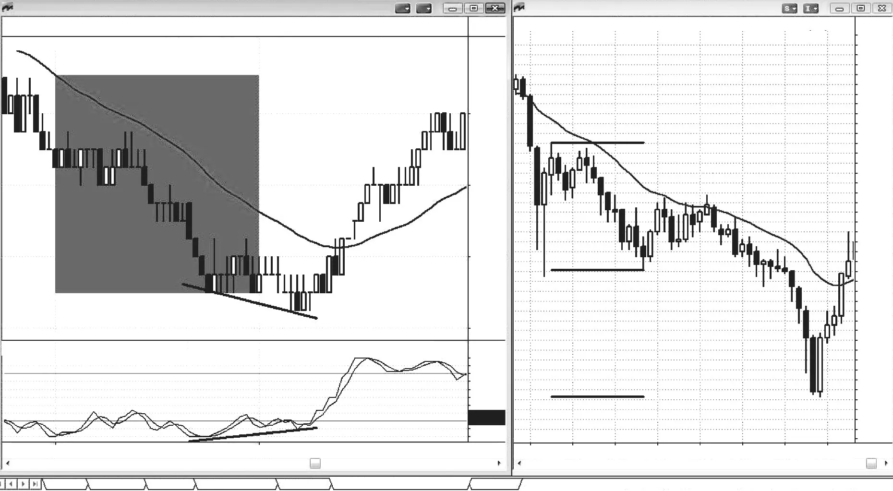
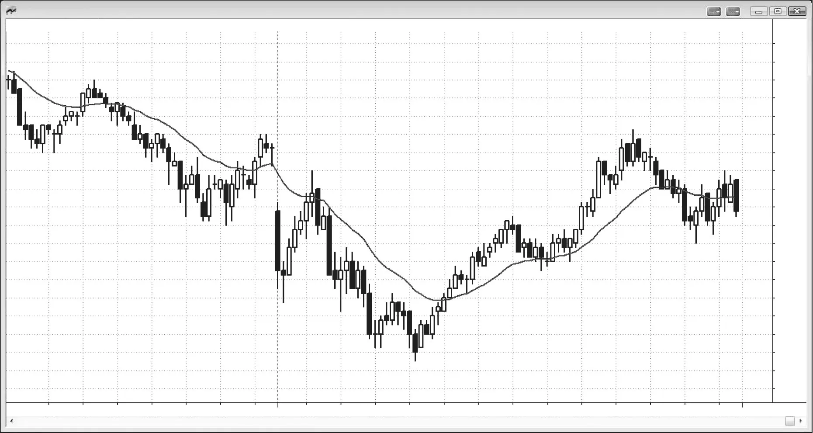

### 第2章　趋势K线、十字星K线与高潮

<!-- Source PDF pages 91–108 -->
<!-- English: CHAPTER 2 Trend Bars, Doji Bars, and Climaxes -->

<!-- PDF page 91 -->

# 第2章  
# 趋势K线、十字星K线与高潮

市场在你眼前的图表上要么处于趋势中，要么不处于趋势中。若不处于趋势中，则处于某种震荡区间，而震荡区间由更小时间框架上的趋势组成。当两根或更多根K线大体重叠时，它们就构成震荡区间。震荡区间可以有许多形状和名称，如旗形、三角旗和三角形，但名称无关紧要。关键只在于多头与空头处于某种均衡，往往一方略强。在单根K线层面，它要么是趋势K线，要么是震荡区间K线。要么多头或空头控制该K线，要么双方大体均衡（单根震荡区间）。

交易中最重要的两个概念是：一切都有数学基础；以及在任何你确信市场方向的时刻，总有同样聪明的人相信相反方向。永远不要对任何事确信无疑，并始终对市场会做出与你预期完全相反之事的可能性保持开放。尽管市场有时会失衡，并在许多根K线上强势上行或下行，但大多数时候它相对均衡，尽管对初学者而言可能并非如此。

每一个 tick 都是一笔成交，意味着有人认为该价格是卖出的好价值，另有人认为是买入的好价值。由于市场由机构控制且他们很聪明，这两类交易者都很聪明且行为理性，双方都有经测试并证明可盈利的策略。交易者能培养的最重要技能之一，是理解一根趋势K线是行情的开始还是结束。若你把强多头趋势K线只看作看涨、把强空头趋势K线只看作看跌，你就错过了半数大参与者在做什么。

<!-- PDF page 92 -->

在每一根多头趋势K线的高点附近，有多头在买入这股力量。也有其他多头在寻找回撤，若市场到得了该K线低点附近就会买入。然而重要的是认识到：还有其他多头预期这股力量会失败，并利用这股力量作为卖出多单、获利了结的机会。也有空头把多头趋势K线——无论多强——看作多头高潮性、失败的努力，并在该K线高点附近做空。有些人在场外等待强多头趋势K线，以便在他们认为过度的反弹处做空。其他空头会在该K线低点下方做空，因为他们把这视为可能导致可交易反转的疲弱信号。同样，在每一根空头趋势K线的底部，无论该K线看起来多强，都有获利了结的空头和新多头在买入，也有其他空头想在其高点附近做空，以及多头想在其高点上方买入。

对交易者而言，最有用的是把所有K线想成要么是趋势K线，要么是非趋势（震荡区间）K线。由于后者表述笨拙且多数类似十字星，把所有非趋势K线称为十字星更简单。若实体在图上看起来极小或不存在，该K线是十字星；多头与空头都未控制该K线，该K线本质上是单根震荡区间。在 5 分钟 Emini 图上，十字星实体不存在或仅 1–2 个 tick 大小，取决于K线大小。然而在 Google 日线或周线图上，实体可以有 100 个 tick（一美元）或更多，仍具有与完美十字星相同的意义，因此称之为十字星是合理的。判断是相对且主观的，取决于市场与时间框架。在全部交易中，接近就足够好，完美很少见。若某物与形态高度相似，随后发生的事很可能与完美形态之后预期发生的事相同。

把小实体K线细分成上吊线、锤子线或孕线等诸多子类型，对交易者帮助不大。根本问题是该K线与市场是否在试图趋势，并意识到多数时候处于中间状态。判断任何趋势的强度远比花时间担心某根K线的精确名称重要。你靠下单赚钱，而不是靠担心一堆无意义的花哨名称。

若有实体，则收盘相对开盘发生了趋势性移动，该K线是趋势K线。显然，若K线很大而实体很小，趋势性强度不大。此外，在该K线内部（更小时间框架上可见），可能有多次大体横盘的摆动，但这无关紧要，因为你应只关注一张图。一般而言，实体越大表示强度越大，但在长期行情或突破之后出现的极大实体，可代表趋势的衰竭高潮性结束，在更多价格行为展开之前不应交易。一系列强趋势K线是健康趋势的信号，即便立即出现回撤，通常仍会有进一步极端。

<!-- PDF page 93 -->

趋势K线、十字星K线与高潮

每一根趋势K线同时是：（1）尖峰；（2）突破；（3）缺口（如第二册所讨论，所有突破在功能上等同于缺口，因此所有趋势K线也是）；（4）真空与高潮的一部分或全部（停顿或反转K线在一根或连续趋势K线之后结束高潮）。这四个特征中的一个或多个可能在某根特定趋势K线中占主导，每一个都提供交易机会，将在全书中讨论。当它是高潮并开始反转时，原因是真空效应。例如，若买入尖峰之后反转，急剧上涨更可能是因为强空头退场、多头等待市场到达双方都在等待卖出的区域才离场多单。若反而有跟随买入，则买入并非由于真空效应，而是强多头买入与强空头相信市场会进一步上涨的组合。交易者用整体背景判断哪种更可能。他们的评估会引导他们寻找买入、卖出或等待。显然，每一个导致反转的尖峰都是真空效应的体现，但我把该术语保留给在明显支撑或阻力位（对决线，第二册讨论）以反转结束的尖峰。顺便说，崩盘是真空效应的例子。1987 年与 2009 年股市崩盘都跌到月线趋势线略下方，强买家在那里重新出现、强空头获利了结，导致急剧向上反转。此外，股票交易者常在多头趋势中买入强空头尖峰，因为他们把尖峰看作价值机会。尽管他们通常在买入前寻找强价格行为，但他们常会在急剧抛售底部买入他们喜欢的股票，尤其是到多头趋势线区域，即便尚未向上反转。他们相信市场因某新闻事件暂时错误地低估了该股，并买入是因为他们怀疑折扣不会长久。他们不介意它再跌一点，因为他们怀疑无法精确抄底，但他们想在抛售中入场，因为他们相信市场会很快纠正错误、股票很快反弹。

回撤（第二册讨论）常常是强尖峰，使交易者怀疑趋势是否已反转。例如，在多头趋势中，可能有一两根大空头趋势K线跌破均线，或许还跌破震荡区间数个 tick。交易者会怀疑始终持仓方向是否正在翻空。他们需要看到的是跟随卖出，或许再只需一根空头趋势K线。每个人都会密切关注下一根。若它是大空头趋势K线，多数交易者会相信反转已确认，并开始市价做空以及在回撤时做空。若该K线反而有多头收盘，他们会怀疑反转尝试已失败，抛售只是短暂但急剧的降价，因此是买入机会。初学者看到强空头尖峰，忽略了

<!-- PDF page 94 -->

它所处的强多头趋势。他们在空头趋势K线收盘做空、在其低点下方做空、在接下来几根的任何小反弹做空，以及在任何 Low 1 或 Low 2 做空形态下方做空。聪明的多头站在这些交易的对手方，因为他们理解正在发生什么。市场总在试图反转，但 80% 的反转尝试会失败并成为多头旗形。在反转尝试发生时，那两三根空头K线可能很有说服力，但若没有跟随卖出，多头把抛售看作在短暂卖盘高潮低点附近再次做多的绝佳机会。有经验的多头与空头等待这些强趋势K线，有时会退到一边直到一根形成。然后他们进入市场买入，因为他们把它看作卖出的高潮性结束。空头买回空单，多头重建多单。这也会发生在趋势结束时，当强势交易者在等待一根大趋势K线时。例如，在空头趋势接近支撑区时，常会有异常大空头趋势K线形式的迟突破。多头与空头都停止买入，直到看到它形成。那时，双方都买入卖盘高潮，因为空头把它看作获利了结空单的绝佳价格，多头把它看作以极低价买入的短暂机会。

有时该空头尖峰可以收在低点，初学者会对市场随后缓慢或快速反转回升感到震惊。一根收在低点的大空头趋势K线，怎么会随后是小多头内包K线，再反转上攻至当日新高？他们没意识到的是，在更小时间框架上，那根强空头趋势K线有清晰的反转形态，比如 Emini 100-tick 图上的三推形态。然而，即便他们观看并交易更小时间框架图，也会亏钱，因为形态形成太快，交易者无法准确分析。记住，所有形态都是计算机算法的结果，计算机有巨大的速度优势。在误差空间如此之小的游戏中与有优势的对手竞争，总是错误。当速度关键时，计算机有巨大优势，交易者不应与之对打。相反，他们应选择一个时间框架，如 5 分钟图，使他们有时间仔细处理信息。

趋势K线是高潮的关键组成部分，高潮是反转的关键组成部分，但交易者常错误地把「高潮」一词当作「反转」的同义词。每一根趋势K线都是高潮或高潮的一部分，高潮以第一根停顿K线结束。例如，若有三根连续多头趋势K线，然后下一根是顶部有明显影线的小多头趋势K线、内包K线、十字星或空头趋势K线，则高潮以那三根多头趋势K线结束。这个三K线买盘高潮只意味着市场走得太远太快，买入热情已迅速降到市场变成双边的程度。一些多头在获利了结并希望在更低价再买，一些空头开始做空。若多头压过

<!-- PDF page 95 -->

趋势K线、十字星K线与高潮

空头，反弹会恢复；若空头压过多头，市场会以空头趋势K线反转向下，该K线更像空头突破，反转形态将是高潮反转顶部。买盘高潮是向上运动，高潮反转顶部是先上后下的运动。多头趋势K线更多作为高潮起作用，空头趋势K线更多作为突破起作用，二者共同创造高潮反转顶部或买盘高潮与反转。

所有强多头趋势都有强多头趋势K线或连续多头趋势K线，每一根都是买盘高潮，但多数不会成为高潮反转的第一段。反转需要买盘高潮然后空头突破，即强空头趋势K线。多头与空头趋势K线不必连续，常被许多根隔开，但高潮反转需要二者。事实上，多头市场顶部的每一次反转都是高潮反转，无论在你眼前的图上是否看起来像。若多头在 5 分钟图上以强空头反转K线反转，它仍是高潮反转，但只在更小时间框架上。尽管不值得搜索越来越小的时间框架去找完美的上尖峰再下尖峰，它总是存在。同样，每当有跨许多根的高潮顶部时，在某个更高时间框架图上它总是单根反转K线，同样不值得寻找完美时间框架只为看到完美反转K线。记住，交易者都在寻找优势，计算机绘图程序让交易者能快速创建基于一切可想象区间的图表，会有交易者基于一切可想象之物做决策。这不仅包括基于时间的图，还包括基于 tick 数、成交合约数及其任意组合的图。总会有人看到那根完美反转K线，另有人看到上尖峰再下尖峰，但若你理解眼前图表在告诉你什么，你不必看到其中任何一个。高潮底部则相反：卖盘高潮之后向上反转。高潮反转在第 5、6 章信号K线中进一步讨论，并在第三册再次讨论。

理想的趋势K线有中等大小实体，表明到K线收盘时市场已从开盘趋势离开。最低要求是多头趋势K线收盘高于开盘，在本书中用白色蜡烛实体表示。

<!-- PDF page 96 -->

多头可以通过使实体与过去五或十根的中位实体大小相当或更大来展示更强控制。其他强度信号在另一节讨论，包括开盘在或靠近低点、收盘在或靠近高点、收盘在或高于前几根收盘与高点、高点高于前一根或多根高点、影线很小。若K线非常大，尤其在趋势中发展时，它可能代表衰竭或困住新多头的单K线假突破，仅在下一两根反转向下。空头趋势K线则相反。

所有趋势K线都是试图突破进入趋势，但如下一章所讨论，多数突破会失败。此外，所有趋势都以趋势K线开始，其实体可能仅比近期K线实体略大。有时它很大，随后有几根同方向趋势K线，表明更强趋势且更可能有跟随。

当市场处于震荡区间或空头趋势中，并开始创造若干多头趋势K线时，这是买盘压力的信号，是多头试图控制市场并使其成为多头趋势的尝试。交易者在K线内买入小回撤，因为他们相信市场很快会更高，可能不会再有更大回撤让他们买。当他们在K线收盘前最后几秒买入时，他们害怕下一根可能在低点附近开盘然后进一步反弹。他们感到紧迫，急于现在做多，而不是等待可能直到市场高得多之后才出现的回撤。他们在前一根低点下方和摆动低点下方买入，市场正过渡到多头腿或趋势。空头不再在新低处大量做空。他们在获利了结，越来越多多头把新低看作绝佳价值并买入。

若空头实体开始在多头趋势或震荡区间中累积，这是卖盘压力的信号，空头可能很快能创造下降趋势。例如，若市场处于多头趋势，有过几次带大空头趋势K线的回撤，现在进入震荡区间且有过几次带明显空头趋势K线的摆动，卖盘压力在累积，空头可能很快能把市场反转成空头腿或空头趋势。卖盘压力是累积的，空头实体越多、实体越大，压力越可能达到临界点压过多头并驱动市场下行。买盘压力则相反。若有震荡区间或空头趋势，且多头趋势K线变大、变多，买盘压力在累积，这使反弹更可能。

强多头创造买盘压力，强空头创造卖盘压力。强多头与强空头是机构交易者，这些强势交易者的累积效应决定市场方向。例如，空头趋势中买盘压力的信号包括K线底部的影线、下跌摆动底部的两K线反转或多头反转K线，以及带大多头实体的K线数量增加。正是强多头在每个新低和每根K线底部买入，把收盘从K线低点推高。这只有在强空头不再觉得在这些更低价做空有价值时才会发生。这些多头愿意在市场进一步下跌时买更多，不像会带着亏损离场的弱多头。此时强空头只愿意在更高处做空。你怎么知道？若有足够多的人愿意在

<!-- PDF page 97 -->

趋势K线、十字星K线与高潮

K线底部做空，他们本应能压过多头，K线会收在低点而不是中部或高点附近。

每当交易者看到买盘压力信号时，他们假设强多头在低点买入，强空头不再愿意在低点做空，现在只愿意在反弹中卖出。因此当强多头在底部买入、强空头只愿意在更高处卖出时，会发生什么？市场进入震荡区间。强空头会在顶部做空而不在底部，强多头会在底部买入而不在顶部。弱交易者通常做相反的事。弱多头在低点继续卖出因为被止损，在高点买入因为害怕错过新多头趋势。弱空头在低点做空预期突破，在高点带着亏损平空因为害怕市场正在变成多头趋势。

一切都是相对的，并需不断重新评估，甚至到完全改变你对市场方向看法的程度。记住，你很少能对市场方向有 60% 的把握，而这很快可变回 50–50，甚至变成另一方向 60%。

是的，每一根K线要么是趋势K线要么是十字星。十字星意味着多头与空头均衡。当十字星在形成时，若你看足够小的时间框架，会看到市场要么先下后上创造卖盘高潮，要么先上后下创造买盘高潮。如第三册高潮反转一节所讨论，高潮并不意味着市场在反转。它只意味着市场在一个方向走得太远太快，现在正尝试另一方向。那时，多头继续买入试图产生上行跟随，空头继续做空试图创造空头趋势，结果通常是横盘市场。横盘交易可以短至单根K线，也可持续许多根，但它代表双边交易，因此是震荡区间。由于所有十字星都包含双边交易且通常至少短暂后跟更多双边交易，十字星应被看作单根震荡区间。

然而，有时一系列十字星可能意味着趋势在进行。例如，若有一系列十字星，每一个收盘更高，且多数高点高于前一根高点、低点高于前一根低点，市场在展示趋势性收盘、高点与低点，因此趋势在进行。

<!-- PDF page 98 -->

图 2.1  

十字星很少完美

图 2.1 说明了把「十字星」一词限制为仅收盘与开盘同价的K线的缺陷。由于基本价格行为分析适用于所有时间框架，把术语限制为完美形态根本没有意义。左侧 1 分钟 Emini 图有 10 根完美十字星，尽管是多头趋势；右侧 Google（GOOG）月线图没有一根十字星。尽管几根看起来像十字星，即便实体最小的 bar 3 收盘仍比开盘高 47 美分。在两种情况下使用经典定义对交易者毫无帮助。在 GOOG 图中，bar 3 是出色的信号K线，表现完全像十字星应有的表现，应按十字星交易。在交易中，接近就足够好，担心完美只会让你赔钱。

**对本图的更深入讨论**

当多头趋势中出现非常大多头趋势K线时，如图 2.1 的 GOOG 图，它可能代表最后绝望的买家在买入，要么是为了平掉亏损空单，要么是在非常晚的阶段进入非常强的多头趋势。它是买盘高潮，形成之后常没有人再买，把市场控制权留给空头。随后的大空头趋势K线构成了反转的第二根。

<!-- PDF page 99 -->

趋势K线、十字星K线与高潮

在某个更高时间框架上，这将是完美的两K线反转。在更高的时间框架上，这个顶部会是大多头反转K线。在上尖峰与下尖峰之后，多头与空头继续交易，试图在各自方向创造通道。这创造了可以短至单根或持续许多根的震荡区间。这里，双边交易形成了三根更低高点。最终一方获胜。

<!-- PDF page 100 -->

图 2.2  

日内十字星

为交易目的，把所有K线想成要么是趋势K线要么是十字星（或非趋势K线，图 2.1 与 2.2 中用 D 标出）是有用的，标注是宽松的。一根小实体K线在价格行为的某一区域可以是十字星，在另一区域可以是小趋势K线。区分的唯一目的是帮助你快速评估是一方控制该K线，还是多头与空头陷入僵局。

图 2.2 中几根K线可以有争议地同时被看作趋势K线与十字星。

<!-- PDF page 101 -->

趋势K线、十字星K线与高潮

图 2.3  

趋势性十字星

单根十字星意味着多头与空头都未控制市场，但趋势性十字星表明趋势。它们是买盘压力累积的信号，使反弹更可能。在图 2.3 中，右侧 5 分钟图从 bar 1 起有连续四根十字星，各自有趋势性收盘、高点与低点。左侧 15 分钟图显示它们在当时的新摆动低点创造了多头反转K线。

**对本图的更深入讨论**

该日以图 2.3 中的大跳空低开开始，这是空头突破，然后是大空头趋势K线，因此很可能是某种空头趋势日，交易者在寻找做空。右侧 5 分钟图当日第四根是多头趋势K线，是多头试图反转当日，但失败了，把多头困在场内、空头挡在场外。失败突破又失败了，在该多头趋势K线下方设置了突破回撤做空。bar 4 处的均线（20 周期指数移动平均线）缺口K线处于强空头趋势中，是测试当日低点的好做空；但由于测试通常导致强回撤或反转，交易者在寻找买入新低以及稍后对当日低点的测试。

在图 2.3 中，bar 1 在两张图上也是趋势通道线超调，用前两个摆动低点创建趋势线。市场试图突破

<!-- PDF page 102 -->

空头通道底部并加速下行，但突破失败了，多数突破都会失败。趋势通道线突破的失败尤其常见，因为它们是试图加速趋势，而趋势往往随时间减弱。

Bar 4 是十字星，是单根震荡区间，但仍可以是好的形态K线，取决于背景。这里，它是最后旗形反转信号K线（ii 旗形失败突破），以及空头趋势中的均线缺口K线做空形态，因此是测试空头低点的可靠信号。空头反弹至均线缺口K线通常突破空头趋势线，随后测试空头趋势低点的抛售往往是市场试图反转前的最后一段下行。这里，对 bar 1 空头趋势低点的测试是更低低点，交易者应预期至少两段上行。若测试是更高低点，则上攻至 bar 4 会是第一段上行，交易者应预期从该更高低点至少再有一段上行。

<!-- PDF page 103 -->

趋势K线、十字星K线与高潮

图 2.4  

没有趋势的趋势K线

正如十字星并不总意味着市场无趋势，趋势K线也并不总意味着市场在趋势。在图 2.4 中，bar 6 是从一排十字星突破的强多头趋势K线。然而没有跟随。下一根只比趋势K线高 1 个 tick 然后收在低点附近。多头在这根空头停顿K线下方 1 tick 离场，新空头也在那里卖出，把它看作失败的多头突破。没有人在没有更多多头价格行为时有兴趣买入，这导致市场下跌。多头试图以小多头趋势K线保护多头突破K线的低点（bar 8 是突破回撤做多形态，尽管从未触发），但市场跌破其低点；这些新的抢先多头再次离场，更多新空头进入。此时，在多头两次尝试失败后，他们不会在没有对自己有利的充分价格行为时买入，他们与空头都会寻找至少两段下行。

趋势K线可以意味着与它们表面告诉交易者的相反的东西。初学者可能把 bar 3 之前的强趋势K线看作突破进入新多头趋势。有经验的交易者会需要第二或第三根多头趋势K线形式的跟随，才会相信始终持仓交易已翻多。有经验的交易者在该K线收盘做空、在该K线上方做空、在 bar 3 收盘做空、在 bar 3 下方做空。多头在剥头皮离场多单，空头在建立新的波段空单。同样类型的多头陷阱发生在

<!-- PDF page 104 -->

结束于 bar 7 与 bar 17 之前空头旗形的多头趋势K线上。相反的情况发生在 bar 19：当日最大空头趋势K线之一是空头趋势结束的开始。每当在持续 30 根或更多且没有多大回撤的空头趋势中形成大空头趋势K线时，它常代表卖盘真空与衰竭卖盘高潮。有时它是空头趋势低点，另一些时候市场再跌几根后才试图反转。当强多头与空头看到某个支撑位并预期它会被测试时，他们退到一边等待大空头趋势K线形成。一旦形成，他们都激进买入。空头买回空单，多头建立新多单。双方都预期至少两段、持续至少 10 根、略突破均线上方的较大调整。市场可能继续趋势反转，但交易者需要看到反弹的强度再决定他们认为它会走多远。

**对本图的更深入讨论**

如图 2.4 所示，今日突破昨日高点上方，但以失败突破与开盘即趋势的空头趋势反转向下。这基本上是空头趋势恢复日，尽管前几小时是震荡区间日。当日最重要的交易是太平洋时间上午 11:00 开始的崩跌。一旦 bar 12 突破形成，交易者需要考虑空头趋势恢复的可能性。当下一根有更大的空头实体时，交易者需要做空。他们甚至可以等下一根 bar 13，又是一根强空头趋势K线。在安静期后做空崩跌非常困难，因为到此时交易者已变得自满，预期当日保持安静。然而，这是非常高概率的做空。Bar 12 到 bar 13 有大空头实体且不重叠。它们形成了强空头尖峰，随后有几根跟随。概率很高：市场会从尖峰第一根的高点或开盘到最后一根的收盘或低点有某种等幅运动下行。由于K线很大且市场移动很快，交易者害怕大反转的风险。

<!-- PDF page 105 -->

趋势K线、十字星K线与高潮

最好的做法是在 bar 13 或其前一根收盘做空，并把保护性止损放在该信号K线高点上方。若你害怕，只做极小仓位以确保在交易中。一旦你有另一根强空头趋势K线如 bar 14，把止损移到保本或该K线高点上方，持有到收盘。

<!-- PDF page 106 -->

图 2.5  

大空头趋势K线可以结束空头趋势

市场在图 2.5 右侧 5 分钟 Emini 图上处于强空头趋势，但在大 bar 8 空头趋势K线之后急剧反转向上。Bar 9 在从 bar 3 到 bar 4 的等幅运动下行处形成两K线反转（等幅运动在第二册讨论）。交易者能否观看更小时间框架图，然后在小反转形态触发时买入？左侧是 tick 图，每根 100 个 tick。每发生 100 笔成交，K线收盘、新K线开始。5 分钟图上的 bar 8 结束于太平洋时间上午 11:20，tick 图上的 bar 8 由该 5 分钟K线的最后 100 个 tick 组成。tick 图上的 bar 9 对应 5 分钟图 bar 9 的低点。在 tick 图上，市场形成双底，在 bar 9 向下突破，但空头突破失败，市场反转向上。它伴随着随机指标上的背离。这是非常有序、传统的反转形态，但这里有一个使其不可交易的问题。左侧灰框是右侧 5 分钟K线的最后一分钟，包含 33 根K线！对人类而言信息量太大，无法可靠处理并及时准确下单。市场由计算机控制，有时价格移动非常快。盈利交易总是困难的，当速度关键时几乎不可能，因为微秒级速度是只有计算机才有的优势。你不能指望在对手有明显优势时靠交易赚钱。

<!-- PDF page 107 -->

趋势K线、十字星K线与高潮

有经验的交易者在这张 5 分钟图上有许多买入方式，包括在 bar 8 收盘市价买入或在 bar 9 上方买入，这些在第三册讨论。

那么从 bar 7 到 bar 9 的空头尖峰中发生了什么？每个空头实体逐渐变大，这是空头力量增强的信号。然而，它也是潜在卖盘高潮的信号，如此处所示。当空头趋势已持续 30 根或更多并处于支撑位时，多头与空头都退到一边等待大空头趋势K线，然后激进买入。在 bar 9 低点有等幅运动，但当趋势反转时总有许多支撑位存在，尽管多数对初学者不可见。因为强多头与空头在买入前等待像这样异常强的空头趋势，当市场接近支撑时缺乏买入导致卖盘真空与大空头趋势K线的形成。一旦形成，空头迅速买回空单获利了结，多头建立新多单。双方都理解正在发生什么，双方都预期大调整甚至反转，因此空头不会寻找做空，多头不会为获利了结卖出多单，直到市场至少反弹两段、至少 10 根，并至少到均线上方。结果常常是急剧反弹，且可以以非常强的空头趋势K线开始。

<!-- PDF page 108 -->

图 2.6  

趋势过渡到震荡区间

当空头开始把新低看作获利了结的好地方，而不是新一段下行的绝佳做空处，且多头把它看作开始做多的好价格时，市场正从强趋势过渡到更双边的市场。如图 2.6 所示，在从 bar 2 下行的空头趋势中，每当市场跌破最近摆动低点，一两根内就会形成多头K线或带大影线的K线。这是买盘压力的信号，且是累积的。当累积足够时，多头可以接管市场并创造大空头反弹甚至趋势反转。

在 bar 13 顶部，空头实体开始累积，这种卖盘压力是市场可能很快回撤的信号。
