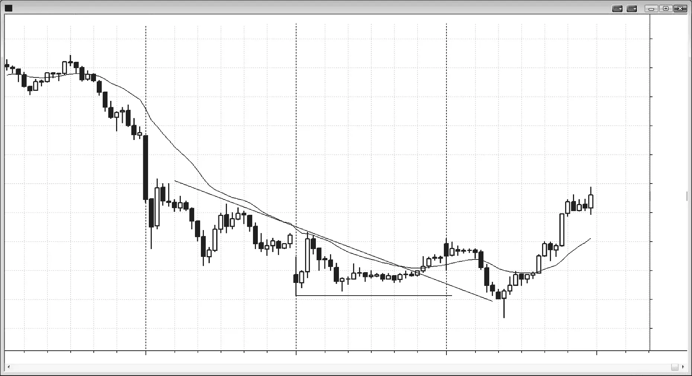

### 第4章 K线基础：信号K线、入场K线、交易形态与蜡烛图形态

<!-- Source PDF pages 115–120 -->
<!-- English: CHAPTER 4 Bar Basics: Signal Bars, Entry Bars, Setups, and Candle Patterns -->

<!-- PDF page 115 -->

交易者全天都在寻找交易形态。交易形态是由一根或多根K线组成的图表形态，使交易者相信可以下单，并有较好机会获得盈利交易。实际上，图表上的每一根K线都是交易形态，因为下一根K线总可能是任一方向强行情的开始。若交易与最近或主导趋势方向相同，则为顺势；若方向相反，则为逆势。例如，若最近趋势向上而你买入，该形态是顺势形态。若你做空，你作为交易依据的形态是逆势形态，你的做空是逆势交易。
信号K线总是在事后标记的——在该K线收盘之后、交易入场之后。一旦你的入场单成交，前一根K线就从仅仅是形态K线变成信号K线，而当前K线是入场K线。入场后的那根是跟随K线，若有第二根朝你入场方向的K线总是更好。有时市场会横盘一两根K线之后才出现跟随K线，这仍然不错，因为只要有跟随，从交易中赚更多的概率就会提高。
有多头在前一根K线高点上方挂买入止损单，也有空头在同一根K线低点下方挂卖出止损单。也有多头在前一根K线低点及下方挂买入限价单，空头在前一根K线高点及上方挂卖出限价单。这意味着每一根K线都是做多和做空交易的信号K线，多头和空头都会在顶部和底部突破时入场。而且，每一根K线都可以被视为单根K线震荡区间。若下一根K线走在它上方或下方，突破交易者会预期这次突破有足够跟随，至少能赚到剥头皮利润。然而， <!-- PDF page 116 --> 同样聪明的交易者会预期突破失败，并朝相反方向交易。若市场走到前一根K线高点上方 1 个 tick，会有多头用止损单买入，前一根K线就是他们做多的信号K线。也会有空头在前一根K线高点用限价单做空，预期突破失败。他们希望在做空后的下一根K线，市场交易到其入场K线低点下方，那时其入场K线就会成为做空交易的信号K线。关于交易最重要的认识之一是：无论你多确信自己是对的，都有同样聪明、同样确信相反情况会发生的人。
交易者能培养的最重要的单一技能，是判断在前一根K线上方或下方何时买方更多、何时卖方更多的能力。正确背景下的信号K线就是这种失衡出现的时刻。例如，当多头趋势中的回撤出现多头信号K线时，该K线上方可能买方多于卖方，因此在其上方寻找买入比在其上方寻找做空更合理。每当交易者相信存在失衡时，他就有优势，但这优势总是很小，因为总有聪明的交易者持相反看法（必须有人接你的对手盘，否则你的订单不会成交）。作为交易者，我们的优势是阅读价格行为的能力；我们越强，优势越大，靠交易谋生的概率也越大。以下是常见的信号K线和交易形态（在接下来几节中会进一步讨论）：
强趋势尖峰阶段的延续信号：延续信号可以是在多头趋势顶部买入，或在空头趋势底部卖出。
r 多头尖峰中的强多头趋势K线。
r 空头尖峰中的强空头趋势K线。
反转信号：反转形态可以是趋势反转，也可以是回撤结束并反转回趋势方向。
r 反转K线。
r 两K线反转。
r 三K线反转。
r 小K线：
r 内包K线。
r ii（或 iii）形态。
r 大K线或震荡区间高点或低点附近的小K线。
r ioi 形态。
r 外包K线与 oo 形态（外包K线后跟更大的外包K线）。
r 双顶与双底。
r 失败的反转尝试，包括反转K线失败。

<!-- PDF page 117 -->

r 失败的延续尝试，如在看似见底的空头趋势中在 Low 1 信号K线下方买入，或在看似见顶的多头趋势中在 High 1 信号K线上方做空。
r 光头/光脚K线：顶部或底部没有影线的K线。
r 趋势K线：多头趋势K线可以是强空头趋势中反弹时以及震荡区间顶部附近的做空形态；空头趋势K线可以是强多头趋势中回撤时以及震荡区间底部附近的做多形态。
r 强趋势尖峰阶段中的任何停顿或回撤K线。
r 通道中的所有K线：在前一根K线处或下方买入，在前一根K线处或上方卖出。
r 任何在多头趋势中形成更高低点、在空头趋势中形成更低高点的K线。
初学者应只在信号K线也是交易方向的趋势K线时入场，并且只顺势交易。例如，若他们在做空，应把自己限制在空头趋势中的空头趋势K线信号K线上，因为那时市场已经显示出卖盘压力，跟随的概率高于信号K线收在开盘上方的情况。同样，当初学者想买入时，应只在信号K线收在开盘上方且多头趋势正在进行时买入。
总的来说，交易者对趋势反转入场的信号K线要求应比对趋势回撤和震荡区间交易更严格。因为大多数逆势交易会失败，你需要尽一切可能提高成功机会。最强的趋势通常有看起来很糟糕的信号K线，但交易仍然出色。如果一个形态太明显，市场会迅速纠正这个偏差。行情会又快又小，大多数剥头皮就是这样。相比之下，波段交易形态的成功概率通常只有 50% 或更低，这在第二本书中有更多讨论。它们看起来常常只是会再持续许多根K线的震荡区间的一部分。强趋势会尽一切可能把交易者挡在外面，迫使他们在趋势无情推进时追赶。震荡区间顶部的第二次入场反转形态常常有带多头实体的信号K线，底部的做多形态常常有带空头实体的信号K线。然而，由于大多数反转趋势的尝试会失败，交易者应只在一切看起来完美时——包括信号K线——才考虑反转交易，以降低失败概率。初学者应避免除绝对最强之外的所有逆势交易，任何交易者都应只在整体图表形态支持反转时才考虑逆势。至少，交易者应等待趋势线强突破后的回撤，并且只有在有强反转K线时才交易，因为大多数成功的反转交易以强信号K线开始。否则，成功概率太 <!-- PDF page 118 --> 小，交易者长期会亏损。顺便说，趋势线突破后的回撤可以到达新极端，如多头趋势结束时的更高高点，或空头趋势结束时的更低低点。由于逆势交易是如此低概率的方法，最好的交易者只在有充分证据表明趋势即将反转时才做这些交易。
趋势往往会比大多数交易者认为可能的时间持续长得多，这导致大多数相反方向的交易失败，并最终只是在趋势中设置另一次回撤和另一次顺势入场。
同样，若交易者想顺势交易，他们急于入场，不会等待强信号K线形成。例如，若交易者想在强趋势中买入均线处的小回撤，而该回撤也在测试先前摆动低点、趋势线，或许还有斐波那契回撤位，即使信号K线是空头趋势K线，交易者也会买入。结果是，强趋势中大多数成功的信号K线看起来很差。一般规则是：趋势越强，信号K线的外观越不重要；你的入场越逆势，看到强信号K线就越重要。在强趋势中，大多数信号K线看起来很差，很少是趋势方向的趋势K线。
几乎每一根K线都是潜在的信号K线，但大多数从未导致入场，因此不会成为信号K线。作为日内交易者，你会下许多从未成交的订单。通常最好在前一根K线上方或下方 1 个 tick 用止损入场；若止损未被触发，取消订单并寻找新的下单位置。对于股票，常常更好把入场止损放在潜在信号K线之外几个 tick，因为 1 tick 陷阱很常见——市场只突破 1 个 tick 然后反转，困住所有刚用止损入场的交易者。
若入场止损单被触发，你部分依据前一根K线做交易，因此该K线被称为信号K线（它给了你需要下单的信号）。常常一根K线可以是两个方向的形态K线，你会在两个极端之外放置入场止损，并在任一方向K线突破时入场。
关于蜡烛图形态已有很多著述，感觉它们不寻常的日本名称一定意味着它们有某种神秘力量，来自特殊的古代智慧。这正是新手交易者所寻找的——众神之力告诉他们该做什么，而不是依赖自己的努力工作。对交易者而言，最重要的单一问题是判断市场是在趋势中还是在震荡区间中。说到分析单根K线，问题也是它是否在趋势中。若多头或空头在控制，蜡烛图有实体，是趋势K线。若多头和空头处于均衡状态且实体很小或不存在，它是十字星。许多蜡烛图交易者用 wick（烛芯）一词指通常从实体上下延伸的线，大概是为了与蜡烛概念一致。另一些人称之为 <!-- PDF page 119 --> shadows（影线）。由于我们都在不断寻找反转K线，而反转K线看起来更像蝌蚪或小鱼，tail（尾巴）是更准确的描述性术语，本书译为「影线」。
你应只从价格行为的角度思考K线，而不是一堆无意义且误导的蜡烛名称（误导在于它们传递神秘力量的意象）。每根K线或蜡烛图只有在与价格行为的关系中才重要，绝大多数蜡烛形态在大多数时候并无帮助，因为它们出现在没有高概率预测价值的价格行为中。因此，蜡烛形态名称会通过给你太多要思考的东西来复杂化你的交易，并使你的注意力离开趋势。
常见的是在适合交易的区域开始形成信号K线。或许在 5 分钟K线进行到三分钟时，它形状很好，像刚突破最后空头旗形之后的多头反转K线。然后，在K线收盘前五到十秒，它突然增大四或更多个 tick。当K线收盘时，它仍有好的多头反转K线形状，但其高点现在接近空头旗形的高点。你有几秒钟决定是否仍想在其高点上方买入，并意识到你将在空头旗形顶部买入。在你持续盈利并能快速阅读之前，最好不要做这笔交易，而是等待第二次入场。然而，若你确信有很多被困的空头，你可以做这笔交易，但每当有几根大波幅、大量重叠的K线连续出现时，风险都很大。
所有反转都涉及高潮，但不同交易者对术语的用法常不同。记住，每一根趋势K线都是高潮或高潮的一部分，高潮以第一根停顿K线结束。例如，若有三根连续的多头趋势K线，然后下一根是顶部有明显影线的小多头趋势K线，或内包K线、十字星、或空头趋势K线，则高潮以那三根多头趋势K线结束。

<!-- PDF page 120 -->

图 4.1

图 4.1
典型的做多信号K线
图 4.1 所示的 Visa（V）15 分钟图显示突破空头趋势线上方，然后两段式下跌至昨日低点下方的更低低点。本图的要点是展示什么是信号K线和入场K线，具体的形态模式将在本书后面讨论。第一段由结束于 K线 2 的 iii 完成。K线 3 是强多头反转K线，既反转了昨日低点，也测试了空头趋势线，设置了可能的做多。在这根K线上方 1 个 tick 的买入止损会被成交，然后 K线 3 成为信号K线（而不只是形态K线），成交所在的那根K线成为入场K线。入场后两根有不错的多头趋势K线，它是跟随K线。由于这是逆势交易，交易者在买入前需要像 K线 3 这样的强多头反转K线；否则成功交易的机会会显著降低。
K线 4 是 ii 形态（稍后讨论）的入场K线，用于第二段向上。
K线 5 是内包K线突破回撤的入场K线（市场刚刚勉强突破 K线 2 的 iii 上方）。两根停顿K线的实体各自是内包实体，因此这个形态实质上与 ii 形态相同。
