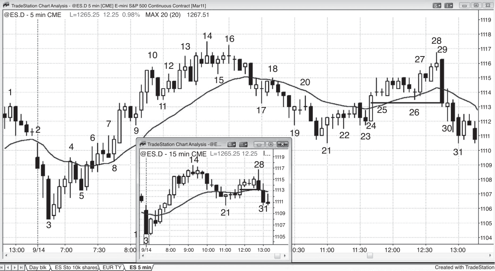
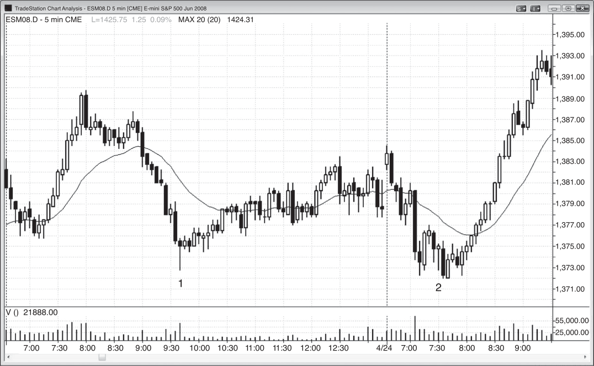

### 第 5 章 信号K线：反转K线

<!-- Source PDF pages 121–132 -->
<!-- CHAPTER 5 Signal Bars: Reversal Bars -->

<!-- PDF page 121 -->

第 5 章
信号K线：
反转K线反转K线是最可靠的信号K线之一，它只是反转了前一根或多根K线方向的某个方面。若你看更小时间框架图，会发现每一根多头反转K线都由一根空头趋势K线再加一根多头趋势K线组成，但它们不必连续。市场出现卖盘高潮，随后多头突破（记住，所有趋势K线同时是尖峰、突破与高潮，但背景决定此刻哪个属性占主导）。空头反转K线则相反：更小时间框架上有多头趋势K线，表明发生了买盘高潮，随后是空头趋势K线，表明市场向下突破。

多数交易者希望反转K线有与旧趋势相反方向的实体，但这并非必需，还有许多其他反转要素应予考虑。

最广为人知的信号K线是反转K线；多头反转K线至少应具备：收盘高于开盘（多头实体），或收盘高于中点。最佳多头反转K线具备下列中的多项：

- 开盘靠近或低于前一根收盘，且收盘高于开盘并高于前一根收盘。
- 下影线约为K线高度的三分之一到一半，上影线很小或不存在。
- 与前一根或多根重叠不多。

<!-- PDF page 122 -->

- 信号K线之后不是十字星内包K线，而是强入场K线（实体相对较大、影线较小的多头趋势K线）。
- 收盘反转（收在其上）多根K线的收盘与高点。

空头反转K线至少应具备：收盘低于开盘（空头实体），或收盘低于中点。最佳空头反转K线具备：

- 开盘靠近或高于前一根收盘，且收盘明显低于前一根收盘。
- 上影线约为K线高度的三分之一到一半，下影线很小或不存在。
- 与前一根或多根重叠不多。
- 信号K线之后不是十字星内包K线，而是强入场K线（实体相对较大、影线较小的空头趋势K线）。
- 收盘反转（收在其下）多根K线的收盘与低点。

这最后一项属性对任何强趋势K线都成立，如强突破K线、信号K线或入场K线。例如，在空头段底部，若有多头反转K线，其收盘高于过去八根的收盘，其高点高于过去五根的高点，视背景而定，这通常比仅收盘高于前一根收盘、且不高于任何近期K线高点的反转K线更强。

市场在任何K线之后都可能上行或下行，因此每一根K线都同时是做多与做空入场的设置K线。只有当下一根K线（成为入场K线）上交易被入场时，设置K线才变成信号K线。设置K线本身不是入场理由。它必须结合其前K线来看，且只有当它是延续或反转形态的一部分时才能导致交易。新手最困难的事情之一是：信号K线往往似乎在收盘前最后几秒突然从天而降，出现在几根K线之后才说得通的时间与位置。交易的关键是对市场可能在下一根向上或向下摆动持开放态度。就像最优秀的棋手会提前想好几步，最优秀的交易者不断思考市场为何可能在下一根与接下来几根向上或向下的理由。这使他们能预期信号K线，从而在良好形态快速形成时准备好下单。

由于最明智的是顺势交易，若信号K线是交易方向上的强趋势K线，交易最可能成功。记住，你在寻找前一根之上或之下买卖双方可能失衡的时机。正确背景下的反转K线 <!-- PDF page 123 --> 信号K线：反转K线往往就是这样的时机，给交易者带来优势。即便你只在一根趋势之后入场，你也预期你的方向会有更多趋势。用止损单在信号K线之外入场，要求市场进一步朝你的方向走，提高成功概率。不过，视图表上其他价格行为而定，相反方向的趋势K线也可以是合理的信号K线。一般而言，十字星或与你的交易相反方向的趋势K线作为信号K线，失败概率更大，因为你需要掌控局面的那一方尚未确立自己。但在强多头趋势中，你几乎可以为任何理由做多，包括在强空头趋势K线高点之上买入，尤其若你使用足够宽的止损。趋势越强，顺势交易对强信号K线的要求越低，逆势交易对强信号K线的要求越高。

始终更好是在正确一方（多头或空头）至少已控制信号K线之后再入场。那根趋势K线会给交易者更大信心入场、使用更宽松的止损并交易更大成交量，这些都会提高其剥头皮目标被达到的概率。

反转K线可以有表明强度的特征。最熟悉的多头反转K线有多头实体（收盘明显高于开盘）与底部适中影线。这表明市场先下跌，然后反弹进入该K线收盘，显示多头赢得了该K线，并一直激进到最后一个 tick。

在强趋势中考虑逆势交易时，你必须等趋势线被突破，然后在极值测试时形成强反转K线，否则盈利交易的概率太小。此外，不要在 1 分钟反转K线上入场，因为它们多数会失败并变成顺势形态。亏损可能很小，但若你在五笔交易上各亏 4 tick，你永远无法在当日回到盈利（你会因一千次纸割伤而失血而亡）。

为什么极值测试那么重要？例如，在熊市末端，买家取得控制，市场反弹。当市场回到那最终低点区域时，是在测试买家是否会再次在该价位附近激进入场，还是会被再次试图把价格推到更早低点之下的卖家压倒。若卖家在这第二次向下推动的尝试中失败，市场很可能至少上涨一段时间。每当市场两次尝试某事并失败，它通常会尝试相反方向。这就是双顶与双底为何有效，也是交易者在旧趋势极值被测试之前不会对反转形成深刻信念的原因。

若反转K线与前一根或多根大量重叠，或影线仅比前几根多延伸几个 tick，它可能只是震荡区间的一部分。若是如此，就没有什么可反转的，因为市场在横盘而非趋势。此时不应把它用作信号K线，若有足够多交易者被困，它甚至可能变成 <!-- PDF page 124 --> 相反方向的形态。即便该K线具有完美多头反转K线的形状，由于没有空头被困，很可能没有跟随买盘，新多头会花几根K线希望市场回到其入场价以便保本离场。这是积压的卖盘压力。

当信号K线很大且与前两到三根大量重叠时，它是震荡区间的一部分。这在多头与空头旗形中很常见，会困住过于急切的顺势交易者。例如，考虑市场在震荡日直到强势反转向上到均线略上方。然后横盘三根，形成强多头反转K线。若入场或许在多头旗形顶部之下 1 tick 左右，买入很诱人；但约 60% 的时间，这是多头陷阱，市场会在入场后不久下行。

多少重叠可以接受？作为指引，每当可能的多头反转中多头反转K线的中点高于前一根低点（或在可能的空头反转中空头反转K线的中点低于前一根高点），重叠可能过度，表明正在形成震荡区间而不是可交易的反转。这在你试图逆势入场（试图抓趋势反转）时远为重要；在回撤末端顺势入场时，你对完美形态不必那么挑剔。

若实体很小使该K线成为十字星但K线很大，通常不应作为反转交易的依据。大十字星基本上是单根震荡区间，在空头趋势中不宜在震荡区间顶部买入，或在多头趋势中不宜在震荡区间低点卖出。最好等待第二次信号。

若多头反转K线顶部有大影线，或空头反转K线底部有大影线，逆势交易者在该K线收盘前失去了信念；只有当实体看起来相当强且价格行为支持（如第二次入场）时，才应做逆势交易。

若反转K线比前几根小得多，尤其若实体很小，它缺乏逆势强度，是风险更大的信号K线。不过，若该K线有强实体且背景正确，交易风险很小（小K线另一侧之外 1 tick）。

在强趋势中，常见看到反转K线正在形成，然后在收盘前几秒反转失败。例如，在空头趋势中，你可能看到强多头反转K线：大下影线、最后价格（K线尚未收盘）远高于开盘并高于前一根收盘、低点延伸到或超调空头趋势通道线；但在收盘前最后几秒，价格崩溃，K线收在低点。不是趋势通道线超调上的多头反转K线，市场形成了 <!-- PDF page 125 --> 信号K线：反转K线强空头趋势K线，所有因预期强多头反转而提前入场的交易者现在被困住，并会在被迫带损卖出时进一步把市场往下推。

大的、实体很小的多头反转K线也必须结合先前价格行为来考虑。大下影线表明卖出被拒绝、买家控制了该K线。但若该K线与前一根或多根过度重叠，它可能只代表更小时间框架上的震荡区间，收在顶部可能只是收在区间顶部附近，注定会被更多卖出跟随，因为 1 分钟多头获利了结。在这种情况下，在做逆势交易前你需要额外的价格行为。你不想在空头趋势旗形顶部买入，或在多头旗形底部卖出。

计算机程序允许交易者使用基于价格行为广泛特征的图表。交易者使用可想象的每一种时间框架，以及每根K线基于任意数量 tick（任意规模的每一笔成交是 1 tick）或成交合约数等许多其他事物的图表。因此，在 5 分钟蜡烛图上看起来完美的反转K线，在许多其他图上可能完全不像反转K线。更重要的是，任何图上的每一次反转在某张其他图上都是完美的反转K线。若你看到反转正在形成但没有反转K线，不要浪费时间在几十张图上寻找有完美反转的那张。你的目标是理解市场在做什么，而不是找到某个完美形态。若你看到市场在试图反转，即便它在十几根K线上进行，你也需要找到某种入场方式，那必须是你的焦点。若你浪费时间在其他图上搜寻完美反转K线，你是在让自己偏离目标，此刻你很可能在心理上尚未准备好交易。

日线图上的多数反转K线来自日内图上的趋势型震荡日（见第 22 章讨论），但少数来自高潮性的日内反转。每当交易者看到趋势型震荡日，他们应意识到它可能在当日稍后出现强势反转。

<!-- PDF page 126 -->

图 5.1

图 5.1
震荡区间中的反转K线如图 5.1 所示，反转K线 1 与前四根大量重叠，表明双向市场，因此没有什么可反转的。这不是做多设置K线。反转K线 2 是出色的空头信号K线，因为它反转了反转K线 1 的突破（该多头反转K线突破处有被困多头），也反转了从当日高点下行的空头趋势线之上的突破。被困多头被迫卖出离场，这增加了空头的卖盘压力。敏锐的交易者知道 bar 2 低点之下卖家多于买家，并在那里做空，预期至少有足够的跟随卖出以获得剥头皮利润。当市场在下跌摆动中处于震荡区间时，它在形成空头旗形。聪明的交易者会在高点附近寻找卖出；若形态很强，他们会在低点附近买入。尽管这句话老套，“低买高卖”仍是交易者最好的指导原则之一。当我说低买时，我的意思是：若你做空，你可以买回空单获利；若有强买入信号，你可以买入建立多头仓位。同样， <!-- PDF page 127 --> 图 5.1
信号K线：反转K线当市场靠近区间顶部时，你高卖。这种卖出可以是若你做多则获利了结，或若有好的做空形态则卖出建立空头仓位。

对本图的更深入讨论在图 5.1 中，市场跌破了昨日低点，但突破失败并反转向上，进入开盘即趋势的多头日。多头趋势以 PST 时间上午 7:48 失败的强突破结束，伴随均线缺口K线做空形态。到 bar 1 的下跌是窄空头通道，窄通道之上的第一次突破通常在一两根K线内反转。那时，它可能形成突破后的更低低点或更高低点回撤，然后反弹恢复；或者突破只是失败，空头趋势恢复，如此处所示。

<!-- PDF page 128 -->

图 5.2

图 5.2
大影线小实体的反转K线大影线小实体的反转K线必须结合先前价格行为评估。如图 5.2 所示，反转K线 1 是在严重超卖市场中跌破先前主要摆动低点的突破（它从先前八根的陡峭趋势通道线突破之下反转向上）。当日更早还有非常强的多头活动，因此多头可能回归。获利了结者会想回补空单，并等待过度用时间与价格消化后，才再急于卖出。

次日，反转K线 2 与前一根重叠约 50%，也与再之前几根重叠，且没有刺破先前低点。它很可能只代表 1 分钟图上的震荡区间，在更多价格行为展开前不应交易。

尽管经典反转K线是最可靠的信号K线之一，多数反转发生在它们缺席时。还有许多其他K线形态产生可靠信号。几乎在所有情况下，若信号K线是你交易方向上的趋势K线，信号更强。例如，若你想在空头趋势底部买入可能的反转，若信号K线收盘远高于开盘并靠近高点，成功交易的概率会显著提高。

<!-- PDF page 129 -->

图 5.2
信号K线：反转K线对本图的更深入讨论今日（图上最近一天），如图 5.2 所示，突破了昨日震荡区间之上，但突破失败，当日变成开盘即趋势的空头。昨日低点之下的第二次突破也失败，成为当日低点。

当市场急剧上然后下时，它通常进入震荡区间，多头与空头随后争夺对市场的控制。到当日新低的行情在末端加速。有几根大空头趋势K线，是连续卖盘高潮。这通常之后至少有两段与 10 根K线上涨。由于到新低的抛售没有跟随，它只是由于卖盘真空，而不是强空头。强多头预期市场会测试当日低点之下，因此在目标达到前他们只是停止买入。他们在通向 bar 1 的几根K线期间缺乏买入导致市场崩跌。在他们相信市场会跌破低点时，在低点略上方买入没有意义。为何现在买，若你只要等几分钟就能买得更低？不过，一旦到达他们的买入区域，他们无情买入，市场以多头通道反弹进入收盘。

<!-- PDF page 130 -->

图 5.3

图 5.3
反转K线可以不按常规空头反转K线不必有高于前一根高点的高点，但它需要反转前一根或多根价格行为的某个方面。在图 5.3 中，bar 29 是多头段中的强空头趋势K线，因此其实体反转了市场方向。其收盘反转了前 13 根的收盘与前 12 根的低点，这不寻常但是强度信号。所有在 bar 24 收盘时及随后 12 根任一期间买入的交易者，现在很快持有亏损仓位；若他们未在该K线形成时离场，他们很可能会在其收盘时或下一根跌破其低点时离场。最强的多头会扛过回撤，并持有到他们相信趋势已翻转。像 bar 29 这样反转许多收盘与低点的单次强反转，可以翻转始终持仓方向。它也可以使那些强多头相信市场很可能跌到足够低，使他们能离场多单，然后在低得多的位置再找买入，大概基于该K线高度的等幅运动。这些失望的多头会寻找任何机会离场。他们预期此刻会带损离场，但希望亏损尽可能小，并会在 bar 29 收盘之上与前几根高点之上挂限价单。一些交易者会把前一根看作 High 1 买入形态，但这是交易者相信始终持仓方向已反转为向下的情形。因此他们认为 High 1 与 <!-- PDF page 131 --> 图 5.3
信号K线：反转K线High 2 入场甚至无法产生剥头皮利润。多头与空头都会在这些 High 1 与 High 2 信号K线之上挂限价卖单（在你预期会失败的 High 或 Low 1 与 2 信号上用限价单入场，见第 2 册讨论）。多头会因以较小亏损离场而松一口气，空头则把这看作在新空头趋势中（可能是空头通道）前一根高点之上做空的绝佳机会；但若市场跌破 High 2 买入信号K线的低点，即使最死多头也会放弃，市场往往突破进入空头尖峰，然后至少有一倍等幅运动下跌。

若几根K线内没有允许被困多头以较小亏损离场的回撤，他们会以市价离场，并在有空头收盘的K线收盘时离场，以及在前一根低点之下的止损上离场。空头理解正在发生的事，会寻找同样的机会卖出，但他们的卖出是建立空单，不是离场多单。扛过 bar 29 收盘的多头是波段多头，因为他们愿意扛回撤。波段交易者通常是最强的参与者，因为许多是资金雄厚的机构，有能力容忍回撤。一旦这些最强多头判定市场会进一步下跌，就没有人再买，市场通常必须下跌约 10 根K线与两段到某个支撑位，他们才会考虑再买。他们不会买，直到出现强买入形态；若没有，他们会继续等待。这里，日内剩余K线不足以让他们再找买入，因此没有足够买家在收盘前抬升市场。

Bar 29 是信号K线，许多交易者在其低点之下做空。它也是入场K线，许多交易者在它跌破前一根低点并向下扩展时做空，因为他们相信过去 12 根震荡区间之上的突破正在失败。它也是突破K线，因为它向下突破了该震荡区间。它与 bar 27、或与从 bar 26 到 bar 29 的整个多头尖峰形成反转。从插图可见，它是 15 分钟图上大反转K线的一部分。

Bar 21 反转了前三根的收盘，但由于它在陡峭空头通道中，更安全的是等市场突破通道之上后再买入突破回撤。此外，它与前两根重叠，可能在形成震荡区间而不是反转。Bar 23 是合理的突破回撤信号K线，因为市场刚两次尝试下跌且都失败（bar 11 与 bar 23 之前那根）。由于当日前几小时有如此强的反弹，市场在回撤后很可能再尝试反弹。这提高了在 bar 21 之上买入的交易者的成功概率，尤其因为它测试了开盘区间之上的初始突破（bar 1 的高点）并反转向上。

Bar 21 是信号K线，但随后是十字星K线，显示多头缺乏紧迫感。Bar 25 也是信号K线，下一根是 <!-- PDF page 132 --> 图 5.3十字星内包K线。每当信号K线之后是小十字星，市场对反转缺乏紧迫感。若该K线是内包K线，如 bar 25 之后，通常最好不做该交易，除非形态在其他方面特别强。若十字星是入场K线如 bar 21 之后，你有几个选择。你可以尝试保本或亏 1 tick 离场；或者，若形态在其他方面看起来不错，可以把止损留在信号K线下方。由于这看起来是好形态，合理的是持有多单，止损在信号K线之下。

Bar 19 之后是十字星，但 bar 19 是弱信号。当弱信号之后的入场K线也弱时，最好尝试在保本附近离场。一般而言，把止损抬到十字星入场K线略下方不是好选择，因为被打到的概率是五五开。若你倾向于那么做，或许最好尝试在保本附近离场。每当反转附近几根内有十字星，市场约有 50% 概率会跌破它。此外，当你做反转时，你在逆势交易，回撤概率很高。若你做了交易且它看起来很强，你必须愿意允许回撤，否则不应做该交易。若形态反而很弱，你想要非常强的入场K线；若没有，考虑尝试以 scratch（保本或或许 1–2 tick 亏损）离场。

Bar 13 之后两根有强多头趋势K线，由于它是反转K线，可被视为信号K线。其后是内包K线，可看作突破回撤。不过，由于那根强多头信号K线与前两根有如此多重叠，它可能有 60% 概率是多头陷阱——事实也是如此。均线略上方有三根或更多大体重叠的大K线的多头旗形通常是陷阱。均线略下方有三根或更多大体重叠的大空头K线的空头旗形同样如此。即便有强空头趋势K线作为信号K线，在其下做空导致亏损的概率也很高。

在 bar 10 与 bar 15 之间有几根实体强劲的空头K线，这是卖盘压力的信号。压力是累积的，最终导致了抛售。
