### 第6章 信号K线：其他类型

<!-- Source PDF pages 133–186 -->
<!-- CHAPTER 6 Signal Bars: Other Types -->

<!-- PDF page 133 -->

第 6 章
信号K线：
其他类型

请记住，信号K线是导致入场的形态K线。然而，并非所有交易都值得做；仅仅因为止损单被触发、把前一根K线变成了信号K线，并不意味着这笔交易值得做（例如，窄幅震荡区间中的许多信号——后面会讨论——最好回避）。若没有价格行为表明该K线突破后很可能走出至少能获利的剥头皮空间，所有信号K线都没有意义。

**强势趋势K线**

一种非常重要的信号K线是强势趋势K线，尤其是在趋势的尖峰阶段。例如，若市场刚在重大支撑区因将影响市场数日的重大消息而向上突破底部，交易者会寻找任何理由做多。一种常见做法是等一根K线收盘；若它是强势多头趋势K线，交易者会在该K线一收盘就以市价买入。许多人会迅速以收盘价挂限价单，若几秒钟内未成交，就改成市价单。另一些交易者会在该K线高点上方1 tick处以止损单入场。这种紧迫感会带来一连串多头趋势K线，以及不断放大的多头尖峰。

**反转形态**

交易者总在寻找方向变化，并把反转形态当作可能正在发生转变的最早信号。风险到

<!-- PDF page 134 -->

该K线的另一端，而回报往往是数倍。例如，若交易者在一根高度为8 tick的多头反转K线上方1 tick处以止损单买入，他可能把保护性止损放在该K线下方1 tick处，总风险便是10 tick。然而，他可能计划在入场上方20 tick或更多处止盈。

当强趋势可能反转为震荡区间或相反趋势时，交易者会希望看到强有力的反转形态（常被简称为反转）。因为趋势对变化有抵抗力；若要押注相反方向的运动，他们需要强有力的信号表明市场即将反转。然而，若已有强趋势随后出现回撤，交易者非常确信趋势会恢复，因而在回撤末端并不要求强有力的反转形态。事实上，趋势回撤交易中的大多数信号K线看起来都很弱。若某个回撤形态看起来完美且容易，通常意味着趋势并不强。太多交易者会去做它，它往往成为趋势中的最后旗形，导致更大的调整。趋势需要交易者不断错过入场，从而产生持续的紧张感、持续的想进场的欲望；趋势做到这一点的方式之一，就是通过弱信号K线。例如，在强多头趋势中出现回撤至均线的两段式回撤时，交易者可能愿意在前一根K线高点上方买入，即使它是空头趋势K线而不是强势多头反转K线。他们担心回撤会重新转向多头趋势方向，反弹可能迅速加速。他们曾希望出现回撤以便在更低价格买入；现在回撤来了，他们就想确保在多头旗形突破走远之前买到。所有交易者都有这种紧迫感，这就是为何冲向新高往往非常快。因信号看起来弱而未做交易的人会继续渴望买入，许多人会一路分批小量买入，只为确保至少有一点仓位。被困的空头则一直等待更深的调整和更清晰的买入信号以便以更小亏损离场，但这样的信号永远不来，他们不得不随着趋势继续上行而分批买回空头。大多数趋势在更深调整到来之前，最终至少会出现一次次要高潮；高潮通常是因为弱交易者终于迟介入场，以及最后一批站在错误一侧的交易者终于离场。当错误一侧不再有交易者时，紧迫感消失，市场通常会进入震荡区间，至少一段时间。

除经典反转K线外，其他常见反转形态（有些是两根或三根K线形态）包括以下几种。

**两K线反转**

两K线反转是最常见的反转形态之一，因而非常重要。把每一次反转都想成某种两K线反转很有用，

<!-- PDF page 135 -->

因为这一说法提醒交易者：市场先在一个方向上走出强势运动，随后又在相反方向上走出强势运动。最强的行情通常以反转K线或两K线反转作为信号开始。因此，当形态出现在可能随之而来强势运动的时机时，准备好下单就非常重要。两K线反转有许多变体，是每一次反转的一部分，但在你正在使用的图表上可能并不明显。然而，只要你理解市场正在反转，就不必去许多类型的图表上寻找完美的两K线反转或完美的反转K线——尽管二者在每一次反转中都存在。

最广为人知的版本是一对大约同样大小、方向相反的连续5分钟趋势K线。做多形态是空头趋势K线紧接一根多头趋势K线；做空形态是多头趋势K线紧接一根空头趋势K线。这两根K线构成一根10分钟反转K线，但只有约50%的时间能在10分钟图上清楚地看到反转K线，因为只有一半的5分钟两K线反转会与10分钟K线在同一时刻结束。另一半会在10分钟图上形成某种通常较不清晰的反转。

重要的是要认识到：所有高潮反转、所有反转K线、以及所有两K线反转，在本质上完全相同，并且在每一次反转中都存在；若你查看足够多不同类型的图表，就能看到它们。仔细想一想，即使是经典反转K线，在某个更小时间框架或某种其他类型图表上（例如使用合适tick数或股数的tick图或成交量图），实际上也是两K线反转。此外，方向相反的两根K线不必连续，大多数时候它们并不连续。然而，若你查看所有可能的更高时间框架图表，总能找到一张图上该形态实际上是完美的两K线反转。你几乎总能找到一张图上它变成单根反转K线。始终对各种可能性保持开放，因为这样你会发现更多你理解并有信心去交易的形态。关键是识别反转正在发生，并了解它可能以多种方式出现。空头反转总有一根多头趋势K线（充当买盘高潮），不久之后跟一根空头趋势K线（充当向下突破）。多头反转则相反：先有充当卖盘高潮的空头趋势K线，再有充当多头突破的多头趋势K线。

反转K线可以是两K线反转中的第二根。当它与前一根K线重叠超过约75%时，最好把这两根K线视为两K线反转形态，而不是单独的反转K线。这样做，成功反转交易的概率更高。例如，若市场正在上涨并形成一根空头反转K线，其低点仅比前一根K线低点高1 tick，这往往是空头陷阱。市场经常跌破该空头反转K线下方1 tick，但未跌破其前那根多头趋势K线的低点，随后在几根K线内冲向新高。

<!-- PDF page 136 -->

若那根空头入场K线跌破两根K线的低点，而不仅仅是空头反转K线的低点，这种情况就少得多。当反转K线与前一根重叠过多时，它们形成两K线震荡区间，突破入场应在整个震荡区间之外。由于震荡区间只有两根K线长，入场应在两根K线之外，而不仅仅是第二根。

若那根空头反转K线跌破前一根多头趋势K线，即使其高点低于多头趋势K线的高点，也要把它当作外包K线处理。一般而言，此时最好等回撤至更低高点后再做空。否则你是在多头段顶部下方很远的地方做空，风险过大——你可能正做空在某个支撑位（如正在形成的震荡区间底部），市场可能反弹。

有一种特殊的两K线反转会发出相反方向的交易信号。若两K线反转坐在或触及均线底部，且这两根K线几乎完全与一根或更多前K线重叠，突破通常会失败。然而若市场处于强趋势中，该信号通常会奏效，因为在强趋势中几乎任何顺势入场都会奏效。若没有强趋势，即使是完美的两K线反转，信号通常也会失败。任意三根或更多大幅重叠的大K线都如此。例如，若均线上方刚好出现两K线多头反转，且K线相对较大并大多与第三或第四根重叠，就不要在信号K线高点上方买入。市场已形成小型震荡区间；对自己整体价格行为解读有信心的交易者，往往可以在多头信号K线处或其上方做空，做向下的剥头皮。

**三K线反转**

三K线反转只是两K线反转的变体：连续三根K线，第一根和第三根构成两K线反转，中间那根不起眼，如小K线或十字星。当第三根5分钟K线与15分钟K线同时收盘时，这就构成一根15分钟反转K线。发生这种情况时通常更可靠，因为它会吸引按15分钟图交易的人。在三分之二未同时收盘的情况下，5分钟信号通常会在15分钟图上形成某种其他反转形态。在寻找任何5分钟反转入场时，想一想是否有三根连续K线也可能正在形成15分钟反转K线会有帮助。若是，这会增加你对交易的信心，因为更高时间框架信号更可能伴随更大行情，你也可能更安心地对仓位做更多波段持有并使用更宽的止盈目标。一般而言，交易者应把它们视为简单的两K线反转，不必纠结它们是否也在形成15分钟反转K线。

<!-- PDF page 137 -->

**小K线**

相对前几根K线振幅较小的K线，可以成为反转信号K线。常见例子有：

- 内包K线：高点低于前一根高点且低点等于或高于前一根低点，或低点高于前一根低点且高点等于或低于前一根高点。若它较小且实体方向与当前趋势相反，更可靠；若是大十字星，则较不可靠。事实上，大十字星即使是内包K线也很少是好的信号K线；由于它是单根K线震荡区间，通常会随之出现更多双向交易。
- ii（或 iii）形态：连续两根内包K线，第二根在第一根之内（iii 由连续三根内包K线构成）。
- 位于大K线（趋势K线或外包K线）或震荡区间高点或低点附近的小K线（尤其当其实体方向与你交易方向一致时，表明你这一方已取得控制）。
- ioi 形态：内包K线后跟外包K线，再跟另一根内包K线（inside-outside-inside）。若出现在突破似乎可能的位置，交易者可在第二根内包K线突破时入场。这些常常是突破模式形态，意味着行情可能朝任一方向；通常明智的做法是在该第二根内包K线下方挂卖出止损单、上方挂买入止损单，朝突破方向入场。未成交的那一单随后成为保护性止损。

请注意，十字星K线很少是好的信号K线，因为它们是单根K线震荡区间；当市场处于震荡区间时，你不应寻求在高点上方买入或在低点下方做空。若它们出现在震荡日的高点或低点附近，或在强趋势中作为顺势形态，它们可以成为尚可的反转交易信号K线。在震荡区间中，若十字星位于区间高点，尤其当它是第二次入场时，在十字星下方卖出可以是合理的。更大的震荡区间压过十字星所代表的微小震荡区间，因此在十字星下方卖出也就是在大型震荡区间顶部卖出，这通常是好交易。

**外包K线**

外包K线是其高点或低点超出前一根K线对应极值、且另一端也等于或超出前一根对应极值的K线。见第7章。

<!-- PDF page 138 -->

**微型双底**

微型双底是连续或几乎连续的K线，具有相同或几乎相同的低点。当它形成于空头尖峰中，且是一根收在或接近低点的空头趋势K线，随后一根开在或接近其低点的多头趋势K线时，它是单根空头旗形。若低点完全相同，可考虑在低点下方1 tick处卖出。在所有其他时候，它更可能是反转形态，因为大多数小型多头反转都来自某种微型双底（在第3册讨论）。

**微型双顶**

微型双顶是连续或几乎连续的K线，具有相同或几乎相同的高点。当它形成于多头尖峰中，且是一根收在或接近高点的多头趋势K线，随后一根开在或接近其高点的空头趋势K线时，它是单根多头旗形。若高点完全相同，可考虑在高点上方1 tick处买入。在所有其他时候，它更可能是反转形态，因为大多数小型空头反转都来自某种微型双顶（在第3册讨论）。

**反转K线失败**

反转K线失败是指反转K线之后那根K线从反转的错误一侧突破（例如，多头趋势中出现空头反转K线，下一根却在其高点上方而不是低点下方交易）。

**光头/光脚K线（Shaved Bar）**

光头/光脚K线在其一端或两端没有影线。只有在强趋势中形成时才构成形态（例如，在强多头趋势中，若出现顶部或底部没有影线的多头趋势K线，则它是做多形态）。

**衰竭K线**

趋势方向上异常大的趋势K线，往往可以代表趋势情绪性的衰竭。所有趋势K线都是尖峰、突破、缺口，以及高潮或衰竭K线；有时衰竭成分可以成为主导特征。

**趋势K线**

除了作为强趋势中顺势入场的信号K线外，趋势K线也可以作为反转交易的信号K线，例如回撤重新转向

<!-- PDF page 139 -->

趋势方向，以及震荡区间中的反转交易。例如，若有强多头趋势且至少连续20根K线都在均线上方，市场横盘漂移至上升的均线，可考虑在第一根收盘仅在均线下方1或2 tick的小型空头趋势K线收盘时买入。也可在其高点上方买入。你预期这段横盘至向下的调整会结束，并重新转向趋势方向。

若有明确界定、多次反转的震荡区间，日中出现两段式、两根多头趋势K线构成的尖峰略创新高，这往往是很好的市价做空信号，尤其是若你可以在更高处分批加仓，以及它若属于另一形态的一部分（如在小型楔形顶部，或测试空头趋势线）。同样，若震荡区间中出现两段式下跌，形成一根收在区间下半部、并收破更早摆动低点的空头趋势K线，这也可以是市价买入信号，尤其是若你可以在更低处加仓，或它是另一形态的一部分（如楔形多头旗形底部）。

**通道中的所有K线**

当存在强多头通道时，多头会在前一根K线低点处或其下方挂限价单买入，空头会在每根K线高点处或其上方以及每个摆动高点上方挂限价单做空。多头也会在回撤K线高点上方挂买入止损单，空头会在通道顶部的K线低点下方挂卖出止损单。空头通道中情况相反。

小K线有许多类型，出现情境也各不相同，全部都代表多空双方都缺乏热情。每一根都必须放在背景中评估。若小K线有朝你交易方向的实体（小型反转K线），表明你这一方拥有该K线，则形态好得多。若小K线没有实体，通常最好等第二次入场，因为成功交易的概率低得多，且鞭锯风险太大。

内包K线不必完全“在内”（高点低于前一根高点、低点高于前一根低点）。其一端或两端可以与前一根对应极值相同。一般而言，当它是小K线且收盘方向与你想做的交易一致时，信号更可靠（做多时总是最好有多头信号K线，做空时最好有空头信号K线）。

当内包K线出现在突破震荡区间的大趋势K线之后时，它可能只是趋势交易者的停顿，但也可能是信念丧失，将导致反转（失败突破）。当小K线是内包K线且是

<!-- PDF page 140 -->

与大突破K线方向相反的趋势K线时，反转更可能。顺势内包K线会增加突破行情延续的机会，尤其是若市场当天早些时候已在该方向趋势（例如，这可能是你所期待的第二段的开始）。

突破趋势K线之后的小型内包K线对交易者来说有些情绪化，因为他们会考虑在任一方向用止损单入场，并且必须快速处理大量信息。例如，若下跌日中出现多头突破，交易者往往会在内包K线高点上方1 tick处挂买单，并在其低点下方1 tick处挂第二张卖单。一旦一单成交，另一单就成为保护性止损。若订单是因突破失败而成交的（即卖单成交），交易者应考虑把买单止损单的规模加倍，以防失败突破变成突破回撤（相反方向的失败意味着多空都被困，这通常构成可靠交易）。然而，若交易者先是买单（顺势）成交，通常不应在保护性止损处反手，但若当天是空头趋势日则可能会。一旦出现第二或第三根K线都没有失败，之后再出现的失败更有可能只是设置新趋势方向的突破回撤入场，而不是可交易的失败。一般而言，优秀交易者会根据许多细微因素做出快速、主观的决定；若这个过程让人感觉太混乱或太情绪化，最好不要下单，尤其是成对突破单或反手单这类复杂订单。交易者不应对混乱的交易投入过多情绪，因为他们很可能对很快可能出现的清晰交易准备不足。

摆动行情之后的内包K线可能标志着该段摆动的结束，尤其当其收盘逆势且还有其他因素起作用时，如趋势线或趋势通道线超调、ABC 两段式调整（High 2 或 Low 2）、或震荡区间中的新摆动高点。此外，任何小K线——无论是否为内包K线——靠近任何大K线（趋势K线、十字星或外包K线）的极值，都可以设置反转，尤其当小K线是小型反转K线时。一般而言，交易者应寻求低买高卖。在震荡区间中（震荡日或趋势日中的震荡区间），唯一的小K线入场应是在极值处的 fade（逆势交易失败突破）。例如，若小K线是摆动高点，或跟随空头趋势线测试或是多头趋势通道线超调与反转，只寻找做空入场。若是摆动低点，只寻找买入。

在趋势中（即使是震荡日中的趋势），小K线可以设置任一方向的入场。例如，若有强多头行情且尚未出现显著多头趋势线的跌破，靠近大多头趋势K线高点的内包K线，或延伸到该趋势K线高点上方的小K线，应只视为做多形态。若是内包K线，尤其是多头趋势K线，则是极好的做多形态。若只是延伸到多头趋势K线高点上方的小K线，若趋势足够强，它可能是安全的做多形态。一般而言，

<!-- PDF page 141 -->

最好等待回撤，除非小K线是空头反转K线——此时它可能困住空头，在其高点上方1 tick处以止损单买入可能有意义。

ii 形态是一根较大内包K线之后再跟一根内包K线。它是连续两根，第二根在第一根之内且大小相同或更小（iii 更强，连续三根）。在漫长行情之后，尤其若已有趋势线突破，从 ii 形态的顺势突破往往只是剥头皮，并很有机会在到达止盈目标之前或之后反转（最后旗形，如第3册所述）。然而，逆势突破（或最后旗形的反转）往往导致大幅反转。该形态常出现在最后旗形中，因为它终于表明多空之间的平衡；弱势一方的力量至少暂时已追上强势一方。因此，若顺势一方取得控制，逆势一方在顺势突破之后试图夺回控制的概率很高。ii 形态的止损在两根K线相反一侧之外（不仅仅是技术上作为信号K线的第二根），但有时若K线相对较大，你可以用更小的止损（在两根中第二根之外，而不是两根之外）。入场K线收盘后，收紧止损，并考虑在入场K线之外1 tick处反手。在接下来的几根K线中继续留意任何失败处反手，因为 ii 突破后不久失败很常见，尤其当形态形成于当日区间中部时。

5分钟 ii 形态往往是1分钟图上多头趋势中的双底回撤或空头趋势中的双顶回撤（第2册所述），它们是反转形态，或许可以解释为何小的 ii 可以导致大幅逆势行情。

当有强多头趋势时，有时会出现两根连续高点相同、且通常顶部有小影线的K线。这是两K线双顶做多形态，在1分钟图上是双顶。在这些K线高点上方1 tick处挂止损单做多，因为你是在买入失败的双顶，且做空它的交易者的保护性止损也在那里，为行情加油。同样，在强空头趋势中，可在两K线双底做空形态下方1 tick处以止损单做空。

两K线反转形态有几个名称，每一个都是方向相反、实体大小大致相同的一对重叠趋势K线。在两K线反转顶部形态中，第一根是多头趋势K线，第二根是空头趋势K线；若市场不在震荡区间中，这一组合是做空形态。两K线反转底部是空头趋势K线后跟多头趋势K线，形成做多形态。它们本质上都是两K线反转形态，对应一根10分钟反转K线（只需想象两根5分钟K线合并成一根10分钟K线会是什么样子）。

两K线反转可以是延续形态（单根旗形）或反转形态，取决于背景。例如，若市场处于强空头尖峰，随后有一根空头K线，再有一根小的多头趋势K线，其低点接近

<!-- PDF page 142 -->

前一根K线的低点，这是两K线反转。然而，由于市场处于陡峭趋势中，你绝不应该在其上方寻求买入。相反，你应把这根多头K线视为单根空头旗形，并考虑在其下方做空。相反，若同样的两K线形态出现在多头趋势中、回撤至均线的两段式回撤末端，这就是两K线反转，是很好的做多形态。回撤正在结束并重新转向多头趋势。

当强趋势中的趋势K线有光头/光脚实体（一端或两端无影线）时，通常表明市场是单边且强势的。然而，失控多头趋势中5分钟多头趋势K线的光头顶部，比光脚底部更强，因为极端强势一直延续到该K线收盘，更可能延续五分钟前发生的强势。因此，光头顶部是很好的做多形态。若该K线高点有1 tick影线或是光脚底部，它仍然强，但一般而言仅凭这一点不足以在其高点上方买入。此外，必须把该K线放在背景中分析。若该K线在震荡区间中，在其高点上方买入是愚蠢的，因为震荡区间往往会反复测试极值，当该K线是测试的概率大于成功突破的概率时，你不应在高点附近买入。同样，失控空头趋势中光脚底部的空头趋势K线，是在其低点下方1 tick处做空的形态。

当市场清淡、成交量低时，光头和光脚有时很常见，并不是强势的信号。当你在大约一小时内看到许多光头和光脚且它们处于震荡区间时，要非常有选择性地交易。这些K线每一根都是陷阱，诱使交易者相信有强势，而实际上没有。

并非所有小K线都是好的 fade 形态。有一种特殊情况不应把它们用作信号K线：当该K线是小十字星（相对最近K线较小），尤其若没有实体、靠近均线，且大约出现在太平洋标准时间上午10:00至11:00之间。这些失败率非常高，总是需要更多价格行为之后再下单。

虽然大多数顺势的大趋势K线是强势的，但若一根K线异常大，它往往代表高潮性衰竭（买盘高潮）。例如，在多头趋势中，它往往意味着最后的买家已买入，且他们是恐慌性买入——因为他们必须不惜任何价格进场；或者若他们是空头，他们必须不惜任何价格买回亏损的空头。若再也没有买家，市场就会下跌。任何标准反转形态都可以充当信号K线，但在逆势交易时，带强势反转K线的第二次入场始终是最安全的形态。

突破上的大趋势K线往往在下一根失败，把交易者困在市场的错误一侧。这在清淡的震荡日尤其常见——市场总是冲向区间顶部和底部，诱使天真的交易者期待成功突破。

<!-- PDF page 143 -->

图 6.1

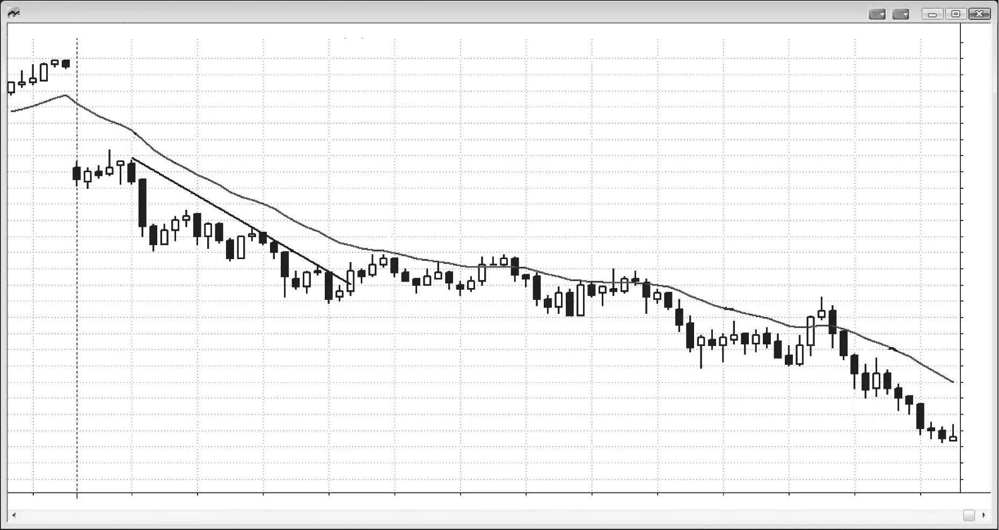

**图 6.1**
**小型信号K线**

小K线可以是顺势或逆势形态。在趋势中，回撤上的小K线只是顺势形态。如图6.1所示，K线7、9、12、14、17和21是回撤中的小K线，它们提供的唯一交易是在其低点下方1 tick处以止损单做空。尽管它们大多是十字星，但它们是顺势的，因此是合理的做空。强趋势中的大多数信号K线看起来很弱，这正是趋势能不断向下奏效的原因之一。空头渴望做空，多头想以更小亏损离场，双方都一直在等待强有力的做空形态。那会让他们确信市场不会反弹、需要立即出场。完美形态永远不来，空头被困在场外，多头被困在场内。这就产生持续的紧张与紧迫感，不断把市场压低。双方全天都分批小量卖出，以防完美形态永远不来……而它通常确实不来。形态看起来从不强，因此交易者很容易假定趋势很弱、很快会有不错的反弹让他们以更好价格卖出。他们看到市场一直在均线下方，但它从未跌得足够快让他们恐慌，于是他们一直希望有更大的反弹再卖。弱信号K线是强趋势的重要成分。

若小K线出现在摆动低点，且还有其他逆势交易理由（如此前的趋势线突破），它也可以设置逆势交易。K线16是一根小型空头K线，在突破

<!-- PDF page 144 -->

图 6.1

空头趋势线之后以及从K线7到13的空头通道的 High 4 底部之后，设置了做多。从K线14测试均线之后有两段式回撤，市场很可能有第二段上涨。

交易者应在低点处卖出小K线的唯一时机是在空头趋势中，最好是在强空头尖峰期间。K线29并不特别小，但它是内包K线（功能类似小K线），且是空头趋势K线，因此在当日低点做空是安全的。

K线13是三K线向上反转的中间一根，K线17是四K线向下反转的中间部分。所有多K线反转都只是两K线反转的变体。图上还有其他几处反转，所有图表都是如此。

**对本图的深入讨论**

如图6.1，当天以大幅向下跳空开盘，因此交易者必须寻找可能的开盘即趋势向上或向下，并密切关注形态。K线3是多头反转K线，是失败突破并向上反转的好做多形态，但入场K线有空头实体——若交易者期待多头趋势，这从来不是好事。这一失败突破失败了，变成突破回撤做空形态，并导致空头突破恢复。多头在K线4下方向下反转时离场，许多人反手做空。下一根也是十字星，现在市场在大幅向下跳空日处于窄幅震荡区间。这是极好的突破模式形态，可能走出大幅向上或向下趋势。K线5越过那根十字星上方1 tick，很可能困住了过早做多、未等待开盘区间顶部K线4上方突破的多头。当天最好的交易是在K线5下方做空，或在下一根跌破窄幅震荡区间低点时做空，或在其收盘时——当时已清楚市场处于始终做空。跌至K线6的尖峰有三根大型空头趋势K线，很可能随后出现等幅运动向下，可能以空头通道形式。趋势走得比那远得多。

K线13是新摆动低点处的小型多头内包K线，是 Low 2 最后旗形做空之后的向上反转，也是第二段下跌中的第二段，使之成为 High 4 做多形态。它也是尖峰与通道空头中空头通道的第三或第四次下推（取决于你如何数推）。尖峰由从K线5开始的三根空头趋势K线构成。通道往往在第三次下推结束，通常随后出现两段式横盘至向上，如此处。调整常到达通道顶部，但此处空头趋势太强，调整只能横盘而不能向上。那通常意味着更低价格将随之而来。

K线16是在相对强势上冲至K线14（强到足以突破空头趋势线）之后、正在形成的震荡区间中的 High 2 做多形态。这一强势使第二段上涨成为可能。

<!-- PDF page 145 -->

图 6.1

K线14接近20缺口K线做空形态，因为此前20根K线的高点都在均线下方。接近就足够接近，对空头低点的测试是可能的。冲向K线14也是窄通道的第一次突破，因此很可能随后至少有一次向下测试。

K线17是真正的20缺口K线做空形态。市场在其下方交易，然后在其上方，随后跌至当日新低。K线17是十字星均线缺口K线做空形态，但从K线16起的上涨是强多头尖峰，大多数交易者会等待第二次信号再做空。入场在K线17之后的向上外包K线下方。入场K线是强势空头趋势K线，成为强空头尖峰中的第一根。

所有图表上都有许多微型双顶和双底反转形态，这些在第3册关于反转的章节中讨论。K线20和21形成了微型双顶反转形态的例子。

<!-- PDF page 146 -->

图 6.2

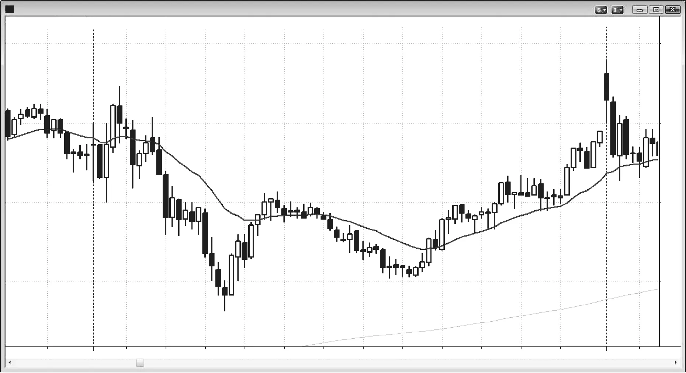

**图 6.2**
**反转K线可以是延续形态**

当趋势很强时，市场往往在多头反转K线下方而不是上方交易，或在空头反转K线上方而不是下方交易。如图6.2，在这张百度公司（BIDU）5分钟图上，K线3是第三次试图让市场向上反转，且是强势多头反转K线。然而，市场不是在其上方运动，而是在其下方突破。也许有抢先做多者在反转K线触发买入信号之前就入场了（下一根并未在其高点上方1 tick处交易），这些过于急切的多头现在被困。他们会在多头反转K线下方1 tick处离场，而聪明的交易者就在那里做空。

相反的情况发生在K线6空头反转K线处：在市场交易到该K线低点下方之前就做空的交易者被困，不得不在下一根交易到空头反转K线上方时回补。仅有反转K线并不足以构成入场理由，即使它处于反转可能合理发生的区域。

<!-- PDF page 147 -->

图 6.3

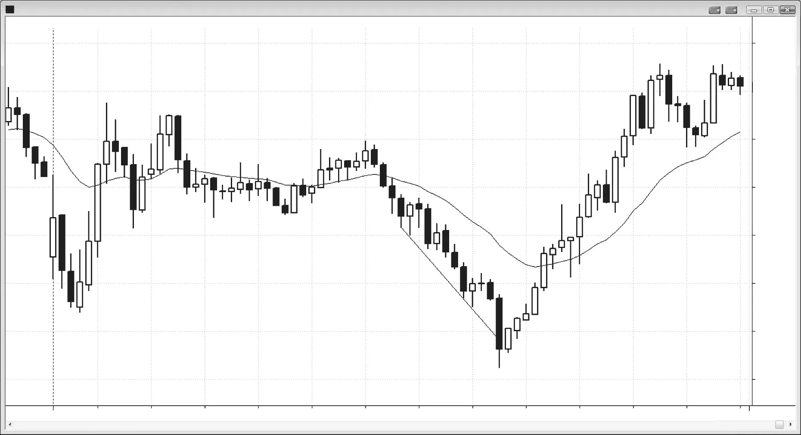

**图 6.3**
**大趋势K线可以表明衰竭**

在已持续10根或更多K线的趋势中形成的异常大趋势K线，通常意味着市场已衰竭，将至少调整10根K线，有时会导致反转。

在图6.3中，K线3是巨大的趋势K线，跌破开盘低点并穿过趋势通道线，随后是一根光头顶部的多头内包K线，意味着买家一直积极买入到其收盘。这是极好的做多形态。这根大型空头趋势K线充当卖盘高潮，多头内包K线上方的突破是多头突破。这是向下尖峰随后向上尖峰，即反转；若你查看各种更高时间框架图表，可以找到一张或多张图上这一底部是完美的两K线反转，以及其他图上形成单根反转K线。

K线4是空头反转K线，但K线5做空入场K线立即反转至K线4高点上方，触发了那些空头的止损。重要的是要注意：在K线4空头反转K线下方做空并不是明智决定，因为向上动能太强。有连续11根多头趋势K线，因此交易者不应在第一根空头K线下方做空。在空头反转K线上方或在K线5向上外包多头K线上方买入是合理交易，因为被止损的空头会等待更多价格行为再考虑做空。若空头尚未准备好做空，多头可以把市场推得更高。

<!-- PDF page 148 -->

图 6.3

**对本图的深入讨论**

如图6.3，当天以向下跳空开盘并出现强势多头趋势K线，但立即向下反转，成为突破回撤做空形态。由于前两根K线有大影线和大实体，且开盘小幅向下跳空，更多横盘的概率很高，最好等待而不做这笔空头交易。然而，随后出现两K线反转信号，构成失败突破形态以及可能的当日低点。有四根多头尖峰K线但没有跟随。在接下来的一两个小时里的某个时点，交易者至少会部分止盈，并可能在晚期下跌期间用保本止损离场剩余仓位（若他们没有反手做空）。

K线3也是尖峰与通道空头趋势的底部，反转应测试通道起点K线2，而它确实测试了。跌至K线1的五根K线下跌是尖峰，向下通道从回撤至K线2开始。跌至K线3的下跌是高潮性的，因为大约有十几根K线的低点和高点都低于前一根。实际数字并不重要。重要的是有许多根K线，且越多，这种行为就越不可持续，因此越是高潮性的。像K线3这样在强空头趋势之后的大型空头趋势K线是卖盘高潮。这通常导致两段式横盘至向上调整，较少导致如此处发展的趋势反转。

失败的K线4反转K线是失败的 Low 2 做多形态。Low 2 困住了在反转K线下卖出、却未等待空头强势事先展示的天真交易者。若市场处于尚未出现多头趋势线突破的窄通道强多头趋势中，你不应卖出。

冲至7:05那根的四K线尖峰本可能随后出现向上通道。然而，跌至K线1的尖峰创造了可能改为向下通道的可能，而事实如此。买入大约在8:45结束的回撤、期待向上尖峰是合适的；在K线2之后的空头内包K线下方反手做空也同样合适。

注意K线1前后的十字星都不是好的信号K线，因为它们在当日区间中部，且紧邻平坦的均线。

K线1之前五根处的摆动高点形成了三K线反转，在15分钟图上会像一根实体只有1 tick高的多头15分钟反转K线，因为第三根与15分钟K线同时收盘。

<!-- PDF page 149 -->

图 6.4

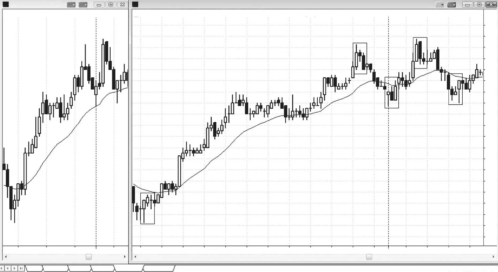

**图 6.4**
**5分钟图上的15分钟反转**

注意15分钟反转可以在5分钟图上看到。在图6.4中，左侧15分钟图有几处反转K线，对应的三K线形态在右侧5分钟图的方框内。一般而言，15分钟反转比5分钟反转更可能带来更长行情。当你准备做5分钟交易时，若看到也构成15分钟反转的三K线组合，通常可以对交易更有信心。

一般而言，把任何在接下来约10根K线内被一根收盘接近第一根开盘的相反趋势K线跟随的趋势K线视为反转，是个好主意。该反转在某个更高时间框架图上会是两K线反转，在更高时间框架图上会是反转K线。

**对本图的深入讨论**

如图6.4，市场跌破均线，突破失败并导致开盘即趋势的多头趋势。K线3是强趋势中的均线缺口K线，跌至K线3的运动突破了多头趋势线。均线缺口K线往往导致更大调整之前趋势的最后一段。K线4是更高高点处的两K线反转做空形态。

<!-- PDF page 150 -->

图 6.5

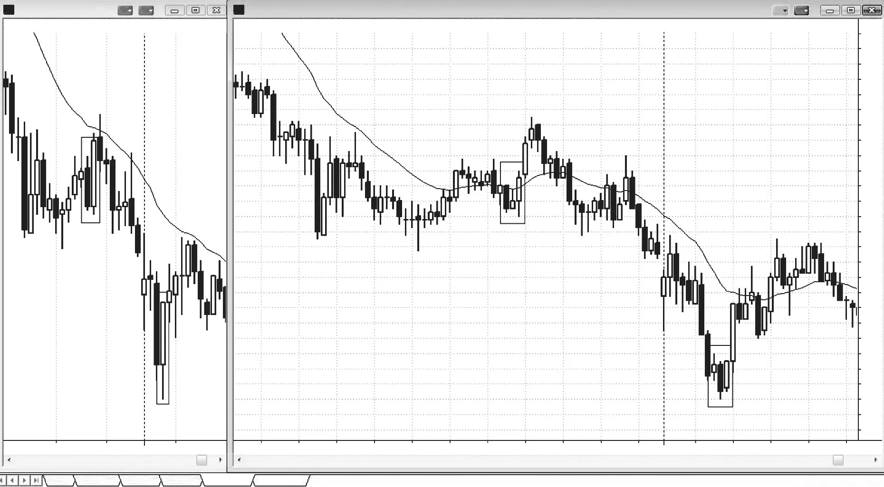

**图 6.5**
**三K线反转**

5分钟图上有些三K线形态不会在15分钟图上形成良好反转，但它们仍然导致可接受的反转。在图6.5中，右侧5分钟图有几处三K线形态，看起来应形成完美的15分钟三K线反转。然而，由于两处第三根都在整点后25分钟而不是30分钟收盘（15分钟K线收盘时），15分钟形态未显示同样的强势。若它是完美的15分钟反转，交易者可以交易5分钟形态，在三根K线高点上方1 tick处买入；或若有更早的5分钟入场则更早入场。例如，在5分钟图上的第二个例子中，第二根和第三根形成了两K线反转，因此可以接受在两K线反转上方1 tick处入场，而不是再高2 tick、在三根顶部上方入场。一般而言，交易者不应花时间寻找三K线反转，因为它们一天只出现几次，你不应冒错过其他更常见形态的风险。

K线2是两K线反转的第一根，你可以找到某个时间框架，使通向底部的三根大型空头趋势K线与K线2之后的两根大趋势K线构成两K线反转，如左侧15分钟图。你也可以找到一张图，使这些K线形成完美的单根反转K线。因此，所有反转形态都密切相关。不要太

<!-- PDF page 151 -->

图 6.5

挑剔，也不要忘记目标。你是在试图看出市场何时试图反转，然后一旦你相信反转很可能有跟随，就寻找某种入场方式。

**对本图的深入讨论**

如图6.5，市场以小缺口跌破昨日低点，第一根是失败突破做多形态，可能形成开盘即趋势的多头趋势。当反转处于如此陡峭的空头通道中时，最好等向上反转后的回撤再买入。几根K线后有更高低点，但K线横盘且有大影线，因此多头应等待更多强势。相反，出现了 Low 2 做空，也是突破回撤做空，但当开盘区间是小于约平均日区间三分之一的小型震荡区间时，大多数交易者更愿意等待整个开盘区间的突破。跌破开盘区间低点的大型空头趋势K线表明，大多数交易者等待该突破才做空。

K线2是开盘反转做多的两K线反转。它跟随单根最后旗形，且当天第一根强势K线中已有更早的买盘强势。

<!-- PDF page 152 -->

图 6.6

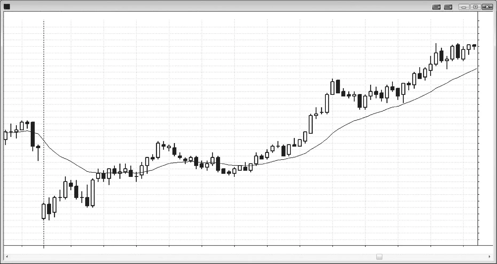

**图 6.6**
**两K线反转**

两K线反转是由两根K线组成的形态，入场在两根之外1 tick。在图6.6中，尽管K线5是空头趋势K线，其低点比前一根低点高1 tick。当反转K线几乎完全与前一根重叠时，应把它视为两K线反转形态。例如此处，最安全的做空入场是在K线5或其前一根中较低者的下方。市场跌破K线5下方1 tick，但与其前一根的低点形成了双底。以为在大空头K线下方做空就安全的交易者被止损出局。

K线3是类似情况；若交易者考虑做空，更安全的是在其前一根低点下方做空，而不仅仅是K线3下方。无论如何，这是有风险的做空，因为市场已强势上涨九根K线。更好的是不做空，而是寻找回撤买入，如在K线4两K线反转上方。

K线1是两K线买入反转的第二根，第二根高于第一根高点。入场在该第二根高点上方。

K线2是两根高点相同的两K线反转。

<!-- PDF page 153 -->

图 6.6

**对本图的深入讨论**

如图6.6，有大幅向下跳空和一根多头趋势K线。市场随后形成向下的两K线反转，但未触发做空，反而变成向上的两K线反转。K线1上方的做多在两根K线后有良好跟随。由于这可能是开盘即趋势的多头趋势且有买盘强势迹象，交易者应依赖当日低点下方的初始止损，直到更高低点之后。一旦市场从更高低点以强势多头趋势K线转上，他们可以把止损上移到更高低点下方，并持多到收盘。

<!-- PDF page 154 -->

图 6.7

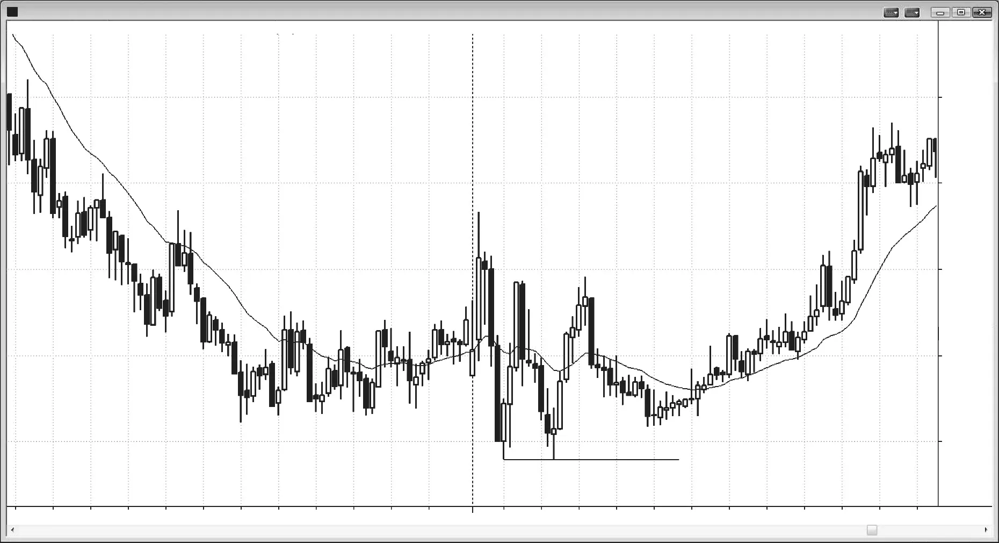

**图 6.7**
**第一小时反转**

始终准备好在开盘后大约一小时内出现反转。高盛集团（GS）昨日处于空头趋势，今日开盘有强势反弹，因此交易者在寻找回撤至更低低点或更高低点以及可能的趋势反转。如图6.7，K线1有更低低点，被K线3测试，二者形成双底。随后K线5有更高低点，多头在寻找可能新多头趋势的做多形态。K线5是内包K线，其后一根也在K线5之内，低点高于K线5低点、高点低于K线5高点。这是 ii 形态，交易者会在第二根上方1 tick处以止损单买入。K线6是第二个 ii 形态，因为它是内包K线，其前一根也是内包K线。

**对本图的深入讨论**

如图6.7，开盘棘手；有疑问时就观望。市场突破昨日最后几小时的震荡区间上方，但突破在第三根失败。市场随后跌破该震荡区间下方，该突破在K线1失败并向上反转。K线3是可接受的双底做多形态，但等待的交易者可以在K线6上方买入双底回撤。

这是双底回撤做多形态。双底回撤的回撤通常延伸超过50%，往往几乎全程

<!-- PDF page 155 -->

图 6.7

回到双底。这一双底精确到 tick。更高低点往往形成圆弧底，传统股票交易者会把它描述为吸筹区。名称无关紧要；重要的是市场在这第二次下试时未能创出更低低点（K线3是第一次），因此若它不能向下，空头会让开，市场会向上试探（寻找愿意在更高价卖出的卖家）。市场没有找到卖家，反而找到了愿意在更高价买入的买家。

K线7设置了连续相反失败上的第三次入场。市场在K线6上方的向上突破失败，随后在下一根向下失败，意味着多空都被困。K线7变成只是K线6上方突破的回撤，因此是突破回撤做多形态。

K线4是双顶空头旗形做空形态。开盘反弹后，K线2有更低高点，被K线4测试，形成双顶。由于双顶在开盘高点下方，存在可能的空头趋势，空头趋势中的任何回撤都应视为空头旗形。

<!-- PDF page 156 -->

图 6.8

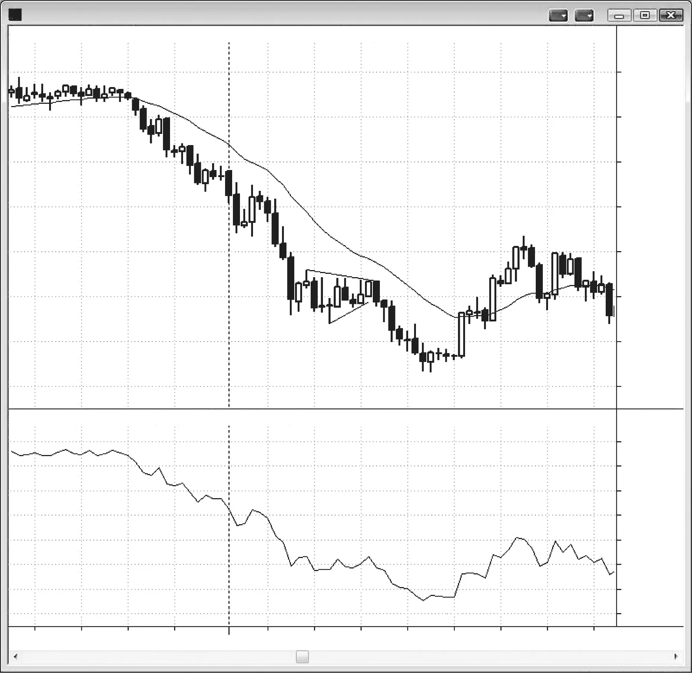

**图 6.8**
**极小的K线仍然可能有用**

有时K线极小，看起来微不足道，但它们仍然可以告诉你非常重要的信息。在图6.8中，K线2信号K线是极小K线（185美元股票中的11美分），但若你看收盘价线图，在点2处小的更高低点很清晰。

K线2是反转形态的后半部分，K线1之前三根形成的大型空头趋势K线是反转中下跌部分的起点。你可以找到某个更高时间框架图，使这10根K线的集合形成两K线反转。

<!-- PDF page 157 -->

图 6.8

**对本图的深入讨论**

如图6.8，当天在最高 tick 开盘，并以两K线尖峰向下突破昨日收盘的两K线空头旗形。市场在第四根试图向上反转，但没有做多入场，因为那是没有跟随的向上外包K线。空头会持有，止损在信号K线上方或可能在向上外包K线上方。下一根是空头内包K线，在开盘即趋势的空头趋势中设置了 Low 2 做空入场。

K线2之前三根的多头反转K线是风险更大的入场，因为此前七根市场一直处于窄空头通道。更安全的是等待通道突破，然后买入突破回撤。这一回撤更多是横盘停顿，以K线2更高低点买入信号结束。一般而言第二次入场更可靠。它非常接近 iii 形态，iii 形态往往在摆动末端导致反转。

K线1不是最后旗形突破后向上反转的好形态，因为信号K线是十字星。相反，在强空头趋势中抄底时，你应等待多头趋势K线作为信号K线。此外，此前四根是空头趋势K线，向下动能太强，不宜买入第一次反转尝试，尤其当信号K线是十字星——它并不代表强买盘。

<!-- PDF page 158 -->

图 6.9

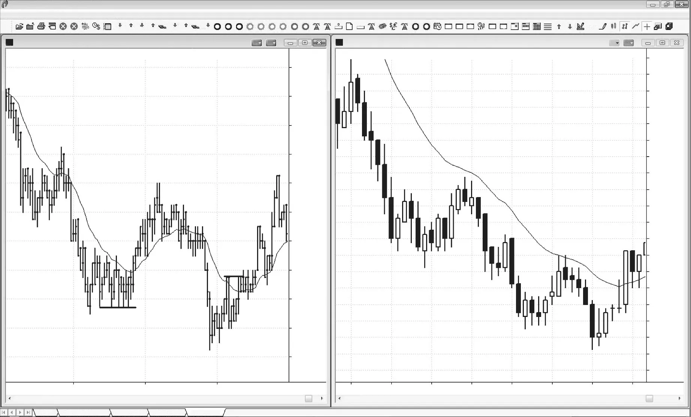

**图 6.9**
**ii 形态是更小时间框架上的反转**

因为 ii 形态总是代表更小时间框架图上清晰的反转形态，你永远不必检查那张图来确认。在图6.9中，右侧5分钟图有两处 ii 形态（第一处是 iii）。这些在更小时间框架图上往往是更清晰的反转形态，如左侧1分钟图。5分钟图上的K线1 iii 是在1分钟图上被反复测试的更高低点。5分钟图上的K线2 ii 是更高低点之后的更高低点，因此市场在做出趋势性的更高低点，这是多头趋势的组成部分。

在这两种情况下，ii 形态末端的多头趋势K线都是极好的做多入场形态。尽管小K线的方向意义较小，但让最后一根是你打算入场方向上的趋势K线总是更好。

5分钟图上的K线2与此前两根形成的空头趋势K线构成反转。

**对本图的深入讨论**

图6.9中1分钟图上的K线1形态是双底回撤做多形态，K线2形态是失败的 Low 2。

<!-- PDF page 159 -->

图 6.10

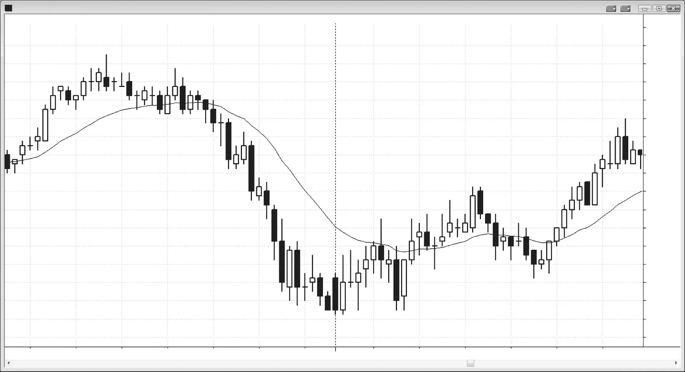

**图 6.10**
**两K线双底与双顶**

双底和双顶可以小到连续两根K线，仍然很重要。

在图6.10中，K线1是微型双底空头旗形形态，因为它是空头尖峰中紧接多头趋势K线的空头趋势K线，且二者低点相同。在其低点下方1 tick处卖出。你也可以在下一根单根回撤的低点下方卖出，获得更早入场。

K线2是另一个例子。

K线3是微型双顶做多交易的入场K线，因为该空头趋势K线是多头尖峰中的单根多头旗形（多头尖峰中的 High 1 做多形态）。它也是微型双底，并与其前一根构成两K线反转。因此交易者也可以在K线3高点上方买入，尽管这是风险更大的入场，因为差价差了4 tick。此外，在三根重叠K线突破后的大K线上方买入是有风险的，因为那三根可能是震荡区间的开始。

**对本图的深入讨论**

如图6.10，当天第一根跌破昨日低点，突破失败。由于市场仍在昨日最后一小时震荡区间内

<!-- PDF page 160 -->

图 6.10

且开盘两K线向上反转的K线较大，这会迫使交易者在有许多大影线K线的震荡区间顶部买入。相反，交易者应等待。上冲至均线是空头旗形，在太平洋标准时间上午7:15突破，但突破失败，在下一根以两K线反转向上，是合理的买入。

在上午8:50有双底回撤做多形态。

<!-- PDF page 161 -->

图 6.11

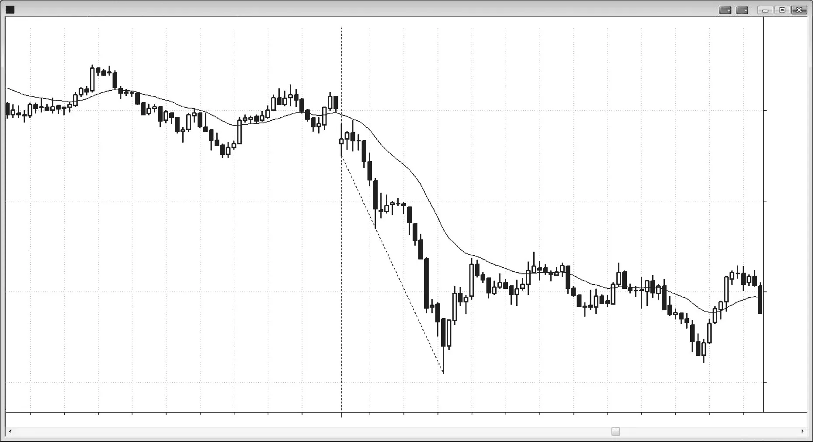

**图 6.11**
**强势两K线反转**

虽然通常最好不要在强空头趋势中买入第一次反转尝试，但在卖盘高潮之后，强势两K线反转可以是可靠的做多形态。

如图6.11，雷曼兄弟控股（LEH）在测试空头趋势通道线并经历连续卖盘高潮后出现两K线反转底部。下跌是高潮性的，因为那是不可持续的行为。此前17根中有16根的高点都低于前一根高点。此外，有三次出现大型空头趋势K线跟随一系列较小空头趋势K线。高潮通常随后是持续许多根K线的两段式调整（在5分钟图上至少一小时）。

K线1是两K线反转的第一根。在强空头趋势中买入第一次反转通常有风险，但在有若干高潮行为迹象以及非常强势的两K线反转之后，这是合理的做多形态。K线1是又一根大型空头趋势K线，因此又是一次卖盘高潮，第二根是强势多头趋势K线。它很大，开在低点、收在高点。

**对本图的深入讨论**

如图6.11，市场开盘突破昨日最后90分钟的空头旗形，并测试昨日低点。第三根测试均线，

<!-- PDF page 162 -->

图 6.11

下一根设置了 Low 2 做空，可能是开盘即趋势的空头以及突破回撤做空。许多交易者等待跌破当天第一根再做空，这导致一根空头趋势K线成为三K线空头尖峰的第一根。交易者也可以在随后空头旗形下方做空。

K线1振幅大，跟随强势空头段，因此是卖盘高潮。四根之前还有一根大型空头趋势K线，也是卖盘高潮。当趋势特别强时，往往要到第二次卖盘高潮之后才调整，很少在第三次之后。

K线1之前两根形成的小型内包K线变成了单根最后旗形。

开盘有三根几乎不重叠的连续大型空头趋势K线，构成向下尖峰。强势向下尖峰通常随后是空头通道，然后是回撤，有时是反转。那一初始向下尖峰之后是横盘 Low 2，然后是更强的卖压。尽管这一跟随卖压几乎垂直，仍应把它视为跟随初始向下尖峰的空头通道。那个 Low 2 是一种最后旗形，尽管市场在试图回撤之前又跌得很远。

尖峰与高潮空头（一种尖峰与通道空头趋势）通常在一两天内测试通道起点附近，但当卖压如此强时，它们可能不会，更高时间框架形态可能在控制市场。例如，整个跌至K线1的下跌可能是60分钟图上的大尖峰，随后的震荡区间可能变成导致大幅空头通道向更低价格推进的回撤。

<!-- PDF page 163 -->

图 6.12

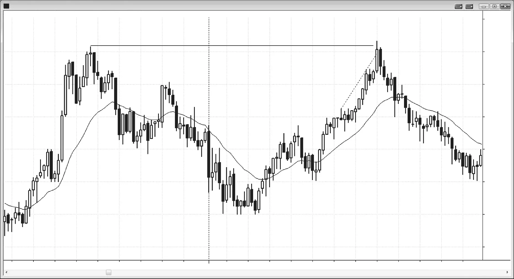

**图 6.12**
**两K线反转买盘高潮**

在强多头通道中第一次反转尝试可以是可靠的做空——若它处于买盘高潮末端且两K线反转很强。

在图6.12中，K线4是突破昨日高点和多头趋势通道线、并在小型旗形（K线3）突破之后的大型两K线反转顶部。当两根K线重叠如此之多时，若你在两根中较低者下方而不是另一根（此处是K线4）下方做空，获利交易的机会更大。此外，第二根有大空头实体；当多头趋势很强时，你应只在强势空头K线下方做空，绝不在强势多头K线下方做空。

K线1及其前的空头K线并未提供良好的两K线反转做多形态，因为在更低高点突破上那两根大型空头趋势K线的向下动能太强。两根几乎互不重叠，且影线很小。

紧接着又是另一个两K线反转做多形态（背靠背形态偶尔发生），但向下尖峰之后有四根重叠K线时那是空头旗形，你不应在空头趋势的震荡区间顶部买入，尤其是刚好在均线下方。两K线反转只有在有理由期待反转时才是逆势信号。

<!-- PDF page 164 -->

图 6.12

K线2是基于前两根构成的两K线反转顶部的可接受做空入场K线。它在反转上冲至均线的小幅调整。然而，每当均线下方刚好有两K线反转做空形态，且K线相对较大并与一根或更多其他K线重叠时，你通常可以在信号K线低点处或其下方买入做多剥头皮。这是小型震荡区间，通常最好在小型震荡区间底部买入。

K线4是两K线反转的第一根。

**对本图的深入讨论**

如图6.12，K线4两K线反转跟随K线3处的小型最后旗形，是上午9:10开始的多头尖峰之后的第三次上推。尖峰与通道形态往往在三次上推后调整。尖峰是第一次推，随后往往还有两次尖峰，再跟通常测试通道底部附近的调整。

今天第一根突破昨日最后90分钟双底多头旗形下方。交易者可以在双底下方以止损单做空，或在三根之后的 ii 突破回撤形态下方做空。

从昨日高点有大幅两段式下跌，在今日开盘以三重底结束。在测试开盘高点的初始强势上冲之后，上午9:05 PST 的更高低点有第二次做多机会。这也是突破回撤做多形态（尽管市场尚未突破开盘高点上方）。

K线1是向上K线，随后是向下K线，再是第二根测试均线的向上K线。这是回撤至均线的小型两段式调整，因此是 Low 2 做空形态。也有被困多头在背靠背两K线反转底部尝试上方买入；一旦 Low 2 触发，他们会亏损离场。他们的卖出叠加新空头的卖出，增加成功机会。此外，由于他们刚亏损，会犹豫再买；买家的亏损增加成功做空剥头皮的机会。

一系列重叠K线是窄幅震荡区间，它是磁铁，突破往往失败，市场被吸回窄幅震荡区间。这是因为多空双方都觉得该区间有好价值。当市场漂移向区间底部时，多头觉得价值更好，买入更积极。空头更喜欢在区间中部或顶部做空。他们在区间底部的缺席以及多头的增加买入把市场抬回上方。区间顶部发生相反情况：空头变得更积极，买家停止买入并等待稍低价格。整个

<!-- PDF page 165 -->

图 6.12

过程在突破时被放大。此处，空头能够压倒买家并把市场向下突破。然而，在那里没有找到能把市场推得更远的新卖家，买家把这些更低价格视为比窄幅震荡区间中更好的价值。结果是市场被吸回区间。

市场后来试图向上突破，再次被吸回区间。然而，最终总会有一次成功突破。

<!-- PDF page 166 -->

图 6.13

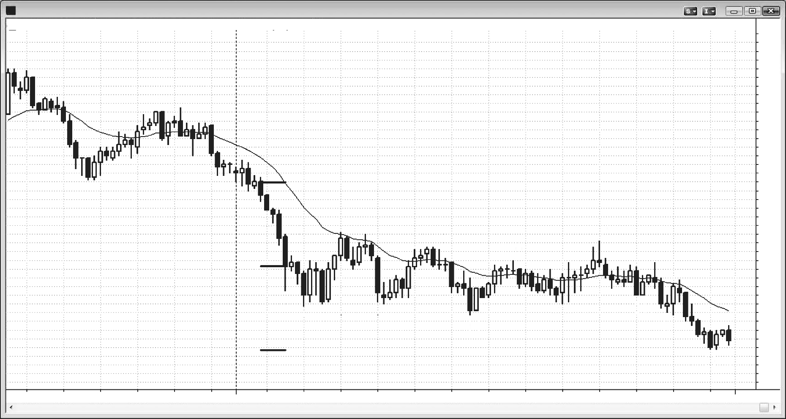

**图 6.13**
**无影线意味着强势**

强趋势中任一端都无影线的K线是强势信号，交易者应在其突破时顺势入场。在图6.13中，K线8是强空头趋势中的空头K线，其高点和低点都无影线，表明严重的卖盘压力（他们从始至终都在卖）。很可能还有更多卖压。交易者必须迅速挂卖出止损单，因为市场移动很快。或者，他们可以只是市价做空，或用限价单在1或2 tick反弹处做空。

K线10之后那根在空头趋势中有光头顶部，但由于此时市场并非自由落体，仅凭这一点不足以做空。

K线16之后那根是光头又光脚的多头趋势K线，但它不在多头趋势中，因此不能仅凭没有影线就充当做多形态。

K线17之后和K线20之前的K线不是光头/光脚做空形态，因为它们不在自由落体的空头趋势中。

这张图上有许多两K线反转形态，所有图表都是如此。

**对本图的深入讨论**

如图6.13，开盘清淡，延续昨日收盘的窄幅震荡区间。K线8是两K线突破，交易者可以在其收盘做空

<!-- PDF page 167 -->

图 6.13

——因可能的开盘即趋势空头趋势；或在第一次停顿K线10下方；或在K线13双顶空头旗形测试均线处。

K线11是两K线反转的第二根，市场可能在卖盘高潮后试图转上。下一根是十字星内包K线，是 Low 1 做空形态。然而，当空头旗形的信号K线大多与前两根重叠、且市场可能处于震荡区间时，做空失败并变成空头陷阱的概率很高。不要做这些做空信号。

从K线12起的三K线上涨导致20缺口K线做空，但由于向上动能强，最好等待第二次信号，出现在K线13。

K线19是均线缺口K线做空，导致当日新低。它也是K线15和17摆动高点上方的失败突破，以及对震荡区间顶部的测试。趋势日在太平洋标准时间上午11:00至中午之间常有强势逆势行情，如此处把交易者困在错误方向。认识到这一点很重要，这样你才会在心理上准备好做顺势交易——此处是做空。

由于K线10之前那根是已持续一段时间趋势中的大振幅K线，它是卖盘高潮，市场可能很快试图横盘至向上调整。强趋势中的第一次停顿通常是成功的做空剥头皮，即使在强空头趋势中也是如此，但它可能变成最后旗形并导致向上调整（其低点下方的突破可能在一两根内向上反转）。每当有强势向下尖峰时，通常随后会有基于尖峰某方面的等幅运动向下，通常是从第一根的开盘或高点到尖峰最后一根的收盘或低点的距离。当日低点是从第一根开盘到最后一根收盘的完美等幅运动向下。交易者应继续持空，至少直到市场到达这些目标的大致区域。

K线16是当日新低处向上反转的大型多头内包K线，市场现在处于震荡区间。它也是震荡区间中的 High 2，因此是可接受的做多形态。High 1 形成于两根之前。

昨日收盘的两K线向下尖峰导致今日K线11之前结束的空头通道。然而，整个通道足够陡峭，很可能在15或60分钟图上充当尖峰，市场可能正在向下通道进入当日收盘。

K线21强势空头趋势K线或K线20之前那根可能充当了导致向下通道进入收盘的小型向下尖峰。

<!-- PDF page 168 -->

图 6.14

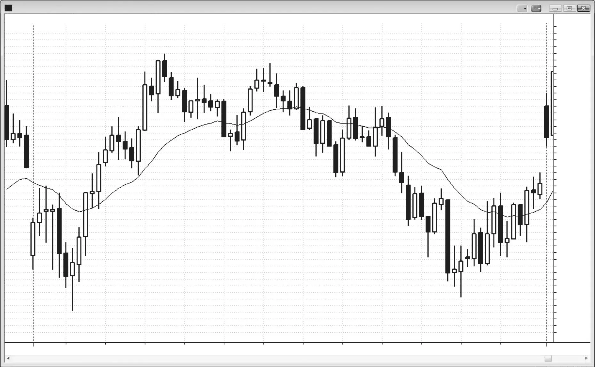

**图 6.14**
**信号K线示例**

苹果（AAPL）在图6.14所示5分钟图上展示了许多常见信号K线。尽管K线1是向下摆动底部的锤头十字星，会让许多蜡烛图崇拜者想买入——尤其因为它与当天第一根形成双底——但对价格行为交易者来说这是糟糕形态。它是第三个重叠十字星，意味着三根K线中市场都既上又下交易。这是双向交易区域，因此是震荡区间；每当均线正下方有震荡区间时，概率偏向向下突破。从下方任何对均线的测试总有卖家，且该K线高点与均线之间没有足够空间做出即使是剥头皮的利润。若你在K线1上方买入，就必须注意K线大小——它们都有相对较大的振幅。这增加交易风险，因为你的保护性止损位置应部分由当前K线大小决定。若你想在所有交易上保持相同风险，就必须交易更少股数。

K线2是好得多的反转K线形态，因为它有像样大小的多头实体，是从昨日低点下方和

<!-- PDF page 169 -->

图 6.14

当日新低第二次试图向上反转（K线1是第一次）。当天前两根的多头实体显示一些此前的多头强势。顶部影线显示一些弱势，但被随后的趋势K线抹去。

K线2是两K线反转的第二根，也是某个更高时间框架图上大型两K线反转的中间。你可以找到一张图，使前一根或后一根形成两K线反转；你也可以找到更高时间框架图，使前两根和后两根形成两K线反转。与所有两K线反转一样，你可以找到更高时间框架图，使这五根形成单根多头反转K线。

K线3是停顿K线之后的向上外包K线（有多头实体的外包K线），停顿跟随突破至当日新高，是在小K线高点上方买入的入场K线。新趋势中的外包K线往往把交易者困在绝佳交易之外，因为它们发生得太快。许多交易者没有足够时间把视角从看跌迅速转为看涨，于是不得不追涨。K线3之前那根是十字星，因此不是强势做空形态，尽管市场可能在突破至当日新高后向下反转。由于累积的多头强势迹象，只有剥头皮者和弱空头会在其低点下方做空。那根十字星之前的K线有当日最大的多头实体并收在高点，也是连续第三根上涨K线。三根都有像样大小的实体，第二根和第三根与前一根的重叠不超过一半。很可能交易者在积极寻找任何回撤买入，并在十字星低点下方和高点上方都挂了限价买单，买盘如此强以至于两套买单在一根K线内都成交了。

K线4是新高处的空头十字星，但向上动能太强、反转K线太弱，只有第二次入场才可以考虑做空。这是连续七根多头K线后的第一根空头实体，市场很少在第一次尝试时反转很远，尤其当信号K线收在中部而不是低点时。空头甚至不够强到把K线收在低点，因此他们不太可能在多头再次压倒他们之前把市场推得很低。

K线5是又一根向上外包K线，测试均线和开盘区间突破，是强势上冲中第一次回撤的结束。

K线6是空头反转K线，是突破K线4摆动高点和昨日高点后的第二次做空入场形态（第一次在两根之前）。由于空头有足够强势用K线5测试均线，且多头趋势更加过度，这次空头应能调整到均线甚至其下方。随着趋势延续，多头通常会希望更深的回撤再考虑再次买入。

K线7是你期待测试均线时的 ii 做空形态上的入场K线。两根 ii 都有空头实体，这增加

<!-- PDF page 170 -->

图 6.14

做空交易的成功机会。尽管空头入场K线上的多头实体不好，且其后一根在其上方交易，市场并未交易到 ii 两根中任一根上方——那是保护性止损所在。若你要在窄幅震荡区间中交易，必须给它一点空间。那根入场K线变成小型多头反转K线，但小型反转K线很少是好的；当它形成于窄幅震荡区间时，不应把它视为反转K线，因为没有什么可反转的。ii 突破在几根后向上反转回来，这在 ii 处于当日区间中部时是预期的。此外，市场完成了两段下跌并穿透均线的目标。

K线8是现在已是震荡区间中接近双顶的十字星。十字星在强多头中绝不是好的做空信号K线，但在震荡区间中视背景可以是可接受的做空信号K线。由于市场在测试区间顶部，它是可接受的做空信号K线，因为市场可能测试区间底部。

K线9是新摆动低点并测试K线5低点后的两K线反转。入场在两根中较高者的高点上方，即K线9上方。然而这有风险，因为从下方测试均线时总有人做空。此外，两根较大，迫使买家在下跌段低点上方太高处进场。当风险更大时，最好不做该交易，等待强势形态。

K线10是四根实体大小不错、影线小、几乎不重叠的空头趋势K线之后的两K线反转，因此是强空头趋势中很好的做空形态。

K线11是第三次下推后的多头反转K线，试图守在当日低点上方。空头趋势已持续很久，沿途有许多回撤，因此测试均线的概率很高。由于它是逆势，你必须愿意允许上冲至均线过程中的回撤，因此不要过早收紧止损。

**对本图的深入讨论**

如图6.14，市场在开盘跌破均线，但以强势多头反转K线失败。第二根有多头实体但也有突出影线，未能越过均线。第三根也没有跟随买盘，同样测试均线并未能越过。多头应考虑离场并观望，因为市场现在处于均线下方的小型窄幅震荡区间，K线大且有影线。均线下方的窄幅震荡区间通常向下突破，但没有可靠的做空形态。相反，交易者应等待更好的形态。K线2是强势多头反转K线，设置了该窄幅震荡区间失败突破的做多——该区间变成了最后旗形。

<!-- PDF page 171 -->

图 6.14

一旦市场突破开盘高点上方，等幅运动向上就成为可能。K线2也是跌破可沿前三根底部画出的趋势通道线的空头微型楔形。注意K线1之后那根底部有影线。那意味着买家在该K线低点附近进场。空头希望在跌破该K线低点时找到卖家，并希望收盘远低于该K线低点，但反而有一些买家。下一根也是如此，K线2更是如此。空头终于能够把价格推到前一根低点更下方，但多头变得特别积极，反转市场并把K线收在开盘上方、接近高点。尽管微型楔形本身通常不会导致主要反转，但此处起作用的其他因素造就了当日低点。

K线2与其前一根和后一根也构成三K线反转和15分钟反转K线，因为前一根的开盘与15分钟K线相同，后一根的收盘与15分钟K线相同，且收盘高于开盘。下一根随后会触发15分钟做多入场。

从K线4到5的下跌有几根重叠K线，可能是最后旗形。K线5及其后一根都有很大实体和很小影线，因此形成两K线买盘高潮。当高潮出现在趋势已持续许多根之后时，至少持续10根的两段式横盘至向下调整的概率增加。下一根是买盘高潮后的空头内包K线，可能变成单根最后旗形。

K线6是从K线5第一次回撤和从K线2低点起的第二段上涨，第二段往往是反转。此外，它是 Low 4 和楔形，三次推是K线4、K线5之后那根、以及K线6。它还是更大楔形，三次推是当天第三根、K线4和K线6。有如此多因素在运作，交易者应期待至少两段下跌。它也跟随两次买盘高潮，第一次是K线5及下一根的两K线高潮，第二次是K线6之前那根。第二次连续买盘高潮通常导致至少两段式调整，穿透均线并持续至少一小时。

跟随K线6做空的两段式回撤穿透了均线，以均线缺口K线结束。由于它形成于强趋势中，测试趋势高点是可能的。它也是楔形多头旗形做多形态，第一次下推是K线6之前那根，第二次下推是K线6之后第三根。均线缺口K线往往导致市场出现更大回撤甚至反转之前趋势的最后一段。

K线8是均线缺口K线之后的更低高点或双顶——均线缺口K线总是突破趋势线——因此是可能的趋势反转。有很好的风险/回报设置做向下波段，空头应对部分仓位做波段持有。它也形成了单根最后旗形反转，以及与其前两根中任一根顶部影线构成的微型双顶反转。

<!-- PDF page 172 -->

图 6.14

K线9是从K线8起三次下推的楔形多头旗形，但由于下跌处于相对窄的空头通道，市场可能已反转为空头趋势，最好等待看是否会有可接受的突破回撤做多形态。五根之后有向上外包K线，但那在震荡区间或空头趋势中都不是可接受的做多入场，因此买家还得再等。K线9也是试图与K线5形成双底多头旗形，处于当天早些时候市场找到买家的价位。最后，它是从K线6高点起的大型两段式调整的结束，因此是 High 2 做多，可能在更高时间框架图（如15分钟图）上是清晰的 High 2 做多。

K线10是跌破K线9楔形多头旗形低点和失败 High 2 的突破回撤，跟随K线9之后形成的双顶空头旗形下方的突破。四K线突破是向下尖峰，市场在收盘前反弹测试通道顶部K线10。有与K线10高点及其后四根形成的双顶空头旗形做空形态。所有突破都是尖峰和高潮，K线11之前两根有第二次卖盘高潮；第二次连续卖盘高潮通常导致至少两段式回撤。突破尖峰往往导致等幅运动向下。取四根中第一根开盘与第四根空头K线收盘之间的 tick 数，从第一次回撤顶部（K线10高点）向下投射。

K线11在外观上类似K线1——更早在这一价格区域找到过买家，他们可能愿意再次买入。由于尚未出现空头趋势线突破，震荡区间的概率大于显著反转的概率。从K线6起的下跌处于通道中，空头通道应视为多头旗形，因此不久可能有强势上冲。此外，从K线6起的整个下跌是复杂两段式运动，第二段下跌始于K线8；在更高时间框架图（如60分钟图）上它可能是简单的两段式调整。

K线11是与其前多头十字星影线构成的微型双底反转。

<!-- PDF page 173 -->

图 6.15

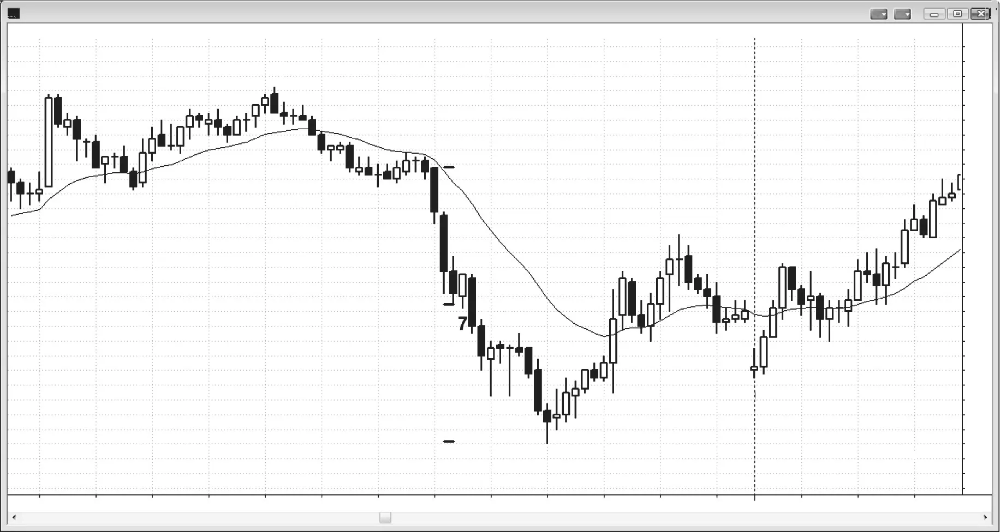

**图 6.15**
**单根空头旗形**

空头尖峰中的多头反转K线可以是单根空头旗形。在图6.15中，K线8是强空头趋势中跌破多头反转K线（失败反转K线），是极好的做空，因为抢先做多的多头会被困并被迫在其低点下方卖出。

K线8至14在更高时间框架图上构成两K线反转，在更高时间框架图上构成单根反转K线。

K线9和10形成小型双底，K线11是做多的入场K线，但十字星不是对抗强趋势的好逆势信号K线。陡峭下跌中此前没有多头回撤，由于强趋势中第一次回撤通常失败，聪明交易者预期这一底部会失败。他们把卖出止损单挂在亏损多头会离场的同一位置——K线11下方1 tick处——去做空。

十字星是单根K线震荡区间，K线9和10构成一对大十字星，中间夹一根小十字星。这三根在强空头趋势中形成小型横盘震荡区间，是空头旗形，因此向下突破可能。由于K线11是第二次试图反弹（第一次在两根之前，但甚至未能越过其前多头十字星上方），多头几乎肯定会在K线11下方离场，在市场再向下走一两根之前不会再买。当这些多头卖出仓位时，他们的卖压叠加了预期这一弱底部会失败而在K线11下方做空的聪明交易者的卖压。

<!-- PDF page 174 -->

图 6.15

唯一愿意买入的交易者刚买入并亏损，因此市场短暂变成单边，注定下跌。

**对本图的深入讨论**

K线7与两根之前大型空头K线底部的影线形成微型双底（底部不必价格完全相同）。由于市场处于空头尖峰，在K线7双底低点下方突破处卖出是合理的做空。这与K线18微型双底（与两根之前十字星的影线）不同——后者处于四根多头尖峰的回撤中，而不是空头尖峰中。在K线18上方买入是合理的（大多数次要多头反转都来自某种微型双底，如第3册关于反转的章节所述），但在其下方做空不好。K线11与两根之前的高点形成微型双顶，变成 Low 2 空头旗形做空信号K线。

如图6.15，K线15强势突破空头趋势线上方，跳空向下开盘至K线16是期待第二段上涨的更高低点做多形态。市场跌破均线，并跌破昨日最后一小时双底多头旗形下方，突破失败。

K线18是从K线15到16多头旗形突破的突破回撤做多。

K线6及下一根是跌破K线2和4双底下方的大型空头趋势K线。影线小、实体大，更多卖压可能。每一次大型空头突破都是卖盘高潮，但那并不意味着市场会反转。这一突破看起来很强，多头在卖盘高潮后只能制造两K线停顿就被空头再次压倒。突破不仅是高潮也是尖峰；当突破如此强时，通常随后是向下通道，然后才形成可交易底部。空头会积极在每一次停顿和每一次小回撤做空，直到可能的底部形成。底部通常会在某个等幅运动目标，首先考虑的是突破前震荡区间顶部到底部的等幅运动向下。接下来看突破K线开盘到突破最后一根强势空头趋势K线的收盘或低点，可能是K线7之前那根或其前一根。结果是空头趋势在用尖峰顶部到尖峰第三根也是最后一根空头K线低点向下投射的等幅运动处见底。你也应寻找其他可能的等幅运动投射，因为若市场在这些磁铁之一的几 tick 内试图反转，应增加你做该交易的信心。然而，你不能仅凭等幅运动就做逆势交易，因为大多数失败，你必须继续看其他。成功概率太小。然而，若有其他做交易的理由，如趋势通道线超调与反转或最后旗形反转，成功概率会显著增加。

<!-- PDF page 175 -->

图 6.15

强势向下尖峰之后，最可能的后续是某种向下通道，最终向上测试通道顶部。交易者会一路在通道中做空，然后在底部买入以回撤至通道顶部。

K线8及其后一根是几乎不重叠的大型空头趋势K线，因此构成第二次卖盘高潮。尽管第二次卖盘高潮通常导致至少10根的两段式横盘至向上，但跌至K线9如此陡峭，买家不愿买入，卖家仍愿继续卖。

K线11是四K线铁丝网形态的结束，长趋势后的铁丝网往往变成最后旗形，如此处。交易者预期小型窄幅震荡区间下方的任何突破很快会失败，市场被吸回区间。因此，他们可能只对K线11下方的做空做剥头皮，而不是持有做向下波段。K线11之后两根又是大型空头趋势K线，形成第三次尖峰，它始终既是某物的突破（此处是铁丝网，因此是潜在最后旗形）又是高潮。第三次连续卖盘高潮相当不寻常，因此至少有持续至少10根的两段式横盘至向上调整的概率很高。在最后旗形突破和等幅运动之后，这甚至更可能。

尽管低点处的K线12信号K线有空头实体，其收盘在中点上方，因此买家显示一些强势。它也是尖峰突破后的第三次下推（K线7和9是前两次），跟随尖峰的通道往往以第三次推结束。在最后旗形、第三次连续卖盘高潮、楔形底部和等幅运动的背景下，这是很好的反弹形态。首要目标是测试铁丝网顶部K线11高点附近以及测试均线。另一目标是持续约10根或约一小时的两段式横盘至向上。最终目标是测试初始尖峰后通道的顶部，那是K线7多头K线的顶部。尽管上冲至K线15有两段，它大多包含在通道中，因此更可能是更大两段式形态中的复杂第一段，事实如此。第二段上涨在次日K线16开盘开始。

<!-- PDF page 176 -->

图 6.16

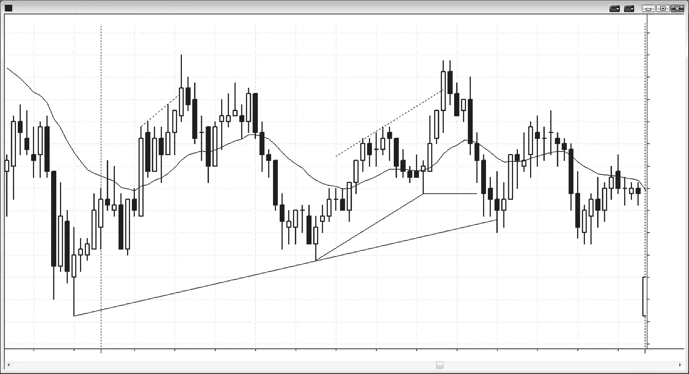

**图 6.16**
**好形态很常见**

每天每张图上都有许多好形态，你越有经验在它们形成时发现它们，从中获利的机会就越大。

在图6.16中，K线1是突破开盘低点后的两K线反转做多形态，相对昨日低点是更高低点。

K线2之前的小型空头反转K线测试了均线，试图让两K线反转失败。它失败了，变成只是K线1上方突破的回撤。当市场试图上行时，在回撤上方买入是好的。

K线3是试图突破多头趋势通道线和昨日高点上方之后的空头内包K线。这设置了做空，因为若市场交易到其低点下方，交易者会认为突破已失败，应有回撤。

K线4是另外两个十字星之后的十字星；实体极小、由十字星构成的微型楔形顶部很少是可靠形态。重叠十字星代表双向交易，因此代表不确定性。然而，三根K线顶部的影线是卖盘压力在累积的信号。第二次入场形态在两根之后以两K线反转出现，做空入场在两根中较低者下方。该空头趋势K线下方的入场也是跌破由那根空头K线与两根之前十字星形成的微型双底。

<!-- PDF page 177 -->

图 6.16

K线5是 ii 上方向上突破的失败。

K线6是多头反转K线，是测试当日低点上第二次试图反弹。

K线7是十字星，但它是强势上冲后回撤至均线、有多头实体，且是第二次试图反弹（第一次是其前那根）。

K线8是空头内包K线，但跟随三根强势多头趋势K线。有如此多向上动能，最好等待第二次入场再做空。

K线8是两K线反转，处于更高时间框架图上两K线反转的中部。该更高时间框架反转的多头成分由K线8之前三根多头趋势K线构成，空头成分是结束于K线11的一系列空头趋势K线。一些更高时间框架图会使用所有这些K线，另一些会使用这些K线期间发生的大部分交易。

K线9是多头反转K线，但相对最近K线较小，因此不太可能导致成功做多。最好等待第二次入场，但一次也没来。相反，在K线9上方买入的多头在市场反转为向下外包K线时立即被困。在K线9低点下方卖出是可接受的，因为那是在利用那些不得不卖出现在亏损仓位的多头。然而，交易者必须快速思考才能意识到这一点并下单。

K线11是 ioi，是跌破K线7摆动低点后的第二次做多入场形态。在震荡日，市场往往反转先前摆动点上方和下方的突破，第二次信号尤其可靠。第一次信号在两根之前，但当时向下动能太强，在那里买入不明智。K线13是有风险的做多入场，因为每当有三根或更多相对较大的重叠K线坐在均线上时，多头突破通常是陷阱。

**对本图的深入讨论**

如图6.16，开盘市场延续昨日收盘的反弹，回撤至均线并设置均线回撤做空。然而向上动能强，因此最好不要做第一次做空入场，而是等待看是否会有第二次。市场跌破当日开盘，向新低的突破失败。这一向上反转是可能的当日低点，与当天第一根形成双底和更高低点。

K线1是失败的 Low 2 做多形态，昨日收盘前的低点是第一次下推。

K线2是K线1上方做多入场的强势跟随K线，在失败 Low 2 之后变成大型突破K线。失败 Low 2 通常随后要么再有一次上推和楔形空头旗形做空形态，要么再有两次上推和 Low 4

<!-- PDF page 178 -->

图 6.16

做空。若突破很强，如此处，Low 4 更可能。由于是如此强的向上尖峰，向上通道也可能。通道呈现楔形形状。一旦楔形或通道反转，第一目标是测试形态起点。

K线3是失败 Low 2 之后预期的 Low 4 做空形态。它也是两个楔形顶部向下反转的形态。较小的一个以K线2之后那根为第一次推，第二次上推在三根之后。较大楔形始于当天第二根，第二次推是K线2之后那根。两个楔形都应随后至少有两段横盘至向下，并应测试各楔形起点。较小楔形起点的测试出现在K线3之后三根。它有两小段，K线3之后两根形成的十字星影线是第一段下跌。该K线反弹进入收盘，第二次下推在下一根。这与K线2之后三根形成的摆动低点构成双底多头旗形，当市场测试通道或楔形底部时这是常见形态。

这两小段只是较大楔形顶部的第一段下跌，K线6是第二段的结束，以及对那一楔形底部测试的向上反转和五 tick 失败突破。

K线5是下跌后第三个小型横盘K线，任何行情后的横盘形态都可能变成最后旗形，如此处。因为它以五 tick 失败做到这一点，有被困空头在K线6上方买回空头，增加买盘压力。K线6也与K线1低点形成双底多头旗形，导致预期的反弹。它也是楔形多头旗形做多形态，第一次下推在K线3之后三根，第二次下推在K线5之前三根。

K线7是强势上冲中的楔形多头旗形。第一次下推是太平洋标准时间上午10点前那根，第二次下推结束于K线7之前两根。尽管十字星一般不是可靠信号K线，但它们可以用于趋势中的回撤或震荡区间中强势段的回撤。

K线8是空头内包趋势K线，是震荡日第二段上涨的结束以及对当日高点的测试，二者往往导致反转。它也跟随趋势通道线突破和多头通道中的第三次上推（K线5是第一次）。

K线11技术上是 High 3，但应预期表现像 High 2，因为K线10外包多头陷阱应被视为下跌的起点（而不是K线8实际摆动高点）。

<!-- PDF page 179 -->

图 6.17

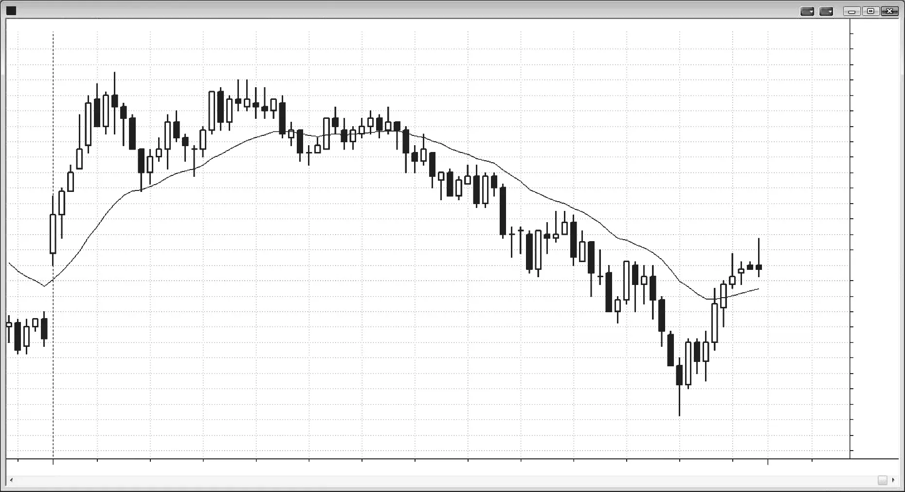

**图 6.17**
**空头反转K线可以导致多头旗形**

多头趋势中的空头反转K线并不足以构成做空理由，它有时变成多头旗形。在图6.17中，K线1之后那根是强势空头反转K线，但跟随五根强势多头趋势K线。在空头此前没有强势的情况下，它不是做空形态。只有第二次入场可以考虑，即在K线2下方做空。然而，K线2是十字星，强多头趋势中有四根大幅重叠K线。与其做空，更好的是等待回撤买入。四根之后均线处的两K线反转是好形态。

尽管在多头尖峰中多头趋势K线上方买入往往是好交易，但在此处该空头趋势K线上方或其后多头反转K线上方买入是有风险的。K线1是几根其他多头趋势K线之后的大型多头趋势K线，因此是高潮性的。买盘高潮后有太大风险出现横盘至向下调整。若你看K线1为止的高点，斜率在增加。这种抛物线弯曲也是高潮行为的信号，使调整风险显著。买入回撤或寻找做空是更安全的做法。

K线4是跌破两根小十字星以及K线3跌破均线附近七K线水平空头旗形之后的两K线反转。由于过去大约15根的下跌趋势只有很小的回撤，尽管有大型向上外包多头趋势K线，这充其量是做多剥头皮。

<!-- PDF page 180 -->

图 6.17

K线5是收盘接近高点的小型多头反转K线，是过去六根中的第三次下推，因此买家开始进场。尽管市场仍处于过去几小时的空头通道中，这是好的做多剥头皮形态。

K线6是有大底部影线、收盘在K线中点上方的大型空头趋势K线，这可以足以显示多头强势来反转市场，尤其在空头趋势末端崩塌之后。它也是几条空头趋势通道线的超调（未画出）。连续四根大型空头趋势K线，只有第二次做多入场可以考虑，出现在K线7向上外包K线。K线7低点是小型更高低点，是第二段上涨的起点。在K线6上方买入是可接受的，但更好的是在多头K线高点上方买入，如K线6之后那根，最好在第二次信号买入。K线7是那第二次信号；你可以在它一向上外包时买入——因为它越过了K线6之后那根强势多头K线的高点——或在K线7高点上方买入。

**对本图的深入讨论**

如图6.17，市场以向上跳空和多头趋势K线开盘，形成多头尖峰，然后在第二根小幅回撤，最低交易到第一根中部下方。这是市场走抛物线之前的唯一回撤，形成缺口尖峰与通道多头趋势以及开盘即趋势的多头趋势。抛物线意味着趋势在已经很强之后加速。此处，若你沿前三根高点画趋势通道线，突出趋势斜率，你会看到第四根突破那条趋势通道线上方。若你继续沿连续K线高点画趋势通道线，你会看到线条变得更陡，然后在高点处变平。这是抛物线形状，抛物线运动是一种买盘高潮。由于市场仍处于开盘即趋势的多头趋势中，你不应卖出第一次回撤尝试，因为第一次回撤几乎总是在几根内跟随对高点的测试。

尽管向上动能如此强，交易者应始终意识到市场随时可能反转，尤其在第一小时。市场往往冲向某个常常并不明显的磁铁，一旦被测试，市场就可以做任何事，包括反转。

每当有任何类型的高潮，一旦市场开始调整，通常以两段调整，持续至少10根。

K线3之前有七K线水平空头旗形，趋势已走10根或更多之后的窄幅震荡区间往往变成最后旗形。有带空头信号K线的 Low 2 做空信号，但由于可能出现最后旗形反转，最好只对做空做剥头皮。空头旗形的突破是大型K线3空头趋势K线，它始终是尖峰和卖盘高潮。当卖盘高潮形成于

<!-- PDF page 181 -->

图 6.17

漫长趋势之后时，它可能失败并导致约十根的两段式横盘至向上调整。然而，空头趋势中没有显著强势迹象，因此若市场确实试图反转，最好只寻找剥头皮。

尖峰之后是楔形空头旗形，由K线3之后的十字星、K线4之后的向上外包K线、以及两根之后的小十字星构成。它也可以视为 Low 2 做空，K线4是第一次下推，做空在四根之后小型多头内包K线下方。

由四根强势空头趋势K线构成跌至K线6的运动是又一次尖峰，因此又是一次卖盘高潮，是K线3尖峰后的第三次下推。跟随尖峰的通道往往以三次推结束，但当向下动能如此强时，最好等待第二次信号再考虑买入，这出现在K线7。空头通道是多头旗形，因此一旦突破空头通道上方，市场应反弹。此外，它应测试K线3向下尖峰后通道的起点，但有时反弹要到次日才完成。

<!-- PDF page 182 -->

图 6.18

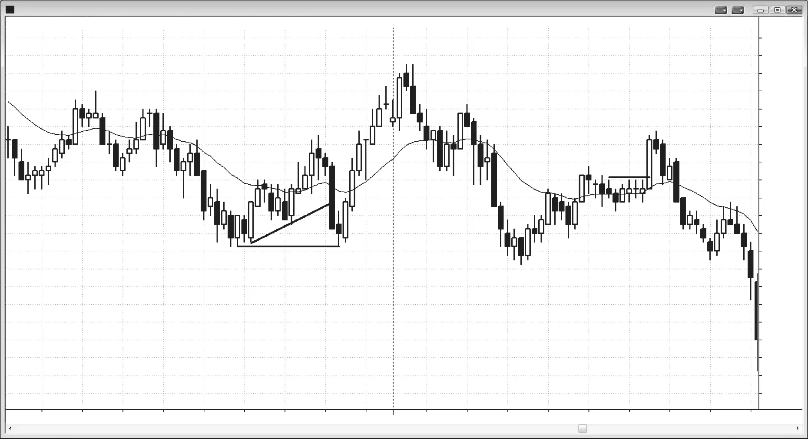

**图 6.18**
**弱反转K线需要更多**

当反转K线不是特别强时，若有额外做交易的理由，它仍然可以是好形态。

在图6.18中，K线1是大型空头趋势K线突破大旗形后的相对小K线，可能正在设置旗形的失败突破。它也是对更早低点的精确测试。在震荡日中，K线1设置这两次反转时，它是合理的做多形态，尤其是下一根创造了两K线反转做多形态。从K线1起的反弹以及次日跌至同一价格区域，在某个更高时间框架图上形成两K线反转顶部，在更高时间框架图上形成单根反转K线。

K线2是小型震荡区间突破后大型多头趋势K线之后的小型空头反转K线。这是可接受的失败突破做空信号K线。

**对本图的深入讨论**

如图6.18，市场突破昨日高点上方，但突破失败，导致开盘即趋势的空头日。

<!-- PDF page 183 -->

图 6.18

K线2是窄幅震荡区间失败突破后的最后旗形做空形态。摆动10根或更多之后的窄幅震荡区间往往变成最后旗形。它也与太平洋标准时间上午7:30高点形成双顶空头旗形。记住，接近就足够接近。随后的空头趋势巨大，市场收低30点，但当天其余部分未显示，因为那会把这根多头趋势K线缩小到看起来平淡无奇，而不是它在实时中的样子。

<!-- PDF page 184 -->

图 6.19

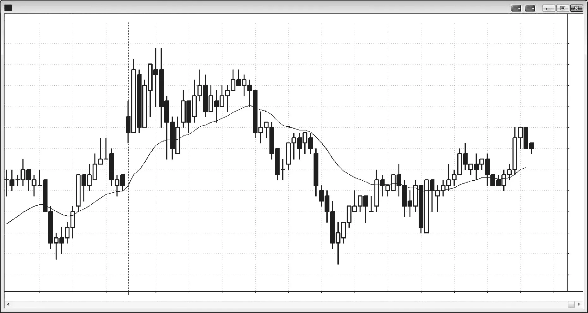

**图 6.19**
**光头/光脚K线可能毫无意义**

光头顶部和光脚底部并不总是强势信号。当许多光头顶部和光脚底部密集出现时，交易者应非常小心，因为它们可能代表震荡区间中的低成交量，而不是趋势中的强势。在图6.19第一组四个光头顶部（以“s”标示）中，空头趋势仍然很强。然而，在第二组中，市场处于震荡区间，它们可能只表明成交量低。在这些情况下交易要非常小心。

**对本图的深入讨论**

如图6.19，市场以向上跳空突破昨日高点，但第一根是空头趋势K线，因此是多头弱势的信号。市场本可能在失败突破中下跌，但反而以强势多头趋势K线向上突破。这本可能导致强势开盘即趋势的多头日，但随后跟了一根大型空头趋势K线。这设置了失败突破做空的两K线反转，但做空从未触发，多头仍持有仓位。市场随后从 ii 形态向上突破；然而突破失败，设置了失败突破做空和可能的当日高点。

<!-- PDF page 185 -->

图 6.19

当有几根大振幅K线形成窄幅横盘震荡区间时，在突破处入场是有风险的，因为窄幅震荡区间的磁铁效应会使大多数突破失败。市场向上突破，然后向下突破，然后从均线反弹回区间。跌至均线的尖峰之后是形成更低高点的更低回撤，然后演化成双顶空头旗形。测试当日高点的回撤动能低，表现为许多重叠K线、几根空头K线和许多有影线的K线。那不是强势多头段的样子。

<!-- PDF page 186: no extractable text (likely figure-only) -->
