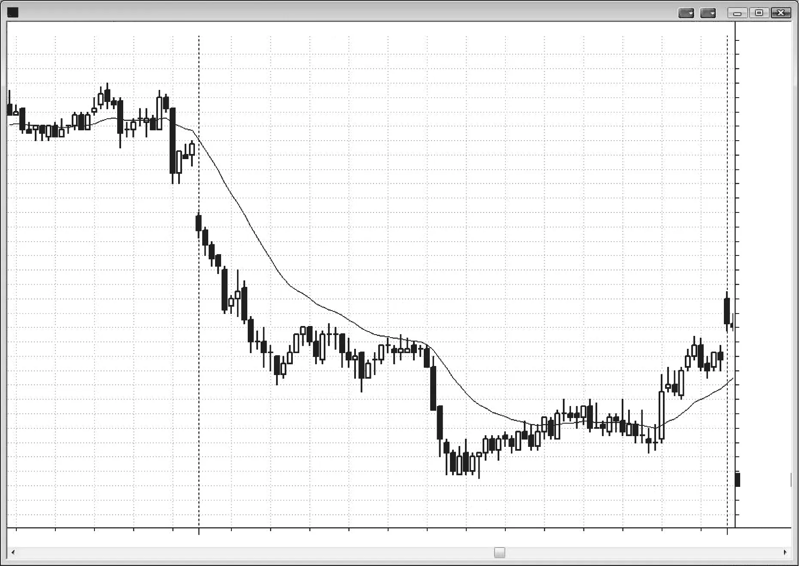
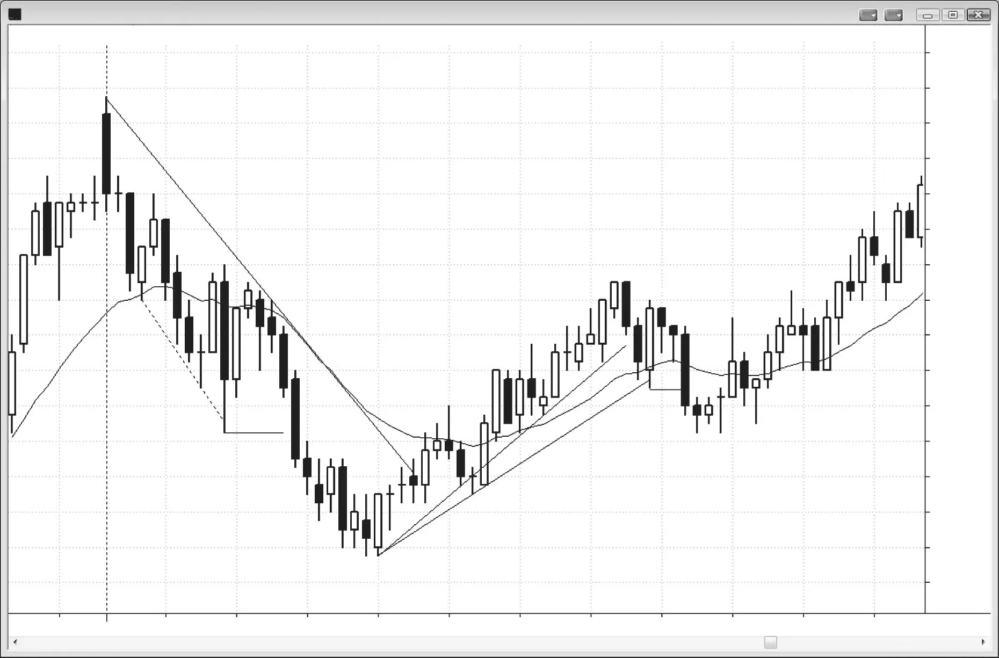
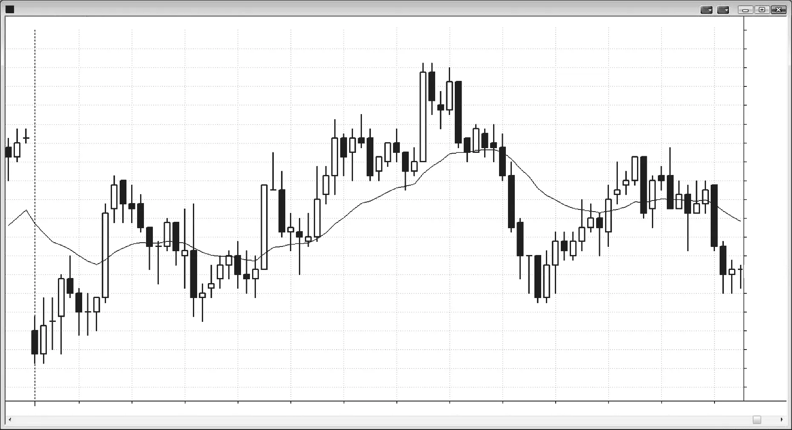
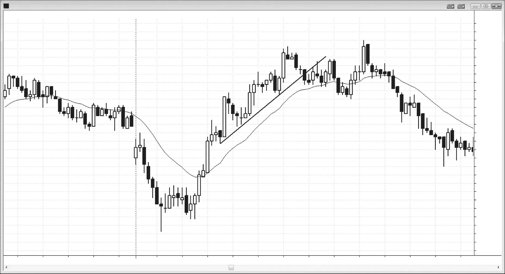

### 第 7 章 外包K线

<!-- Source PDF pages 187–200 -->
<!-- CHAPTER 7 Outside Bars -->

<!-- PDF page 187 -->

第 7 章
外包K线若当前K线的高点高于前一根高点，且低点低于前一根低点，则当前K线是外包K线。外包K线难以解读，因为在该K线或前一根K线内的某个时点，多头与空头都曾掌控局面，其分析有许多微妙之处。K线变大意味着多头与空头都愿意更激进，但若收盘靠近中部，它本质上是一根K线长度的震荡区间。事实上，根据定义，由于外包K线完全覆盖了前一根，每一根外包K线都是震荡区间的一部分——震荡区间是两根或更多根大体重叠的K线。在其他时候，它们可以充当反转K线或趋势K线。交易者必须注意它们出现的市场背景。

传统技术分析教导：外包K线是双向突破的信号K线，应在其上下各挂入场止损。一旦成交，把未成交那一侧止损的规模加倍，并改为反转单。然而，几乎总是不明智在 5 分钟外包K线的突破上入场，尤其当外包K线很大时，因为远处止损带来的风险更大。有时它们出现在你寻找主要反转、且你非常确信会出现大幅强势反转的时候。那时，在该K线刚突破前一根极值时入场是合理的。若把握较小，可以等该K线收盘，再在外包K线的突破上入场。若你确已在外包K线突破上入场且保护性止损过大，可考虑使用资金止损（如 Emini 中的 2 点）或减少合约数。由于外包K线是单根震荡区间，不宜在横盘市场顶部买入或在其下方卖出，通常最好不要在该K线的突破上入场。

<!-- PDF page 188 -->

若外包K线之前是良好的信号K线，则外包K线可以是可靠的入场K线。例如，若交易者想在空头摆动底部买入，市场形成了强多头反转K线，但下一根跌破了该K线，交易者应考虑把买单继续留在市场中。若该K线突然反转回升并突破多头信号K线之上，买单会被触发，当前K线将成为外包K线与入场K线。一般而言，除非前一根是像样的信号K线，否则交易者不应在外包K线上做反转交易。

有时你必须在外包K线上入场（不是在其突破上），因为你知道交易者被困住了。这在强势行情之后尤其如此。若外包K线作为从趋势线突破或趋势通道线超调的强势反转中的第二次入场出现，它可以是出色的入场K线。例如，若市场第二次跌破摆动低点，并从趋势通道线超调反转向上，你很可能在寻找买入，并不断把买单止损移到前一根高点之上 1 tick，直到成交。有时成交会发生在向上外包K线上。这通常是很好的反转交易，由强势买家驱动。

若外包K线位于震荡区间中部，它没有意义，不应被用来产生交易，除非其后在外包K线高点或低点附近出现小K线，设置 fade（逆势交易失败突破）。震荡区间中的外包K线只是再次确认大家已知的——双方势均力敌，双方都会在区间顶部附近卖出、底部附近买入，预期向外包K线另一端移动。若市场反而向另一方向突破，就放过它，并寻找对外包K线失败突破的 fade，这通常在几根K线内发生。否则，就等回撤（失败突破再失败，就是突破回撤形态）。

若外包K线之后是内包K线，则这是 ioi 形态（内包-外包-内包），可以是在内包K线突破方向入场的形态。但只有在有理由相信市场能走得足够远以达到你的止盈目标时才入场。例如，若 ioi 在新摆动高点，且第二根内包K线是收在低点附近的空头K线，向下突破可能是好的做空，因为它很可能是第二次入场（第一次入场很可能发生在外包K线跌破其前一根低点时）。若它在铁丝网形态（窄幅震荡区间）中，尤其当内包K线较大且靠近外包K线中部时，通常最好等待更强的形态。

当顺势外包K线出现在趋势反转的第一段、且前一趋势很强时，它的作用像强趋势K线，而不是震荡区间类型的K线。例如，在空头趋势中，若出现强势向上反转，交易者可能开始寻找更多反弹。许多交易者会在更高低点的高点之上寻找买入，更少的交易者会在前一根 <!-- PDF page 189 --> 外包K线低点之下做空。若多头特别激进，他们会在前一根低点之下买入，而不是等着在其高点之上买，并在接下来几分钟内持续买入，因为越来越多交易者看到多头已掌控市场。这会使该K线延伸到那根前K线的高点之上。一旦如此，它就成为向上外包K线，那些刚在前一根低点之下做空的空头很可能会回补，且至少几根K线内不再急于再空。几乎没有空头、许多激进多头，市场一边倒，至少可能再涨一两根K线。所有人突然就新方向达成一致，因此这波行情会有极大动能并延伸很远，以至于回撤后很可能被测试，形成向上的第二段。这个更高低点——而不是实际的空头低点——是上攻段的起点，因为正是在那时市场突然同意下一段向上而不是向下。通常会从外包K线底部走出两段上涨。虽然从实际空头低点看，图表上的向上摆动会像三段上涨，但功能上只有两段上涨，因为市场直到形成更高低点才对多头行情达成一致，而不是在实际低点。正是在这里，多头已夺取控制变得清晰。

为什么这波行情往往很强？在前一根低点之下做空、以为那只是又一个空头旗形的旧空头被困住了。然后他们的入场K线迅速反转成向上外包K线，把空头困在场内，并把多头挡在场外。许多多头被挡在场外，是因为他们不喜欢在外包K线形成时入场，因为许多外包K线只会导向震荡区间。结果总是市场再强势上行许多根K线，因为所有人都意识到市场已反转，并在试图弄清如何调整仓位。空头希望有回落以便以较小亏损离场，多头也希望同样的回落以便以有限风险加仓。当所有人都想要同一件事时，它就不会发生，因为双方甚至会开始买入 2 或 3 tick 的回撤，从而阻止 2 或 3 根K线的回撤形成，直到趋势已走得很远。聪明的价格行为交易者一开始就会意识到这种可能，若他们在寻找两段式延伸上攻，他们会仔细观察该空头旗形的向下突破并预期其失败。他们会把入场单放在前一根高点略上方，即使这意味着在向上外包K线上入场（尤其当它是空头的入场K线时）。

若你从机构的角度思考，你会希望空头旗形做空被触发，这样就会有被挡在场外的多头去追涨，以及被困在场内、若空头突破失败就必须回补的新空头。这对希望并预期反弹的机构是理想局面。那么，作为机构，你能做什么来促成这一点？在陷阱形成之前不要激进买入。事实上，你试图制造陷阱 <!-- PDF page 190 --> ——一直卖到做空入场被触发，然后在所有这些空头做空、多头在前一根低点略下方带损离场时激进买入。你站在他们仓位的对手方，在前一根低点之下重仓买入！一旦你把他们都困住，你就可以一路向上激进买入；一旦他们看到陷阱，他们会追赶市场，这会把市场向上推进，所有人都一致认为市场在走高。

关于外包K线，最重要的一点是：每当交易者不确定该怎么做时，最好的决定是等待更多价格行为发展。

<!-- PDF page 191 -->

图 7.1

外包K线
图 7.1
外包K线很棘手外包K线有风险，交易者必须仔细注意导致它们出现的价格行为。

在图 7.1 中，bar 1 是强空头趋势中的向上外包K线，因此交易者只会寻找向下突破的入场。你可以在 bar 1 之下做空，或等突破K线收盘后再看它是什么样。这里，它是强空头趋势K线，被困多头很可能会在如此强的空头趋势K线之下离场。因此，在该空头K线低点之下做空是合理的。

Bar 5 是向下外包K线，但市场基本上横盘，有大量重叠K线，因此不是可靠的突破入场形态。其后的内包K线（ioi）太大，不宜用作突破信号，因为你要么在震荡区间底部卖出，要么在顶部买入，而你只想低买高卖。

<!-- PDF page 192 -->

图 7.1
对本图的更深入讨论在图 7.1 中，市场突破了昨日低点之下，第一根是空头趋势K线，也是开盘即趋势的空头趋势的第一根。Bar 1 及其前一根形成了第一次回撤，在第一次回撤之后通常至少有一次向下剥头皮。在 bar 3 有回撤到均线的两段式回撤，也是 20 均线缺口K线做空形态。

<!-- PDF page 193 -->

图 7.2

外包K线
图 7.2
ioi 形态外包K线很棘手，因为在该K线或前一根期间，多头与空头都曾掌控局面，因此接下来几根K线的运动可能还有进一步反转。在图 7.2 中，bar 1 是形成内包-外包-内包（ioi）形态的外包K线。Bar 1 之后内包K线的 bar 2 突破失败了，这很常见，尤其当内包K线较大时。因为多头被迫在 ioi 形态顶部附近买入，而那是震荡区间，这从来不是好事，尤其当市场在下跌时。

Bar 2 是震荡区间顶部附近的小K线，是寻找做空入场的好区域。由于交易者预期多头会在其入场K线 bar 2 的低点之下带损离场，他们在 bar 2 之下 1 tick 做空，这是震荡区间顶部失败的 ioi 突破。由于 ioi 各K线很大，bar 2 下方有足够空间至少做一次向下剥头皮。

Bar 4 几乎是向上外包K线；在交易中，若某物几乎是可靠形态，它很可能产生可靠结果。Bar 4 是此前五根中的第三根多头趋势K线，因此是从第三次向下推动反转向上。它 <!-- PDF page 194 --> 图 7.2也是最强的，波幅最大、影线最小，表明多头在增强力量。

Bar 5 是外包K线，其后在其高点附近有一根小内包K线。同样，这产生了风险极小的出色做空，尤其因为内包K线是空头K线。

对本图的更深入讨论在图 7.2 中，第一根突破了昨日高点之上，突破失败。该K线变成强空头趋势K线，设置了开盘即趋势的做空。

Bar 8 与 bar 9 形成小型双底，这不是交易者在 bar 7 空头突破K线之后所预期的向下动能。向下动能的丧失之后是 bar 10 双底回撤做多。

Bar 9 也是从 bar 4 反弹的两段式回撤上的 High 2 做多。这在突破空头趋势线之后形成了当日的更高低点，设置了可能的趋势反转。

<!-- PDF page 195 -->

图 7.3

外包K线
图 7.3
外包K线取决于背景外包K线必须在背景中评估。在图 7.3 中，bar 1 之后的十字星内包K线不是好的做空信号K线，因为有三根横盘K线，且 bar 1 刚反转了其前的空头K线。概率是在该开盘反转之后市场至少会横盘或上行一两根K线，尤其在相对平坦的均线下。到均线有剥头皮的空间，最好在多头K线之上买入。内包K线是向上反转后的停顿，因此是一种回撤，所以在其高点之上、在 bar 1 高点之上买入是合理的。交易者可在 bar 1 之上 1 tick 挂买单止损；当 bar 2 跌破内包K线时，明智的做法是把止损买单继续留着。做多的逻辑仍然成立，现在还有被困空头——他们犯了在弱信号K线之下卖出的错误，会在信号K线之上回补。这使得 bar 2 一旦向上外包就立即做多成为好交易。只要外包K线之前是像样的信号K线，在外包K线上入场可以是合理的交易。

Bar 3 是均线附近的空头反转K线，是可接受的做空，但它相对于 bar 1 与 bar 2 的多头实体较小，因此市场可能形成更高低点然后再涨一些，当可能趋势反转处出现强外包趋势K线时经常如此。因此，无论 <!-- PDF page 196 --> 图 7.3是否在 bar 3 之下做空，他们都必须准备好买入更高低点，两根K线后的小多头 ii 是好信号。

Bar 4 是外包K线，但市场已横盘五根K线。因此它只是震荡区间的一部分，不是信号K线。

Bar 5 是更大的外包K线，形成 oo 或外包-外包形态。这通常只是更大的震荡区间。这里，该K线有大空头实体，收在 bar 4 低点之下；错误地在 bar 4 外包K线之下做空的交易者被困住。一般而言，当震荡区间中许多K线相对较大且有大影线时，不宜做空震荡区间的突破，因为突破失败的概率很高。其后的小多头十字星是失败反转做多的好信号K线。

Bar 6 设置了向上外包K线顶部突破之后的做空。

Bar 7 突破到摆动高点，并以收在低点的外包K线向下反转。这是反弹后有被困多头与强空头反转的情形。但这是震荡日，任何一段持续超过五根K线时，交易者都会寻找反转（震荡日上“低买高卖”）。虽然在该K线跌破其前小空头K线时做空是可接受的，但更好是在 bar 7 低点之下卖出，因为你会在强空头反转K线获得一些跟随时于其下方做空。

对本图的更深入讨论在图 7.3 中，市场以大幅向下跳空与空头趋势K线向下突破，但没有下行并形成开盘即趋势的空头趋势，向下突破失败，市场反转向上进入开盘即趋势的多头日。

Bar 2 是向上外包K线，也是可能的当日低点，因为市场正从大向下跳空反转向上。这意味着市场在 bar 2 判定趋势向上，因此应把它视为上攻的起点。虽然 bar 3 是 Low 2 做空，但市场把它只看作 Low 1，因为它是从 bar 2 反弹起点的第一次回撤，因此很可能只导致更高低点。交易者预期它会失败；你把上攻看作失败的 Low 2 还是失败的 Low 1 并不重要，因为在可能的多头趋势中两者都是好的买入形态。

Bar 5 是铁丝网形态的突破；铁丝网的多数突破会失败，因此交易者应寻找 fade 形态。铁丝网是极度不确定与双向交易的区域。多头在低点附近激进买入，在高点附近停止买入。空头在高点附近激进卖出，在低点附近停止做空。这里有大型买卖程序在运作，从每根K线期间成交的良好成交量可以看出。多头与空头都乐意在此交易；若一方能够 <!-- PDF page 197 --> 图 7.3
外包K线短暂压倒另一方并形成突破，通常形态的磁吸效应会把市场拉回。一旦市场向下突破，那些乐意在该震荡区间中部更高处买入的多头，在更低处买入会更高兴。同时，乐意在震荡区间顶部卖出的空头，若突破没有立即跟随，会迅速买回空单。这些因素导致突破失败并被拉回铁丝网的概率很高，如此处所示。有时市场随后从另一侧突破，有时震荡区间继续。最终会有离开该形态的行情。

当日第一根与前几根往往预示接下来几小时、乃至全天会是什么样。当日以两K线反转开盘，然后是十字星（是K线内反转），然后是向上外包K线反转。接着有空头反转与几根带影线的小K线，表明不确定性。多次反转、大影线与不确定性都是震荡日的特征，而这天正变成那样。有了这种早期怀疑，交易者更乐意双向交易、对更大比例仓位剥头皮，也更不倾向于波段持有。

PST 时间上午 11:25，有一根形成两K线反转的多头外包K线，因此创建了买入形态。该形态也与其前的十字星形成微型双底。

<!-- PDF page 198 -->

图 7.4

图 7.4
作为入场K线的外包K线外包K线有时可以是合理的入场K线。在图 7.4 中，bar 3 是向上外包K线，也是可接受的入场K线，因为它是强多头趋势中两段式调整后的向上反转，且前两根有多头趋势K线，显示强度。交易者会在该K线刚越过前一根高点时买入，但更安全的是再等几个 tick，直到它越过两根之前那根多头趋势K线的高点。在多头K线之上买入通常有更高机会导致盈利交易。最后，交易者可以等向上外包K线收盘，看它是否收在高点附近并高于前一根——确实如此。一旦看到这种强度，他们可以在外包K线高点之上买入。

Bar 6 是向下外包K线，此前六根中有五根有空头实体。它收在低点，激进交易者可在如此空头力量之后在其下方做空，尤其因为它把多头困进了买入旧多头趋势的仓位，而该趋势现在可能结束了。

对本图的更深入讨论在图 7.4 中，市场突破了昨日最后一小时震荡区间的下方。第一根是多头趋势K线，但顶部有大影线，表明 <!-- PDF page 199 --> 图 7.4
外包K线多头不够强，未能把K线收在高点。你可以在该K线之上买入，也可以等待。第二根是突破回撤做空形态，对应开盘即趋势的空头日。到 bar 1 的下跌是抛物线式卖盘高潮，因此可能是当日低点。由于卖出很强，买入前最好等第二次信号，它在八根K线后来临，形式是更高低点与空头旗形的失败突破。

到 bar 3 的抛售突破了主要趋势线，提醒交易者在测试 bar 2 高点时做空。Bar 3 之前那根是强趋势中的均线缺口K线买入形态，因此在其上方买入——即便以向上外包K线——是好交易。到 20 均线缺口K线形态的下跌几乎总是突破趋势线，从该K线的上攻通常会以更高高点或更低高点测试趋势高点。若随后向下反转，通常导致至少两段、持续至少 10 根K线，并经常导致趋势反转。

Bar 3 也是与其前空头K线、以及与两根之前的空头K线构成的两K线反转的第二根，因此许多多头在 bar 3 高点之上买入。

Bar 4 是形成更高高点的大多头趋势K线（高潮性），其后是作为做空信号的强空头内包K线。交易者预期从如此强势形态有两段下跌。因此，聪明的交易者会观察 High 1 然后 High 2 的形成，并准备好在这些做多形态失败并困住多头时加空。

Bar 5 是失败 High 1 的做空形态，bar 6 是出色的多头陷阱。它是失败的 High 2，做多入场K线反转成向下外包K线，把多头困在场内、空头挡在场外。这根外包K线的作用像空头趋势K线，而不仅仅是外包K线。因为它是外包K线，入场K线及其失败在一两分钟内相继发生，没有给交易者足够时间处理信息。在一两根K线内，他们意识到市场实际上已变成空头趋势。多头希望有 2 或 3 根K线的回撤以较小亏损离场，而空头希望同样的反弹以便以更小风险做空入场。实际发生的是双方开始卖出每一个 2 或 3 tick 的回撤，因此直到市场走了很长一段，2 或 3 根K线的反弹才出现。

注意 High 2 做多是糟糕的买入形态，因为此前六根中有五根是空头K线，另一根是十字星。单独的 High 2 不是形态。首先必须有更早的强度，通常形式是突破趋势线的 High 1 段，或至少更早的一根强多头趋势K线。

<!-- PDF page 200: no extractable text (likely figure-only) -->
