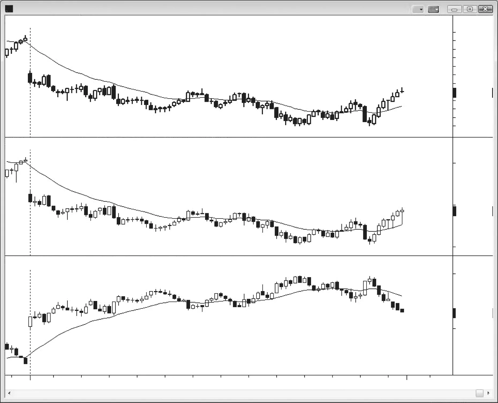
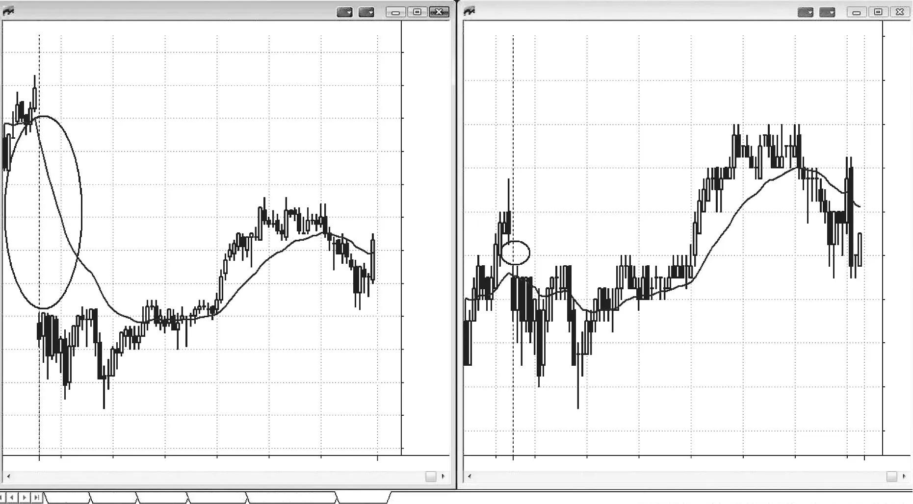

### 第9章 交易所交易基金与反向图表

<!-- Source PDF pages 205–208 -->
<!-- CHAPTER 9 Exchange-Traded Funds and Inverse Charts -->

<!-- PDF page 205 -->

第 9 章
交易所交易基金与反向图表
有时，若你对图表做一点改动，价格行为会变得更清晰。你可以切换为柱状图或折线图、基于成交量或 tick 的图表、更高或更低的时间框架，或者干脆把图打印出来。若干交易所交易基金（ETF）也很有帮助。例如，SPDR S&P 500 ETF（SPY）在外观上与 Emini 图表几乎完全一致，有时价格行为更清晰。
此外，从相反的视角来看图表也会有帮助。如果你看到一个多头旗形，但感觉哪里不太对劲，可以考虑看看 ProShares UltraShort S&P 500（SDS），这是一只基于 SPY 反向（但具有两倍杠杆）的 ETF。如果你看它，可能会发现自己在 Emini 与 SPY 上看到的多头旗形，在 SDS 上现在看起来像是一个圆弧底。如果是这样，明智的做法是不要买入 Emini 旗形，而是等待更多价格行为展开（比如等待突破，然后若突破失败再做空）。有时形态在其他股指期货上更清晰，例如 Emini Nasdaq-100，或其 ETF 即 QQQ，或其双倍反向基金 QID，但通常不值得去看这些，最好坚持看 Emini，有时再看 SDS。
由于 ETF 是基金，管理它的公司是为了赚钱，这意味着它会从 ETF 中收取费用。结果是，ETF 并不总是与可比市场精确同步。例如，在三巫日（triple witching days），SPY 往往会比 Emini 有大得多的跳空开盘，而这种缺口是由于对 SPY 的价格调整造成的。它在当天仍会与 Emini 几乎逐 tick 同步交易，因此交易者不必为这种差异感到担忧。

<!-- PDF page 206 -->

图 9.1

图 9.1
Emini 与 SPY 相似
如图 9.1 所示，上方的 Emini 图表与 SPY（中间图）本质上完全一致，但 SPY 上的价格行为有时更容易阅读，因为其更小的 tick 尺寸往往使形态更清晰。下方图是 SDS，这是 SPY 的反向 ETF（带两倍杠杆）。有时 SDS 图表会让你重新考虑对 Emini 图表的解读。

<!-- PDF page 207 -->

图 9.2

交易所交易基金与反向图表
图 9.2
三巫日对 SPY 的调整
如图 9.2 所示，在三巫日 SPY 的价格会被调整，这往往导致跳空开盘，且可能比 Emini 上的缺口大得多（左侧是 SPY，右侧是 Emini）。然而，之后它们几乎会像任何其他交易日一样逐 tick 同步交易，因此不必为缺口担忧，只需随着当天展开交易价格行为即可。

<!-- PDF page 208: no extractable text (likely figure-only) -->
