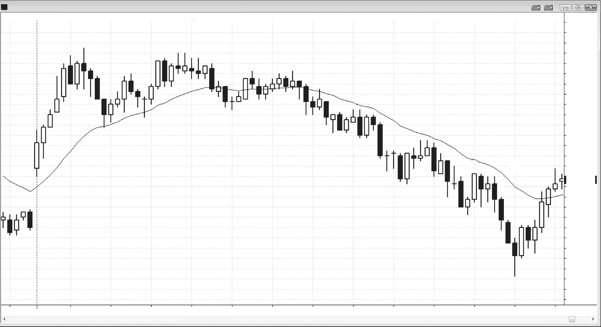
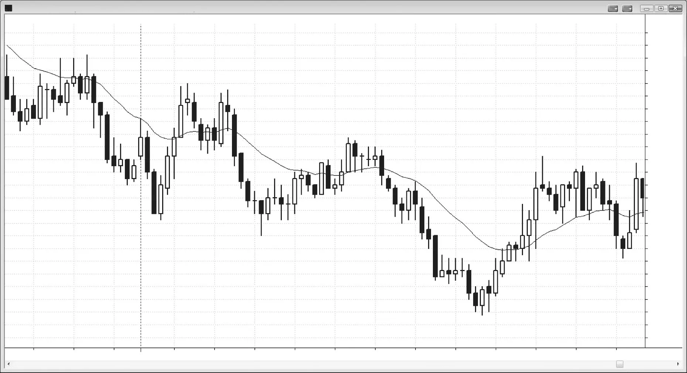

### 第10章　第二次入场

<!-- Source PDF pages 209–212 -->
<!-- English title: CHAPTER 10 Second Entries -->

<!-- PDF page 209 -->

# 第10章  
# 第二次入场

分析师常说，日线图上的底部通常需要第二次从低点反转，才能说服足够多的交易者把市场当作可能的新多头趋势来交易。但顶部同样如此。第二次入场几乎总是比第一次入场更可能带来盈利交易。

若第二次入场让你以比第一次更好的价格进入，要怀疑它可能是陷阱。多数好的第二次入场价格相同或更差。做第二次入场的交易者是在较晚入场、试图最小化风险，市场通常会为额外信息让他多付一点。若市场向你收费更少，可能是在设置失败信号来拿走你的钱。

寻找第二次入场的交易者更积极、更有信心，常会在更小时间框架图上入场。这通常导致 5 分钟图交易者在许多其他人已经入场之后才进，入场略差。若市场让你以更好价格进入，应怀疑自己漏看了什么，并考虑不做该交易。多数时候，好的成交等于差的交易（坏的成交等于好的交易！）。

若你在逆势交易，例如在强多头趋势中第一次反转处做空——该上涨约有四根连续多头趋势K线，或两三根大多头趋势K线——动能太强，不宜在反方向挂单。更好的做法是等待一次入场机会但不做，等趋势再延续一两根 K线，然后在市场第二次尝试反转时入场。

<!-- PDF page 210 -->

## 图 10.1　第二次入场

当日有许多第二次入场交易（见图 10.1），除一笔外都以与第一次相同或更差的价格成交。看 K线 10 的做多：市场让你比在 K线 9 买入的交易者好 1 tick 买入。一般而言，「好成交、差交易」的箴言适用。只要市场给你「便宜货」，就假定你读图有误；通常最好不做。尽管 K线 10 是第二次入场，下行动能仍强，从 K线 8 起的紧凑空头通道可见。在做逆势交易前，最好先看到前几根 K线中有证据表明多头曾能越过前一根高点不止一两 tick。

如第三册所讨论，多数顶部来自某种微型双顶，如 K线 1 与两根之前的空头反转K线；多数底部来自某种微型双底，如 K线 18 与 K线 17 前一根。

<!-- PDF page 211 -->

## 图 10.2　强势运动中等待第二次反转

动能强时，最好等待第二次反转形态再做逆势（见图 10.2）。

K线 1 前有五根多头趋势K线，上行动能太强，不宜在第一次下行尝试时做空。聪明的交易者会等看多头第二次反弹是否失败再做空，这发生在 K线 2 的第二次做空入场。

K线 3 是当日新低上的第一次做多入场，但连续六根没有多头收盘，更合理是等待第二次做多入场，发生在 K线 4。

K线 5 前有四根空头趋势K线，下行动能太强不宜买入。从未出现第二次入场，聪明交易者因等待而避免了亏损。

K线 10 前有六根更高低点，且仅两根有小空头实体，多头力量太强不宜做空。在 K线 11 空头反转K线处有第二次入场。

### 对本图的更深入讨论

图 10.2 中市场突破进入昨日尾盘的空头通道上方，但突破在均线处失败，设置做空。当日市场突破昨日低点下方，

<!-- PDF page 212 -->

但在当日第四根 K线上反转向上，突破失败。这次反转可视为：第一根突破小型空头通道上方之后，对更低低点的突破回撤。

市场未能做出更高高点，趋势型空头通道继续。交易者应在 K线 6 双顶下方做空，因为开盘即趋势的尝试失败——市场未能突破先前更低高点。更低高点与更低低点的趋势仍在继续。

止于 K线 3 前一根的空头尖峰之后的回撤，形成 Low 4 做空形态，在太平洋时间上午 9:35 以空头趋势K线触发。空头突破成长为四K线空头尖峰。

K线 5 是 High 2，但前有四根空头趋势K线，因此不应买入。

K线 6 是四K线空头尖峰的起点。

K线 7 的 ii 是可能的最后旗形。

K线 7 导致两K线空头尖峰。该 Low 4 做空之后通道下行中的全部三个空头尖峰构成连续卖盘高潮；一旦有三个，至少两段式反弹的概率很高。

交易者可在 K线 8 反转K线之后于 K线 9 做多，预期在最后旗形与漫长空头趋势后至少两段上涨。K线 8 是微型双底（做多形态），因为 K线 8 下行，且两根之前也下行（空头K线）。

K线 10 是 Low 1，但多头力量太强不宜做空，更合理是寻找更高低点买入，甚至在前一根下方用限价单买入。上行动能如此之强，市场极可能至少测试该上行腿的高点。

K线 11 是大多头趋势K线后的十字星反转K线。在五到十根多头趋势K线之后出现的大多头趋势K线是买盘高潮，之后很可能约有 10 根或更多横向至向下的 K线，多头才会回来。它也处于空头趋势最后更低高点区域，形成潜在双顶空头旗形。多头如此之强，多数交易者假定会有更高低点，但把双顶空头旗形当作获利了结区。一些空头剥头皮者在此做空，预期至少测试至均线。该反弹中多头趋势K线如此之多，市场很可能形成更高低点，因为买方显然积极。
