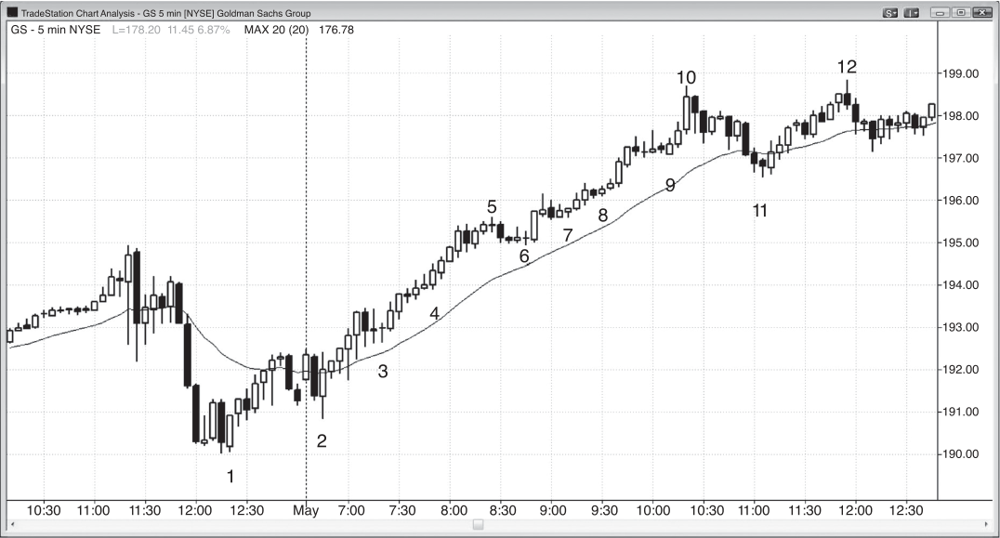

### 第11章 迟介入场与错过入场

<!-- Source PDF pages 213–216 -->
<!-- CHAPTER 11 Late and Missed Entries -->

<!-- PDF page 213 -->

第 11 章
迟介入场与错过入场
如果你看任何一张图，并认为若当时接了最初入场、现在仍会持有交易中的波段部分，那么你就需要用市价入场。市场有明确的始终持仓（always-in）方向，你需要参与趋势，因为获利概率很高。不过，你入场的股数或合约数应仅限于：若你接了最初入场，此时仍会持有的那一部分；并且你应使用相同的移动止损。你的止损通常会比剥头皮所用的更大，因此需要用更小的仓位来保持美元风险不变。例如，如果你看到 GS 正在形成强趋势，若你最初用 300 股入场、现在只会持有 100 股且保护性止损在 1.50 美元之外，你就应当用市价买入 100 股，并设置 1.50 美元的保护性止损。从逻辑上讲，无论你是现在买入波段规模的仓位，还是持有更早入场的波段仓位，都没有区别。尽管在情绪上，把带有浮动盈利的交易想成“在用别人的钱冒险”可能更容易，但那并非现实。那是你自己的钱，你所冒的风险与现在买入并冒同样 1.50 美元的风险并无不同。交易者明白这一点，会毫不犹豫地下单。如果他们不下，那么他们只是并不真正相信自己若更早入场现在仍会持有任何股份，或者他们需要处理这一情绪问题。

<!-- PDF page 214 -->

图 11.1

图 11.1
趋势中的连续趋势K线
一旦市场开始形成四根或更多连续多头趋势K线，且它们不太大（因此可能并非高潮性），交易者就应至少用市价买入一小部分仓位，而不是等待回撤。
如图 11.1 所示，GS 昨日收盘前有强劲的两段式下跌，但在 bar 2 出现强劲的多头反转K线。它正在形成对空头低点的更高低点测试，并可能成为多头趋势日。
如果交易者大约在 bar 4 附近开始看这张图，他们会看到一系列多头趋势K线与强劲的多头趋势。他们很可能会希望自己至少还持有仓位中的波段部分。如果他们通常交易 300 股，而此刻从 bar 3 上方的入场只会剩 100 股，他们就应当用市价买入 100 股。此外，他们应使用与在 bar 3 上方入场时相同的止损。由于他们只会保留波段部分，应使用保本止损，或者或许在 bar 3 高点下方约 10 美分处止损。他们还应寻找停顿与回撤以便加仓。在 bar 6 上方加仓之后，他们可以把全部仓位的止损移到 bar 6 信号K线下方 1 tick，然后向上移动止损。
在使用原始止损的情况下迟介入场，与持有原始仓位的波段部分并用相同保护性止损，是完全一样的。

<!-- PDF page 215 -->

图 11.1
迟介入场与错过入场
对本图的深入讨论
在图 11.1 中，当天第一根K线向上突破了收盘摆动高点，在均线处形成小型双顶空头旗形做空。然而，这一第二次试图向下突破始于 bar 1 的空头旗形失败了。Bar 2 强劲向上反转，形成两K线多头反转。下一根是多头内包K线，是开盘即趋势多头的良好信号K线。它也从昨日最后四根K线形成的小型双底的向下突破中向上反转。
回撤至 bar 11 均线缺口K线的卖压突破了多头趋势线，预期会带来对多头高点的更高高点或更低高点测试。通常，市场随后会形成更大或更复杂的调整。然而，上涨至 bar 10 的通道如此之窄，表明多头异常强势。整段反弹在更高时间框架图表上很可能是一个尖峰，在 5 分钟图出现较大调整之前，该更高时间框架图上很可能还会跟随一个向上通道。此外，bar 11 均线缺口K线也是 20 缺口K线回撤。在 20 缺口K线回撤之后的第一个新高之后，市场通常会回撤，然后再次测试高点，因此这一均线缺口K线更可能像 20 缺口K线形态那样起作用，而不是典型的均线缺口K线形态。

<!-- PDF page 216: no extractable text (likely figure-only) -->
