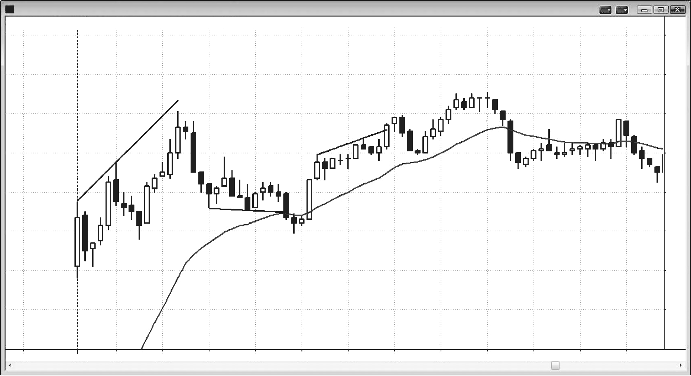
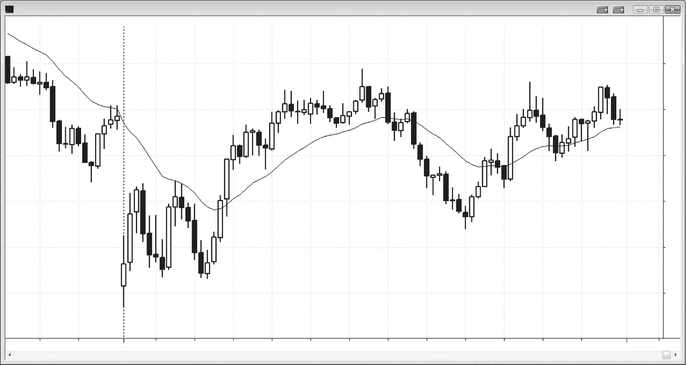

### 第12章　形态演化

<!-- Source PDF pages 217–222 -->
<!-- English title: CHAPTER 12 Pattern Evolution -->

<!-- PDF page 217 -->

# 第12章  
# 形态演化

重要的是记住：当前K线始终可能是任一方向大行情的起点，你必须仔细观察价格行为如何展开，看形态是否变成会导致相反方向交易的东西。形态经常变形为其他形态，或演化为更大形态，两者都可能导致同向或反向交易。多数时候，若正确读懂价格行为，原始形态至少会提供剥头皮利润；更大形态通常也会。是否把更大形态标为原始形态的扩展版并不重要。名称从不重要。只要正确读懂眼前内容并下单，忽略几根K线前已完成的形态即可。

最常见的变形形态是失败：形态未能给出剥头皮利润，然后反转为反方向信号。这把交易者困在错误一侧；当这些交易者被迫亏损离场时，会提供把市场推向至少剥头皮利润的反向燃料。任何形态都可能如此，因为所有形态都可能失败。若失败后只是横盘若干根K线，然后出现新形态，更合理的是把新形态视为与第一个独立。忽略第一个，因为不会再有很多被困交易者在被迫亏损离场时推动市场。

此刻不必熟悉书中全部形态；后续章节会看到形态演化的常见例子。扩散三角形有时从五段扩到七段。微型趋势 <!-- PDF page 218 --> 线突破通常失败，然后有突破回撤。当最后空头旗形未能反转市场时，通常变形为突破回撤做空形态。它随后常扩大为楔形反转形态，或更大的震荡区间，该区间又常成为更大的最后旗形。多头尖峰与通道趋势形态通常演化为震荡区间，再变成双底多头旗形。在第一小时，双顶空头旗形常演化为双底多头旗形，反之亦然。若你积极交易该市场，应考虑两次入场都做，并波段持有一部分，因为从这两种形态的第一种或第二种之后常有大行情。

<!-- PDF page 219 -->

## 图 12.1　形态可演化为更复杂形态

可靠形态约有 40% 会失败，并常演化为设置任一方向入场的更大形态。图 12.1 是 5 分钟 EWZ（iShares MSCI Brazil Index Fund）。此处 K线 2 下方的 Low 2 做空失败，但形态演化为更大楔形顶部，入场在 K线 3 后一根下方。

K线 19 的 Low 2 空头旗形演化为 K线 21 两K线反转下方更复杂的 Low 2 做空。第一次上推是 K线 18。

### 对本图的更深入讨论

图 12.1 中 K线 6 之后的 High 2 演化为均线处 K线 8 上方的楔形多头旗形。它也是尖峰与通道空头，K线 8 是通道中第三次下推，常是通道终点。

K线 10 的 Low 2 很可能失败，因为上行至 K线 9 的尖峰很强。Low 1 入场在 K线 10 前两根。形态在 K线 11 变成失败的 Low 2 买入，然后在 K线 12 成为尖峰与通道顶部，通道在第三次上推结束，这很常见。

K线 15 的 High 2 失败，形态变成在当日新高处第二次尝试向下反转。入场在 K线 15 之后的 High 2 入场K线下方。

<!-- PDF page 220 -->

## 图 12.2　第一小时的突破模式

第一小时常见既有双顶也有双底，使市场处于突破模式。图 12.2 中 GS 的双顶演化为双底多头旗形。这是常见形态，你应两次入场都做（K线 4 下方做空，再在 K线 5 上方做多）并波段一部分，因为大行情常跟在第一种或第二种形态之后。记住，一个极值通常在第一小时形成，意味着市场随后通常会离开该价位数小时，若成趋势日则可能全天。此处 GS 大幅跳空低开，跌破昨日趋势通道线，并在当日第一根反转向上。市场在下行均线处 K线 4 形成 Low 2 与双顶空头旗形，却在 K线 5 双底多头旗形处反转向上。市场随后上涨 $3 至 K线 6 当日高点。

### 对本图的更深入讨论

大跳空开盘常导致任一方向的趋势日。图 12.2 中前三根强劲上行，多头趋势更可能，尤其是在昨日空头趋势通道超调后反转向上之后。然而空头趋势在均线处试图重申，但当市场下行至 K线 5 时， <!-- PDF page 221 --> 又在 K线 3 低点区域找到强多头。K线 4 第二次试图制造空头趋势日失败，市场在 K线 5 第二次做底成功后形成多头通道。

市场有上行至 K线 2 与 K线 4 的多头尖峰，以及下行至 K线 3 与 K线 5 的空头尖峰。这常导致震荡区间，因为多空双方继续交易以试图在自己方向生成通道。此处市场从 K线 5 形成非常强的五K线多头尖峰，再三推通道上行至 K线 6。有些交易者会说上行至 K线 2 是尖峰，至 K线 5 的震荡是回撤，导致通道上行至 K线 6。另一些会说从 K线 5 起的尖峰是当日主导特征，多头通道在该五K线多头尖峰结束后开始。没有唯一清晰答案，两种解读都有效。重要的是看到从 K线 1 与 K线 5 起的多头尖峰强于从 K线 2 与 K线 4 起的空头尖峰，因此概率偏向多头通道。

这本可以是开盘即多头趋势日，却变成趋势型震荡日。K线 7 测试进入下方震荡区间，再反转向上至收盘，接近上方震荡区间高点。

<!-- PDF page 222: no extractable text (likely figure-only) -->
