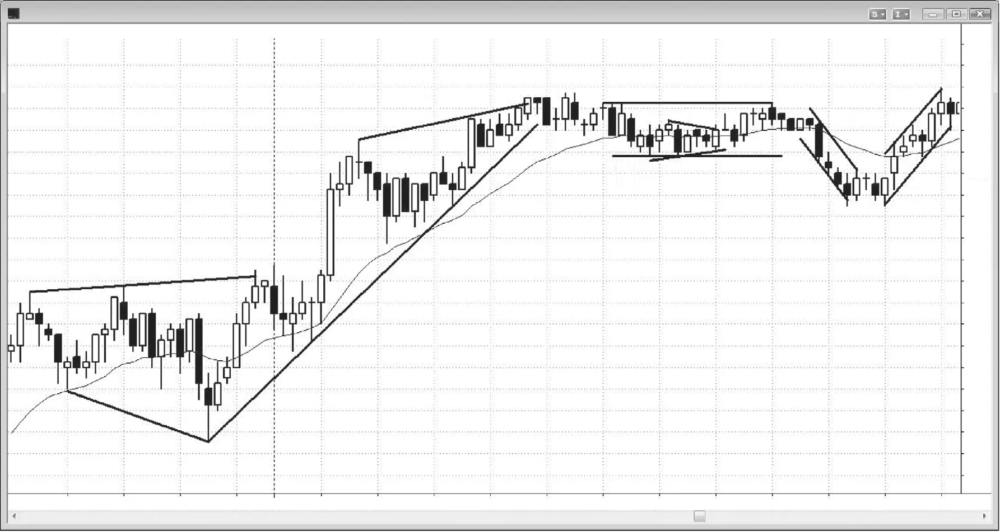

## 第二部分　趋势线与通道

<!-- Source PDF pages 223–226 -->
<!-- English title: PART II Trend Lines and Channels -->

<!-- PDF page 223 -->

# 第二部分  
# 趋势线与通道

尽管许多交易者把所有线都称为趋势线，但对交易者而言区分若干子类型会有帮助。趋势线与趋势通道线都是约束市场价格行为的直线、对角线，但位于相反一侧，共同形成通道。在多头趋势中，趋势线在低点下方，趋势通道线在高点上方；在空头趋势中，趋势线在高点上方，趋势通道线在低点下方。界定通道的线多数平行或大致平行，但在楔形与多数三角形中会收敛，在扩散三角形中会发散。趋势线最常设置顺势交易，趋势通道线则最有助于发现可交易的逆势交易。曲线与带状区域过于主观，因此在需要快速下单时思考成本太高。

通道可以向上、向下或横向——震荡区间就是横向的情况。通道横向时，线为水平线，上方为阻力线，下方为支撑线。一些股票交易者把阻力线看作派发区（交易者了结多头），把支撑线看作吸筹区（交易者加多）。然而，如今许多机构做空与做多一样多，阻力线同样可能是他们开新空的位置，而不只是了结或派发多头；支撑线同样可能是他们了结或派发空头之处，而不只是开多之处。

<!-- PDF page 224 -->

## 图 PII.1　用线条突出趋势

可以画线来突出价格行为，使发起与管理交易更容易（见图 PII.1）。

线 1 是扩散三角形上方的趋势通道线，线 2 是扩散三角形下方的趋势通道线。由于通道在扩散，没有趋势，因此也没有趋势线。

线 3 是多头趋势中 K线 下方的趋势线，是支撑线；线 10 是空头趋势中高点上方的趋势线，是阻力线。

线 4 是多头趋势中的趋势通道线，在高点上方；线 9 是空头趋势中的趋势通道线，在低点下方。

线 5 与线 6 是震荡区间中的水平线，震荡区间就是水平通道。线 5 在高点上方为阻力线，线 6 在低点下方为支撑线。

由线 3 与线 4 形成的通道收敛且上升，因此是楔形。

线 7 与线 8 是小型对称三角形中的趋势线，这是收敛通道。由于对称三角形内既有小型空头趋势也有小型多头趋势，通道由两条趋势线构成，没有趋势通道线。收敛三角形可细分为对称、上升、下降类型，但因交易方式相同，这些名称并非必要。

<!-- PDF page 225 -->

### 对本图的更深入讨论

在图 PII.1 中，当日第一根 K线 突破昨日高点，但突破失败。由于昨日最后六根是多头趋势K线，只能考虑第二次入场做空，但没有合理信号。市场在前七根 K线 进入小型震荡区间，因此处于突破模式。交易者会在开盘区间高点上方 1 tick 止损买入，在低点下方 1 tick 做空。市场向上突破，最小目标是与扩散三角形高度相等的等幅上行。

<!-- PDF page 226: no extractable text (likely figure-only) -->
