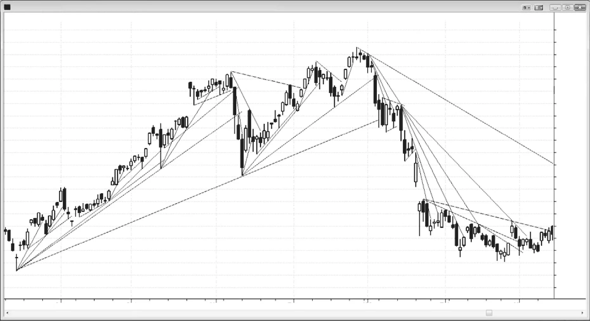
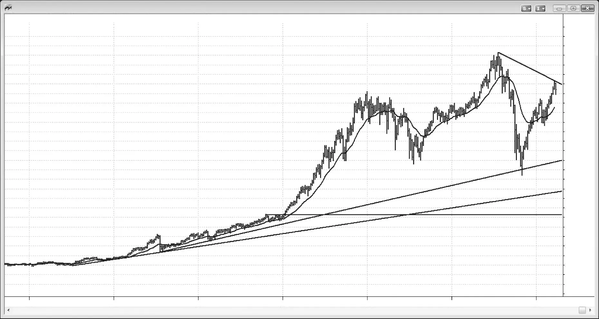
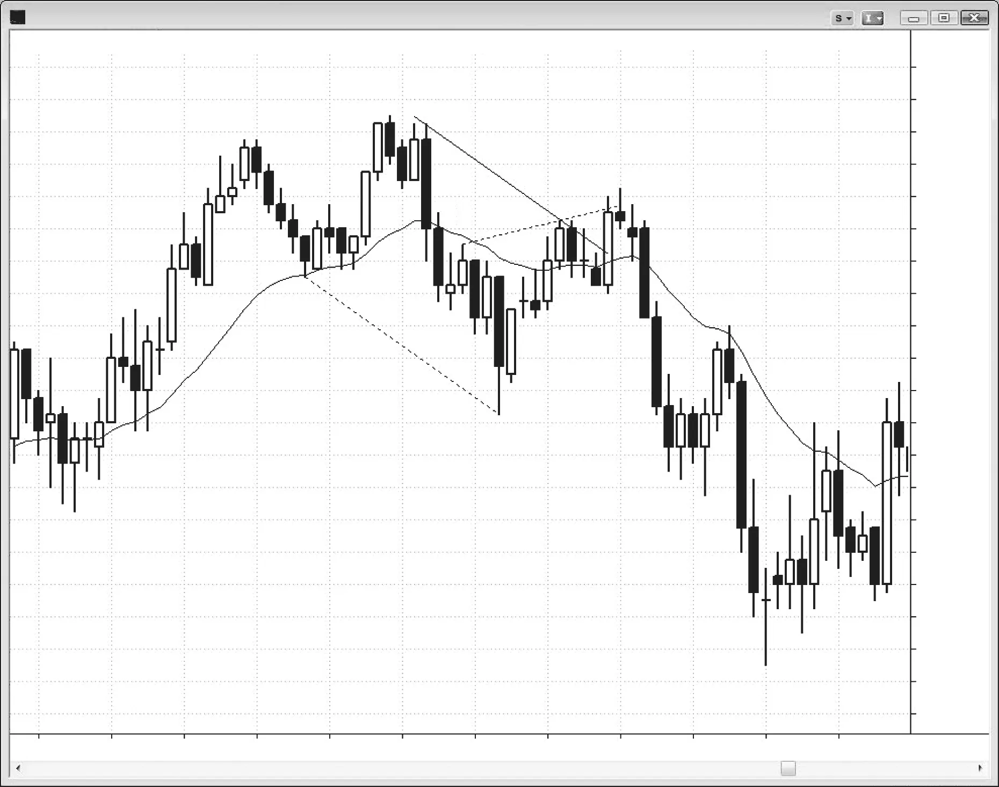
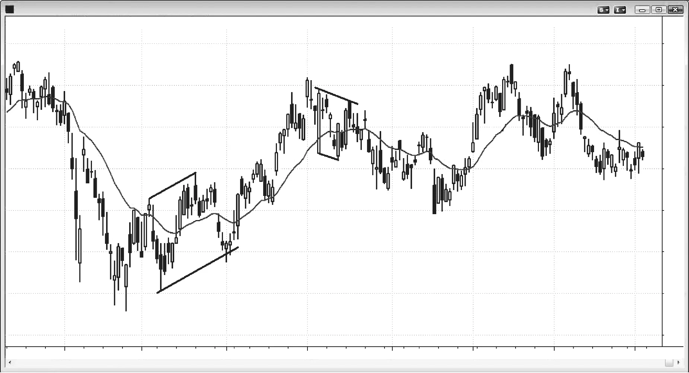
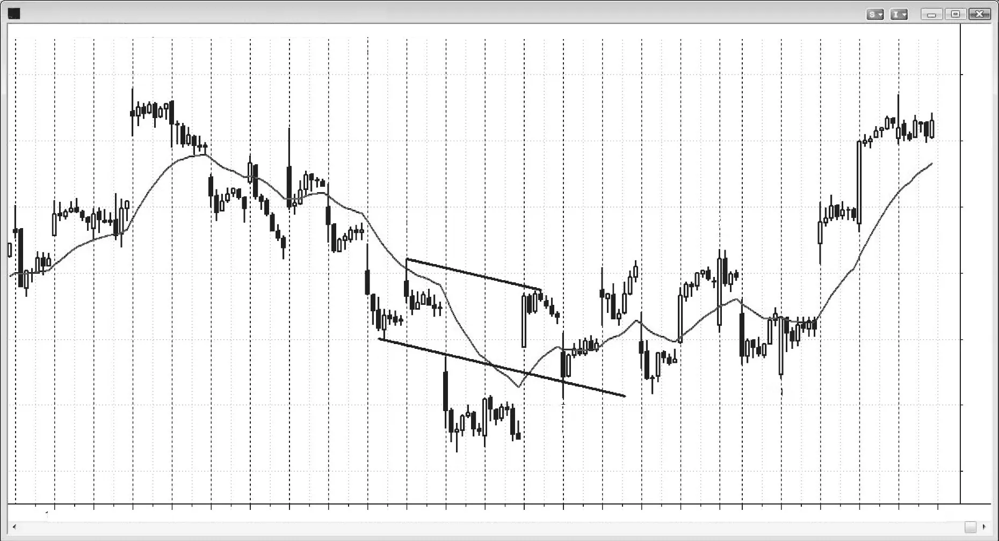
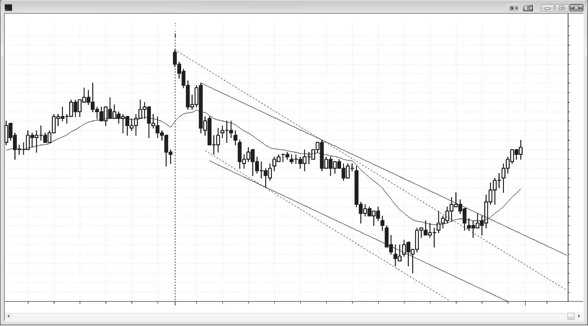
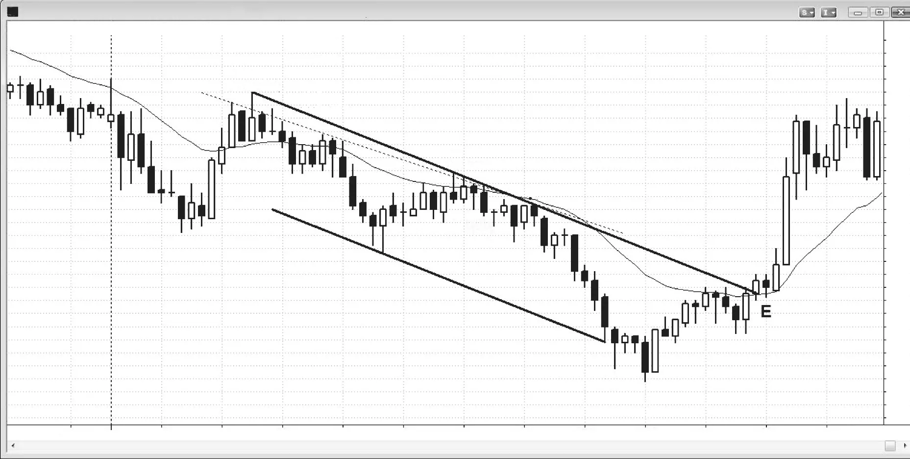

### 第13章　趋势线

<!-- Source PDF pages 227–240 -->
<!-- English: CHAPTER 13 Trend Lines -->

<!-- PDF page 227 -->

# 第13章  
# 趋势线

多头趋势线是画在多头趋势低点上的线，空头趋势线是画在空头趋势高点上的线。趋势线在寻找趋势方向上回撤处入场、以及趋势线被突破后反方向入场时最有帮助。趋势线可用摆动点绘制，或用最佳拟合技术如线性回归计算，或简单地快速画一个最佳近似。它们也可以作为趋势通道线的平行线创建，然后拖到K线的趋势线一侧，但这种方法很少需要，因为通常可用摆动点画出可接受的趋势线。有时最佳拟合趋势线只使用蜡烛实体并忽略影线；这在楔形形态中常见，楔形往往没有楔形形状。当趋势线显而易见时不必实际画出。若你画了线，通常可在验证市场已测试它之后立即擦掉，因为图上太多线会分散注意力。

一旦趋势由一系列趋势性高低点确立，在趋势线被突破之前，最有利可图的交易是沿趋势线方向。每当市场回撤到趋势线附近区域，即便略微未达或超调趋势线，也要寻找从趋势线的反转，然后沿趋势方向入场。即便在趋势线突破之后，若它已生效数十根K线，极有可能在回撤后测试趋势极端。测试之后可以是趋势继续、趋势反转，或市场进入震荡区间。关于趋势线突破最重要的一点是：它是市场不再由单方（买家或卖家）控制的第一个信号，进一步

<!-- PDF page 228 -->

双边交易的可能性现在大得多。每一次趋势线突破后，会有一个新的摆动点可用来画新线。通常，连续的线斜率越来越平，表明趋势在失去动能。到某一点，相反方向的趋势线会变得更重要，因为市场控制权从空头转到多头或反之。

若市场在相对较少的K线内多次反复测试趋势线，且市场无法远离该趋势线，则可能发生两件事之一。多数时候，市场会突破趋势线并试图反转趋势。然而有时市场做相反的事，当交易者放弃试图突破它时迅速远离趋势线。趋势然后加速而不是反转。

趋势线突破的强度提供了逆势交易者强度的指示。逆势行情越大越快，反转越可能发生，但通常会先测试趋势的极端（例如，以更低高点或更高高点形式测试多头趋势高点）。

有助于把跳空开盘与任何大趋势K线都看作有效突破，每一根都应被当作单根趋势处理，因为突破常失败，若有形态你需要准备好 fade 它们。接下来几根的任何横盘运动都会打破该趋势。通常，那些K线会设置旗形，然后从旗形中顺势走出，但有时突破会失败、市场反转。由于横盘K线打破了陡峭趋势线，若有好的反转信号K线，你可以寻找 fade 该趋势。

<!-- PDF page 229 -->

图 13.1  

所有趋势线都很重要

哪些趋势线有效？你能看到的每一条都有产生交易的潜力。寻找你能找到的每一个摆动点，看是否有更早的一个可用趋势线连接，然后把线向右延伸，看当价格穿透或触及该线时如何反应。注意连续的趋势线往往越来越平，直到某一点相反方向的趋势线变得更重要。

在实际操作中，当你看到可能的趋势线且不确定它距当前K线多远时，画出来看市场是否已触及它，然后迅速擦掉。交易时你不希望线在图上超过几秒，因为你不希望分心。你需要关注K线，看它们在线附近如何表现，而不是关注线本身。

随着趋势进展，逆势运动突破趋势线，且通常突破失败，设置顺势入场。每一次突破失败成为创建新的、更长、斜率更浅的趋势线的第二个点。最终，失败突破未能到达新的趋势极端。这在可能成为相反方向新趋势中创造回撤，并允许画相反方向的趋势线。在主要趋势线被突破后，相反方向的趋势线变得更重要，此时趋势很可能已反转。

<!-- PDF page 230 -->

图 13.1  
图 13.1 说明了每个人若要成为成功交易者都需要接受为现实的最重要一点——多数突破会失败！市场反复以非常强的动能冲向趋势线，很容易被K线的强度裹挟，而忽略过去 20 根刚发生了什么。例如，当市场在上涨时，有许多非常强的抛售迅速跌到多头趋势线。这使初学者假设市场已反转，他们在趋势线略上方、处或下方做空，相信有如此多的下行动能，他们会乘浪至大利润，并在新空头趋势非常早期入场。最坏情况，市场可能小反弹后至少有第二段下行，让他们保本离场。当他们决定逆势交易并希望新趋势正在开始时，他们只考虑自己可能获得的回报。然而，他们忽略了每笔交易的另外两个基本考量：风险与成功概率。三者都必须在下单前评估。

当初学者在多头趋势线附近那些强抛售上做空时，有经验的交易者做相反的事。他们在趋势线处及略下方挂限价买单，或用市价单在那里买入。在急剧抛售中，市场通常至少要略跌破趋势线以寻找信息。它需要知道会有更多卖家还是更多买家。多数时候会有更多买家，多头趋势会恢复，但只有在趋势线下方有大突破，然后另一次反弹以更高高点（如此处）或更低高点测试旧多头高点之后。

<!-- PDF page 231 -->

图 13.2  

月线趋势线

趋势线在所有时间框架上都很重要，包括道琼斯工业平均指数（INDU）的月线图。注意图 13.2 中，1987 年崩盘在 bar 3 处结束于用 bar 1 与 bar 2 画出的趋势线 B 的测试。2009 年熊市从用 1987 年崩盘与 1990 年低点画出的趋势线 A 反转向上，但由于 2009 年空头趋势如此之强，有合理机会市场会再次测试线 B。市场不太可能一路回到与 1994 年共和党掌控众议院与参议院重合的线 C 突破处。通常，当突破之后是长期趋势时，它不太可能再被触及，但通常会被测试。由于我们从未充分测试它，它可能仍作为某种磁铁，把市场往下吸。然而，它是许多根之前的事，可能已失去部分或全部磁力。

顺便说，市场方向通常只有约 50% 的确定性，因为多头与空头多数时候处于均衡。然而，当有强趋势时，交易者常可有 60% 或更高的方向确定性。由于 2009 年崩盘如此之强，在历史高点被超越之前测试其低点的概率大概是 60%。空头可能会开始把当前的空头反弹看作头肩顶的潜在右肩、与 2007 年高点的双顶，或扩展三角形顶部（若市场到达新历史高点）。价格行为交易者把这些中的每一个都只看作对 12 年长震荡区间顶部的测试。

<!-- PDF page 232 -->

图 13.3  

作为平行线创建的趋势线

趋势线可用趋势通道线的平行线绘制，但这很少提供用其他更常见价格行为分析尚未显现的交易。

在图 13.3 中，从 bar 1 到 bar 4 的空头趋势通道线被用来创建平行线，平行线被拖到价格的对面并锚定在 bar 2 高点（因为这样包含了 bar 1 与 bar 4 趋势通道线起止之间的所有价格）。

Bar 6 是对该线上方突破的第二次反转尝试，因此是好的做空形态。

作为 bar 1 到 bar 4 趋势通道线平行线创建的趋势线，与用 bar 2 与

<!-- PDF page 233 -->

趋势线

bar 5 高点创建的趋势线（未显示）几乎无法区分，因此对寻找做空的交易者没有增加什么。展示它只是为了完整性。

**对本图的更深入讨论**

图 13.3 中 bar 6 也是 bar 3 与 bar 5 趋势通道线的失败超调，使 bar 6 做空成为对决线交易的例子。这是回撤中的趋势通道线或通道的一段与通道的趋势线相交之处。这里，对趋势线的回撤以 bar 3、5 与 6 创造的楔形空头旗形形式出现。

<!-- PDF page 234 -->

图 13.4  

趋势通道线创建通道

在前几次上推之后，有时它们生成的趋势通道线可被用来创建通道。图 13.4 是俄罗斯通信公司 Mobile Telesystems（MBT）的日线图。

上攻至 bar 6 很强，到 bar 8 有第二次强上攻。在 bar 4 的楔形底部之后，市场可能在发展趋势反转与多头通道。交易者可用从 bar 6 到 bar 8 的趋势通道线创建平行线，然后拖到它们之间的 bar 7 摆动低点以创建通道。交易者然后观察从 bar 8 的抛售，看它是否随后在通道底部向上反转。Bar 9 多头反转K线是买入形态。

类似地，bar 10 在 bar 1 高点区域，因此交易者意识到可能的双顶。市场在 bar 11 跳空低开，有第二段下行至 bar 12 低点。交易者可在它们的低点上画趋势通道线，然后拖到它们之间的高点，碰巧是 bar 11 顶部。他们然后等待从 bar 12 低点的反弹，看它是否在这个潜在新空头通道顶部遇到阻力。当他们看到 bar 13 的强空头反转K线时，他们可以做空，预期市场可能正在向下通道化。

<!-- PDF page 235 -->

图 13.5  

用趋势通道线的头肩形态

如图 13.5 所示，当可能的头肩形态在设置时（bar 4 附近区域是头部），跨颈线（bar 3 与 5）画出的趋势通道线拖到左肩（bar 2）有时给出右肩可能形成何处（bar 6）的近似。当市场跌到该水平时，交易者会开始寻找买入形态，如 bar 6 卖盘高潮之后的强多头内包K线。这并不太重要，因为最近的K线在决定何处入场时总是重要得多。这是印度领先软件公司之一 Infosys Technologies（INFY）的 60 分钟图。

<!-- PDF page 236 -->

图 13.6  

趋势通道线创建通道

在图 13.6 中，从 bar 3 低点到 bar 5 低点略下方的虚线趋势通道线，是作为跨 bar 1 与 bar 4 高点画出的虚线空头趋势线的平行线创建的。尽管 bar 5 与 bar 6 都未触及它，它们足够接近，许多多头会满意通道底部已充分测试，因此市场可以买入。然而，许多交易者更希望看到对通道的穿透，然后再寻找应以穿透通道顶部为最低目标的向上反转。

当趋势通道线如此之陡以致被测试但未突破时，明智的是寻找其他可能的画线方式。也许市场看到了你尚未看到的东西。由于空头趋势真正以 bar 2 大空头趋势K线开始，把它作为趋势线起点是合理的。若你从 bar 1 到 bar 4 画趋势线，然后创建平行线并拖到 bar 3 低点，你会发现 bar 6 是对该通道底部超调的第二次向上反转（bar 5 是第一次）。市场如预期反弹并突破通道顶部上方。然后回撤并进一步上行。

<!-- PDF page 237 -->

趋势线

**对本图的更深入讨论**

今日在图 13.6 中以跳空高开突破昨日高点，突破失败。市场下行四根，创造开盘即趋势的空头趋势。Bar 2 是第一次回撤，通常是进入空头趋势的可靠入场。它是向下突破，因此是向下尖峰，随后是以到 bar 3 的三推下行结束的空头通道。由于尖峰与通道形态是一种高潮，反转通常有两段上行，反弹通常测试通道顶部，在那里常设置双顶空头旗形做空，如此处所示。

Bar 4 是另一个向下尖峰，八根后有更大的空头尖峰。它随后是空头通道，该通道顶部被在太平洋时间下午 12:00 刚过后结束的多头尖峰与通道测试。然后有四根抛售测试接近该多头通道底部，设置双底多头旗形，随后是测试 bar 4 高点的强反弹。这是进入次日的潜在双顶空头旗形形态。

平均日波幅约 20 点，因此一旦市场到开盘下方约 20 点，这给交易者另一个寻找反弹的理由。

<!-- PDF page 238 -->

图 13.7  

对趋势线的反复测试

如图 13.7 所示，虚线空头趋势线被反复测试约 15 次，最终多头放弃。趋势线是跨高点的最佳拟合线，以说明对阻力线的所有测试。多头最终停止尝试。他们卖出多单，增加卖盘压力，并停止寻找再买，直到市场再跌许多根。市场因此非常单边，空头能加速趋势下行。通常当市场反复测试趋势线且无法从它下跌时，它会向上突破。另一些时候，如此处，它加速下行并以通道底部附近的高潮结束。跨 bar 3 与 bar 15 高点画出的趋势线包含了所有高点，因此是通道顶部的合理选择。平行线锚定在 bar A 低点，bar B 与 bar C 都突破通道底部并反转向上。一旦反转被 bar C 及其后的两K线反转确认，反弹的第一个目标是测试通道顶部上方。Bar D 有突破，然后是单根停顿，这是一种回撤。市场不是在空头趋势线处找到阻力与卖家，而是找到强买盘，并有强多头突破空头通道上方。

<!-- PDF page 239 -->

趋势线

**对本图的更深入讨论**

今日在图 13.7 中测试了均线，然后突破昨日摆动低点下方。交易者可在第一根下方做空，因为它是 Low 2 做空（对 EMA 的小两段式回撤），或在当日第四根下方。然而，第二、三、四根很大且几乎完全重叠，这是不确定性的信号，是震荡区间的标志之一。这使在该第四根下方做空更可能随后是突破不会走远就被该窄幅震荡区间的磁力拉回。

市场数小时保持在震荡区间中，然后下跌至当日新低。双边力量继续控制市场，市场反转向上进入收盘，以大约开始的位置结束当日。

<!-- PDF page 240: no extractable text (likely figure-only) -->
