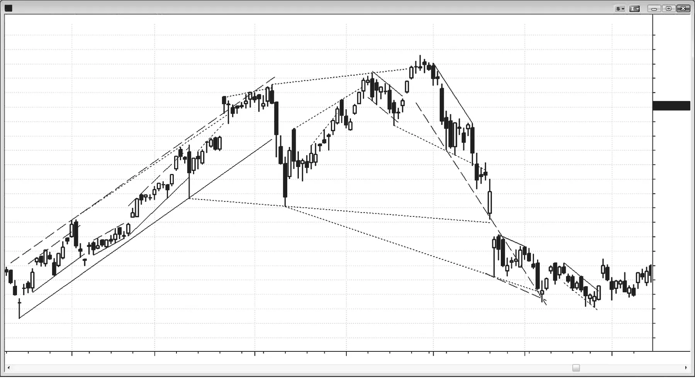
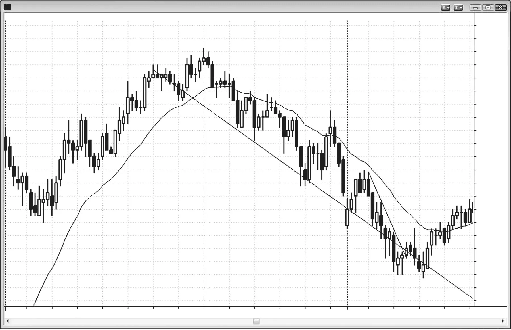
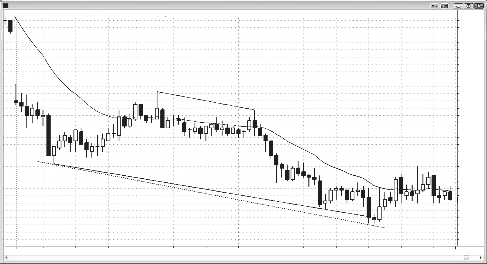

### 第14章　趋势通道线

<!-- Source PDF pages 241–250 -->
<!-- English: CHAPTER 14 Trend Channel Lines -->

<!-- PDF page 241 -->

# 第14章  
# 趋势通道线

在多头或空头通道中，趋势通道线位于价格行为与趋势线相对的一侧，并有大体相同的斜率。在多头趋势中，趋势线在低点下方，趋势通道线在高点上方，二者都向右上倾斜。趋势通道线是 fade 走得太远太快的趋势的有用工具。寻找超调后反转，尤其当它是第二次穿透在反转时。

趋势通道可以有大致平行的线，或线可以收敛或发散。当它们收敛且通道在上升或下降时，通道是楔形，这常设置反转交易。一般而言，任何向右上倾斜的通道可被看作空头旗形，很可能有通过通道底部的突破。突破可导致趋势反转或可向上或向下突破的震荡区间。有时市场会加速上行并突破通道顶部。当这发生时，通常是导致反转回通道内并常穿过通道底部的高潮性反弹，但有时可以是更强多头趋势中另一段上行的开始。

类似地，向右下倾斜的通道可被看作多头旗形，市场很可能向上突破通道。这可以是趋势反转或震荡区间的开始。若市场跌穿下降通道底部，突破通常在约五根内失败并导致反转，但也可以是新的、更强空头腿的开始。

趋势通道线可作为趋势线的平行线创建，然后拖到价格行为的对面。它也可以跨通道对面的尖峰绘制，或作为最佳拟合线绘制，如线性

<!-- PDF page 242 -->

回归线，或仅凭视觉画最佳拟合线。在多头趋势中，趋势线跨两个低点绘制。若该趋势线被用来创建将用于趋势通道线的平行线，把平行线拖到趋势的对面。你希望它包含（在上方）用于创建趋势线的两根K线之间所有K线的高点，因此把它拖到无论哪根高点会使其只触及那一根的位置。偶尔若你把线锚定在两根之外的K线上会得到对趋势更好的感觉。始终做最能突出趋势的事。

有时在其他方面相当窄的通道内会有单根上冲尖峰，当是这种情况时，通常最好忽略它并用其他K线确定趋势通道线位置。然而，要意识到市场最终可能决定通道线应跨该上冲尖峰。若市场开始有更宽的摆动且它们都停在使用该尖峰作为趋势通道线锚点的通道顶部，则你应使用该更宽通道。

趋势通道线也可以独立创建，而不是作为趋势线的平行线。在空头摆动中，趋势线向下倾斜并在高点上方。趋势通道线会有相似斜率，但在空头摆动中的任何两个摆动低点之间绘制。若它包含（在下方）摆动中所有其他K线则最有用，因此选择会给出该结果的K线。

趋势通道线超调与楔形密切相关，应被看作并当作同一事物交易。多数楔形有失败的趋势通道线突破作为反转交易的触发，多数趋势通道线超调与反转也是楔形反转，尽管楔形可能不明显或没有完美楔形形状。当趋势通道线作为趋势线的平行线构建时，楔形不太明显且不太可能存在，但楔形仍常存在。

当通道有楔形形状时，原因是紧迫感。例如，在楔形顶部，趋势线的斜率大于趋势通道线的斜率。趋势线是顺势交易者入场与逆势交易者离场之处，在趋势通道线处则相反。因此若趋势线斜率更大，意味着多头在更小回撤上买入，空头在更小抛售上离场。最初把楔形与线平行的通道区分开的是第二次回撤。一旦第二次上推开始反转向下，交易者可画趋势通道线，然后用它创建平行线。当他们把该平行线拖到第一次回撤底部时，他们创建了趋势线与趋势通道。这告诉多头与空头支撑在哪里，多头会寻找在那里买入，空头会寻找在那里获利了结。然而，若多头开始在该水平上方买入且空头提前离场空单，市场会在到达趋势线之前转回向上。双方都这么做是因为他们感到紧迫，害怕市场会

<!-- PDF page 243 -->

趋势通道线

跌不到该支撑位。这意味着双方都觉得趋势线需要更陡、上行趋势更强。

一旦市场转上，交易者可重画趋势线。不再使用趋势通道线的平行线，他们现在可用前两次回撤的底部画趋势线。他们现在看到它比上方的趋势通道线更陡，并开始相信市场在形成楔形，他们知道这常是反转形态。交易者会画该新更陡趋势线的平行线并拖到第二次上推的顶部，以防市场在形成更陡的平行通道而不是楔形。多头与空头都会观察原始趋势通道线是否会遏制反弹，还是新的更陡的那条会被到达。若原始那条遏制了反弹且市场转下，交易者会认为尽管第二次回撤中买入有更多紧迫感，但该紧迫感在第三次上推中未继续。多头在原始、更浅的趋势通道线获利了结，意味着他们比本可以的更早离场。多头希望市场反弹到更陡的趋势通道线但现在失望了。空头如此急于做空，以致害怕市场到不了更陡、更高的趋势通道线，因此他们在原始线开始做空。现在是空头有紧迫感而多头害怕。交易者会看到从楔形顶部的转下，多数会等待至少两段下行再寻找下一个主要买入或卖出形态。

一旦市场完成第一段下行，它会跌破楔形下方。在某一点，空头会获利了结，多头会再次买入。多头想使楔形顶部失败。当市场反弹测试楔形顶部时，空头会再次开始卖出。若多头开始获利了结，他们相信自己无法把市场推到旧高上方。一旦他们的获利了结与空头的新卖出达到临界量，它会压倒剩余买家，市场会转下进入第二段。在某一点，多头会回来、空头会获利了结，双方会看到两段式回撤并怀疑多头趋势是否会恢复。此时，楔形已演绎完毕，市场会寻找下一个形态。

为什么那么多反转发生在趋势通道线超调之后，而人人都知道它常导致反转？抢先入场者难道不会阻止线被到达吗？普遍看法是：站在错误一侧的新手交易者持有亏损仓位直到无法再忍受痛苦，然后突然全部同时离场，创造暴发式或抛物线高潮。例如，在多头通道中，市场一路上移到某个阻力位，即便它不太明显或令人印象深刻，并戳穿它，导致最后的空头不再愿意承受痛苦。他们突然放弃。一旦这些最后的空头一致平空，许多欣喜若狂、缺乏经验的多头看到上冲并买入其中，增加了突然、急剧的运动，突破

<!-- PDF page 244 -->

趋势通道线上方。这个向上尖峰导致更多剩余空头平空，令人印象深刻的上冲导致更多幼稚多头建立新多单，过程自我强化。但随后没有足够的空头平空把市场推得更高，那些基于情绪而非逻辑交易的欣喜多头会在市场突然停止加速上行、停顿并开始转下时恐慌。他们突然意识到自己在可能的高潮高点买入，会迅速离场。没有更多买家，被困的新多头恐慌卖出仓位，市场突然变成单边并由卖家主导，因此只能下行。那是传统逻辑，它是否真实并不重要。事实上，它很可能不是像 Emini 这样由机构主导且多数交易可能由计算机生成的巨大市场中反转的有意义组成部分。聪明交易者在强趋势线突破后的回撤之前，或趋势通道线超调的反转之前，不会逆势交易。例如，在多头趋势中，聪明资金会继续买入直到把价格推到多头趋势通道线上方，然后他们会获利了结。可能有几次失败的反转尝试，市场可能以加速步伐继续反弹，创造更陡的趋势通道线。顺便说，若你发现自己反复重画趋势通道线，这通常是你站在市场错误一侧的信号。你在寻找反转但趋势不断变强。你应顺势交易，而不是紧张地寻找反转。

最终市场会就哪条趋势通道线是最后一条达成一致，你会看到有说服力的反转。在此之前要有耐心且只顺势交易；在它清晰反转之前永远不要逆势交易。在获利了结者获利了结的同时，许多人会反手，许多已空仓的其他交易者会建立空单。其他聪明交易者会等待图上的反转，会有交易者在所有类型的图上（1 到 5 分钟，以及任意大小的成交量图与 tick 图）在反转上入场。

<!-- PDF page 245 -->

趋势通道线

一旦他们相信顶部已确立，这些聪明资金不会再寻找买入。他们做空，且这些交易者中的多数会扛过新高，尽管当前仓位有浮动亏损，相信顶部已确立或接近确立。事实上，许多人会在高点上方加空，既为了获得更好的平均空单价格，也为了帮助把市场往下推。大参与者只想着做空，除了罕见的第二次入场失败或巨大失败（例如，或许在 Emini 中入场上方三点）外不会被吓出。没有买家了，市场只有一个方向可走。

尽管你在决定是否下单时不必看成交量，因为它如此不可靠，但在关键转折点尤其是底部，成交量常很大。每笔交易都是一个或多个机构买入与一个或多个卖出之间。市场底部的主要买家是获利了结的空头与新多头。为什么一家公司会在熊市最低 tick 卖出？每一家

<!-- PDF page 246 -->

公司都使用他们仔细测试并发现可盈利的策略，但所有策略在 30% 到 70% 的交易上亏损。在熊市最低 tick 卖出的公司是那些一路在低 tick 卖出的公司，在许多更早入场上获利，他们只是继续使用那些策略直到趋势清晰已反转。所以，是的，他们在空头最后低 tick 的那笔做空上亏损，但靠所有更早做空赚得足够最终盈利。也有高频交易（HFT）公司会为甚至单 tick 剥头皮，一直到空头的低 tick。记住，低点总在支撑位，许多 HFT 公司会在支撑上方 1 或 2 tick 做空以试图捕获最后那个 tick，若他们的系统显示这是可盈利策略。其他机构作为另一市场（股票、期权、债券、货币等）对冲的一部分卖出，因为他们觉得若下对冲，风险/回报比更好。成交量不是来自小型个人交易者，因为他们在主要转折点贡献不到 5% 的成交量。超调处的反转发生是因为它是机构交易心理中如此根深蒂固的一部分，以至于它必须发生。即便机构不看图，他们也会有其他标准告诉他们市场已走得太远、是离场或反转的时候，这会始终与价格行为交易者看到的重合。记住，价格行为是大量聪明人独立试图在市场中赚最多钱时价格正在发生什么的不可避免的足迹。在大市场中，价格行为无法被操纵，且总是基本相同。

最后一个次要观察是：趋势最后旗形的斜率常提供新趋势斜率的近似。这对交易者价值有限，因为在下单前的决策中会有其他重要得多的因素，但这是有趣的观察。

<!-- PDF page 247 -->

趋势通道线

图 14.1  

测试趋势通道线

趋势通道线指向趋势方向，但位于趋势与趋势线相对的一侧。把它向右延伸，观察当价格穿透通道线时如何表现。它是反转还是趋势加速、忽略该线？

趋势通道线常用两种方式之一绘制。第一种是画成趋势线（图 14.1 中实线）的平行线（虚线），拖到行为的对面，并放在触及用于创建趋势线的两根K线之间某个摆动点的位置。选择会使趋势线与通道线之间所有K线都包含在线之间的点。第二种（图 14.1 中点线）趋势通道线跨摆动点绘制，独立于任何趋势线。你也可以简单地画最佳拟合，但这些在交易中通常没有帮助。

<!-- PDF page 248 -->

图 14.2  

最后旗形的斜率

多头趋势最后旗形的斜率为图 14.2 中随后的空头趋势提供了方向。在 bar 1 与 bar 2 之间画出的线性回归趋势线成为延伸到次日的抛售的粗略空头趋势通道线。它可能对 bar 7 的买入有贡献，但 bar 7 的买入只是基于对交易首小时上方画出的趋势线的突破，以及对 bar 5 开盘低点下方突破的第二次反转尝试。若最近价格行为提供了交易的正当理由，通常远好于回头看 30 根或更多根再下单。

事后看，多头趋势在 bar 1 有效结束，即便市场在 bar 2 后创了更高高点。到 bar 2 的下行是空头通道中的第一段下行。

<!-- PDF page 249 -->

趋势通道线

**对本图的更深入讨论**

市场在图 14.2 中昨日最后几小时处于空头通道，因此第一次尝试向上反转成功的概率不大。趋势通道线下方的突破以当日第一根——多头趋势K线——反转向上，但失败突破只走了几根就设置了突破回撤做空。

<!-- PDF page 250 -->

图 14.3  

很长的趋势通道线

在图 14.3 中，从 bar 2 与 bar 3 的趋势线被用来创建平行线，拖到 bar 1 并向右延伸。这条趋势通道线未被 bar 6 穿透。此外，它锚定在 bar 1，而 bar 1 不在 bar 2 与 bar 3 之间（用于创建原始趋势线的K线）。然而，交易者应始终看每一种可能性。若有穿透与反转，从 bar 5 低点两段式反弹的机会本会提高。

用 bar 1 与 bar 5 低点创建的简单趋势通道线被 bar 6 穿透，但这不是作为逆势交易基础的理想趋势线，因为 bar 1 与 bar 5 相距很远而 bar 5 与 bar 6 靠得很近。趋势线在被第三段测试时效果最好。这里，bar 5 与 bar 6 本质上仍是同一段的一部分（三推下行，bar 4、5 与 6）。该交易仍值得做，因为 bar 6 很小，因此风险/回报比良好。这也是收缩阶梯下行形态（稍后讨论，但是一系列更低低点，每一次连续突破都小于前一次），表明空头动能衰减并支持做多。

**对本图的更深入讨论**

图 14.3 中的大跳空低开是突破，所有大缺口都是，当日以开盘即趋势的空头日开始。小开盘区间把市场置于突破模式，有大空头突破K线。然而，在空头趋势已走很长一段后形成的异常大空头趋势K线通常是卖盘高潮，随后会有至少两段、持续至少 10 根的横盘到上行调整。Bar 1 是强多头反转K线，设置了失败突破做多。有两段式横盘调整，以窄幅震荡区间的 bar 3 失败突破结束，并与 bar 2 形成近似双顶。即便多数交易是横盘，当日仍在高点附近开盘、低点附近收盘。这是有上下震荡区间的趋势型震荡日。
