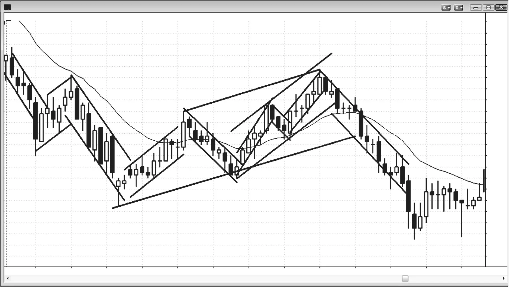
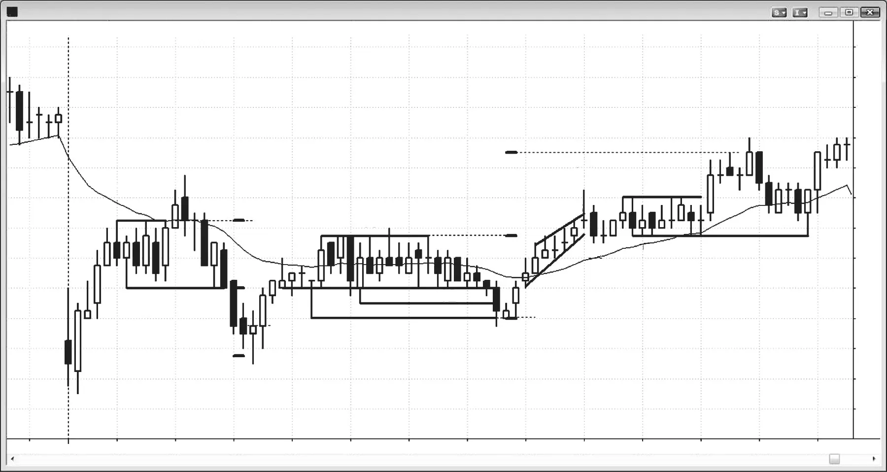
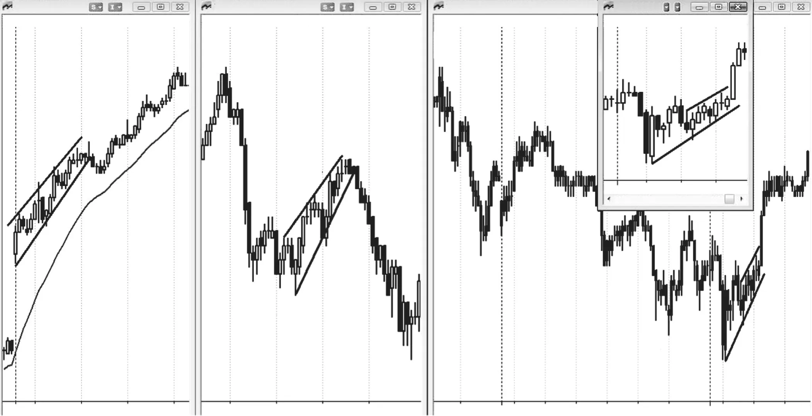
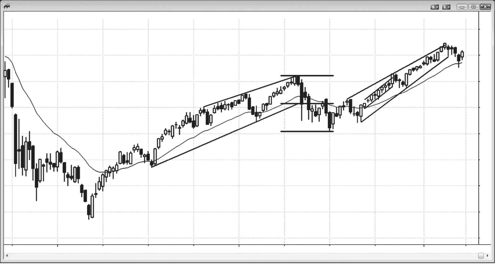
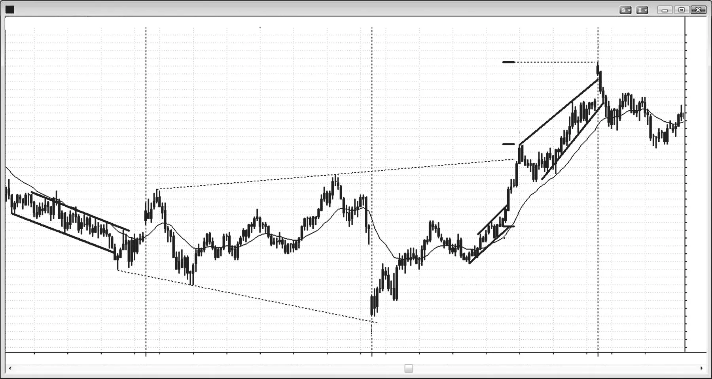
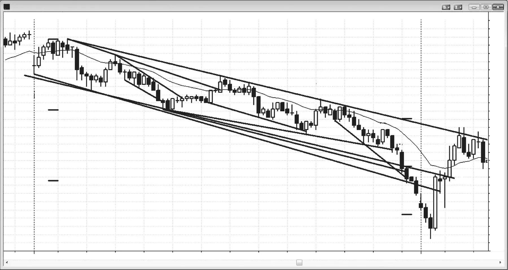
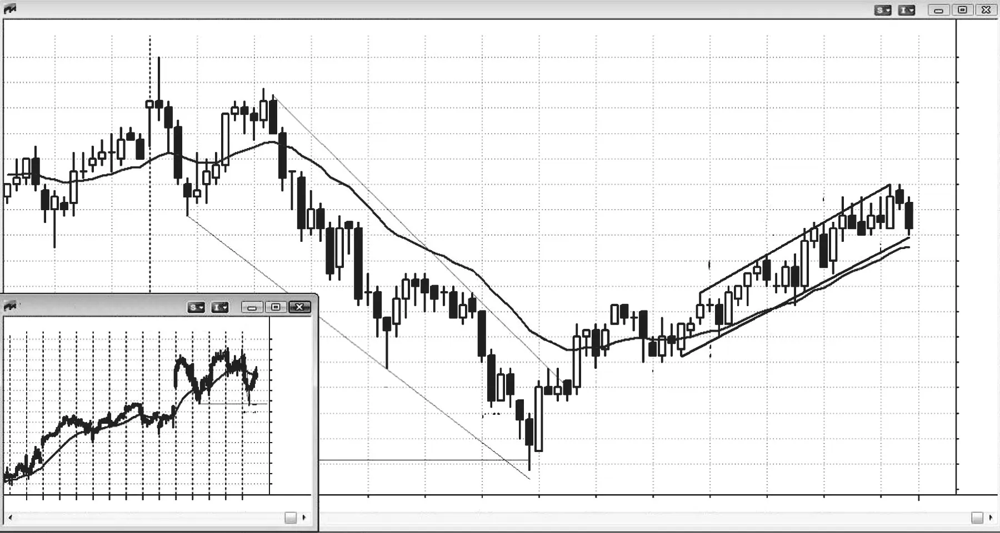
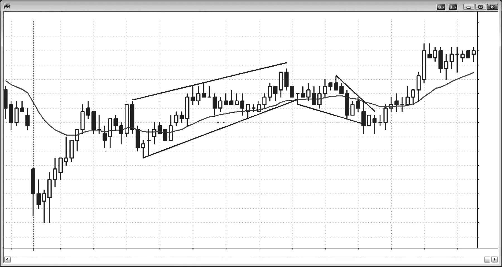

### 第15章 通道

<!-- CHAPTER 15 Channels -->

<!-- Source PDF pages 251–280 -->

<!-- PDF page 251 -->

第 15 章
通道当交易大多被限制在一对线之间时，市场就处于通道中。只要你足够仔细地去找，市场总是处在某种通道里，而且通常会同时处在多条通道中，尤其是在你查看其他时间框架时。趋势通道是一种斜向的通道，由趋势线与趋势通道线所界定。例如，空头通道上方有一条下行的趋势线（空头趋势线），下方有一条下行的趋势通道线（空头趋势通道线）。震荡区间则夹在下方的水平支撑线与上方的阻力线之间。有时震荡区间可以略微上升或下降，但若如此，最好把它看作弱势的趋势通道。

三角形也是通道，因为它们同样是被两条线所夹住的价格行为区域。由于它们要么有更高高点，要么有更低低点，或者在扩展三角形的情形下两者兼有，因此它们除了震荡区间行为之外，也带有一定的趋势行为。扩展三角形被夹在两条发散的线之间，这两条线从技术上都属于趋势通道线。下方的线穿过更低低点，因此位于空头趋势之下，是趋势通道线；上方的线穿过更高高点，因此是多头趋势通道线。收缩三角形则被夹在两条趋势线之间，因为市场同时处于带有更低高点的小空头趋势与带有更高低点的多头趋势之中。上升三角形上方是阻力线、下方是多头趋势线；下降三角形下方是支撑线、上方是空头趋势线。楔形是上升或下降的通道，其中趋势线与趋势通道线收敛，它是三角形的一种变体。多头趋势中的 ABC 调整是一个小型空头通道；在空头趋势中，它则是一个小型多头通道。

<!-- PDF page 252 -->

尽管移动平均线在强趋势中常常起到支撑或阻力的作用，而且许多交易者会基于移动平均线以及许多其他因素画出曲线通道和带状区间，但直线趋势线与趋势通道线始终能提供更可靠的交易形态与更有利可图的交易。

多头通道可以出现在震荡区间、多头趋势、空头趋势中，也可以出现在空头趋势可能见底、市场开始向上反转时。当它处于震荡区间中时，交易者可以考虑在区间下半部做多，但随着通道推进到区间上半部，成功概率会下降。当通道处于多头趋势中时，更高价格更为确定，交易者应在通道底部附近寻找买入机会。成功做多的机会会一直保持较好，直到通道开始出现明显的卖盘压力，或接近重要阻力。当通道特别窄时——也就是说趋势线与趋势通道线彼此很近、回撤很小——这是趋势强劲的迹象，在更高时间框架图上它可能就是一个尖峰。之后可能跟随一个更宽的通道，并可能达到基于窄通道高度的等幅运动目标。通道窄到几乎没有回撤、或只有一两次极小回撤时，就是微型通道，下一章会讨论。

当多头通道形成于空头趋势中时，它就是空头旗形，交易者应在顶部附近做空，或在向下突破后的回撤上做空。有时当空头趋势开始向上反转时，最初的五到十根 K 线会处于弱势的多头通道中，有大量重叠 K 线，并有一次或多次试图跌破空头旗形，但这些尝试失败并很快向上反转。在 Low 2 或 Low 3 失败之后，市场有时会从空头旗形向上突破，市场突然变成始终做多，多头反转随之开始。当交易者怀疑某个空头旗形可能是多头趋势的起点时，许多人会在 Low 1、Low 2 或 Low 3 信号 K 线下方买入，预期它们会失败、市场会向上反转。

在通道形成过程中，交易者并不确定到底会出现通道，还是只是两段式运动然后反转。事实上，通常要等到市场从两段式运动开始反转、反转失败、第三段开始之后，你才能画出通道线。例如，若市场刚完成两段上涨并开始反转，而反弹又不是强多头趋势，许多交易者会做空这次反转。然而，若向下的那一段结束，且其规模与第一段下跌（第一段上涨之后的那段）相当，然后市场再次向上反转，交易者此时会开始假定这是多头通道在进行，而不是反转进入空头一段。一旦第二段结束，交易者会从第一段下跌的底部到第二段下跌的底部画一条趋势线，并把它向右延长。每当市场再次回到趋势线时，他们会寻找买入机会。他们还会把这条线画一条平行线，并拖到第一段上涨的顶部——这就是他们第一次画出的通道。每当市场反弹到那条趋势通道线时，交易者会兑现多单利润，并寻找做空机会。由于多头通道至少需要那最初两段下跌 <!-- PDF page 253 --> 通道来确认通道的存在，而市场通常随后会测试第二段上涨的顶部之上，因此多头通道通常至少有三次向上推动。交易者通常不会在第三次向上推动形成之前寻找反转与通道的向下突破。然而，一旦第三次推动形成，尤其是若出现对趋势通道线的过度延伸以及一根强劲的空头反转 K 线，交易者会积极做空，因为成功向下突破的概率已经上升。正因为如此，许多多头通道会在第三次向上推动后结束。同样，许多空头通道会在第三次向下推动后结束。

为什么市场会向通道顶部和底部急速奔去？这是因为真空效应。例如，若存在多头通道，而某一段正在接近上方的趋势通道线，交易者认为市场很可能会触及那条线，甚至可能比它高出一两个 tick。既然他们认为市场至少还会比现在再高一点，他们就会暂缓卖出。多头最终想卖出多单以兑现利润，空头想卖出以建立新空仓。当前相对缺乏卖盘会形成买盘失衡，而一旦出现任何失衡，市场就会快速运动。结果往往是，在市场测试通道顶部时，会出现一两根大型多头趋势 K 线。这常常会吸引过于急切的多头在尖峰顶部买入，因为他们认为市场正在形成新的、更强的多头一段。然而，大多数突破尝试都会失败，这一次也很可能失败。为什么？因为机构交易者。强大的空头想做空，但他们认为市场会触及上方趋势通道线，所以他们等待。一旦市场到了那里，他们会大量做空并压倒多头。他们喜欢看到强劲的多头趋势 K 线，因为他们相信市场会走低，而做空的最佳价格莫过于多头情绪最极端之处。市场可能在多头趋势 K 线顶部停顿成一根小 K 线，多空双方都在判断突破是否会失败，但通常随后会快速下跌，因为机构多头与机构空头都知道，所有突破尝试失败的概率极高。

那么那些强大的机构多头会怎么做？他们停止买入，并迅速卖出多单，捕捉短暂的意外利润。他们知道这个机会很可能很短暂，因为市场不会在极端位置停留太久，所以他们退出，至少一两根 K 线之内不会再考虑买入。这些机构多头的相对缺席，加上机构空头的积极进攻，迫使市场快速跌向通道底部，在那里相反的过程开始。多空双方都预期下方的趋势线会受到测试；空头会一直做空直到市场到那里，然后买入回补空单以兑现利润；而多头则不会在市场到那里之前买入。这会形成短暂而急促的向下运动，会诱使初学者做空、期待空头突破，但他们的做法与机构恰好相反。记住，你的工作是跟随机构在做什么。你不应该去做你希望他们很快会做的事，也绝不应 <!-- PDF page 254 --> 做与他们完全相反的事。这些小回撤中的每一次都是微型卖盘真空。一旦市场接近通道底部，多空双方都预期市场会到达多头趋势线，并在到达之前停止买入。一旦到达，多头买入以建立新多仓，空头兑现其短线剥头皮空单的利润。双方都预期会出现新的通道高点以及对通道顶部的测试，然后这一过程再次开始。这发生在所有通道中，包括震荡区间与三角形。

即使在趋势通道中，也在发生双向交易，而这属于震荡区间行为。事实上，可以把趋势通道看作倾斜的震荡区间。当斜率很陡、通道很窄时，它更像趋势，交易只应顺着趋势方向进行。当斜率不那么陡，且通道内有较宽的摆动——有些持续五根甚至十根 K 线——时，市场更像震荡区间，可以双向交易。与所有震荡区间一样，震荡区间中部有一种磁吸拉力，往往把市场留在区间内。为什么市场会待在通道中而不会突然加速？因为不确定性太多，就像所有震荡区间一样。

例如，在多头通道中，多头想买得更多，但想在更低的价格买。弱势空头希望出现下跌，以便以较小的亏损离场。多头与弱势空头都担心可能不会出现能让他们在更好价格买到想买全部股份的回撤（弱势空头是在回补其亏损空仓），所以他们在市场上涨过程中继续分批买入，这又增加了买盘压力。在任何小幅回落时他们买得更积极，例如用限价单在前一根 K 线低点下方、在移动平均线处、或在构成通道底部的趋势线附近买入。

一般而言，当通道刚开始时，最好顺势交易；当它接近目标区域、并出现更多双向交易时，有经验的交易者往往会开始逆势交易。因此在多头通道的起点，更好的做法是在 K 线低点下方买入；但当通道到达阻力区域，并开始出现更多重叠 K 线、空头 K 线、更深的回撤以及明显影线时，更好的考虑是在 K 线上方做空，而不是在 K 线下方买入。

然而，对刚入门的交易者来说，只要看到通道，就只应顺势交易——如果交易的话。交易通道非常困难，因为它们总在试图反转，并有许多回撤。这会让初学者困惑，并常常反复亏损。若有多头通道，他们应只寻找买入。最可靠的买入信号是 High 2，且在移动平均线处有多头信号 K 线，同时入场点不太靠近通道顶部。这类完美形态并不常见。若交易者刚起步，他们应等待最好的形态，哪怕这意味着错过整个 <!-- PDF page 255 --> 通道趋势。更有经验的交易者可以在弱势卖出信号下方、在移动平均线附近以及通道底部附近用限价单买入。若交易者尚未持续盈利，他们应避免在多头通道中接受任何卖出信号，即使出现小的更低高点。市场处于始终做多状态，他们不应寻找做空，尽管会出现许多看起来可以接受的信号。要等到市场明确变成始终做空之后，再寻找做空。那通常需要一根强劲的空头尖峰跌破通道与移动平均线，并有跟随，然后出现带有空头信号 K 线的更低高点。若形态比这更弱，初学者应等待，只寻找回撤买入。不要陷入向均值回归的心态，以为通道看起来很弱、反转早就该来了。市场可以把它那看起来不可持续的行为延续得远比你在逆着那条看起来很弱的趋势下注时、账户所能支撑的时间更久。

许多多头会在市场上涨过程中分批加仓其多头仓位，他们会用尽一切可以想到的合乎逻辑的方法。有人会在回撤到移动平均线时买入，或在前一根 K 线低点下方买入，或按固定间隔在回撤时买入，例如在 AAPL 最近高点下方每隔 50 美分买入。另一些人会在市场看起来恢复向上通道时买入，例如在前一个低点上方每隔 25 美分买入。只要你能想到一种方法，某个程序员也能想到；若她能证明它在数学上有效，她的公司很可能就会尝试交易它。

由于多头与被困空头都希望价格更低，却又害怕更低价格不会到来，双方都会继续买入，直到他们没有什么可买为止。这总会发生在某个磁吸位，例如等幅运动、更高时间框架的趋势线或趋势通道线。由于通道通常比大多数交易者预期的走得远得多，趋势通常会越过最初一个或多个明显的阻力位继续上行，直到到达一个足够多强大的多头与空头都同意市场已经走得够远、很可能不会再高多少的位置。在那一点，市场耗尽了买盘压力，强大的多头兑现利润并卖出多单，强大的空头进来更积极地卖出。结果是反转进入更深的调整，或进入相反的趋势。多头趋势常常以突破通道顶部而结束，因为最后那些绝望的空头在绝望中回补空单，而那些一直等待更低价格的最弱多头最终也只好市价买入。强大的空头预期到这一点，往往等待强劲突破，然后开始无情地做空。他们相信这是在非常高的价格做空的短暂机会，市场不会在这里停留太久。强大的多头把向上尖峰看作礼物，他们退出多单，现在至少要等一段持续至少 10 根 K 线的两段式回撤之后才会再买。他们常常要等到市场跌到通道起点——他们当初买入并做成盈利交易的地方——才会再买。强大的空头知道这一点，会寻找在强大的多头再次买入的同一位置 <!-- PDF page 256 --> 兑现利润；结果通常是反弹，然后往往进入震荡区间，因为双方都对下一步方向变得不确定。不确定性通常意味着市场处于震荡区间。

至少这是传统逻辑，但实际情况可能更复杂、更精巧，也更不可知。所有机构都熟悉这种形态，你可以肯定他们的程序员在不断寻找利用它的方法。机构可能做的一件事是试图制造买盘高潮。若它一路上一直在买入，并准备兑现利润，但想确保顶部已经形成，它可能突然买入最后一大块，即使意识到可能在这块上小亏，目标是在图表上制造高潮反转。若该公司成功——若其他几家机构也在运行做类似事情的程序，它可能成功——它就可以退出全部多单，大部分带利润，甚至反手做空，确信现在是卖方控制市场。

这是否发生在每一次高潮中？不可知，也无关紧要。你的目标是跟随机构在做什么，而你可以在图表上看到它。你永远不必了解形态背后的程序，机构自己也从不知道其他机构在运行什么类型的程序。他们只知道自己的程序，但市场很少会走远，除非许多机构在同一时间朝同一方向交易，并且交易规模足以压倒做相反方向的其他机构。绝大多数机构站在同一边的唯一时刻，是在强趋势的尖峰阶段，而这在图表上出现的 K 线不到 5%。

随着通道继续上行，下单的不只是多头与弱势空头。强大的空头也在市场走高时卖出，分批加仓其仓位，相信上行空间有限，最终他们的交易会盈利。他们的卖出开始以更多带空头实体的 K 线、更大的空头实体、K 线顶部的影线、以及更多低点低于前一根 K 线低点的 K 线等形式形成卖盘压力。他们在寻找通道的向下突破，甚至可能测试到通道起点。由于他们想在尽可能好的价格做空，他们在市场上涨时卖出，而不是等待反转。这是因为反转可能快速而强劲，那时他们最终会在远低于通道顶部的位置做空，而他们认为那不太可能盈利。

他们有多种加仓空头的方式，例如用限价单在前一根 K 线高点上方或在通道内次要摆动高点上方卖出，在每次测试通道顶部的趋势通道线时卖出，在等幅运动目标处卖出，在市场上涨时按固定间隔卖出（例如在 AAPL 每隔高 50 美分），或在每个潜在顶部卖出。一旦市场反转，他们可能持有全部仓位，期待显著反转；也可能在利润目标处离场，例如在通道底部的趋势线测试处，甚至在 <!-- PDF page 257 --> 通道他们第一笔空单的入场价处离场，而那往往靠近通道起点。若他们那样做，第一笔入场会是保本交易，而更高价位的入场会带来利润。

若你在该多头通道中分批加仓做空，最好只在当日的前三分之二时段这样做。你不想发现自己在多头通道中重仓做空，而你的保本入场远在下方，以至于剩余时间不足以无亏损离场，更不用说获得大利润。一般而言，若你在当日下半场交易通道，远更好的做法是只顺势交易，例如在前一根 K 线低点下方买入，或在移动平均线处每一根多头反转 K 线上方买入。

若市场继续高于空头认为可能的位置，他们会以亏损全部买回仓位，这很可能是有时出现在通道末端的高潮式向上突破的重要贡献因素。他们不再预期很快会出现能让他们以更好价格买入的回撤，而是改为市价买入，并对所有空头入场承担亏损。由于许多人是动量交易者，许多人会转而做多。所有动量交易的多头会在市场向上加速时积极买入，因为他们知道数学站在他们一边。下一 tick 更高而不是更低的方向概率超过 50%，所以他们有优势。即使突破可能短暂、反转可能尖锐，只要逻辑支持，他们的买入程序就会继续买入。然而，这就像抢椅子游戏；一旦动量的音乐停下，每个人都迅速抢椅子，这意味着他们非常迅速地退出多单。当他们卖出多单时，也有积极的空头在做空，这会形成有利于空头的强烈失衡。若空头取得控制，下跌通常会持续至少 10 根 K 线，通常会反转跌回趋势通道线下方并进入通道，然后突破通道下侧。

电视评论员会把急剧的向上突破归因于某条新闻，而总有许多新闻可选，因为他们只从基于基本面交易的传统股票交易者视角看市场。他们不理解：许多发生的事情——尤其是在一个小时左右的过程中——与基本面无关，而是大量程序同时做同一件事、全然不顾基本面的结果。一旦市场在高潮式冲顶上快速反转，他们就转向下一个故事。他们从不面对自己刚刚给出了愚蠢而幼稚的报道这一事实，并完全无视短期内驱动市场的强大技术力量。每隔几年会有一次格外巨大的日内波动，而几乎只有那时他们才会承认技术因素在起作用。事实上，他们总是把它归咎于程序，仿佛程序突然短暂出现。没有什么可归咎的。绝大多数日内价格运动都由程序造成，而记者们却毫无头绪。他们眼里只有财报、季度销售与利润率。

<!-- PDF page 258 -->

由于通道是倾斜的震荡区间，就像其他震荡区间一样，大多数试图突破顶部或底部的尝试都会失败。是的，一方更强，但原理与任何震荡区间相同。例如，在多头通道中，多头与空头都在活跃，但多头更强，这就是通道向上倾斜的原因。多空双方在通道中部都乐于下单，但当市场接近通道顶部时，多头开始担心向上突破会失败；一旦他们认为失败很可能，他们就会卖出部分多单。此外，空头在通道中部乐于做空，在顶部附近——更好的价值处——会更积极地做空。当市场接近区间底部时，空头对在这些更低价格做空兴趣减少，而刚才还在更高价格买入的多头，会在这里更积极地买入。这导致从趋势线反弹。市场在通道形成过程中通常会一次或多次戳破通道下方，你必须重画趋势线。结果通常是略微更宽、更平的通道。最终，向下突破会足够强，随后出现更低高点，然后是更低低点；当那发生时，交易者会开始画空头通道，即使多头通道仍然存在——只是宽得多。

重要的是要认识到，多头通道的大多数多头突破都会失败。若多头能够制造多头突破并压倒空头，他们通常只能维持几根 K 线。在那一点，多头会认为市场过度，并兑现利润；他们在市场调整一段时间之前不想再买。通道中部的磁吸效应通常会把市场拉回通道，使突破失败，从而使该突破成为买盘高潮。一旦回到通道内，市场通常会至少戳破通道底部作为最低目标。买盘高潮通常导致约 10 根 K 线的两段式调整，并通常跌破通道。一旦发生向下突破，若卖盘继续，下一目标是大约等于通道高度的等幅运动。空头也知道买盘高潮后很可能有调整，会积极做空。随着多头卖出多单，卖盘压力强劲，市场向下调整，甚至可能变成空头趋势。

有时多头通道的向上突破很强，几根 K 线内不会失败。当是这种情况时，市场通常会反弹到等幅运动目标，而该突破会变成度量缺口。例如，若多头通道呈楔形，并向下突破，但向下突破在几根 K 线内失败，然后市场急速上行并突破楔形顶部，则反弹通常会达到大约等于楔形高度的等幅运动上涨。突破楔形上方的那根或那些趋势 K 线于是变成度量缺口。缺口、等幅运动与突破在第二册中讨论。

<!-- PDF page 259 -->

通道若不是向上突破，而是向下突破，但没有失败的向上突破、买盘高潮与空头反转，市场通常会横盘若干根 K 线。它可能形成更低高点然后第二段下跌，或者震荡区间可能变成多头旗形并导致多头趋势恢复。较少见的情况是出现强劲的向下尖峰与强劲的空头反转。对空头通道而言，上述一切的相反情况都成立。

由于趋势通道只是倾斜的震荡区间，它通常像旗形一样运作。若有多头通道，无论多陡或多持久，它在某个时点通常会有向下突破，因此即使前面没有空头趋势，也可以把它看作空头旗形。在某个时点，强大的多头会兑现利润，只有在显著回撤之后他们才愿意再买。那次回撤往往必须一路回到通道起点——他们更早开始买入的地方——这也是通道常常导致一直调整到通道底部、并通常在那里反弹的部分原因。强大的空头与强大的多头一样聪明，一般就在强大的多头停止买入时，强大的空头开始积极做空，并且不会在更高处被震出。事实上，他们会把更高价格看作更好的价值并加仓做空。他们会在哪里兑现空单利润？在通道底部附近，也就是强大的多头可能试图重建多仓的地方。

因为多头通道行为像空头旗形，它就应像空头旗形一样交易。同样，任何空头通道都应被视为多头旗形。它前面可能有也可能没有多头趋势，但这无关紧要。有时会有更高时间框架的多头趋势，在 5 分钟图上可能并不明显，当那发生时，空头通道在那张图上会呈现为多头旗形。尽管更高时间框架趋势可能提高多头突破的概率以及突破会更强、走得更远的概率，但你经常会看到从空头通道出现的巨大多头突破，因此不必去寻找更高时间框架的多头趋势，也能把该通道当作多头旗形来交易。对多头通道而言则相反——它们在功能上是空头旗形。

由于多头通道是空头旗形，最终通常会有空头突破。不过有时会有多头突破通道上方。在大多数情况下，这种突破是高潮性的、不可持续的。它可能只持续一两根 K 线，但有时会在市场向下反转之前持续五根或更多 K 线。较少见的情况下，多头趋势会以非常强的趋势继续。若它反转，通常会重新进入通道；而任何重新进入通道的通道突破，通常会测试通道的另一侧。在多头通道顶部失败突破之后，由于这是一种高潮，反转应至少有两段向下并持续至少 10 根 K 线，且常常变成趋势反转。对空头通道的向下突破而言则相反。它通常是卖盘高潮，并反转回通道上方，至少有两段向上。

<!-- PDF page 260 -->

所有通道最终都以突破结束，突破可以很猛烈，也可以动量很小。趋势通道通常比大多数交易者怀疑的持续得久得多，它们常常诱使交易者过早做反转交易。大多数通道结束前通常至少有三段。这在三角形中尤其清楚，尤其是在楔形中。对三角形而言，突破通常迫在眉睫，但方向往往不清楚。

斜率越陡、两条线靠得越近，通道越强、动量越强。当通道又陡又窄时，它是一种特殊类型的通道，称为窄通道。当它水平时，就是窄幅震荡区间，在第二册讨论。当通道很强时，逆势交易第一次突破是有风险的，而且整个通道很可能在更高时间框架图上是一个尖峰。因此若有陡峭的空头通道，且通道内大多数回撤只有一根 K 线，最好不要在前一根 K 线上方买入那些突破之一，即使它突破了空头趋势线。相反，更好的是等待看是否有突破回撤，它可以是更低低点或更高低点。若有，且向上反转看起来强劲（例如，过去几根 K 线内可能有两三根大小不错的多头趋势 K 线），那么你可以考虑买入该突破回撤。若没有回撤而市场急速上行，那么更高价格的概率就很好，你可以等待任何回撤，它应在大约五根 K 线内到来。若向上反弹越过移动平均线，且第一次回撤保持在移动平均线上方，则做多盈利的概率更好。这是强势的迹象。若第一次回撤形成在移动平均线下方，多头更弱，第二段上涨的机会更小。若在向上突破之后市场继续下跌，则突破失败，空头趋势在恢复。

当市场可能正处于反转过程中时，通道的强度尤其重要。例如，若有强多头趋势，然后有强劲的下跌，远远跌破多头趋势线，交易者会仔细研究下一次反弹。他们想看看那次反弹是否只是对多头高点的测试，还是会强劲突破高点上方，并跟随多头趋势中又一段强劲上涨。最重要的考量之一是对多头高点那次测试的动量。若反弹处于非常窄、陡峭的通道中，没有回撤，K 线之间重叠很少，并且在有任何停顿或回撤之前反弹远高于多头高点，则动量强劲，尽管有强劲下跌与跌破多头趋势线的突破，多头趋势恢复的概率仍会上升。通常，对窄而持久的通道的第一次突破会失败。然后趋势会恢复，并常常突破到新的极端，达到大约等于那次初始突破高度的等幅运动。

相比之下，若反弹有许多重叠 K 线、几根大型空头趋势 K 线、两三次清晰的回撤、或许呈楔形，且斜率明显小于原来多头趋势与下跌的斜率（动量），则 <!-- PDF page 261 --> 通道对多头高点的测试很可能形成更低高点或略微更高高点，然后再次尝试下跌。市场可能正在反转进入空头趋势，但至少震荡区间是可能的。

每当任何通道出现突破，然后反转回通道内时，市场会试图测试通道的另一侧，并通常试图突破它，至少突破一点。若在任一方向有成功的通道突破，下一最低目标是大约等于通道高度的等幅运动。例如，双顶是水平通道，若有成功的向下突破，最低目标是等于通道高度的等幅运动。然而，突破可以变成趋势反转，运动可以大得多。若突破改为向上，目标同样是等于双顶高度的等幅运动上涨。若 AAPL 正在形成双顶，形态顶部比底部高 5.00 美元，则任何向上突破的初始目标是顶部上方 5.00 美元。若突破改为向下，初始目标是形态低点下方 5.00 美元。对楔形底部也是如此。第一目标是测试楔形顶部。若市场继续上行，下一目标是等幅运动上涨。若反弹继续，市场随后可能进入多头趋势。即使通道是倾斜的，初始目标也是等于通道高度的运动。例如在多头通道中，任选一根 K 线，看其正上方与正下方的通道线。只需测量它们之间的距离，即可得到等幅运动投射。等幅运动目标只是近似的，但市场常常精确触及它们，然后停顿、回撤或反转。若市场远超目标，新趋势很可能正在进行。

与所有突破一样，随后可能发生三件事：它可以成功并跟随该方向的更多交易；它可以失败并变成小型高潮反转；或者市场只是横盘，形态演化成震荡区间。大多数突破在几根 K 线内会有反转尝试。若反转 K 线相对于突破 K 线很强，则失败突破与成功反转的概率很好。若反转 K 线相对于突破较弱，则反转尝试失败、并在一两根 K 线内形成突破回撤、突破恢复的概率较高。若突破与反转大约同样强，交易者随后会看反转信号 K 线之后的那根 K 线。例如，若有一根强多头趋势 K 线突破多头旗形，下一根是同样令人印象深刻的空头反转 K 线，则随后那根 K 线变得重要。若它跌破空头反转 K 线下方，突破至少暂时失败。若它随后有强劲的空头收盘且是强空头趋势 K 线，则反转继续向下的概率上升。若它反而成为强多头反转 K 线，则失败突破很可能不会成功，这根多头反转 K 线于是变成在其高点上方一 tick 买入的突破回撤信号 K 线。突破在第二册中讨论。

<!-- PDF page 262 -->

图 15.1

图 15.1
嵌套通道通道在所有图表上都很常见，有些较小的通道嵌套在较大的通道之内。在图 15.1 中，注意线条不必总是画成包含通道内的所有高点与低点。用最佳拟合线来画有助于使通道行为更清晰，并常常使预判信号更容易。由于大多数交易是机构交易并由计算机程序下单，可以合理假定每个小而窄的通道都由程序交易造成。由于全天有如此多公司在运行程序，只有当几家公司在同一方向运行程序、且成交量足以压倒试图让市场朝相反方向运动的程序时，通道才可能发展。例如，在从 bar 4 向下的通道中，有足够的卖出程序压倒任何买入程序，市场向下运动。当买卖程序大体平衡时，市场在窄幅震荡区间中横盘，那就是水平通道。

多头通道与空头旗形难以区分，空头通道应被视为多头旗形。当通道像从 bar 2 到 bar 3 那样窄时，买方应等到有失败突破并向上反转之后再寻找做多，如 bar 3 处发生的那样。他们也可以等待突破后的回撤，例如在 bar 3 之后五根 K 线形成的那根小 K 线高点上方买入。

<!-- PDF page 263 -->

图 15.1
通道在这两者中的任一种出现之前，交易者应只做空。当通道有较宽的摆动，如从 bar 3 到 bar 8 的通道，交易可以双向进行，因为它更清楚地像倾斜的震荡区间，而震荡区间是给出买卖双方信号的双向市场。

图中大多数通道都很窄，由于其中几个没有回撤或只有很小的（仅一到三个 tick）单根 K 线回撤，并持续约 10 根 K 线或更少，它们也是微型通道。

<!-- PDF page 264 -->

图 15.2

图 15.2
失败的通道突破当通道出现突破，然后反转回通道内时，市场通常会测试通道的另一侧，并常常至少最低限度地突破另一侧。若突破有跟随，第一目标是等于通道高度的等幅运动。在图 15.2 中，bar 3 突破了震荡区间顶部并向下反转。在跌破通道底部之后，bar 4 的低点比完美的等幅运动低一个 tick。

bar 11 突破了震荡区间顶部，然后市场用 bar 13 测试了区间底部。有时在画线时有几根 K 线可选，通常值得留意所有可能性，因为你可能要到几根 K 线之后才知道哪条最好。最宽的通道是最确定的。

跟随 bar 13 突破的多头内包 K 线构成了失败突破买入。由于市场再次反转进入通道，第一目标是测试通道顶部。顶部的突破是成功的，下一目标是等幅运动上涨。bar 22 比该目标高一个 tick。有时趋势会开始并走得远得多。

bar 17 突破了多头微型通道或楔形，并在下一根 K 线向下反转。由于通道很窄，测试通道下端的目标在下一根 K 线上就达到了，但没有足够空间做有利润的空单，不应交易。

<!-- PDF page 265 -->

图 15.2
通道由 bar 19 与 bar 20 形成的通道突破的等幅运动上涨，与由 bar 6 与 bar 10 界定的震荡区间的等幅运动上涨位于同一价格。当多个目标聚集在同一价格附近时，那里的任何反转成功概率都会上升。bar 21 是有效的做空形态，但在入场后的下一根 K 线上失败了。bar 22 下方有第二次入场，市场测试了通道底部。在那里形成了多头反转 K 线，然后市场测试了通道顶部。

对本图的更深入讨论在图 15.2 中，市场以大幅向下跳空跌破收盘震荡区间，但第一根 K 线相对较大，上下都有不错大小的影线。这是震荡区间行为，不是开盘即趋势买入或做空的好信号 K 线。第二根是强多头反转 K 线，为失败突破与开盘即趋势的多头趋势发出做多信号。市场在移动平均线正下方进入窄幅震荡区间，它变成了最后旗形，带有失败突破并向下反转。尽管交易者可以在 bar 3 跌破前一根 K 线低点时就做空，但更安全的是等到该 K 线收盘以确认它会有空头实体，然后在其低点下方做空。

反弹到 bar 1 处于微型通道中，因此 bar 2 的向下突破很可能走不远就会有回撤。当市场越过 bar 2 突破 K 线的高点时，突破失败。在那一点，市场横盘，交易者争夺控制权。空头在寻找来自 bar 2 突破的更高高点或更低高点回撤，而多头只想要失败突破然后又一段上涨。

空头获胜，市场在微型通道中下跌到 bar 4，过程在那里反转。bar 5 是失败突破的信号 K 线，但四根 K 线的多头尖峰足够强，使交易者相信市场很可能测试更高，它在上到 bar 8 的运动中确实如此。

从 bar 14 到 bar 17 是又一个多头微型通道，bar 18 是突破。市场随后横盘，然后小趋势在上到 bar 22 的运动中恢复。

<!-- PDF page 266 -->

图 15.3

图 15.3
多头与空头市场中的多头通道多头通道可以出现在任何类型的市场中。在图 15.3 中，左侧的 5 分钟 Emini 图在强多头趋势中有一个多头通道，市场向上跳空并成为开盘即趋势的多头趋势日。回撤很小，市场全天向上推进。因为该日是强多头趋势日，交易者在小回撤处买入，例如在前一根 K 线低点处及下方。

中间图中的多头通道是空头趋势中的楔形空头旗形，交易者不应寻找做多。他们可以在 bar 18 的 ii 形态下方做空，或在随后几根 K 线中的任一根上做空，因为市场变成了始终做空。

右侧的多头通道是过度延伸的空头趋势中的小型空头旗形。它形成于开盘的大型空头趋势 K 线之后，那是第三次向下推动。bar 26（见插图）构成了相对于昨日低点的强劲两 K 线向上反转。尽管从 bar 26 到 bar 29 前一根 K 线的通道是空头旗形，交易者相信市场正在向上反转，并在前一根 K 线低点下方买入，预期 Low 1 与 Low 2 卖出形态会失败。bar 29 是强多头趋势 K 线，突破了空头旗形顶部，使市场变成明确的始终做多。并非所有空头旗形都会向下突破。有些变成空头趋势的最后旗形，向上突破，并导致多头趋势，如此处发生的那样。

<!-- PDF page 267 -->

图 15.4

通道图 15.4
通道突破与等幅运动当市场成功突破任何通道时，第一目标是等幅运动。在图 15.4 中，SPY 的周线图上，趋势线画过 bar 1 与 bar 4 的低点，从 bar 2 与 bar 3 高点画出的趋势通道线在 bar 5 被触及。这是多头通道，两条线略微收敛。水平线 A 穿过 bar 5 高点，线 B 是 bar 5 正下方的通道底部。线 C 是从线 A 到线 B 的等幅运动下跌。bar 6 在等幅运动处找到支撑，随后出现反弹。

用安德鲁音叉（Andrew’s Pitchfork）会投射出类似目标，但由于基本的价格行为分析给出相同结果，那就是你所需要的全部。空头在 bar 6 低点附近兑现利润、积极的多头在买入，背后可能有无数原因。其中没有一个重要，因为永远无法知道每个原因对应多少美元在交易。你只知道图表是为无数原因而交易的所有这些美元的提炼结果，而理解反复出现的形态使你能够知道何时兑现利润、何时考虑反转交易。

下跌到 bar 1 是对窄而强的多头通道的第一次向下突破，因此很可能失败。当第一次突破失败且趋势恢复时，它常常向上延伸到大约等于那次初始反转尝试高度的等幅运动。这里，反弹延伸得远得多。

<!-- PDF page 268 -->

图 15.4在 bar 1 多头尖峰之后开始的通道也非常窄，下跌到 bar 4 的尖峰是第一次强突破。反转失败，趋势恢复。多头试图把反弹延长约一个等幅运动上涨。那个等幅运动等于 bar 3 到 bar 4 的高度，加在 bar 3 顶部上，但市场没有完全到达目标。

反弹到 bar 7 突破了下跌到 bar 6 的两段式多头旗形，bar 8 是突破回撤。它也是另一条多头通道的起点，下跌到 bar 12 跌破了该通道，大约达到基于通道高度以及第一段下跌高度（bar 11 及其后一根）的等幅运动下跌。bar 3、5 与 7 形成头肩顶，像大多数反转形态一样，变成了大型多头旗形而不是反转。

对本图的更深入讨论图 15.4 中 bar 6 前一根是突破回撤做空形态，也是移动平均线处的 Low 2 做空。bar 5 后一根有大影线，随后几根也有，移动平均线下方的那个震荡区间是铁丝网形态，常常变成最后旗形，如此处那样。

在图底部低点有一根 K 线的向上尖峰，随后是非常窄的通道。事实上，反弹中有三到四个窄通道（有些交易者把从 bar 1 到 bar 3 的第二个尖峰看作单一的陡峭通道或尖峰，另一些人看作两个）。当通道很窄时，它常常像尖峰一样运作，随后跟随通道。回撤到 bar 1 之后是两 K 线尖峰，然后又是一个通道，它再次窄到很可能作为初始尖峰的一部分运作。在 bar 2 的回撤之后，向上的通道有几根空头实体，这是卖盘压力在累积的迹象。结果是强劲的四 K 线空头尖峰下跌到 bar 4。卖盘压力在累积，多头很可能在测试高点时兑现利润。尽管从 bar 4 向上的通道很窄，因此可能是又一个尖峰，但尖峰也可以作为高潮运作。这是第三或第四个连续的买盘高潮（每一个尖峰，无论是一根还是多根 K 线，都是高潮），并且它跟随在强空头尖峰之后。连续高潮通常导致更大的调整，如此处那样。

<!-- PDF page 269 -->

图 15.5

通道图 15.5
空头通道的高潮式空头突破空头通道若突破通道底部，可能跟随更强的空头趋势，但突破通常很快变成高潮，并典型地至少跟随两段上涨，如图 15.5 所示。bar 4 跌破了空头通道，但如预期那样变成了卖盘高潮，随后是在 bar 7 结束的两段式反弹。

有一个向上尖峰到 bar 14，随后是回撤到 bar 15，然后发展出楔形通道。市场在向上跳空到 bar 17 时向上突破，但这次突破只是买盘高潮，反转回多头通道，然后向下突破。调整有两段，在 bar 18 结束。许多通道在反转前有三次推动，bar 14、16 与 17 是三次向上推动。

从 bar 12 开始的小型多头通道向上突破，突破非常强。所有突破都是高潮，但高潮并不总是导致反转。有些可以变成非常强的突破，像这一次。一旦它们最终完成调整、趋势随后恢复，通常会以较小的动量恢复（斜率更小），并且通常有更多重叠 K 线，这是双向交易增加的迹象。

当多头趋势很强时，交易者会买入对移动平均线的测试，如 bar 13 与 bar 15。移动平均线因此包含趋势，并像通道下线一样运作。你可以编写指标来创建趋势线的平行线 <!-- PDF page 270 --> 图 15.5并把它放在高点上方，从而形成通道，但曲线通道线或任何类型的带状区间通常不会像直线通道线那样提供那么多可靠交易。

对本图的更深入讨论图 15.5 中从 bar 13 到 bar 14 的强劲上行几乎是垂直的，所有强多头突破都应被视为向上尖峰与买盘高潮。当尖峰由两根或更多大型多头趋势 K 线组成时，它特别强，更可能在出现显著调整之前有某种等幅运动上涨。用尖峰第一根 K 线的开盘或低点与最后一根 K 线的收盘或高点计算的等幅运动，常常是多头部分或全部兑现利润的好区域，有时也是空头建立空仓的好区域。bar 13 底部没有影线，收在接近高点处；它是许多多头趋势 K 线中的第一根，因此是尖峰底部。用 bar 13 开盘与 bar 14 尖峰顶部的高点计算的尖峰高度，投射出的等幅运动上涨恰好到通道高点——bar 17 高点。

bar 7 是空头趋势中的第二次入场均线缺口 K 线做空，这常常导致空头趋势在更大反转形成之前的最后一段。反弹到 bar 7 突破了空头趋势线，随后在 bar 8 出现更低低点趋势反转。

bar 10 是在那一点已是震荡区间中的又一个更低低点，但它也是扩展三角形底部。扩展三角形常常反弹到新高并形成扩展三角形顶部。市场在 bar 14 试图这样做，但动量如此之强，任何想做空的人都必须等待第二次入场，而第二次入场从未形成。远更好的是寻找回撤买入，而不是在如此强的多头突破之后考虑做空。扩展三角形顶部如预期那样失败，突破趋势通道线顶部与前一日 bar 9 高点之后，跟随了两段式横盘的突破回撤调整，到 bar 15 的移动平均线。

<!-- PDF page 271 -->

图 15.6

通道图 15.6
在线处的反转一旦市场看起来在形成趋势，就寻找所有可能的趋势线与趋势通道线，因为它们是市场可能反转的区域。交易者会用尽各种技术画线，如连接摆动点、创建平行线，以及使用最佳拟合线。图 15.6 显示了一些较明显的线，但还有许多其他线。有些会基于相关市场如现货指数，另一些基于成交量图与 tick 图等其他类型的图表。空头可以在通道底部、趋势通道线附近的测试处部分兑现利润，积极的多头可以在那里建立剥头皮多单。在空头通道顶部，多头会兑现其剥头皮利润，空头会建立波段与剥头皮空单。

由 bar 3 到 bar 7 高点形成的线 A 空头趋势线，在 bar 7 之后六根 K 线被精确测试，并在 bar 10 与 bar 11 再次测试，它约束了所有向上的价格行为。这清楚表明它在今天很重要。因为它重要，创建一条平行线（线 B）并把它锚定在一个包含所有下跌的摆动低点上，很可能形成交易者会觉得重要的通道。bar 6 是该锚点的合理选择。

一旦 bar 14 跌破通道底部，交易者会用突破时通道的高度来看等幅运动下跌，作为可能的等幅运动投射。该运动在开盘时被超过 <!-- PDF page 272 --> 图 15.6到次日。当空头通道向下突破而不是向上突破时，即使突破像这里一样尖锐，它通常也只走几根 K 线就会反转。一旦它在 bar 17 反转回通道内，目标就是戳破通道上方，这发生在 bar 19。

从 bar 13 到 bar 16 的下跌有 10 根空头趋势 K 线，重叠很少，实体大、影线小，全是空头强势的迹象。这是不可持续的行为，因此是高潮性的；在某个更高时间框架图上它必定是一根异常大的空头趋势 K 线，尽管寻找完美的更高时间框架图并无收益。任何大型空头趋势 K 线都是尖峰、突破与卖盘高潮。上到 bar 19 的强劲上行，在某个更高时间框架图上必定与从 bar 13 的下跌构成两 K 线反转，甚至在更高时间框架上构成多头反转 K 线。永远不要忽略大图，也不要被异常强劲的下跌吓倒。是的，巨大的空头尖峰是强卖盘高潮，常常会跟随持久的空头通道，但它也可以代表衰竭并导致大幅反转，如此处那样。

市场通常因真空效应而急速奔向通道顶部与底部。例如，bar 7 是强多头趋势 K 线，两根 K 线之前还有另一根强多头 K 线。弱势多头看到三 K 线尖峰与当日的强劲向上反转，在 bar 7 形成时及其收盘买入，并在三根 K 线后的 High 1 买入。强大的多头则在测试空头通道顶部时退出多单。

那么，为什么在空头明显控制全天的空头趋势日上，市场会以如此力量被真空吸上去？因为空头相信趋势线会被测试，所以随着市场越来越接近它，他们越来越确信价格很快会到达空头趋势线。当他们相信几分钟后可以在更好的价格做空时，就没有动机现在做空。最强空头的缺席制造了上升气流，把市场快速吸到趋势线。动量交易者会一直买入直到动量停下；由于愿意做空的空头更少，市场快速上行到对空头代表价值的价格。一旦到达那里，一直在等待测试的空头积极做空。他们全天都能压倒多头，这从空头趋势日可以看出，多空双方都知道空头在控制。有空头通道，市场大部分时间都在移动平均线下方。

由于除了新手之外所有人都知道，任何试图突破趋势线上方的尝试失败的概率极高，这是建立空单的绝佳位置。此外，在多头最强时做空给空头带来了绝佳入场。他们把市场看作过度延伸，不太可能再高多少。由于他们相信市场可能不会再高哪怕一个 tick，他们终于回到市场并大量、无情地做空，尽管他们曾在几根 K 线里站在场边。多头则利用这次测试作为 <!-- PDF page 273 --> 图 15.6
通道兑现其剥头皮利润的位置。多空双方都知道市场只会短暂处于通道顶部，所以双方都迅速行动。多头迅速剥头皮退出多单，因为他们不想冒市场快速反转向下、跌破其平均入场价的风险；空头则开始大量做空，并一路做空到测试通道底部。在那里，有人部分兑现利润，另一些人继续持有空单，直到看到强劲的趋势反转，而这直到次日才到来。

对本图的更深入讨论在图 15.6 中，市场用 bar 2、4 与 6 形成了楔形空头旗形；一旦市场跌破旗形，它下跌到等幅运动下跌，在收盘前三根 K 线到达目标。

该日以小幅向下跳空开盘，但第一根是十字星，因此是失败突破做多的弱势形态。到 bar 3 时，该日是震荡区间，因此可以在 bar 3 的 Low 2 低点下方做空，尤其因为当日高点或低点通常在第一个小时形成，而这可能是当日高点。市场可能正在形成更低高点，并未能守在移动平均线上方。

bar 5 是对在 bar 3 下方做空的交易者的保本止损的测试，并在移动平均线处构成又一个 Low 2 做空。市场在形成更低高点与更低低点，可能处于空头趋势的早期阶段。

<!-- PDF page 274 -->

图 15.7

图 15.7
通道总在试图反转当市场处于通道中时，反转形态往往看起来不太对。那是因为它们不是反转形态，而只是旗形回撤的开始。在图 15.7 中，Emini 完成了下跌到 bar 12 的楔形多头旗形，它在 60 分钟图（插图）上比更早的低点低几个 tick，并构成大型双底多头旗形。交易者认为市场在 bar 12 后一根、在 bar 14、或在突破 bar 18 信号 K 线上方（小型三角形的多头突破；bar 15、17 与 18 是三次向下推动）时翻转为始终做多。

多头趋势要么处于尖峰，要么处于通道。由于市场不在强尖峰中，交易者假定它处于多头通道中，这意味着会有回撤。任何看起来像 Low 1 或 Low 2 信号 K 线的东西于是都是买入信号。与其在那些 K 线下方做空，更可能在信号 K 线的低点处及下方有更多买方。跟随 bar 17 的 Low 1 做空信号 K 线就发生了这种情况。交易者买入空头内包 K 线下方的突破，因为他们把市场看作始终做多并处于多头通道中，而不是空头一段。他们想在 bar 18 前一根 K 线的低点处及下方买入，预期 Low 2 卖出信号会失败。然而，多头如此急于做多，以至于把买入限价单放在该 K 线低点上方一个 tick。他们担心剩下的空头不足以把市场推到卖出信号 K 线低点下方，不想被困在他们所认为的 <!-- PDF page 275 --> 图 15.7
通道多头趋势早期阶段之外。他们把市场看作始终做多，相信空头是错的，任何卖出信号都会失败。他们预期任何下跌——以及任何以打折价格买入的机会——都会很短暂。他们乐于看到任何空头趋势 K 线，尤其是可能困住空头的 Low 1 或 Low 2；那些空头随后会在市场向上反转时被迫回补亏损空单。这些空头于是成为买方，帮助抬升市场，并且至少几根 K 线之内会犹豫再做空。这会使市场偏向买方一边，至少给他们剥头皮利润，也可能是波段利润。

因为上到 bar 16 的三次推动处于窄多头通道中，许多交易者把那个楔形看作单一的向上尖峰，并在回撤后寻找跟随的多头通道。由于反弹中前三次回撤在五到九个 tick 之间，多头会下限价单买入大约那个大小的回撤。回撤到 bar 20 是七个 tick，到 bar 22 是八个 tick，到 bar 24 也是八个 tick。其他交易者只是在通道中用限价单在前一根 K 线低点下方一到三个 tick 买入，止损设在最近摆动低点下方。例如，他们在 bar 20 跌破其前的小十字星时买入，或在 bar 19 下方买入，保护性止损在 bar 17 下方。对初学者来说，这有违直觉，但对有经验的交易者来说，这是机会。他们知道试图跌破通道底部的尝试中有 80% 会失败，所以在市场做这种尝试时买入很可能是好交易。

把从 bar 12 起的整个上行看作过度的空头反弹的空头，对 bar 13、bar 15 前一根、bar 16、bar 19 后一根、bar 21 前一根、bar 23、以及 bar 25 后一根等处的做空信号有多弱感到不满。每当市场在相对窄的通道中向上推进时，所有卖出信号往往看起来都很差，因为它们并不是真正的卖出信号——它们只是小型多头旗形的开始。由于强大的多头在前一根 K 线低点下方买入，并在最近摆动高点下方大约五到十个 tick 的限价单处买入，在强大的多头正在买入的地方做空是低概率赌注。在窄多头通道中，除非在通道顶部突破后有强劲的高潮反转，否则很少明智地在 K 线低点下方做空；即便那时，也常常更好的是等到下跌之后再出现更低高点，才在 K 线下方做空。记住，市场处于始终做多状态，在市场翻转为始终做空之前，始终更好的是只买入。很容易看着通道觉得它很弱，看着下跌到 bar 12 并假定空头会回来，但你必须交易眼前的市场，而不是刚刚结束的市场，或你认为很快应该开始的市场。

当通道有相对较小的 K 线、带有明显影线的 K 线、以及相反方向的趋势 K 线时，即使通道是趋势，也有显著的双向交易在发生。这为逆势 <!-- PDF page 276 --> 图 15.7剥头皮者创造了机会。从 bar 18 向上的通道就是例子。空头会在先前摆动高点上方的多头趋势 K 线收盘做空，如 bar 22 后一根，以及随后的小多头 K 线收盘，如 bar 23，做剥头皮。许多人愿意在更高处分批加仓（分批加仓在第二册讨论）。例如，若他们在 bar 20 后的多头趋势 K 线收盘做空，并在随后一根或多根小多头 K 线的收盘做空，或在第一笔入场上方大约一个点做空，然后他们会在原始入场价处兑现全部仓位利润。那笔原始入场于是是保本交易，而后来的入场给他们剥头皮利润。这些兑现利润的空头剥头皮者在 bar 22 的低点买回空单，因为其低点跌破了他们第一笔入场的入场价（bar 20 后多头趋势 K 线的收盘）。那根 K 线也是对移动平均线的测试，所以也有多头在测试时买入，加上因为市场到达了他们所用的任何利润目标而离场的兑现利润空头剥头皮者，例如 bar 20 后多头趋势 K 线的收盘、移动平均线、对 16 高点的突破回测，或 bar 20 后十字星高点下方五个 tick（如第二册所讨论，那是弱势买入信号 K 线，所以空头会用限价单在其高点做空，并在低一个点处剥头皮离场；这意味着市场必须下跌五个 tick，它在 bar 22 低点确实如此）。全天每个 tick 总有许多不同的交易者因各种可以想到的原因入场或离场。在同一方向对齐的原因越多，市场越可能形成趋势。

<!-- PDF page 277 -->

图 15.8

通道图 15.8
在通道中用限价单入场除了用止损单入场外，每当市场处于任何类型的通道中时——包括三角形与震荡区间——用限价单（或市价单）入场可以是有效方法。在图 15.8 中，市场在上到 bar 3 的强多头尖峰中有连续八根多头趋势 K 线，因此市场在回撤后很可能测试高点。尽管空头在 bar 3 空头反转 K 线下方做空，多头却在该 K 线低点下方用限价单分批加仓。有人在 bar 3 低点用限价单买入，但由于下一根是强空头趋势 K 线，卖单远更多。其他多头在移动平均线上方一个 tick 用限价单买入，因为市场可能只触及移动平均线而不填到正好在均线处的买入限价单。有些多头在更低处分批加仓，或许按一个点的间隔再买。若他们这样做，他们可以随后下限价单在第一笔订单的入场价——在 bar 3 低点处或略下方——同时退出两个仓位。他们会在 bar 5 被成交，第一笔入场保本，第二笔盈利。这些多头的兑现利润促成了 bar 5 的空头反转 K 线。

交易者看到跟随 bar 3 的空头趋势 K 线之后的十字星内包 K 线，许多人认为这不是好的做空形态。由于他们相信在该 K 线下方做空很可能得不到有利润的剥头皮，有些交易者反而 <!-- PDF page 278 --> 图 15.8在其低点处或下方一个或多个 tick 用限价单买入。这种买入促成了 bar 4 底部的影线。bar 4 是连续第四根下跌 K 线，这种空头动量足以让交易者犹豫在其高点上方买入，即使他们相信市场会测试 bar 3 高点。他们预期第一次向上尝试很可能失败，更愿意等待两段式回撤再买入。空头意识到这一点，认为在 bar 4 上方买入的交易者很可能亏钱。这使得在 bar 4 高点处或略上方用限价单做空成为合理的剥头皮。他们在 bar 6 跌破 bar 4 高点下方五个 tick 时以一个点利润离场。为什么 bar 6 的低点恰好在 bar 4 高点下方五个 tick？很大程度上是因为那些做空剥头皮者在那里兑现利润时成为买方，他们的买入帮助形成了 bar 6 底部的影线。

由于大多数交易者仍然相信市场应测试 bar 3 高点，他们仍在寻找买入。由于市场在从 bar 1 到 bar 3 的尖峰中明确变成始终做多，且尚未有明确翻转为做空，始终持仓方向仍是做多。因此，他们不认为在 bar 5 低点下方做空是好交易。鉴于他们认为那会是亏损交易，许多交易者做相反的事，在 bar 5 低点处或下方用限价单买入。他们的买入，加上从 bar 4 上方剥头皮下来的空头在兑现利润时的买入，形成了 bar 6 底部的影线。

bar 6 是从 bar 3 高点向下的两段式横盘调整，许多交易者在 bar 6 上方用止损单买入，以测试 bar 3 高点。与此同时，许多在 bar 5 下方买入的交易者在反弹中以有利润的剥头皮卖出。

尽管市场在 bar 7 形成双顶，许多交易者并不预期趋势反转，而是预期震荡区间然后是多头通道，因为在如此强的尖峰之后——且当天有充分理由认为 bar 1 很可能保持为当日低点——通常会发生的就是这样。bar 7 与其前一根形成两 K 线反转，更好的入场是在两根 K 线中较低者的下方。在 bar 7 空头 K 线低点下方入场的问题是，市场常常有一个 tick 的空头陷阱。这意味着它跌破空头 K 线一个 tick，但没有跌破两 K 线反转两根 K 线的低点，然后反弹恢复。若你在两根 K 线的低点下方入场，这种风险更小，这也是市场在六个 tick 之后向上反转的原因。空头在位于信号 K 线低点下方五个 tick 的兑现利润限价单上买回空单，而这通常要求市场下跌六个 tick。bar 8 的低点恰好在两 K 线反转底部下方六个 tick。

若这是强空头趋势，交易者可以在 bar 4 先前摆动低点下方用止损单做空。由于大多数交易者认为当日低点已经形成，市场很可能形成多头通道，他们认为在 <!-- PDF page 279 --> 图 15.8
通道bar 4 低点下方做空是坏主意。这意味着在其低点下方买入可能是好的做多，尤其是若交易者需要时可以在更低处分批加仓。此外，由于市场很可能形成可能持续数小时的通道，且市场可能不会再次回到这个水平，这些多头可以对部分或全部仓位做波段。

其他多头把 bar 8 看作从 bar 3 向下的第二段（bar 4 是第一段下跌），他们在 bar 8 高点上方用止损单买入。bar 8 后一根是十字星，表明市场仍是双向的。bar 8 不是强多头反转 K 线，从 bar 7 向下的两 K 线尖峰让交易者怀疑市场是否可能在反转。交易者必须决定他们认为 bar 9 会是导致空头通道的更低高点回撤，还是始终持仓仍是做多、市场处于多头通道的早期阶段。

认为底部已经形成的交易者相信 bar 9 是差的做空形态，他们下限价单在 bar 9 低点处及下方买入。这些多头中许多人会在市场跌破 bar 8 低点时加仓。在 bar 9 下方做空的空头在市场反转越过 bar 10 入场 K 线上方时买回空单。多头也买入，相信这次失败的做空是多头通道正在形成的更多证据。

通道沿途有许多回撤，多头不会让自己被回撤止损出局。相反，他们会在前一根 K 线低点处或下方用限价单买入，例如在 bar 9 与 bar 11 下方。由于通道有双向交易，只要通道不太窄、不太陡，空头会在摆动高点处或上方做空。例如，他们会在 bar 12 越过 bar 7 高点时做空，有些人会在高一个点处加仓。这部分是 bar 13 高点恰好在 bar 7 上方五个 tick 的原因。他们也会在上到 bar 17 的运动中、市场越过 bar 13 高点时做空。有些空头甚至会在急速反弹到 bar 30 时、市场越过 bar 17 高点时做空，并在高一个点处加仓。他们可以在市场下跌到 bar 31 时以原始入场价买回两笔空单。他们的原始空单会保本，加仓会赚一个点利润。

多头会把上到 bar 29 的反弹看作有趋势高点、低点与收盘，因此相信它很强。有些人会在 bar 17 高点上方一个 tick 用止损单再买入。他们可以在 bar 30 带利润离场。每当突破交易带来利润时，这是趋势强劲的迹象。然而，这不是绝对的；若市场大部分时间处于震荡区间——如今天这样——可能没有跟随。

全天都有双向交易，多空双方都在用限价单与止损单入场。例如，一旦始终持仓方向在 bar 17 楔形顶部翻转为做空（楔形反转稍后讨论），空头开始在前一根 K 线高点上方做空，例如在 bar 18、bar 20 上方，以及 <!-- PDF page 280 --> 图 15.8 bar 24 后一根上方。多头在先前摆动低点下方买入，例如在 bar 20 与 bar 23 下方。这一天还有许多其他形态，就像所有日子一样，但本图的目的不是展示每一笔可能的交易。相反，它要说明：当市场处于多头通道中时，多头在前一根 K 线低点下方买入，空头在摆动高点上方卖出。在空头通道中，他们做相反的事——多头在摆动低点下方买入，空头在前一根 K 线高点上方做空。
