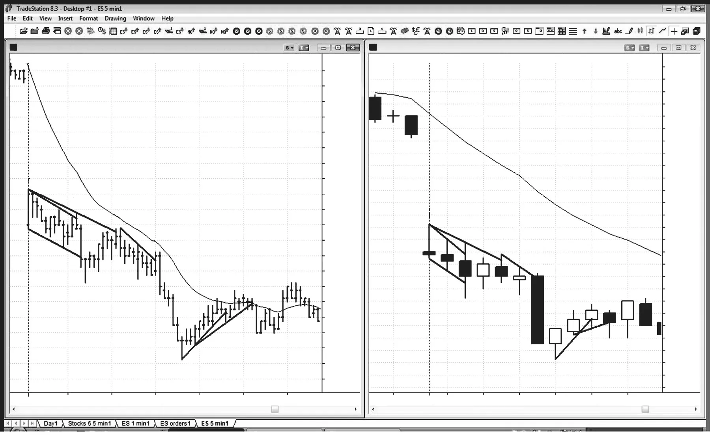
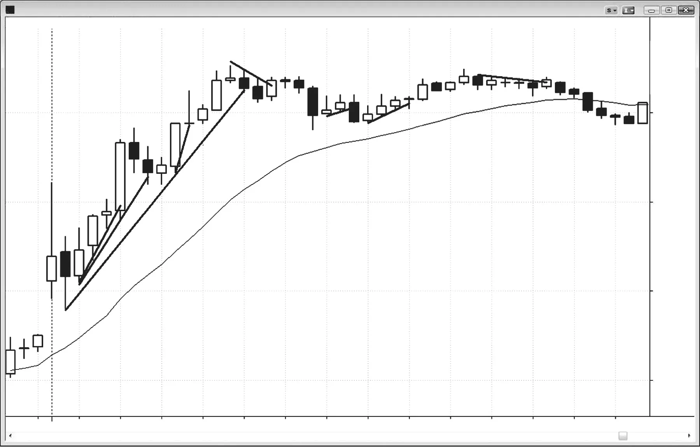
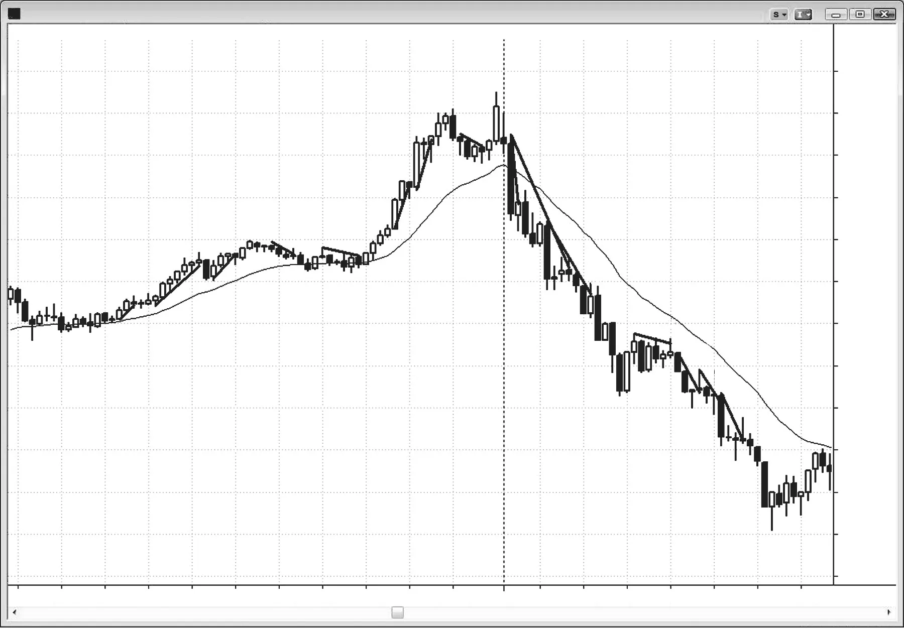
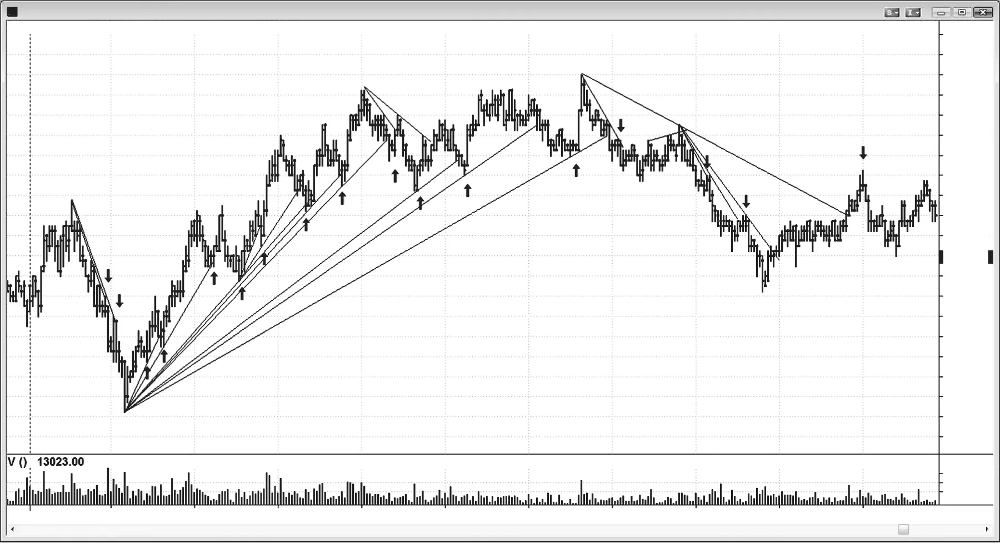
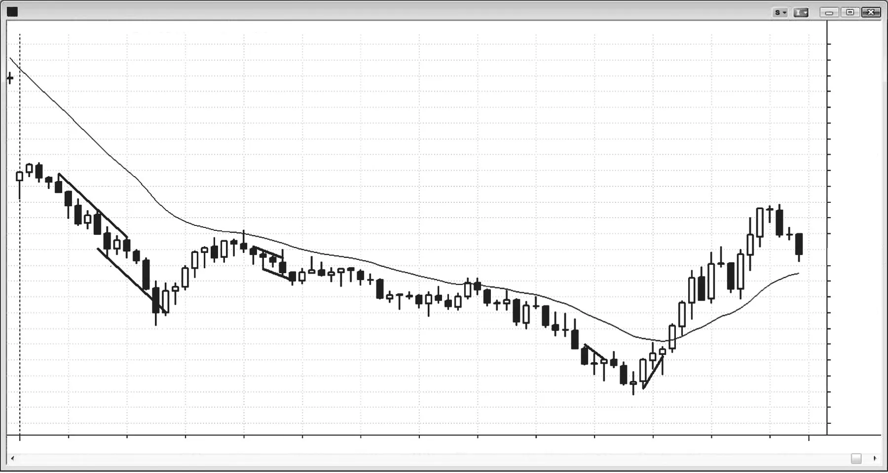
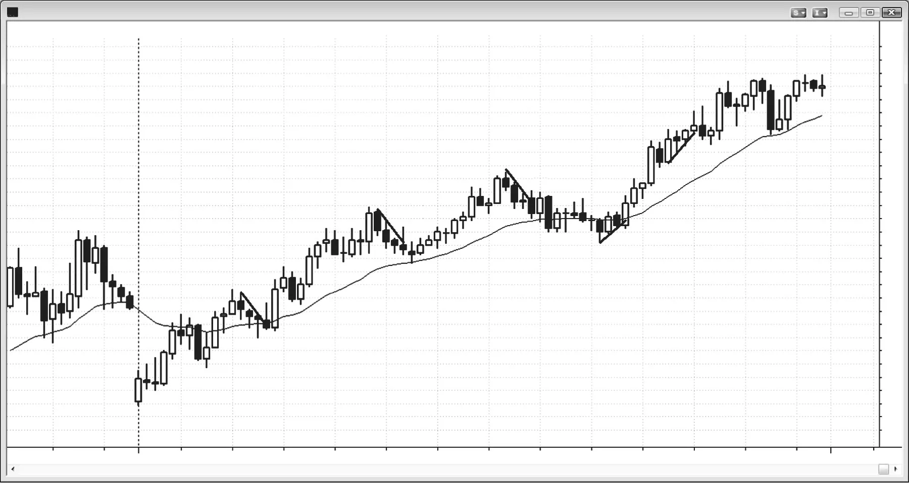

### 第16章 微型通道

<!-- English: CHAPTER 16 Micro Channels -->
<!-- Source PDF pages 281–300 -->

<!-- PDF page 281 -->

微型通道
微型趋势线是任意时间框架上的趋势线，通常跨越约2根至约10根K线，其中大多数K线触及或靠近该趋势线，且K线通常相对较小。通常也可以沿K线的另一端画出趋势通道线，结果就形成非常紧的通道，称为微型通道。与常见有回撤的普通通道不同，微型通道推进时几乎没有回撤，或只有罕见的小回撤，因此是一种极其紧的通道。
K线越多、K线越强（例如实体较大且方向与微型通道一致的趋势K线）、影线越小，微型通道就越强，第一次回撤就越有可能无法反转趋势。微型通道可以持续10根或更多K线；有时它会运行约10根K线，出现一次小回撤，然后再恢复约10根K线。你把整个通道看成一条大的微型通道（微型通道是紧通道的一种）、两条被小回撤隔开的连续微型通道，还是一条大的紧通道，其实并不重要，因为交易方式相同。趋势非常强，交易者会把反转尝试看成会失败并变成回撤，并预期趋势会延续。
十年前，交易者把微型通道视为程序化交易的迹象。如今，由于绝大多数交易由计算机完成，再说微型通道是程序化交易的迹象已经没有额外意义，因为图表上每一根K线都是程序化交易的结果。微型通道只是某一种特定类型的程序化交易，而且很可能是多家公司同时运行程序的结果。一家或多家公司会启动它，但一旦动能形成，动能程序就会检测到它，并开始同方向交易，从而增强趋势的力量。一旦

<!-- PDF page 282 -->

趋势开始突破阻力位，突破程序就会开始交易。有些会顺趋势方向交易，有些会开始逆势分批加仓，或从更低价位买入的多头中分批减仓。
最终，某一根K线会穿透趋势线或趋势通道线，形成突破。多头与空头微型通道都可以出现在多头或空头趋势中，也可以出现在震荡区间中。它们出现的市场环境决定了如何交易。多头与空头通道都可以向上或向下突破。与所有突破一样，随后可能发生三种情况：突破成功并跟随同方向更多交易；突破失败并变成小的高潮反转；或者市场只是横盘，形态演化成震荡区间。
与任何突破一样，交易者要么顺突破方向交易、预期有跟随，要么反向交易——若他们预期突破会失败。突破、失败突破与突破回撤密切相关，并在第2册讨论。作为指引，交易者会比较突破的强度与反转尝试的强度。若一方明显更强，市场很可能朝该方向运行。若两者同样强，交易者需要等待更多K线，再判断市场接下来可能去哪里。
当空头微型通道形成于多头趋势中时，它通常是多头旗形，或是多头旗形的最后一段；交易者会寻找信号K线，然后在其高点上方挂止损买单，以在空头微型通道与多头旗形突破时入场。当多头微型通道形成于空头趋势中时，它通常是空头旗形或空头旗形的最后一段，交易者会在任何信号K线下方做空。
如果不是在多头旗形中形成空头微型通道，而是在多头趋势中形成上升的微型通道（多头微型通道），那么第一次向下突破（第一次回撤）通常不会走远，并会被积极买入。多头微型通道中的K线越多，空头突破就越不可能反转多头趋势。例如，若多头趋势中有五根K线的多头微型通道，在该第五根K线的低点及下方，买盘几乎肯定远多于卖盘。若市场跌破该第五根K线，该K线就构成对多头通道的空头突破。然而，它不太可能导致超过一两根K线的卖压，因为多头会急于买入来自强劲微型通道多头趋势的第一次回撤。记住，许多交易者已经观察这波上涨五根K线了，一直在等待任何回撤买入。他们会急于在第五根K线下方买入，并在回撤K线高点上方买入，而回撤K线就是失败突破买入信号K线（High 1 买入形态）。若市场触发做多，但在一两根K线内形成空头反转K线，这就设置了微型双顶卖出信号。也可以把它看成对多头微型通道下方突破的回撤，即使其高点高于微型通道中最高的那根K线。那它就只是更高高点反转，是主要趋势反转的微型版本（反转在第3册讨论）。

<!-- PDF page 283 -->

微型通道
重要的是要认识到，交易者不必等待回撤才做多。许多有经验的交易者在多头趋势中多头微型通道的第二或第三根K线之后就理解正在发生什么。他们认为市场处于非常强劲买入程序的早期阶段，动能买入程序也在积极买入。这些交易者会试图复制计算机的做法，买入每一根多头收盘，并在每根K线收盘价下方1或2个tick挂限价买单，以及在前一根K线低点上方1或2个tick挂限价买单。若微型通道中最大的回撤是5个tick，他们会挂限价单买入任何3或4个tick的回撤。他们预期第一次有K线跌破前一根K线低点时会吸引更多买盘，因此他们知道尽管有回撤，最近一笔买入也很可能获利。由于他们一路上涨都在赚钱，当回撤最终到来时，他们并不担心最后一笔入场只能保本出场或小亏出场。
与任何通道一样，多头微型通道可以形成于震荡区间中，或形成于多头或空头趋势中。当它处于多头趋势中时，更高价格更确定，交易者应在前一根K线的中部或底部附近寻找买入。当微型通道特别紧时，它在更高时间框架图上可以是一根尖峰；之后可能跟随更宽的通道，并可能达到基于紧微型通道高度的等幅运动目标。当多头微型通道处于空头趋势中时，它是空头旗形，交易者应寻找向下突破做空，或寻找向下突破后的回撤做空。当多头微型通道形成于空头趋势中可能的低点之后时，它可以成为空头趋势中的最后旗形，并向上而不是向下突破，该突破可以成为通向多头趋势的尖峰。当发生多头突破时，通常跟随在失败的 Low 1、2 或 3 之后。
微型通道是倾斜的窄幅震荡区间，因此具有很强的磁力吸引，往往阻止突破走得很远。它也常常足够紧，有时会像尖峰一样起作用，并可能跟随更宽的通道，形成尖峰与通道趋势。当从微型通道发生突破时，通常只持续一两根K线，且主要是由于获利了结。例如，若有多头微型通道（向上倾斜的微型通道），且某根K线跌破前一根K线的低点，那就是对微型通道的向下突破。这主要是由于多头获利了结，尽管也有一些空头在做空。在一两根K线内，其他买家进场，一些空头离场，市场通常会交易到前一根K线高点之上。有些交易者会把这看成微型通道的失败突破，并在市场升破前一根K线高点时买入。对他们来说，这是 High 1 买入形态。另一些交易者会假定趋势正在向下反转；他们会等待市场在接下来的几根K线内形成更高高点或更低高点的突破回撤，然后在前一根K线低点下方做空。整体背景可以提示哪种结果更可能。例如，若市场处于强空头趋势，而多头微型通道只是回撤，则概率偏向微型通道下方的突破会跟随更多卖压。若市场交易到

<!-- PDF page 284 -->

突破K线之上，空头会挂止损单在前一根K线低点下方做空。相反，若多头微型通道是作为多头市场中震荡区间的突破而形成的，则概率偏向微型通道下方的突破会变成多头趋势中的回撤，多头会在前一根K线高点上方1个tick挂买单。
趋势线的突破会设置顺势入场。例如，若有多头微型通道且市场始终做多，随后有一根K线的低点低于微型多头趋势线，则买入该K线高点可以是可靠交易。这是微小但很强的单K线多头旗形（High 1 买入形态），也是失败突破买入信号。它在更小时间框架图上可能是两段式调整；然而，最好不要去看，因为你会发现短时间内有太多信息要处理，很可能会管理失误或不做这笔交易。
若多头微型通道处于震荡区间中或处于空头趋势中，而不是强多头趋势中，在失败空头突破上方买入之前你还有其他因素要考虑。若通道位于震荡区间顶部，通常最好不要买入失败突破，而是等待观察向上反转是否停顿并变成突破的更高高点回撤。若它只上涨一两根K线，然后形成空头反转K线，当它靠近震荡区间顶部时，这可以是可靠的做空形态（微型双顶，在第3册讨论）。若多头微型通道是刚好在均线下方的空头旗形，你应只寻找做空，因为概率是空头的做空会压过多头对回撤的买入。等待通道下方的突破，然后等待失败以及再向上推一次。若该向上反转在一两根K线内于均线处形成空头反转K线，这通常是可靠的突破回撤做空形态（Low 2）。市场从多头微型通道下侧突破，然后回撤到一个小的更高高点。最终，若它再次向下反转，就设置了对已成为空头旗形的向下突破。
与任何多头通道下方的突破一样，可能有回撤，然后卖压恢复。该回撤可以是更低高点或更高高点（更高高点意味着该K线高点升破最近摆动高点的高点，而最近摆动高点很可能是多头通道中最高的那根K线）。因为大多数反转趋势的尝试都会失败，概率偏向空头突破失败，并只变成多头趋势中的回撤，随后多头趋势恢复。交易者应在突破K线高点上方1个tick挂单做多，以防空头突破失败且多头趋势恢复。
然而，他们必须意识到自己的多头可能是多头陷阱，把他们困在一笔亏损的多头交易中。记住，尽管大多数反转趋势的尝试会失败，有些会成功。突破向下不一定失败，市场可能只是短暂地从空头突破回撤，并在卖压恢复之前形成小的更高高点或

<!-- PDF page 285 -->

微型通道
更低高点。这可能跟随成功的趋势反转，进入空头段或空头趋势。因此，若整体价格行为使反转看起来合适，交易者必须准备好在自己多头入场K线下方反手做空。在这种情况下，这是突破回撤做空形态。每当突破失败时，该失败会设置原趋势方向的交易。若那也失败，它就变成原空头突破的突破回撤（相反的失败创造出突破回撤），以及第二次试图把趋势反转向下。
若突破回撤做空被触发（该K线走到前一根K线——通常是多头突破K线——的低点下方1个tick），看最近几根K线实体的大小。若这些K线是多头或空头趋势K线，则这第二次失败很有可能成为成功的第二次入场做空。记住，第一次失败是空头在失败的向下突破中亏损，被困在空头交易之外。第二次失败是多头被困进他们的亏损交易，该交易由通道下方失败的空头突破所设置。若市场现在再次向下转，你刚刚让空头被困在外、多头被困在内。一般而言，若双方都被困入或困出，下一个形态成功的概率会提高。若K线更像十字星，则市场很可能进入震荡区间，但概率仍偏向向下突破。若你不确定，那就等待，因为很可能大多数交易者也不确定，通常会跟随震荡区间。
尽管绝大多数微型趋势线突破在1分钟图上是一段式和两段式回撤，你应避免依据该图交易，因为你很可能会亏钱。大多数交易者无法接受所有信号，总是挑到太多亏损交易、不够多的赢家。最佳交易往往设置得很快、触发也很快，因此容易错过。许多亏损交易往往设置缓慢，给交易者充足时间入场，把他们困在错误方向。
那个多头微型通道也可能向上、在趋势通道线之上突破，试图形成更陡的多头趋势。若它失败并出现强空头反转K线，这个买盘高潮就是潜在的做空形态。
当微型趋势线延伸约10根或更多K线时，很快会出现可交易反转的概率大幅上升。这类趋势不可持续，因此是一种高潮，通常最终会跟随回撤或反转。在这种高潮行为之后，要准备好接受突破回撤入场。这是第二次试图反转趋势，原来的趋势线突破是第一次。
微型趋势线突破不仅在微型趋势线是微型通道一部分时重要，在任何强趋势进行中时也很重要。若有强空头趋势，空头趋势K线很大、连续K线之间重叠很少，且四五根K线没有回撤K线，你很可能

<!-- PDF page 286 -->

急于做空。寻找任何空头微型趋势线，然后在任何戳破任何空头微型趋势线上方的K线低点下方卖出。任何对它的戳破都是失败突破做空入场的形态。在突破空头微型趋势线上方的那根K线下方1个tick入场（Low 1 做空形态）。
小而陡的趋势线，即使只用连续两根K线画出，也常常为顺势交易提供形态。若趋势很陡，有时小的回撤K线或停顿K线可以穿透极小的微型趋势线。当它这样做时，它可以成为顺势入场的信号K线。有些穿透在Emini中小于1个tick，但仍然有效。
当有趋势然后出现回撤时，常见在回撤中看到微型趋势线。例如，在多头趋势的回撤中，若有持续约3至10根K线的空头微型趋势，然后出现对该空头微型趋势线的向上突破，理论上这会在失败突破上设置做空。由于这发生在多头趋势期间，且几乎总是发生在均线上方或附近，你不应做空这种形态。你会发现自己在多头趋势中、靠近上升均线的多头旗形底部持有空头，这是概率很低的交易。由于这个做空很可能失败，你应预期这一点并准备买入该失败，恰好在被困空头离场的位置进场。你的多头将是突破回撤买入，因为市场突破空头微型趋势线上方，然后回撤到小的更低低点或更高低点，随后市场恢复突破方向，这也是当日主要趋势的方向。
必须记住，微型趋势线应只用于寻找顺势形态。然而，一旦趋势已经反转，例如在多头趋势线突破之后、再从更高高点向下反转之后，你应寻找微型趋势线做空形态，即使它们位于均线处或刚好在均线上方。
与任何图表形态一样，微型通道在更小与更高时间框架图上的外观不同。即使微型通道或任何其他类型紧通道中的趋势K线通常并不大，且相邻K线通常有大量重叠，该趋势仍然足够强，在更高时间框架图上可以是一根大趋势K线或一系列趋势K线。这意味着它常常起尖峰的作用，并常常跟随更宽的通道，像任何其他尖峰与通道趋势一样。此外，即使微型通道中没有回撤，若你看足够小的时间框架图，也会有许多回撤。

<!-- PDF page 287 -->

图 16.1

微型通道
图 16.1
微型趋势线
小趋势线可以在一天中产生许多剥头皮交易，尤其是在1分钟图上，而1分钟图很少值得交易。在图16.1中，左侧是1分钟Emini图，数字对应右侧5分钟图上的同一批K线。两者都显示，微小趋势线的失败突破可以产生有利可图的逆势交易。1分钟图上还有其他未显示的交易，因为本图的目的只是展示5分钟微型趋势线如何对应1分钟图上更明显、更长的趋势线，因此若你能读5分钟图，就不需要额外看1分钟图来挂单。其中许多交易在1分钟图上本可以是有利可图的剥头皮。
注意，5分钟图上若干微型趋势线突破很容易被忽略，且幅度小于1个tick。例如，K线3、5、6和7是5分钟图上的失败微型趋势线突破，对大多数交易者不可见，但K线5处的那次特别重要，并导致了不错的做空剥头皮。它是第二次试图突破空头趋势线上方的失败尝试（K线3是第一次）。

<!-- PDF page 288 -->

图 16.1
K线7处多头微型通道下方的失败突破是风险较高的做多，充其量只是剥头皮。由于它是回撤至均线的空头旗形，更好的是预期向上的移动会停顿并变成突破回撤做空形态，而这里确实如此。
价格行为交易即使在最微小的层面也有效。注意1分钟图上的K线8是更高高点突破回测（它回测了形成空头趋势低点的那根K线的高点）做多形态，尽管市场在入场后两根K线回落测试K线8信号K线低点，但信号K线下方的保护性止损不会被打到。还要注意，在这段1分钟图片段中还有一个更小的主要反转。有一个微小的多头趋势，由图底部向上的多头微型趋势线标示，然后在K线7处突破趋势线，再有一个对微小多头趋势极端的更高高点测试。由于形态如此之小，向下到K线8的趋势反转只是剥头皮，正如预期。
在5分钟图上，K线8没有设置做多。为什么？因为它是空头趋势中的回撤。你不应在空头趋势日回撤的顶部买入。相反，一旦你看到微型趋势线买入触发，就准备好在其失败时做空，恰好在被困多头被迫带损离场的位置入场。

<!-- PDF page 289 -->

图 16.2

微型通道
图 16.2
微型趋势线的失败突破
即使只用陡趋势中连续两根或三根K线画出的趋势线，当有小突破并立即反转时，也可以设置顺势入场。每一次新的突破成为更长、更平缓趋势线中的第二个点，直到最终反方向的趋势线变得更重要，而在那一点趋势已经反转。
在图16.2中，K线1跌破三K线趋势线并向上反转，在前一根K线上方1个tick处创造做多入场。
K线2跌破六K线趋势线。交易者会在其高点上方挂止损买单。当未成交时，他们会把止损买单移到下一根K线的高点，并会在K线3成交。这是High 1 买入入场，多头趋势中多头微型通道的大多数空头突破会失败并变成High 1 买入形态。由于微型通道通常正在突破某物，例如此前高点——如此处它升破当日第一根K线——High 1 通常也是突破回撤买入形态。顺便说，K线2之前那根是基于微型趋势通道线（未显示）失败突破的可能做空形态，该通道线是通向K线1的三K线微型趋势线的平行线。向上动能太强，不宜在没有第二次入场时做空，但这说明了微型趋势通道线如何可以设置逆势交易。

<!-- PDF page 290 -->

图 16.2
K线4是小的内包K线，延伸到两K线趋势线下方（穿透未显示）。买入是在小内包K线高点上方1个tick的止损单上。
K线5突破了当日的主要趋势线（任何持续约一小时左右的趋势线都更重要），因此交易者会认为两段式回撤更可能。在K线5之后那根K线突破空头趋势线上方后，会在K线6更低高点触发做空。当K线像K线5之后那些一样是小十字星时，通常最好等待更大的趋势K线再做更多交易，但这些趋势线反转仍然导致了Amazon（AMZN）中30至50美分的有利可图剥头皮。由于K线5是相当紧的多头通道的第一次突破，最好不要做空它，而是等待突破回撤再做空。
K线6是合理的更低高点突破回撤做空入场，用于朝均线方向的剥头皮。这不是好的趋势反转交易，因为尚未出现对均线的测试，随后再测试多头趋势高点。
K线6是多头趋势中的微型趋势线做空，当它靠近均线发生时是糟糕的交易。然而在这里，向下到均线有充足空间；此外，它跟随楔形顶部，因此很可能成为向下两段式调整的一部分。
与常见有回撤的普通通道不同，在微型通道中缺乏回撤是其定义特征之一。例如，在K线8前一根开始的多头微型通道中，第一段以小的K线9回撤结束。有些交易者把接下来四根K线看成同一通道的一部分，K线9是回撤；另一些交易者把K线9看成第二条微型通道的起点。这其实并不重要，因为到K线10的横盘移动突破了两者下方。
本图更深入讨论
市场在图16.2中跳空高开，因此突破了昨日收盘，且第一根K线是多头趋势K线。实体相当强，下方有影线，两者都显示买盘压力。昨日收盘带有一些多头实体，再次显示多头的力量，因此这根K线并不是基于可能失败突破形态的强做空信号K线。第二根K线有空头实体，跌破第一根K线低点，是合理的突破回撤做多形态，对应可能的开盘即趋势多头日。有四根多头趋势K线，形成向上尖峰，但最后一根区间很大，可能显示某种衰竭。这导致了第一次回撤做多形态，K线3是强入场K线。这也是对开盘高点上方突破的突破回撤做多。由于当日第一根K线异常大，它可能并确实导致了大约等幅运动向上。

<!-- PDF page 291 -->

图 16.3

微型通道
图 16.3
强趋势中的微型趋势线
强趋势中的小趋势线，即使用相邻K线画出，也常常有失败突破，设置良好的顺势入场。其中许多是1分钟图上的两段式回撤形态（ABC调整），但当你在5分钟图上看到假突破时，不需要看1分钟图。
交易时，你不必经常在图上真正画出趋势线，因为大多数趋势不用画出的线也可见。
在图16.3这张5分钟AAPL图上，有许多基于微型趋势线失败突破的良好顺势入场。当趋势很陡时，你应只寻找顺势交易，不应交易小反转。例如，即使K线3突破空头微型趋势线上方，该空头趋势实际上是强多头趋势中的多头旗形，市场已在均线上方超过20根K线。你应只寻找买入而不是做空，尤其是不要刚好在均线上方做空。

<!-- PDF page 292 -->

图 16.3
K线2是强多头趋势中对多头微型通道的向下突破，应预期它失败。这设置了可靠的High 1 买入形态。
K线10和12是对陡峭紧通道的第一次向上突破，因此不是好的做多入场。尽管K线12是向下途中第二次向上突破，但从K线10向下的移动持续了几根K线且很陡；因此它创造了新的小微型通道，K线12是突破新通道的第一次尝试（K线10和12都是Low 1 卖出信号K线）。
K线9是空头反转K线，也是小三角形向下突破的信号K线。三角形是大体横盘的震荡区间，在一个或两个方向上有三次或更多次推动。K线9之前那根是三次小向下推动中的第三次，是震荡区间变成三角形的点。由于市场从当日第一根K线起处于如此紧的空头通道中，认为三角形会是可靠买入形态是不合理的。事实上，大多数交易者尚未把该形态看成三角形，并继续寻找做空。一旦K线9空头反转K线形成第三次向上推动，交易者就确信该形态是空头趋势中的三角形，以及可靠的做空形态。即使K线9有多头实体，它是小十字星，因此没有多少买盘压力。然而，由于它收在中点下方，它仍是反转K线。若K线9有空头实体，信号会更强。
在K线8之后三根结束的紧空头通道内有几条更小的微型通道。交易者把紧通道看成带有几次小回撤的大微型通道、三条连续微型通道，还是大的紧空头通道，并不重要，因为他会以同样方式交易市场。向下移动非常强，在更高时间框架图上很可能是强尖峰。聪明的交易者在寻找任何回撤做空，预期任何回撤只是空头的获利了结，会跟随更低价格而不是趋势反转。在像这样的强趋势中，交易者会在前一根K线高点上方做空，并在任何回撤的低点下方做空，例如在K线9、10和12下方。
许多只有小回撤但带来大利润的多头趋势，也有低概率做空形态。例如，K线10和12都是十字星，处于带影线的其他K线区域，因此是双向交易的迹象。当市场开始出现双向交易迹象时，它往往演化成震荡区间，这意味着在其低点附近做空并希望突破正在形成的震荡区间是低概率做空。成功波段向下的概率可能只有40%。然而，由于回报是风险的数倍，交易者公式仍然非常正。偏好只做高概率交易的交易者不会在K线10或12下方做空，而会等待高概率反转买入（例如当日低点一系列卖盘高潮之后的多头反转K线；反转在第3册讨论），或等待回撤做空（例如K线9三角形），或等待强空头尖峰做空（例如

<!-- PDF page 293 -->

图 16.3
微型通道
K线11收盘，因为它是楔形底部下方的突破；K线11之前那根的低点与K线12的高点形成度量缺口，在第2册讨论）。
本图更深入讨论
在图16.3中，昨日收盘是对长期多头趋势后大体水平的多头旗形的强多头趋势K线突破。这是最后旗形做空形态，并在今日第一根K线触发。交易者可以在多头趋势K线下方做空，或在有小空头实体的第一根K线下方做空，或在最后旗形底部下方做空。入场K线是大空头尖峰，随后是紧且因此非常强的空头通道。该日是开盘即趋势的空头趋势日。
微型通道的第一次反转尝试是由于获利了结。例如，当K线2之前那根空头K线跌破多头微型通道时，主要是由于多头获利了结。其他多头急于做多，因为这处于多头趋势中，并在那根空头趋势K线跌破前一根K线低点时用限价单买入，另一些则在下方1至数个tick买入。有些在空头K线收盘买入，预期它会变成失败突破。限价单入场在第2册讨论。偏好止损入场的交易者在K线2两K线反转上方买入，那是High 1 与突破回撤买入形态。

<!-- PDF page 294 -->

图 16.4

图 16.4
微型趋势线只是更小时间框架上的趋势线
在5分钟图上看似微型趋势线形态的东西，在1分钟图上通常是3至10根K线的回撤（见图16.4）。1分钟Emini全天在趋势线测试以及趋势通道超调与反转上提供入场。许多穿透小于1个tick，但仍然有意义。所示的线只是本图上可以画出的一部分；还有许多其他的。仅仅因为你在收盘后回看1分钟图时看起来容易，并不意味着实时交易该图容易赚钱。事实并非如此。总是最好的形态看起来不好，但设置和触发太快来不及做，而亏损交易给你充足时间入场。结果是你做了太多坏交易，没有足够好交易来抵消亏损，当天亏钱。
图16.4中每一条相继的趋势线都变得更平缓，直到反方向的趋势线主导价格行为。
微型通道在某个更高时间框架图上通常是一根趋势K线（尖峰），在更小时间框架图上则是带有许多回撤的通道。

<!-- PDF page 295 -->

图 16.5

微型通道
图 16.5
道指下跌700点时的微型趋势线
在图16.5所绘的这一天，Emini有许多微型趋势线与通道交易（只显示四个），这是极不寻常的一天，道指下跌超过700点，但收盘前回升收复一半跌幅。
K线5是微型趋势通道超调，成为两K线反转的第一根。通道线是K线1至4微型趋势线的平行线。你也可以用低点画出通道线（K线1之后那根的低点与K线3的低点）。有很好的ii形态，两根K线都有多头收盘，在逆势交易强空头趋势时这总是可取的。K线5之后那根与K线5形成两K线反转。
当微型通道开始有五至十根K线，像从开盘到K线5结束的通道那样，你可以同样准确地简单地称它为通道。术语并不重要，因为微型通道只是通道，把它与更大通道区分开的唯一原因是微型通道常常在趋势中设置可靠的顺势剥头皮。
K线7和9是微型趋势线失败突破做空剥头皮，两者都很快跟随买入剥头皮，因为失败又失败，创造出突破回撤买入形态（即使两者都是更低低点）。K线7是微型通道的第一次向上突破，因此不是好的做多形态。相反，它变成向下外包入场做空。你也可以等待K线7收盘，以确定

<!-- PDF page 296 -->

图 16.5
它有空头实体，然后在K线7向下外包K线下方突破做空剥头皮。
K线11是经典陷阱，让你离开强劲上涨。若你离场了，需要在K线11微型趋势线假突破上方的High 1 再次买入。
K线9是对空头微型通道的向上突破，K线10是更低低点突破回撤，因此交易者在想是否更可能有更大上涨。K线10有小空头实体，下一根是强多头趋势K线。再下一根也有多头实体。买盘压力在积聚，这使那第三根多头K线成为弱的Low 1 做空形态。交易者预期它会失败，并在其低点及下方买入。他们不知道多头趋势会跟随，但相信市场会至少上涨到足以完成一笔做多剥头皮。在K线11之后一两根K线内，交易者把市场看成始终做多，并波段持有剩余多头，甚至加仓。
今天许多K线区间超过6至8点。明智的做法是把仓位减到一半或更少，把止损增至4点，止盈目标增至2点。除此之外，这只是又一个表现良好的价格行为日。
本图更深入讨论
该日在图16.5中以大跳空低开开盘，但第一根K线是强多头反转K线，因此基于昨日收盘下方失败突破设置了开盘即趋势买入信号。第三根是强空头K线，因此是向下尖峰，但市场可能只是在形成更高低点，然后上涨恢复。相反，市场交易到更高低点上方，然后在向下外包K线（K线1）中向下反转，触发突破回撤做空入场。向下跳空是突破，失败突破与试图上涨失败，变成突破回撤，用于空头突破的恢复。当该K线向下外包时，交易者反手做空。其他交易者在向下外包K线低点下方做空，还有一些在多头反转K线（当日第一根）低点下方做空。随着市场在紧通道中向下交易到K线5，该日变成大的开盘即趋势空头日。通道如此之紧，以至于实际上只是尖峰。市场回撤至均线，然后空头通道展开向下到K线10当日低点。
大多数失败的微型趋势线交易是空头趋势中的Low 1 入场与多头趋势中的High 1 入场。K线9是Low 1 做空形态。K线11是High 1 买入形态；它是新多头段中的第一个更高低点，而在可能趋势反转进入多头之后的更高低点是良好的买入形态。K线11之前的Low 1 信号K线是十字星，且跟随两根多头趋势K线。第一根是强多头趋势K线，可能已把始终持仓方向转为做多（它与K线9之后那根形成两K线反转，在K线9

<!-- PDF page 297 -->

图 16.5
微型通道
单K线最后旗形之后）。积极的多头会用限价单在Low 1 信号K线低点买入，预期做空会失败。
具有更高高点或更低低点的突破回撤交易是小的最后旗形反转。例如，K线9是对微型趋势线的向上突破，突破失败并卖出到K线10的更低低点。可以把K线10看成对K线9突破的回撤，它回撤到更低低点，突破回撤有时会这样做。由于它向上反转，K线9变成单K线长度的最后旗形。
向下卖出到K线5处于紧通道中，但它如此之强，以至于在更高时间框架图上必须是向下尖峰。市场随后上涨至均线，那里有20均线缺口K线卖出信号。随后是长通道向下到K线10，完成空头尖峰与通道形态。反转的第一个目标是第一个强买入形态的顶部，即K线5两K线反转。之后，下一个目标是空头通道的起点，即8:30对均线的测试。

<!-- PDF page 298 -->

图 16.6

图 16.6
多头趋势中的微型趋势线
在强多头趋势日，应避免做空，包括微型趋势线做空，尤其是在均线附近或均线上方。在图16.6中，在K线1、2和3做空会是在均线区域或均线上方逆多头趋势卖出。是的，向下倾斜的微型趋势线表明有小的空头趋势，但每一个都发生在非常强的多头趋势的回撤中，你应只寻找买入。这些是多头旗形，且它们在均线上方，这是多头力量的迹象。尚未出现对重要多头趋势线的突破，随后从更高高点或更低高点测试多头高点再向下反转。空头微型趋势线在多头趋势日上的唯一价值，是提醒你在微型趋势线做空失败时买入将形成的突破回撤。换言之，不要在K线1、2和3做空，而是在那些空头本会平仓的位置做多。失败会形成小的更低低点（如K线2和3失败微型趋势线突破之后）或小的更高低点（如K线1失败突破上），并且只会变成对空头微型趋势线多头突破中的回撤（突破回撤做多形态）。
顺势微型趋势线入场是高概率交易，如K线4和5处的做多。

<!-- PDF page 299 -->

图 16.6
微型通道
本图更深入讨论
图16.6显示开盘即趋势多头日，因此应避免做空，包括微型趋势线做空，尤其是在均线附近或均线上方。市场突破到均线下方但立即在失败突破中向上反转。空头试图在均线处把上涨变成突破回撤做空，但上涨有几根强多头实体，这意味着交易者应只在第二次入场时做空。没有第二次入场。卖出很短暂，并变成更高低点。

<!-- PDF page 300: no extractable text (likely figure-only) -->
