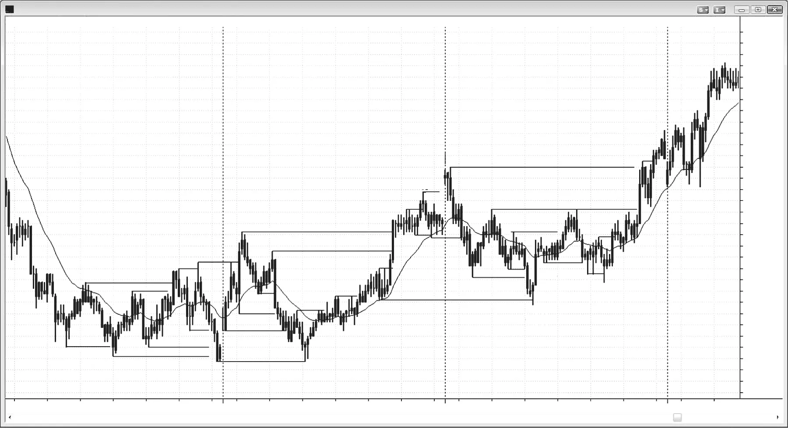
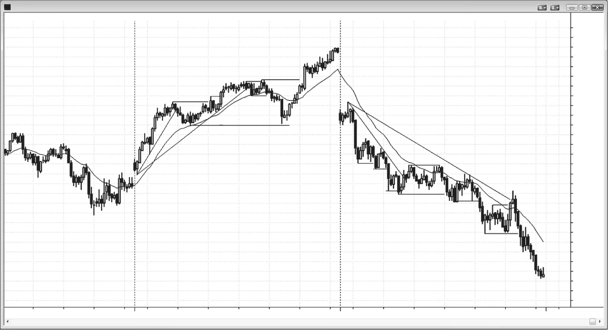

### 第17章　水平线：摆动点与其他关键价格位

<!-- Source PDF pages 301–306 -->
<!-- English title: CHAPTER 17 Horizontal Lines: Swing Points and Other Key Price Levels -->

<!-- PDF page 301 -->

# 第17章  
# 水平线：摆动点与其他关键价格位

多数日子是震荡日，或有大量震荡活动。在这些日子，你会发现穿过摆动高低点的水平线常充当障碍，导致失败突破然后反转。预期摆动高点突破会失败并形成更高高点反转形态，摆动低点突破会失败并形成更低低点反转形态。有时失败再次失败，成为突破回撤形态，市场做出第二次更极端的更高高点或更低低点。对第二次更高高点或更低低点形态做 fade（逆势），成功概率更高，因为它们是第二次尝试反转市场，而第二次信号在震荡日是好形态。

在趋势日，水平线一般只应用于在回撤处入场。例如，若多头趋势日上震荡区间有强向上突破，数根K线后可能回撤到突破位附近。若测试处有多头反转形态，这就是好的突破回撤买入形态。

<!-- PDF page 302 -->

## 图 17.1　突破可设置反转

多数日子不是强趋势日，在这些日子交易者应查看所有先前摆动高低点，看市场是否制造失败突破，从而带来反转入场。第二次信号最好。第二次更高高点或更低低点是震荡日上更极端的点，日中段像磁铁，因此这一进一步极端更可能给出剥头皮利润。例如图 17.1 中，K线 5 是相对 K线 2 的第二次更高高点。

K线 9 是跌破开盘低点后第二次尝试反转向上，并与前一日低点形成双底。

### 对本图的更深入讨论

图 17.1 中 K线 5 也是从 K线 3 低点起的第三次上推。尽管没有楔形外形，三推形态通常表现像楔形，可视为楔形变体。

K线 9 是扩散三角形底部的第七个点（尽管它与昨日低点是双底而非更低低点，已经足够接近），K线 11 是扩散三角形顶部。它也是较小的扩散三角形，K线 10 是第二次上推，大约在第一次后五根。

<!-- PDF page 303 -->

K线 13 是大型双底回撤。标注双底时有多个底可选，K线 3 与 9 可能最好。它也是 High 2 买入形态，因为处于两段大型复杂下跌的底部。由于 K线 9 至 11 形成多头通道（即空头旗形），K线 13 是该空头旗形的失败突破。它也是大型楔形多头旗形，K线 10 前后的小摆动低点是第一次下推，K线 12 是第二次。

K线 15 是双顶空头旗形。它失败了，一根大多头突破K线越过其高点，市场明显更偏多。

K线 17 是相对 K线 14 的第二次更低低点，也是相对 K线 16 的更低低点。它也是与 K线 14、16 构成的楔形多头旗形，以及 K线 11 至 13 多头旗形上方突破后对更高低点的突破回撤。

<!-- PDF page 304 -->

## 图 17.2　不要逆势强趋势

在强趋势日，仅当先有良好趋势线突破与强反转K线时，才考虑在多头趋势中 fade 摆动高点、在空头趋势中 fade 摆动低点。图 17.2 中两天都是强趋势日，极值靠近开盘，随后超过两小时无均线回撤（20 缺口K线回撤形态）。K线 4 是空头反转K线，并是下方突破后小幅反转向上之后、对震荡区间上方突破的向下反转。此外 K线 8 是小型两K线反转的第一根，且有高于 K线 7 的更高低点。然而这些是逆势，且趋势线突破上只有最小逆势动能，这些交易不强，只应剥头皮。若它们让你分心、错过应波段大部分仓位的顺势入场，就不要做。

### 对本图的更深入讨论

图 17.2 中当日开盘突破昨日最后一小时多头通道下方。多头通道应始终视为空头旗形。第一根有空头实体，显示开盘空头有力；但下一根反转向上，试图形成失败突破与开盘即多头趋势日。相反， <!-- PDF page 305 --> 失败突破失败了，导致第四根下方以及开盘区间低点下方的突破回撤做空。有强两K线空头尖峰，随后是漫长空头通道。

K线 1 与 5 形成双底多头旗形，K线 9 是双顶空头旗形的一部分。K线 8 是另一个小型双底多头旗形。记住，双底多头旗形常常只是作为双底的更高低点。

K线 4 是尖峰与通道多头日中通道可能的顶部，市场测试下行至通道起点 K线 1。这设置了双底多头旗形买入。

K线 5 与 13 都是均线缺口K线形态。它们在上午 11:30 之后，此时常有强逆势运动，把交易者困出趋势、困入错误方向。这设置了可靠的顺势交易，通常导致新极值，并常持续到收盘。

<!-- PDF page 306: no extractable text (likely figure-only) -->
