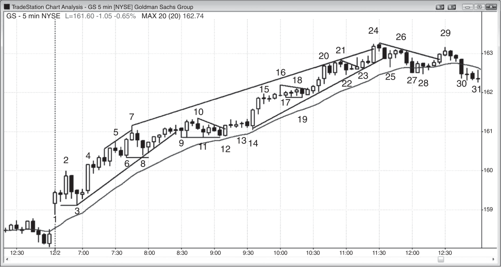

### 第18章 如何交易趋势的示例

<!-- CHAPTER 18 Example of How to Trade a Trend -->

<!-- Source PDF pages 321–338 -->

<!-- PDF page 321 -->

第 18 章
如何交易趋势的示例当市场处于趋势中时，交易者应寻找任何理由入场。趋势本身的存在就足以至少以市价建立一小仓。以下是一些使用止损入场单的合理方法：

- 在多头趋势中，买入回撤到移动平均线的 High 2。
- 在空头趋势中，卖出回撤到移动平均线的 Low 2。
- 在多头趋势中，买入楔形多头旗形回撤。
- 在空头趋势中，卖出楔形空头旗形回撤。
- 在多头趋势中，买入多头旗形突破后的突破回撤。
- 在空头趋势中，卖出空头旗形突破后的突破回撤。
- 在强多头尖峰中的多头趋势里买入 High 1 回撤，但不要在买盘高潮之后。
- 在强空头尖峰中的空头趋势里卖出 Low 1 回撤，但不要在卖盘高潮之后。
- 当多头趋势非常强时，在先前摆动高点上方用止损单买入。
- 当空头趋势非常强时，在先前摆动低点下方用止损单卖出。

用限价单入场需要更多读图经验，因为交易者是在与交易方向相反的市场中入场。然而，有经验的交易者可以可靠地用限价单或市价单配合这些潜在形态：

- 在强多头突破中的多头尖峰里市价买入，在尖峰中每一根多头趋势 K 线收盘买入，或用限价单在前一根 K 线低点处或下方买入

<!-- PDF page 322 -->

（在尖峰中入场需要更宽的止损，且尖峰发生得很快，因此这种组合对许多交易者来说很难）。
- 在强空头突破中的空头尖峰里市价卖出，在尖峰中每一根空头趋势 K 线收盘卖出，或用限价单在前一根 K 线高点处或上方卖出（在尖峰中入场对许多交易者来说很难）。
- 买入多头尖峰中第一根空头 K 线的收盘。
- 卖出空头尖峰中第一根多头 K 线的收盘。
- 在多头趋势中，在多头趋势线处或先前摆动低点处买入（潜在的双底多头旗形）。
- 在空头趋势中，在空头趋势线处或先前摆动高点处卖出（潜在的双顶空头旗形）。
- 在强劲向上反转之后的可能新多头趋势中，或在震荡区间底部，用限价单在 Low 1 或 Low 2 弱势信号 K 线处或下方买入。
- 在强劲向下反转之后的可能新空头趋势中，或在震荡区间顶部，用限价单在 High 1 或 High 2 弱势信号 K 线处或上方做空。
- 在移动平均线处安静的多头旗形中，用限价单在前一根 K 线处或下方买入。
- 在移动平均线处安静的空头旗形中，用限价单在前一根 K 线处或上方做空。
- 在突破多头旗形上方的多头 K 线下方买入，预期突破回撤。
- 在跌破空头旗形的空头 K 线上方卖出，预期突破回撤。
- 在多头趋势中试图做波段时，在突破回测处买入或再买入，这是试图扫掉更早多头入场的保本止损。
- 在空头趋势中试图做波段时，在突破回测处卖出或再卖出，这是试图触及更早空头入场的保本止损。
- 在多头趋势中按距高点固定 tick 数买入。例如，当 Emini 平均日波幅约为 12 点时，买入多头趋势中两、三或四个点的回撤。此外，若头一两个小时最大回撤是 10 个 tick，买入大约八到十二个 tick 的回撤。
- 在空头趋势中按距低点固定 tick 数卖出。例如，当 GS 平均日波幅约为 2.00 美元时，卖出 50 美分的空头反弹。若头一两个小时最大回撤是 60 美分，卖出大约 50 到 70 美分的回撤。
- 在市场逆向运动时沿趋势方向分批加仓。若你分批加仓，事先规划好每笔订单的规模，以使总风险与典型交易相同。很容易发现自己仓位过大、保护性止损过远，所以要非常小心。

<!-- PDF page 323 -->

如何交易趋势的示例

- 在 20 根或更多 K 线未回撤到移动平均线的多头趋势中，用限价单在移动平均线处买入，并在更低处分批加仓。例如，若 Emini 有强多头趋势、市场已在移动平均线上方 20 根或更多 K 线，用限价单在移动平均线上方一个 tick 买入。再在低一、二、或许三个点处买入。若分批加仓，考虑在第一笔入场价退出全部仓位；但若多头趋势很强，则寻找在测试高点时离场。
- 在 20 根或更多 K 线未回撤到移动平均线的空头趋势中，用限价单在移动平均线处卖出，并在更高处分批加仓。例如，若 Emini 有强空头趋势、市场已在移动平均线下方 20 根或更多 K 线，用限价单在移动平均线下方一个 tick 卖出。再在高一、二、或许三个点处卖出。若分批加仓，考虑在第一笔入场价退出全部仓位；但若空头趋势很强，则寻找在测试低点时离场。
- 在强多头趋势中，在第一根收盘在移动平均线下方的空头趋势 K 线收盘买入。
- 在强空头趋势中，在第一根收盘在移动平均线上方的多头趋势 K 线收盘卖出。
- 在强多头趋势中，回撤是小型空头趋势。多头会预期这个小型空头趋势中对先前摆动低点的向下突破会失败，并在那里用限价单买入。
- 在强空头趋势中，回撤是小型多头趋势。空头会预期这个小型多头趋势中对先前摆动高点的向上突破会失败，并在那里用限价单做空。
- 交易者总可以做多、做空或空仓。在趋势中的任何时刻，这三种选择中只有两种与成功交易者相容。若市场处于多头趋势，成功交易者只做多或空仓。若处于空头趋势，他们要么做空要么空仓。极少数交易者有能力持续通过逆势交易赚钱，你应假定自己不属于那一类。不幸的是，大多数起步的交易者会花数年相信自己属于，并月复一月持续亏钱，却不知道为什么。你现在知道答案了。

每一种类型的市场都会做些什么让交易变得困难。市场里充满非常聪明的人，他们想从你的账户拿走钱的劲头，不亚于你想从他们账户拿走钱的劲头，所以永远没有容易的事。这包括在强趋势中获利。当市场以大型趋势 K 线强劲趋势运行时，风险很大，因为止损往往要放在尖峰起点之外。此外，尖峰增长得很快，许多交易者被突破的规模与速度震惊，无法迅速减小仓位 <!-- PDF page 324 --> 并加大止损规模，反而眼看着趋势快速运动，希望出现回撤。一旦趋势进入通道阶段，它看起来总像在反转。例如，在多头趋势中会有许多反转尝试，但几乎所有都很快演化成多头旗形。大多数多头通道会有弱势买入信号 K 线，这些信号会迫使多头在弱势通道顶部买入。这是低概率的做多交易，尽管市场在继续上行。愿意在弱势多头通道顶部附近接受低概率买入形态的波段交易者喜欢这种价格行为，因为他们可以赚到远超所冒风险的倍数，这足以弥补相对较低的成功概率。然而，对大多数交易者来说，在弱势多头通道顶部附近买入低概率形态是困难的。只想做高概率交易的交易者常常坐在一边，看着趋势研磨上行许多根 K 线，因为可能 20 根或更多 K 线都没有高概率入场。结果是他们看到市场在上涨并想做多，却错过了整个趋势。他们只想要高概率交易，例如回撤到移动平均线的 High 2。若他们得不到可接受的回撤，就会继续等待并错过趋势。这是可以接受的，因为交易者应始终待在自己的舒适区内。若他们只舒服于高概率止损入场，那么等待是正确的。通道不会永远持续，他们很快会找到可接受的形态。有经验的交易者在前一根 K 线低点附近及下方用限价单买入，有时会在多头通道期间做一些做空剥头皮。两者都可以是高概率交易，包括做空——若在阻力位有强空头反转 K 线，且有理由认为回撤迫在眉睫。

有这么多赚钱的好方法，为什么大多数交易者还是亏损？因为犯错的方法甚至更多。最常见的之一是交易者以一个计划开始，一旦入场，却按另一个计划管理。例如，若交易者刚在过去两笔做多波段交易中亏损，现在买入第三笔，他可能太害怕再次亏损以至于剥头皮离场，却眼看着交易变成巨大趋势。波段交易者需要这些大赢来弥补亏损，因为波段交易的成功率常常低于 50%。若交易者不持有做波段，他们就得不到所需要的大赢，就会亏钱。剥头皮者身上可能发生相反的事。他们可能做了一笔有利润的剥头皮，但当交易变成巨大趋势、他们在场边观看时感到难过。当他们看到另一次剥头皮时，他们接受它，但一旦到达利润目标，他们决定这笔交易可能变成波段交易，就像上次一样，于是不离场。几分钟后，市场回来，触及止损，他们亏损。这是因为大多数剥头皮是高概率交易，当优势大而明显时，运动通常小而短暂，不是大波段的起点。最好的 <!-- PDF page 325 --> 如何交易趋势的示例赚钱方式是有稳健的策略，然后坚持计划。对大多数初学者来说，计划应是某种波段交易，因为成功做剥头皮所需的胜率远高于大多数交易者能长期维持的水平。

一旦交易者建立仓位，他们就必须决定如何管理它。他们必须做的最重要决定是要做剥头皮还是波段，两者都在第二册详细讨论，交易管理也是。只有最有经验的交易者才应考虑剥头皮，因为风险有时大于潜在回报。这意味着他们必须大约 70% 的时间获胜，这对除了极好交易者之外的任何人来说都是不可能的。你应假定自己永远不会那么好，因为那是现实。然而，你仍然可以成为非常盈利的交易者。若交易者在 Emini 平均日波幅约为 10 到 15 点时交易，他们一般必须冒大约两个点的风险。例如，若他们在多头趋势中买入，保护性止损应大约在入场价下方两个点。或者，止损可以在信号 K 线低点下方一个 tick，这通常仍大约是两个点。有些交易者在波段交易上会冒五个点或更多风险，若他们确信趋势最终会恢复。对理解交易者公式的交易者来说，这可以是盈利的方法：只在成功概率乘以潜在回报显著大于失败概率乘以风险时交易。

若交易者在做剥头皮，那么他试图在交易上赚一到三个点。然而，有些剥头皮者认为两到三个点的交易是小波段，认为剥头皮是一个点的交易。尽管每天有许多交易可以冒两个点风险去赚一个点、并有 80% 的成功概率，但也有许多看起来相似却只有 50% 成功概率的形态。大多数交易者的问题是区分这两者，即使每天犯两三个错误也可能意味着赚钱与亏钱的差别。大多数交易者根本无法在实时中做出区分，若他们做剥头皮就会亏钱。只剥头皮每天两三个最好形态、并交易足够大成交量的交易者或许能以剥头皮为生，但他也可能发现很难盯盘数小时，并在罕见而短暂的形态展开时迅速下单。

初学者更好的赚钱方式是做波段交易。他们可以一次全部入场，或在市场继续朝他们方向运动时通过分批加仓来加码交易。这意味着他们在更早入场利润增长时增加仓位。他们可以一次全部离场，或在交易顺利时分批减仓。例如，若他们在多头趋势早期买入，初始止损是两个点，且他们确信交易会奏效，他们应 <!-- PDF page 326 --> 假定成功概率至少 60%。正因为如此，他们不应在交易至少走出两个点之前兑现任何利润。交易数学在第二册讨论。交易者应只在成功概率（这里是 60% 或更高）乘以潜在回报显著大于失败概率（这里是 40% 或更低）乘以风险时离场。由于保护性止损在入场价下方两个点，风险是两个点。这意味着只有当回报是两个点或更多时，交易者公式才开始变得有利。因此，若交易者拿更小的利润，他们长期会亏钱，除非他们相信成功概率大约 80%，而那很少是情况。当是那样时，有经验的交易者可以在一个点利润处剥头皮部分离场，并在使用两个点止损时仍然赚钱。大多数交易者绝不应冒比回报更大的风险。

那么，交易者应如何在该多头趋势中做波段交易？这在第二册有更多论述。波段交易比交易者在日终看图时看起来要困难得多。波段形态往往要么不清楚，要么清楚但吓人。在交易者看到合理形态之后，他必须接受交易。这些形态几乎总是比剥头皮形态显得更不确定，较低的概率往往让交易者等待。趋势始于从震荡区间的突破，或始于当前趋势的反转。当有潜在反转且有强信号 K 线时，它通常出现在旧趋势在强劲的最终高潮尖峰中快速运动之时。初学者总是相信旧趋势仍在有效，他们今天可能已在几笔逆势交易中亏损，不想再亏钱。他们的否认使他们错过趋势反转的早期入场。在突破 K 线形成时或收盘后入场很难，因为突破尖峰往往很大，交易者必须迅速决定冒比平时大得多的风险。结果，他们常常选择等待回撤。即使他们减小仓位使美元风险与其他交易相同，冒两到三倍 tick 风险的想法也会吓到他们。在回撤上入场很难，因为每次回撤都以次要反转开始，他们担心回撤可能是深度调整的开始，止损会被触及，他们会亏钱。他们最终等到一天几乎结束。当他们终于决定趋势已经清楚时，已经没有时间下单了。趋势会尽其所能把交易者挡在外面，这是它们能让交易者全天追逐市场的唯一方式。当形态容易而清楚——意味着高成功概率——时，运动通常是小而快的剥头皮。若运动要走得很远，它必须不清楚且难以接受，才能把交易者留在场边，迫使他们追逐趋势。

由于多头趋势有趋势高点与趋势低点，那么每当市场到达新高时，交易者应把保护性止损上移到最近低点下方一个 tick。这叫做移动止损。此外，若利润足够大 <!-- PDF page 327 --> 如何交易趋势的示例他们应考虑在市场越过最近高点上方时部分兑现利润。许多交易者这样做，这就是趋势在到达新高后常常回撤的原因。回撤经常会跌破原始入场价，没有经验的波段交易者会把止损收紧到保本价，并被从绝佳趋势交易中止损出局。一旦市场测试原始入场价然后走到新高，大多数交易者随后会把止损至少上移到入场价，因为他们不想在第一次测试后到达新高之后，市场第二次回来测试它。另一些人会把它放在刚刚测试原始入场的回撤低点下方。

有些交易者会允许回撤跌破信号 K 线，只要他们相信多头趋势的前提仍然有效。例如，假定 Emini 最近平均波幅约为 10 到 15 点，他们在 5 分钟图上的多头趋势中买入 High 2 回撤。若信号 K 线有两个点高，他们可能愿意即使市场跌破信号 K 线低点也持有仓位，认为回撤可能演化成 High 3，即楔形多头旗形买入形态。其他交易者会在市场跌破信号 K 线时离场，然后若形成强 High 3 买入信号再买入。有些人甚至可能买入两倍于第一笔的仓位，因为他们把强劲的第二次信号看作更可靠。这些交易者中许多人若认为信号看起来不太对，会在 High 2 买入信号上只买半仓。他们在为 High 2 失败然后演化成楔形多头旗形的可能性留余地，后者甚至可能看起来更强。若结果确实如此，他们会觉得舒适交易通常的全仓。

其他交易者在看到可疑信号时交易半仓，若保护性止损被触及则离场，然后若信号强劲就用全仓接受第二次信号。在交易逆向时分批加仓的交易者显然不以信号 K 线极端作为初始保护性止损，许多人恰好在其他交易者因保护性止损亏损离场的地方寻找加仓。有些人只是使用宽止损。例如，当 Emini 平均日波幅小于大约 15 点时，趋势中的回撤很少超过七个点。有些交易者会认为，除非市场下跌超过平均日波幅的 50% 到 75% 之间，否则趋势仍在有效。只要回撤在他们的容忍范围内，他们会持有仓位并假定前提正确。若他们在多头趋势中买入回撤，入场在当日高点下方三个点，那么他们可能冒五个点风险。由于他们相信趋势仍在有效，他们相信有 60% 或更高的等距运动机会。这意味着他们至少 60% 确信市场会在跌到保护性止损的五个点之前至少上涨五个点，这构成有利可图的交易者公式。若他们在多头回撤中的初始买入信号 <!-- PDF page 328 --> 出现在高点下方五个点，那么他们可能只冒三个点风险，并寻找在测试高点时退出多单。由于回撤相对较大，趋势可能稍弱，这可能使他们在趋势高点下方兑现利润。他们会试图至少获得与所冒风险一样多的回报，但若担心市场可能正在转换成震荡区间，或甚至反转进入空头趋势，他们可能愿意就在旧高略下方离场。

在某个时点，卖盘压力会强到足以把趋势转换成震荡区间，这意味着回撤可能跌破最近低点。有经验的交易者对市场何时从趋势转换成震荡区间有很好的感觉，许多人会在相信它即将发生时退出剩余仓位。他们随后可能用震荡区间方法交易震荡区间，这意味着寻找更小利润。这在第二册讨论。他们也可能持有部分多仓，直到收盘，或直到市场翻转为始终做空。若翻转为始终做空，他们随后要么退出多单，要么反手做空。很少交易者能持续反手，大多数更喜欢退出多单然后重新评估市场，或许休息一下再考虑做空。

<!-- PDF page 329 -->

图 18.1

如何交易趋势的示例图 18.1
GS 的强趋势日交易任何一天都有无数种方式，但当有像图 18.1 所示 GS 中的多头趋势这样的趋势时，交易者应尝试至少对部分仓位做波段。多年前我与一位在这种日子上表现出色的交易者有过深入讨论。他早期买入，然后确定初始风险（保护性止损距入场价有多远）。然后他在市场达到两倍初始风险时兑现一半仓位，并持有另一半直到出现明确反转。若从未有强反转，他在收盘前几分钟离场。在每一个新高之后，他把止损收紧到最近更高低点下方，因为只要趋势继续制造更高高点与更高低点，它就仍然强劲。若它停止制造更高低点，它就开始走弱。

在这种日子上有一种肯定会持续亏钱的方式，所有交易者都知道它。成功交易者避免它，但初学者不可抗拒地被它吸引。他们把市场看作不断过度。最近的 K 线总在电脑屏幕顶部，上面肯定没有足够空间再走高，而下方显然有很多空间。此外，他们知道趋势有回撤，那么为什么不在每次反转上做空剥头皮，然后在回撤上做多？即使交易亏损，亏损也不大。当回撤终于到来时他们并不买入，因为市场可能正在反转进入空头趋势，而买入形态看起来不够强。此外，由于他们做空且市场没有完全到达剥头皮利润目标，他们在盼着市场再 <!-- PDF page 330 --> 图 18.1往下一点，因此并不预期、实际上也不希望回撤现在就结束。他们把 bar 7、10、18、20、21 与 24 看作很可能跌得足够远以提供至少剥头皮利润的反转，以及潜在的当日高点。然而，有经验的交易者知道 80% 的反转尝试会失败并变成多头旗形，他们持有多单，对更早的多单部分兑现利润，或在回撤进行时再买入。初学者不接受这个前提，他们全天拿小亏损，到日终震惊于亏了这么多。他们在其他职业中一生都成功，而且很聪明。他们在电视上看到交易大师，看起来更像小丑与二手车推销员而不是强大对手，所以他们确信自己至少能交易得和那些所谓专家一样好。他们对这些评论员能力的评估是对的，但认为那些人是成功交易者的假定是错的。他们是娱乐者，网络雇用他们来创造观众以带来广告收入。网络是公司，像所有公司一样，目标是赚钱，而不是以任何方式帮助观众。初学者不会停止亏损，直到他们能够阻止自己在多头趋势中寻找做空（或在空头趋势中寻找底部）。他们只有在接受每个顶部都是多头旗形的起点时，才能开始赢。

后面的一些材料会在第二、三册中涵盖，这里包含是因为它们对趋势交易很重要。

大波段通常始于弱势形态，如始于 bar 3 的两 K 线反转。两根 K 线都是小十字星，且它们跟随在大型两 K 线反转顶部之后。导致突破的形态通常足够弱，足以把交易者困在外面。交易者等待突破发生后的更高概率形态，并错过初始突破。在低概率形态上入场，或在突破后的更高概率形态上入场，两者在数学上都是稳健的方法。

大多数交易者到 bar 2 或 bar 4 就会判定始终持仓方向向上。这意味着他们相信市场处于多头趋势，因此会寻找合理理由买入，而理由很多。他们可以在 bar 4 突破 bar 2 上方时买入，在 bar 4 收盘买入，或在其高点上方一个 tick 买入。他们可以下限价单在下一根及随后几根 K 线的低点处或下方买入。他们会在 bar 5 下方被成交。有些人会下单买入对前一根 K 线中点的小回撤，或许低 20 美分。他们也会寻找买入空头收盘，因为他们相信反转尝试应失败。从 bar 4 到 bar 5 的运动是窄通道，因此向下突破的尝试很可能失败。他们可以在 bar 5 下方买入，在随后的小空头趋势 K 线收盘买入，或在其上方作为多头微型通道下方失败突破买入。bar 7 是突破回撤做空，但交易者预期它只会带来回撤。市场在跌破 bar 5 的运动中突破了多头微型通道，反弹到 bar 7 是突破回撤的更高高点。交易者预期反转会失败 <!-- PDF page 331 --> 图 18.1
如何交易趋势的示例有些人在大约低 50 美分、靠近 bar 6 低点区域下限价单，预期双底多头旗形。有些交易者把保护性止损放在 bar 6 下方，因为它是强多头趋势 K 线，强多头趋势通常不会跌破这样的 K 线。因此，就在其低点上方买入是低风险、高回报的交易，成功概率至少 50%。他们也可以在 bar 8 之后的多头反转 K 线上方买入，因为它是双底多头旗形形态与 High 2 做多（bar 6 是 High 1）。

bar 9 是又一次跌破多头微型通道，交易者预期它会失败。有些人会在微型通道增长时在前一根 K 线低点处下限价单买入，并会在 bar 9 被成交。其他交易者在 bar 9 高点上方作为多头微型通道下方失败突破买入。

bar 11 是又一个 High 2 买入形态，但市场已大多横盘超过 10 根 K 线，K 线在变小。尽管这也是双底买入信号，窄幅震荡区间可能继续，所以许多交易者会等待看是否有第三次向下推动，然后在楔形多头旗形上方寻找买入；有些交易者会把它看作三角形，因为它会是横盘而不是向下。这些交易者在 bar 12 及其上方做多。在这个多头旗形突破之后，市场横盘几根 K 线，并在 bar 13 上方以及再次在 bar 14 向上外包强多头趋势 K 线上创造突破回撤买入入场。这是 High 2 入场 K 线，因为 bar 13 是 High 1 入场，下一根下方的回撤是这个四根 K 线长的窄幅震荡区间中的第二段下跌。

有些交易者在市场突破 bar 10 上方时买入，他们把这看作多头趋势中震荡区间的突破。交易者也在 bar 14 收盘及其高点上方买入。下一根有良好跟随，这是强势迹象，交易者因此买入其收盘及其高点上方。有两根 K 线的停顿，形成小型突破回撤多头旗形，交易者买入 bar 15 后一根上方的突破。

bar 16 是十字星顶部，但没有先前的空头强度，也没有显著卖盘压力，且相对于 bar 14 多头尖峰，该 K 线小而弱。交易者预期反转尝试会失败，因此下限价单在其低点处及下方买入。bar 17 是失败的顶部买入信号，bar 19 是小型第二次向下推动，因此是 High 2 买入形态。交易者在市场越过其高点、以及越过随后的多头 K 线高点时买入，那是两 K 线反转买入形态。

上到 bar 20 的运动是又一个强多头尖峰。交易者会在前一根 K 线低点处及下方买入，在多头趋势 K 线收盘买入，以及在第一根空头趋势 K 线收盘买入，如 bar 20 后一根。由于 bar 20 是成熟趋势中特别大的多头趋势 K 线，它足以成为买盘高潮，值得更大的调整，可能横盘或下跌到移动平均线。多头紧迫感降低，他们预期 High 2 或三角形。

<!-- PDF page 332 -->

图 18.1 bar 21 是一根 K 线的最后旗形反转尝试，但上行动量很强。交易者预期又一个多头旗形而不是反转。有些人在其低点下方买入，另一些人等待看是否有 High 2、楔形多头旗形或三角形。bar 22 是又一个双底，因此是 High 2 买入形态。交易者下止损单在其高点上方以及随后的内包 K 线高点上方做多。有些人把 bar 23 看作 High 2 买入形态，bar 20 后一根是 High 1 的信号。另一些人把它看作楔形多头旗形，第一次向下推动是 bar 20 后的空头 K 线。它也是前一根 K 线上发生的多头旗形突破的突破回撤买入形态。

bar 24 是非常重要的 K 线。它是从 bar 14 向上尖峰之后的第三次向上推动与第三次连续买盘高潮（尖峰顶部是第一次推动）。尖峰与通道多头中的通道常常在第三次向上推动结束，然后跟随调整。此外，bar 24 是持久多头趋势中特别强的多头趋势 K 线。这正是强大的多头与空头一直在等待的那根 K 线。双方都把它看作趋势可能的暂时结束，预期这是在更大回撤形成之前卖出的短暂机会。双方都预期调整至少有两段与 10 根 K 线，并穿透移动平均线。多头卖出以兑现利润，空头卖出以建立空仓。双方在 bar 24 收盘、其高点上方、下一根收盘、以及其低点下方卖出。

多头认为市场可能正在转换成震荡区间，有合理机会可以在更低处再买入。bar 28 是到移动平均线的两段式调整，因此是 High 2 买入形态。它也是全天第一次触及移动平均线，因此是 20 缺口 K 线买入形态，并很可能跟随对多头高点的测试。空头在这里兑现空单利润，多头买入以再来一段上涨。

自 bar 3 反弹开始以来当日最大的先前回撤是回撤到 bar 8 时的 75 美分。有些交易者预期当日最大回撤会在大约 11:00 a.m. 之后到来，因此在最近摆动高点下方 75 美分下限价单做多。他们可能在那下方 75 美分处分批加仓，或许冒到略多于第一次回撤两倍的风险，或大约 1.60 美元。全天，交易者会预期回撤保持小于第一次，并会下限价单买入大约一半大小的任何回撤，或许 40 到 50 美分。回撤到 bar 11 是 40 美分，这意味着交易者试图买入 50 美分回撤；当他们在 bar 12 前一根的第二次尝试上没有成交时，他们决定追涨，在 bar 12 高点上方买入。有些交易者看到 bar 9 与 bar 11 双底，会下限价单就在其低点上方买入，或许从高点低 30 美分。交易者随后必须确定最坏情况保护性止损在哪里。他们应选择一个不再想做多的水平。明显位置是 bar 8 低点下方， <!-- PDF page 333 --> 图 18.1
如何交易趋势的示例因为多头趋势有一系列更高高点与更高低点，在每个新高之后，多头预期下一次回撤会守在最近更高低点上方。由于他们计划在 161.05 美元做多——从高点低 30 美分——且需要冒到大约 160.35 美元或再低 70 美分，他们必须确定仓位规模。若他们通常在一笔交易上冒 500 美元或更少风险，他们可以买入 600 股 GS。由于他们冒 70 美分风险，且始终应有至少与风险一样大的回报，利润目标应至少在入场上方 70 美分。在这一点这显然是强趋势日，因此成功概率至少 60%，或许更高。在像这样的强趋势日上，远更好的是使用慷慨的利润目标。交易者在市场至少走到两倍风险——即入场价上方 1.40 美元——之前，不应试图拿任何利润。他们会下限价单在 162.45 美元卖出一半仓位。在 bar 12 强多头趋势 K 线突破三角形（有些人把它看作楔形多头旗形）之后，他们可以把保护性止损收紧到其低点 161.05 美元略下方，把风险减到不到 20 美分。在 bar 14 强多头趋势 K 线突破之后，他们可以把止损收紧到其低点略下方，把风险减到一美分。卖出 300 股兑现利润的限价单会在 bar 20 成交，给他们 420 美元。在那一点，他们可以把保护性止损收紧到那次最近多头尖峰起点 bar 19 下方。若止损被触及，他们会在剩余 300 股上赚大约 80 美分。在那一点，他们会持有仓位直到出现明确向下反转或直到收盘。当你有大利润时，通常明智的是在最后一小时左右、在任何可能导致更大回撤的形态上离场，然后或许在那两段式回撤完成后再寻找做多。bar 24 的空头反转 K 线是第三次向上推动，并跟随买盘高潮 K 线，所以市场终于可能准备回撤到移动平均线。若交易者在其低点下方离场，他们会在剩余 300 股上赚 2.00 美元，或 600 美元。若他们持有到收盘，他们会在那些股份上赚 375 美元。市场甚至从未明确变成始终做空。

许多交易者会在 bar 27 测试移动平均线时用限价单在移动平均线上方一个 tick 买入，因为那是 20 缺口 K 线买入形态，并持有以测试高点。有些交易者会在 bar 27 收盘买入，因为它是第一根收盘在移动平均线下方的空头趋势 K 线。尽管它是两 K 线空头尖峰的第二根，也是 bar 25 下方的突破，空头需要跟随才相信市场已翻转为始终做空，结果下一根却是多头内包 K 线。这是发展中的震荡区间底部，也是从 bar 22 对上到 bar 20 的四 K 线多头尖峰的回撤开始的通道起点的测试。bar 27 后的多头 K 线也收在移动平均线上方。有些多头会在那根多头 K 线收盘买入，另一些人会在 <!-- PDF page 334 --> 图 18.1其高点上方一个 tick 买入。他们的入场会在三根 K 线之后。交易者也会在 bar 28 后的内包 K 线高点上方买入，因为它是 High 2 买入信号，结束从当日高点向下的两段。它也是小型楔形多头旗形，bar 25 是第一次向下推动，bar 27 是第二次。

回撤是相反方向的次要趋势，交易者预期它很快结束、主要趋势恢复。当 GS 从 bar 24 高点开始第二段下跌时，它在 bar 26 形成更低高点，空头需要它形成一系列更低高点与更低低点，才能说服市场趋势已反转向下。有些人因此在市场跌破 bar 25 摆动低点时做空，希望出现一系列大型空头趋势 K 线。相反，bar 25 是小空头趋势 K 线，没有跟随。事实上，向上的反弹表明大多数交易者反而买入了 bar 25 下方的突破，因为他们相信下跌只是回撤，注定是把主要趋势反转成空头趋势的失败尝试。由于大多数反转尝试失败，强多头趋势中第一次有第二段下跌的回撤通常在跌破先前摆动低点时被积极买入，许多多头买入了这一次，即使他们花了几根 K 线才再次把市场推上去。这是他们没有本可以更积极的迹象。这告诉交易者回撤可能演化成更大的震荡区间，它最终确实如此。

许多交易者用趋势线入场与离场。有些人会在 bar 7 高点附近、市场越过趋势通道线时部分兑现利润。他们也会在 bar 9 跌破多头趋势线时以及在 bar 9 高点上方买入，因为他们把 bar 9 看作失败的通道突破。bar 12 突破了小型空头趋势线，交易者在该 K 线越过该线时买入，因为他们把那看作回撤结束与多头趋势恢复。bar 24 是跟随始于 bar 14 的两 K 线多头尖峰的通道中的第三次向上推动，有些交易者会在那条线上方兑现多单利润，甚至在 bar 24 的强多头收盘上。该 K 线是特别大的多头趋势 K 线，也是自 bar 14 以来第三次连续多头高潮，市场很可能有更复杂的调整。有什么比在第三次连续买盘高潮上、对趋势通道线的买盘真空测试处兑现利润更好的位置呢？下跌到 bar 28 跌破了多头趋势线并在其下方保持许多根 K 线，所以交易者怀疑是否可能开始更大的调整。这使许多人更快兑现利润。当从 bar 28 向上的运动无法产生任何强多头趋势 K 线时，交易者认为市场可能处于震荡区间，因此在 bar 29 对 bar 26 更低高点的测试上兑现利润。这是潜在的双顶空头旗形与更低高点趋势反转。下一根是空头趋势 K 线，表明多头正变得不那么积极，空头正变得更强。

当多头趋势非常强时，交易者若使用足够宽的止损，可以为任何理由买入，许多交易者喜欢在突破先前摆动 <!-- PDF page 335 --> 图 18.1
如何交易趋势的示例高点上方买入。然而，在突破前买入回撤一般提供更多回报、更小风险与更高成功概率。突破交易者会在旧高上方一个 tick 下买入止损单，并在市场突破旧高上方时被扫进多单。交易者未能买入回撤最常见的原因是他们希望有更大或更好看的回撤。许多回撤有空头信号 K 线，或跟随两到三根 K 线的空头尖峰，使交易者相信多头趋势需要更多调整才能恢复。然而，当有强多头趋势时，重要的是做多；当趋势非常强时，交易者应在先前摆动高点上方下买入止损单，以防回撤短暂、趋势快速恢复。合理入场包括 bar 4 突破 bar 2 高点上方，以及上到 bar 10 时越过 bar 7 的突破、bar 14 尖峰越过 bar 10、以及 bar 20 尖峰越过 bar 16。这些旧高常常是更高时间框架 K 线的高点，如 15 或 60 分钟图，所以入场通常是突破这些更高时间框架图上先前多头趋势 K 线的高点。由于更高时间框架图有更大的 K 线，保护性止损最初在信号 K 线下方，风险更大，交易者应交易更小仓位，除非他们只寻找快速的小剥头皮。在趋势持续一段时间之后，回撤变得更深、持续更多 K 线。一旦双向交易变得明显，强大的多头开始在摆动高点上方兑现利润而不是建立新仓，强大的空头开始在市场越过旧高时分批加仓做空。例如，bar 20 后的空头 K 线与 bar 22 空头 K 线是卖盘压力的迹象，所以大多数交易者会用越过 bar 21 高点的运动来兑现利润，而不是再买入。在某个时点，大多数交易者会把新高看作做空机会，而不仅仅是兑现利润的区域。尽管许多交易者在 bar 24 后的空头 K 线下方做空，大多数交易者仍然相信趋势向上，回撤后会有对多头高点的测试。在出现远远跌破多头趋势线的强空头运动之前，强大的空头通常不会主导市场。

由于这是趋势日，交易者理想上应对部分仓位做波段，沿途兑现利润，然后在每次回撤上回到全仓规模。然而，大多数交易者无法继续持有部分仓位做波段，同时又反复用另一部分做剥头皮。交易者反而应尝试早期建立全仓，不再接受额外信号，而是在市场向上推进时分批减仓兑现利润。有许多方法这样做。例如，若他们早期买入且必须冒大约 1.00 美元风险（可能更少），他们可能在 1.00 美元利润后减仓四分之一，在 2.00 美元再减四分之一，或许在 3.00 美元再减第三个四分之一，并持有最后四分之一直到形成强卖出信号或直到日终。更好的是他们等到市场反弹 2.00 美元——即两倍初始风险——再拿初始利润，因为他们必须确保对那初始 1.00 美元风险得到充分补偿。这并不重要 <!-- PDF page 336 --> 图 18.1他们怎么做，但重要的是沿途拿一些利润，以防市场向下反转。然而，由于交易者让自己承受了风险，他们必须抵制以过小回报离场的诱惑。只要趋势良好，最好始终尽量抵制兑现利润，直到市场至少走到初始风险的两倍。若交易者已出掉一半仓位，但随后看到又一个强买入信号，他们可能把另一半的部分或全部重新加回，至少做剥头皮；但大多数交易者应简单坚持原始计划，享受增长的利润。

有了所有这些买入信号，若交易者不断加新多单——他们不应这样做——他们可能累积不舒服的大多仓。相反，他们应简单持有仓位直到趋势可能结束，如 bar 24，或者他们可以在每个新高之后、一旦某根 K 线有弱势收盘时剥头皮部分离场，如 bar 16、21 或 24。然后他们可以在看到又一个买入信号时把剥头皮部分重新加上。他们会继续持有波段部分直到趋势结束。

交易者何时把这一天看作趋势日？积极的多头认为向上跳空与强多头趋势 K 线有合理机会导致开盘即趋势的多头趋势日，他们可能在 bar 1 收盘或其高点上方一个 tick 买入。他们的初始保护性止损在 bar 1 低点下方一个 tick，并计划持有部分或全部仓位直到收盘，或直到形成明确的做空信号。

其他交易者总是在向上跳空日寻找双底，他们会在始于 bar 3 的两 K 线反转上方买入，它与 bar 1 或随后的十字星低点形成近似双底。bar 4 是突破开盘区间并收在 bar 2 高点上方的强多头趋势 K 线。有些交易者在 bar 2 高点上方一个 tick 买入，另一些在 bar 4 收盘或其高点上方一个 tick 买入。这根突破 K 线是多头声明他们拥有市场，大多数交易者在这一点相信市场处于始终做多。暂时，保护性止损的最佳位置是其低点下方一个 tick，但由于那几乎低一美元，交易者必须选择足够小的仓位规模，以便在舒适区内交易。

大多数交易者到 bar 5 或 bar 7 时把该日看作多头趋势日，很可能早在 bar 4 收盘时就是。一旦交易者相信该日是趋势日，若他们空仓，他们应市价或在任何小回撤上买入小仓。交易者可以下限价单在前一根 K 线低点下方买入，以及在低一定美分数处买入，或许 20、30 或 50 美分。另一些人会寻找在 High 2 上方用止损单买入，或在移动平均线回撤买入。在 bar 8 两 K 线反转上方买入是合理的做多，在 bar 12 以两 K 线反转结束的楔形多头旗形（有些人看作三角形）也是。保护性止损仍会在 bar 4 低点下方，或或许在其中点下方。交易者 <!-- PDF page 337 --> 图 18.1
如何交易趋势的示例需要交易得足够小，使风险在正常风险承受范围内。其他交易者把止损放在 bar 6 与 bar 8 双底下方；若他们被止损出局，但市场随后形成又一个买入信号且他们相信多头趋势仍完整，他们会再次买入。

交易者必须强迫自己做的最重要的事——这通常很难——是一旦他们相信该日处于趋势中，他们必须至少建立一小仓。他们必须决定最坏情况保护性止损在哪里——通常相对较远——并把它用作止损。因为止损会很大，若他们迟入场，初始仓位应较小。一旦市场朝他们方向运动且他们可以收紧止损，他们可以寻找加仓，但绝不应超过正常风险水平。当每个人都想要回撤时，回撤通常很久不会到来。这是因为每个人都相信市场很快会更高，但他们不一定相信它很快会更低。聪明的交易者知道这一点，因此开始分批买入。由于他们必须冒到尖峰底部的风险，他们买得小。若风险是正常的三倍，他们只买通常规模的三分之一，以把总美元风险保持在正常范围内。当强大的多头不断小批买入时，这是买盘压力，它不利于回撤形成。强大的空头看到趋势，他们也相信市场很快会更高。由于他们认为很快会更高，他们会停止寻找做空。若他们认为再过几根 K 线可以在更好价格做空，现在做空对他们没有意义。所以强大的空头不做空，强大的多头分批买入，以防很久没有回撤。结果是什么？市场继续向上推进。由于你需要做聪明交易者在做的事，你需要至少市价、或在一两个 tick 回撤、或 10 或 20 美分回撤上买入小仓，并冒到尖峰底部的风险（对大多数交易者是 bar 4 低点，但有些人会把止损放在 bar 3 低点下方）。即使回撤从下一个 tick 开始，概率是它不会跌很远，聪明的多头就会把它看作价值并积极买入。记住，每个人都在等待买入回撤，所以当它终于到来时，它只会很小且不会持续很久。所有那些一直在等待买入的交易者会把这看作他们想要的机会。结果是你的仓位很快会再次盈利。一旦市场走得足够高，你可以寻找部分兑现利润，或寻找在回撤上再买入，而那很可能在高于原始入场的价格。重要的是，一旦你决定买入回撤是好主意，你就应完全做强大的多头在做的事，至少市价买入一小仓。

在市场越过 bar 7 高点之后，许多交易者把保护性止损移动到最近摆动低点下方，那是 bar 8。只要市场守在最近摆动低点上方，趋势很可能仍然非常强。若它开始制造更低低点，市场可能正在转换成震荡区间 <!-- PDF page 338 --> 图 18.1甚至空头趋势。无论哪种情况，交易者随后会以不同于交易单边市场（趋势）的方式交易它。

多头会全天继续买入回撤，在市场走到又一个新摆动高点之后，他们会把保护性止损移到最近摆动低点下方。例如，一旦市场越过 bar 16 高点，交易者把保护性止损收紧到 bar 19 低点下方。许多交易者一旦有回撤测试其入场价、然后市场到达新高，就把止损移到保本。他们不想市场第二次回到入场价；若真的回来了，他们会相信趋势不强。

bar 24 是从尖峰上到 bar 15 的第三次向上推动（bar 21 是第二次推动），所以市场很可能调整几段横盘到向下。其后一根是空头内包 K 线，所以市场可能在这一点向下反转，尤其因为这会是趋势通道线上方的失败突破。市场当天早些时候有几次试图回撤到移动平均线，所以可以合理假定这次可能成功。这是对波段多单兑现利润的好位置。积极的交易者可能做空剥头皮，但大多数交易者会等待看是否在移动平均线处形成 20 缺口 K 线买入信号。

交易者应试图接受这些入场中的大多数吗？绝对不应。然而，若他们在场边观看，想知道如何入场，所有这些形态都是合理的。若他们只接受这些波段入场中的一到三个，他们就做了所需要做的一切，不应担心所有其他的。
