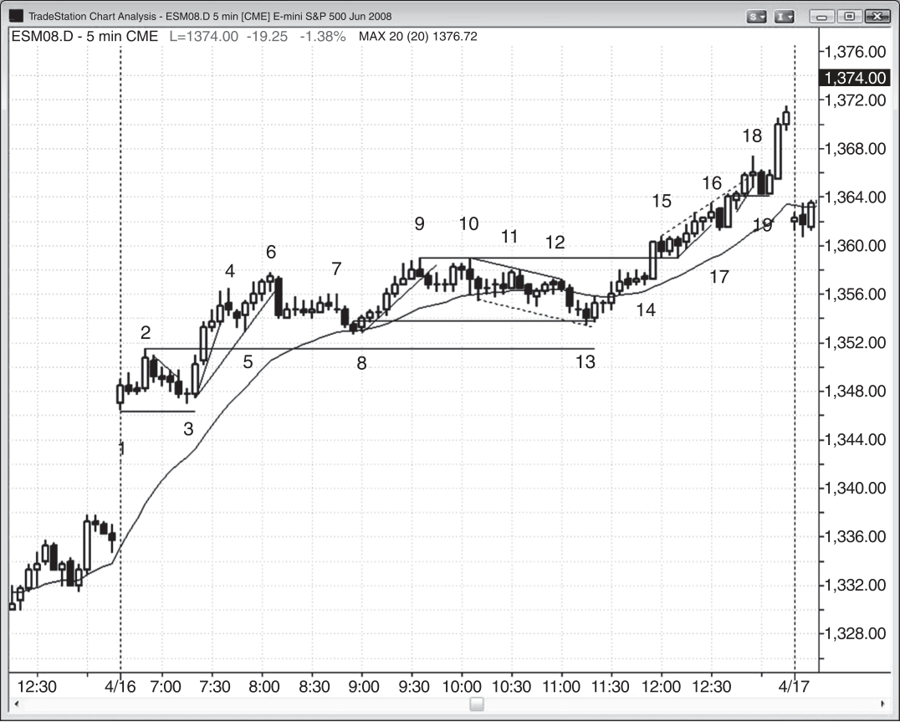
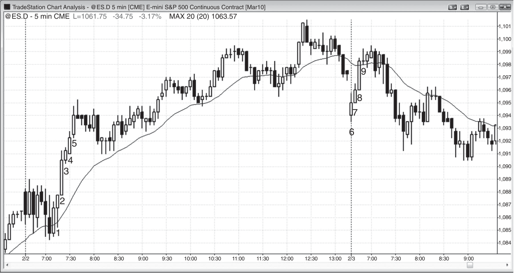

### 第 19 章 趋势中的强度信号

<!-- Source PDF pages 339–350 -->
<!-- CHAPTER 19 Signs of Strength in a Trend -->

<!-- PDF page 339 -->

第 19 章
趋势中的强度信号强势趋势有许多特征。最明显的一点是：它们会从图表的一角一路运行到对角，其间只有很小的回撤。不过，在趋势的早期阶段，就有一些信号表明这波行情很强，并很可能持续。这些信号越多，就越应专注于顺势入场。你应开始把逆势形态都看成绝佳的顺势入场机会——在那些逆势交易者被迫止损出场的确切位置，用止损单入场。

趋势日中有一个有趣现象：在许多这样的日子里，最好看的反转K线和最大的趋势K线往往是逆势的，会把交易者诱入错误方向。同时，缺乏出色的顺势信号K线也会让交易者怀疑自己的入场，迫使他们追赶市场并迟介入场。

最后，一旦你确认市场处于强势趋势中，就不需要再等形态才入场。只要愿意，你可以全天随时以市价入场，并用相对较小的止损。形态的唯一作用是把风险降到最低。

以下是强势趋势中常见的一些特征：

- 当日有大幅跳空开盘。
- 有趋势性的高点与低点（摆动）。
- 大多数K线都是顺趋势方向的趋势K线。
- 连续K线的实体之间重叠很少。例如，在多头尖峰中，许多K线的低点位于前一根K线收盘价处，或仅比其低 1 tick。有些K线的低点刚好在前一根收盘价上、而不是低于它，因此试图以前一根收盘价挂限价买单的交易者无法成交，只能在更高价买入。

<!-- PDF page 340 -->

- 有无影线或影线很小的K线（双向皆然），表明紧迫感。例如，在多头趋势中，若一根多头趋势K线在最低 tick 开盘并向上运行，说明交易者在前一根收盘后就急于买入。若它在最高 tick 或附近收盘，说明交易者预计收盘后会有新买家入场，并在收盘前继续强力买入。他们愿意在收盘前买入，是因为担心若等到收盘再买，可能要贵 1–2 tick。
- 偶尔实体之间会出现缺口（例如，在多头趋势中，某根K线的开盘价可能高于前一根收盘价）。
- 以趋势起点的一根强趋势K线形式出现突破缺口（趋势K线是一种缺口，见第 2 册讨论）。
- 出现度量缺口：突破回测不与突破点重叠。例如，多头突破后的回撤没有跌破发生突破那根K线的高点。
- 出现微型度量缺口：有一根强趋势K线，且其前一根与后一根之间存在缺口。例如，在多头趋势中，若强多头趋势K线之后那根的低点位于该趋势K线之前那根的高点处或之上，这既是缺口，也是突破回测，是强度信号。
- 没有大的高潮出现。
- 没有很多大K线（甚至没有很大的趋势K线）。往往最大的趋势K线是逆势的，诱使交易者去找逆势交易，从而错过顺势交易。逆势形态几乎总是比顺势形态更好看。
- 没有显著的趋势通道线超调，轻微的超调也只带来横盘调整。
- 趋势线突破后的修正是横盘，而不是逆势推进。
- 出现失败的楔形及其他失败反转。
- 出现 20 根均线缺口K线序列（连续 20 根或更多K线不触及均线，见第 2 册讨论）。
- 几乎找不到有利可图的逆势交易。
- 回撤小、少见，且多为横盘。例如，若 Emini 的平均波幅是 12 点，回撤多半不到 3 或 4 点，市场常会连续 5 根或更多K线没有回撤。
- 有紧迫感。你会发现自己等了无数根K线也等不到像样的顺势回撤，回撤始终不来，而市场却在缓慢地继续趋势。
- 回撤有强势形态。例如，多头趋势中的 High 1 和 High 2 回撤买点，其信号K线是强多头反转K线。
- 在最强的趋势中，回撤通常信号K线很弱，使许多交易者不去做，从而迫使交易者追赶市场。例如，

<!-- PDF page 341 -->

趋势中的强度信号在空头趋势中，Low 2 做空的信号K线往往是 2 或 3 根多头尖峰中的小多头K线，有些入场K线还是向下外包K线。它有趋势性的“任何东西”：收盘价、高点、低点或实体。
- 反复出现两段式回撤，设置顺势入场。
- 不会出现连续两根趋势K线收盘在均线另一侧。
- 趋势走得很远，并突破多个阻力位，如均线、前摆动高点与趋势线，且各自超出许多 tick。
- 以逆势尖峰形式出现的反转尝试没有跟随，失败后变成顺趋势方向的旗形。

当趋势处于失控（runaway）模式时，很可能连续许多根K线没有回撤，且K线是实体较大、影线大多较小的趋势K线。由于你希望在继续持有波段仓位的同时，随着趋势延续不断做更多剥头皮，你可以考虑看 3 分钟图以获得额外的顺势形态。它往往有更多停顿K线（逆势内包K线与单根回撤），从而允许顺势入场。1 分钟图也有顺势入场，但另外还有一些逆势形态，在你试图只做顺势时会造成干扰。这再加上读图所需的速度，会在失控趋势中造成过大压力，并干扰你有效交易的能力。由于你必须确保抓住每一次顺势入场，在失控趋势中最好只做 5 分钟图。一旦你有经验且成功，或许也可以再看 3 分钟图。

随着时间推移，趋势会减弱；更多双向交易的迹象出现，强度信号开始消失。例如，在多头趋势中，交易者开始在前一根高点之上与摆动高点之上获利了结，激进的空头开始在K线高点之上与摆动高点之上做空，并在更高处分批加空。强多头最终只会在回撤时买入。最初的多头尖峰被多头通道取代，并最终演化为震荡区间。

<!-- PDF page 342 -->

图 19.1

图 19.1
多头日的大幅向上跳空大幅跳空若未在早期反转，通常标志着当日强势趋势的开始，且当日往往收在最高（或空头日的最低）附近。如图 19.1 所示，5 分钟 Emini 向上跳空 11 点，幅度巨大，第一根K线是多头趋势K线。此外，市场超过两小时未测试均线，又是强度信号。请注意，没有太多情绪化行为（大K线、高潮、大摆动）。安静的市场、大量小K线（其中许多是十字星），往往导致最大的趋势。

在这样的日子里，机构有巨额买单要完成，他们想要更低的价格，但当更低价格不来时，他们不得不全天分批成交，并在越来越高的价格上买入。即使他们看到趋势 <!-- PDF page 343 --> 图 19.1
趋势中的强度信号日正在展开，并预计全天可能都要在更高价买入，他们也不会把全部买单一次性砸进市场，因为那样可能造成高潮性的向上尖峰，然后可能反转跌破他们的平均入场价。他们满足于全天以可控的分量成交，明白自己在越买越高，但知道市场很可能还会更高。而且，像这样的强势日之后的一到数日通常会有更高的价格。

对本图的更深入讨论在图 19.1 中，市场突破了昨日高点，但当市场跌破 bar 2 强多头尖峰之后的那根空头内包K线时，突破变成失败突破。大幅向上跳空日经常测试开盘低点，并形成小型双底多头旗形。当开盘区间像这样很小时，市场处于突破模式，交易者会按突破方向入场。在大幅向上跳空日，概率偏向向上突破。激进的多头可在 bar 3 之上入场（基于双底），但许多多头是在开盘区间高点 bar 2 之上用止损单入场。这一天是开盘即趋势的多头趋势日，也是趋势恢复的多头日。

市场有一个向 bar 3 的小型两段式下移。第一段由一根空头趋势K线与两根十字星组成。第二段由一根顶部有大空头影线的空头趋势K线（该影线是结束第一段下跌的回撤）后接一根十字星组成。这种两段式变体在更小时间框架图上肯定会有两段清晰的下跌，设置 ABC 买入信号。交易者可在 bar 3 之上 1 tick 买入。它也是对缺口的测试，与 bar 1 的低点形成双底。由于这可能是趋势日，因此可能延伸得远超多数交易者的预期，聪明的交易者会波段持有部分或全部仓位。注意当日开盘非常接近当日低点，这是强度信号；开盘即趋势且开盘价距当日低点只有几个 tick 的日子，往往收盘也距当日高点只有几个 tick，并且常有进入收盘的趋势。

Bar 5 是强势上攻（四根多头趋势K线）后的 High 1 突破回撤，在强多头趋势的尖峰阶段，High 1 始终是好的买点。Bar 4 跌破趋势线并从新高反转的 Low 1 不是做空机会，哪怕只是剥头皮。事实上，这里使用 Low 1 这个词是不正确的，因为 Low 1 是在震荡区间与空头趋势中设置交易，而不是在强多头趋势中。在如此强势的上攻之后，聪明的交易者只会寻找买入机会，只有出现第二次入场时才会考虑做空。

Bar 6 是 Low 2，是第二次做空入场，也是多头趋势内震荡区间可能的顶部。但面对强多头趋势，空头只会剥头皮这笔交易。只有先出现过突破了实质性趋势线（或许 20 根或更多K线）的强势下跌，他们才会波段做空。若他们做空， <!-- PDF page 344 --> 图 19.1会迅速离场，然后寻找做多形态做波段交易。强势趋势中的顺势入场应大部分波段持有，只把小部分剥头皮兑现。若你发现自己错过了顺势入场，就停止寻找逆势剥头皮，只做顺势形态。在趋势日期间，你必须尽量抓住每一个顺势信号，因为那是最稳定利润的来源。

由于 bar 6 的入场K线是强空头趋势K线，它是突破，因此也是尖峰。尖峰之后通常跟随至少还有两段推动的通道；但当它们逆强势趋势发生时，往往只再有一段推动，变成两段式多头旗形。无论如何，向下尖峰之后，至少再有一段下跌的概率很高。

Bar 7 是进入第二段下跌的 Low 2 做空入场K线，但在六根K线的窄幅震荡区间之后，任一方向的突破都很可能走不远就失败。

Bar 8 是两段式回撤，也是强多头趋势中第一次回撤到均线，是极好的买点。只要市场连续 20 根或更多K线远离均线（20 均线缺口K线买入形态），趋势就非常强，在均线附近出现买家的概率很高。

Bar 9 是在新摆动高点处的反转，但此前七根K线中没有空头趋势K线，因此除非形成第二次入场，否则不能做空。

Bar 10 是第二次入场，但在多头趋势中的窄幅震荡区间内，任何做空最多是剥头皮，或许最好放弃这笔交易。多头趋势中的横盘价格行为通常是多头旗形，通常会按形成前的趋势方向突破。外包K线可靠性较低，但你可以考虑做空剥头皮，因为第二次入场非常可靠。均线处出现三根小十字星。这是小型窄幅震荡区间，因此有磁吸效应。概率很高会出现任一方向的趋势K线突破，且会失败。交易者持有空单，风险或许 4 tick。Bar 11 的多头趋势K线突破如预期失败，使交易者能在下一根K线上获得 4 tick 的剥头皮利润。

Bar 13 是突破回测，比从 bar 8 做多产生强势上攻的那根信号K线的高点低 1 tick。从 bar 9 到 bar 13 的下跌非常弱，基本上呈横盘。市场费力地下行去测试突破，说明空头缺乏信念。Bar 13 也在均线略下方设置了 High 4 入场，且它跟在当日第一根均线缺口K线之后（高点低于指数移动平均线的K线）。这是强势趋势中的均线缺口K线形态，应预期会以更低高点或更高高点测试多头趋势高点。强势趋势中的均线缺口K线往往导致趋势在更深、更持久的回撤出现之前的最后一段；回撤可能扩大并变成趋势反转。这可能发生在次日。Bar 13 形成了更高低点（高于 bar 8）， <!-- PDF page 345 --> 图 19.1
趋势中的强度信号跟在 bar 9 的更高高点之后，属于趋势性多头摆动的一部分。它本质上是与 bar 8 构成的双底多头旗形。

Bar 14 是 High 2 突破信号K线，High 1 是其前一根。

Bar 15 是最后旗形做空的信号K线，但市场从未触发入场，因为没有跌破信号K线低点。不过，作为空头K线，它是向下的小一段。下一根是多头趋势K线，然后又有一根空头趋势K线。这第二根空头趋势K线是向下的小第二段，因此是 High 2 买入形态。

Bar 17 是强多头日上多头微型通道的第一次突破，因此是在其高点之上 1 tick 买入的形态。该通道呈楔形，虽然交易者不会在此做空，但理论上空头的保护性止损买单在楔形高点之上 1 tick。有一根大的多头趋势K线穿越了这些买单，显示出对空头论点的强力拒绝。该K线之所以如此强，是因为有些多头预期 bar 17 做空会失败，因而在其高点之上挂买单做多；还有在 bar 16 楔形顶部之上 1 tick 被止损的空头。

Bar 18 突破了多头趋势通道线，并给出 Low 2 做空信号。但在强势趋势日，聪明的交易者只有在先出现突破趋势线的强空头段时才会做空。否则，他们会把所有做空形态都看成买入形态，并在弱势空头不得不回补的确切位置挂买单做多（如 bar 17 与 bar 19 高点之上 1 tick）。

Bar 19 是失败的单根趋势线突破，因此是买入形态。有一个两K线多头反转成为做多信号。

<!-- PDF page 346 -->

图 19.2

图 19.2
趋势日上多数反转会失败如图 19.2 所示，趋势日的一个特点是：往往最好看的反转K线与趋势K线是逆势的，把交易者诱入错误方向的亏损交易（bar 1 到 bar 8）。请注意，全天没有一根出色的空头反转信号K线，而这却是巨大的空头趋势。只需看均线——市场直到从 bar 8 开始的反弹顶部处的缺口K线，才连续两根收盘在均线之上。这是空头趋势，每一次买入都应被看作做空入场形态。只需把你的入场单放在多头保护性止损的确切位置，让他们在平仓时把市场往下推。

弱势的卖出信号是趋势如此无情的关键原因。空头一直在等强势信号K线，以便满仓做空。被困多头一直在等趋势很强、需要立即离场的有力证据。这些迹象从不出现，多头与空头都在继续等待。他们看着趋势，看到许多多头K线与 2 或 3 根多头尖峰，于是假设并希望这种买盘压力很快会创造更大的反弹。即使他们看到市场无法站上均线、所有回撤都非常小，他们也否认这些强趋势信号，并继续 <!-- PDF page 347 --> 图 19.2
趋势中的强度信号希望多头把市场抬到他们觉得更舒服的做空位置。这从未发生，空头与被困多头继续全天分批卖出，以防他们想要的反弹永远不来。他们无情的卖出，加上把这看作最强空头趋势、并同样无情激进做空的强空头，使市场全天越走越低，没有大的回撤。

<!-- PDF page 348 -->

图 19.3

图 19.3
没有回撤意味着趋势很强当交易者无法在前一根收盘价挂限价买单成交时，趋势很强。在图 19.3 中，bar 1 刚在高点收盘，一些交易者会立即在该收盘价挂限价买单，希望在下一根 bar 2 开盘数秒内成交。但由于 bar 2 的低点从未跌破 bar 1 的收盘价，限价单很可能无法成交。于是买方会继续尝试在更高价买入。Bar 3、4 和 5 也非常强，不过 bar 3 收盘后，在该收盘价挂限价买单的交易者会在 bar 4 的前几秒成交，因为 bar 4 的低点比 bar 3 收盘价低了 1 tick。通常当出现这样一连串强势K线时，它们会形成尖峰，市场随后通常发展出多头通道。

但并非总是如此。次日，bar 6 到 bar 9 也很强，但导致了更低高点。昨日是尖峰与通道的多头趋势日，因此通道起点今日应被测试。那是市场中的向下磁吸，当市场在昨日多头趋势线下方开盘时，bar 6 到 bar 9 尖峰之后的更低高点导致了向下的趋势反转。

股票交易者会把这条通向昨日高点的多头通道描述为拥挤交易。所有想买的人都已经买了，没有人再买。随着市场开始下跌，通道中的所有买家 <!-- PDF page 349 --> 图 19.3
趋势中的强度信号很快持有亏损仓位，于是所有人冲向出口，以尽量减少亏损并保护部分利润。结果是市场快速下跌。

对本图的更深入讨论在图 19.3 中，开盘突破了昨日尖峰与通道中多头通道的下方，bar 6 是设置失败突破做多的多头趋势K线。该失败突破变成更低高点，并与 PST 时间 7:05 空头尖峰之后的多头K线之下的第二次入场一起，成为突破回撤做空。

<!-- PDF page 350: no extractable text (likely figure-only) -->
