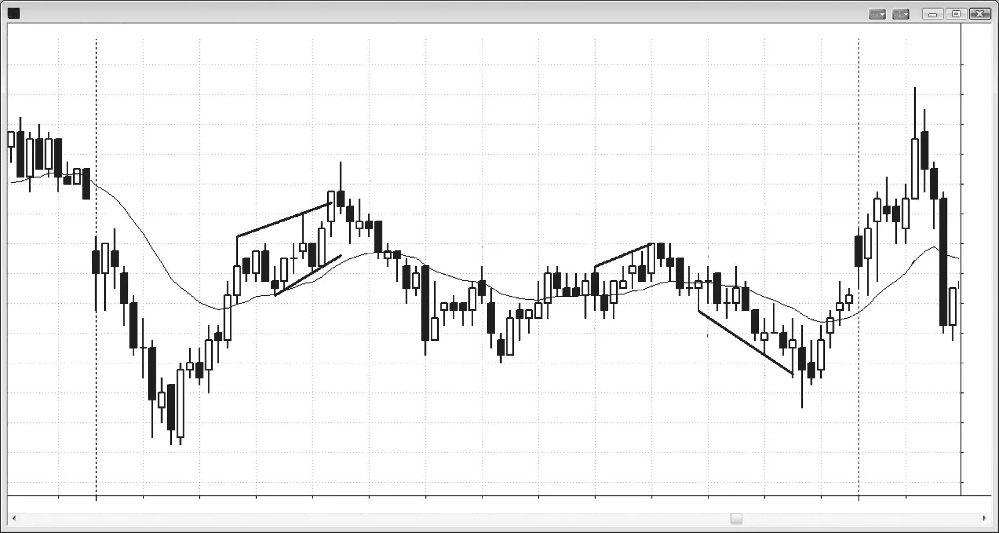
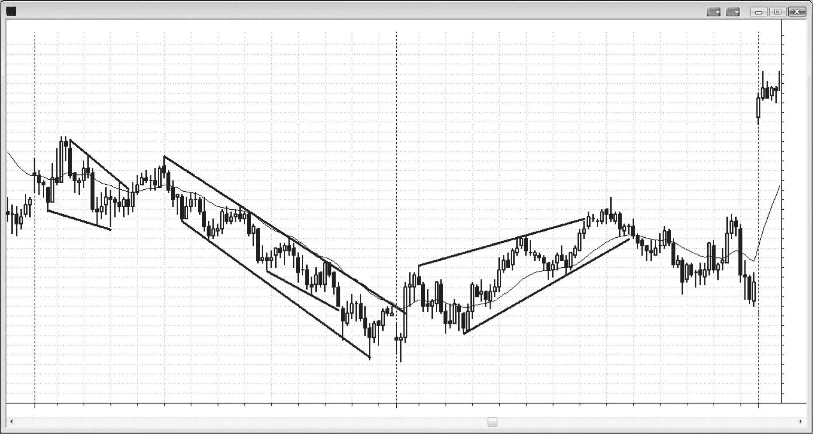
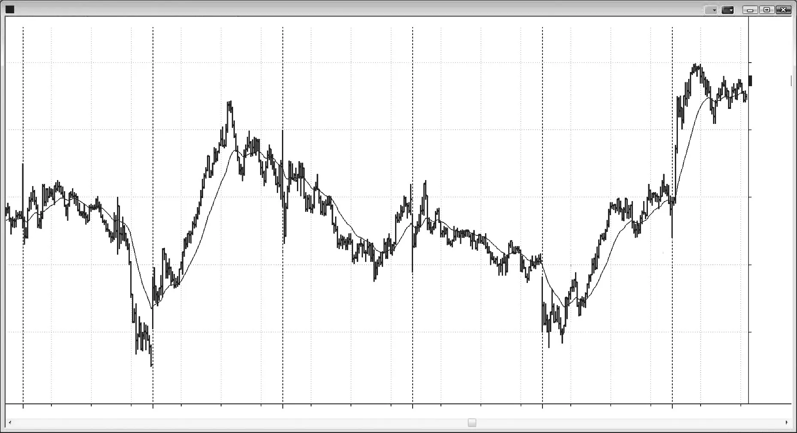
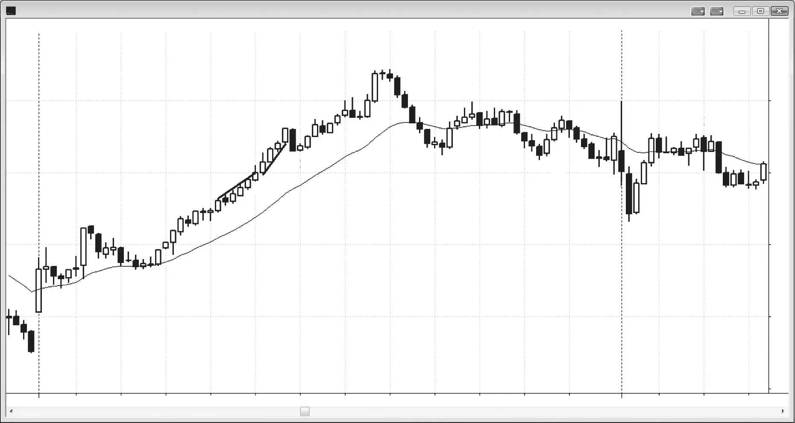
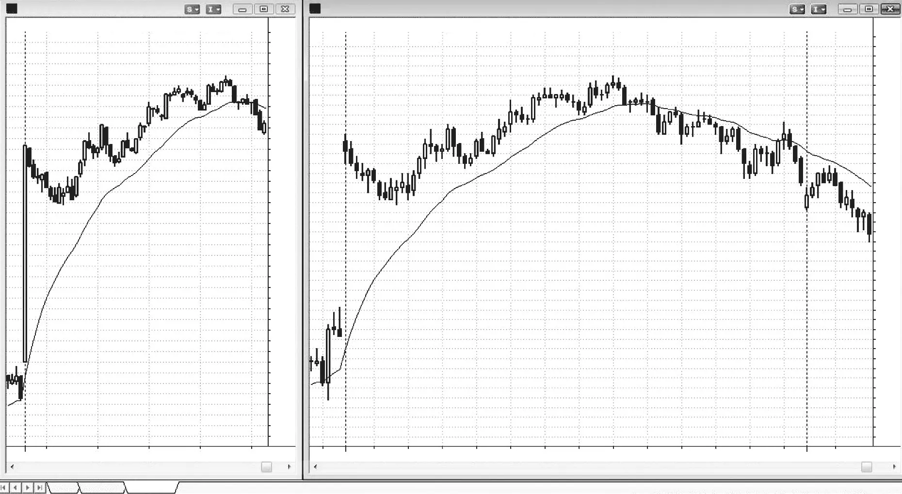
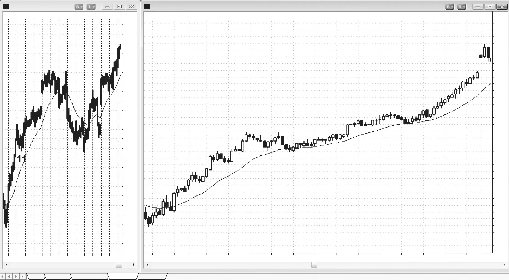
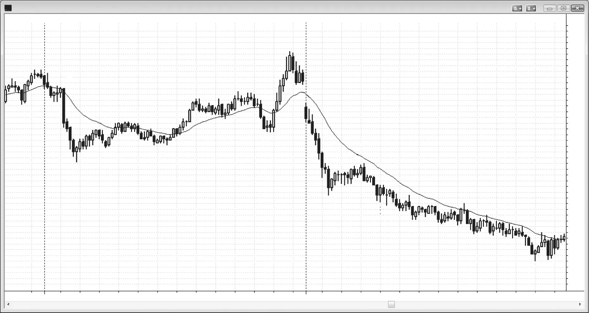
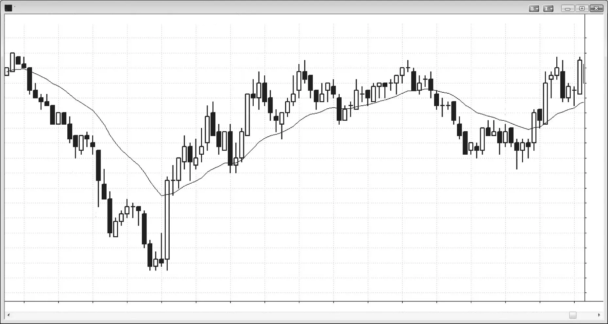
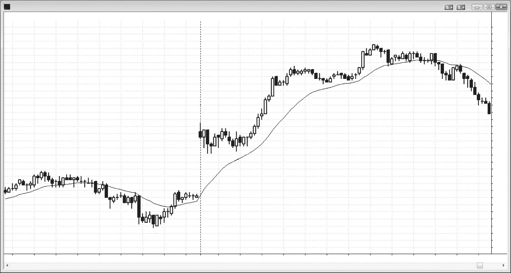
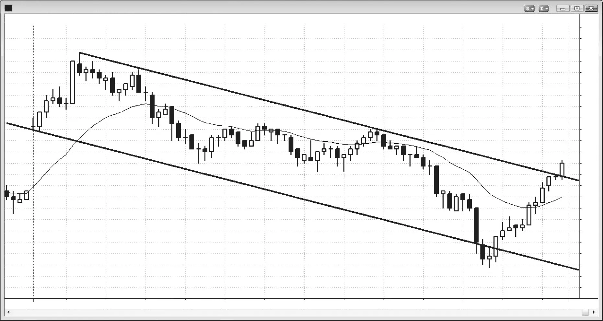

### 第21章 尖峰与通道趋势

<!-- Source PDF pages 357–390 -->
<!-- CHAPTER 21 Spike and Channel Trend -->

<!-- PDF page 357 -->

第 2 1 章
尖峰与
通道趋势
尖峰与通道趋势日的主要特征：
r 尖峰由一根或多根趋势K线组成，它表明市场正在突破进入明确的始终持仓（always-in）状态。在尖峰期间，存在紧迫感，交易者会加仓并推进交易。尖峰实际上就是突破缺口（在第2册讨论）。
r 尖峰通常在第一个小时内形成，而且常常出现在当日最初几根K线之内。
r 突破越强，越有可能以通道形式出现跟随/延续，通道也越有可能走得更远（参见第19章关于趋势强度的内容，以及第2册第2章关于突破强度的内容）。
r 当突破很强时，它常常成为等幅运动的基础，通道可能在此结束，你最终可以部分或全部止盈。
r 尖峰之后立即出现回撤，短则仅一根K线，长则可长达二十多根K线。
r 趋势以通道形式恢复。在通道期间，由于双向交易，存在担忧与不确定感。
r 当市场在通道中运行时，最好像交易趋势型震荡区间那样交易（例如，在多头通道中，最好在前一根K线低点下方买入，并持有部分仓位做波段；若做任何空头，则在摆动高点或前一根K线高点上方卖出，并以剥头皮为主）。
r 通道很少会顺势方向突破，但一旦发生，突破通常在五根K线内失败，然后市场反转。

<!-- PDF page 358 -->

r 通道结束于某个等幅运动目标位，且常常出现在第三次推动时。
r 若通道逆势突破——最终通常都会如此——不要在突破时入场，而应等待回撤（例如，若出现多头尖峰与通道，且市场跌破通道，则寻找更低高点做空）。
r 市场通常会回撤至通道起点，这是对缺口的测试（尖峰与所有尖峰一样，也是一种缺口）。
r 随后市场至少会向趋势方向回升25%，尝试形成震荡区间。在多头尖峰与通道中，回撤常常与通道底部形成双底多头旗形，而通道底部就是尖峰上涨之后回撤的底部。
r 当形态较弱时，更可能是趋势型震荡日（下一章讨论）。
尖峰与通道趋势是最常见的趋势类型，几乎每天、每一次趋势中都以某种形式出现。变体无数，而且常常有许多较小的嵌套在较大的之中。由于它常常是如此多价格行为的主导力量，交易者必须理解它。这是一个由两个组成部分构成的形态。每一个趋势都有尖峰阶段和通道阶段，而且每一个趋势在任何时候都处于这两种模式之一。首先，是一根或多根K线的尖峰，市场快速移动。存在紧迫感，每个人都相信市场还有更远的路要走。尖峰是突破缺口，市场从一个价位快速移向另一个价位。接下来是回撤，短则仅一根K线，也可以持续几十根K线，甚至回撤超过尖峰的起点。例如，若出现多头尖峰，偶尔回撤会跌破尖峰底部，然后通道才开始。回撤之后，趋势转化为通道，紧迫感减弱，更多的是担忧与不确定。这就是你有时在电视上听到评论员说的“忧虑之墙”。每个人都看到双向交易在进行，趋势看起来不断像要结束，却仍在延伸。交易者急于止盈，但随着趋势延续，他们会不断重新入场或加仓，因为他们不确定趋势何时结束，又想确保参与其中。极少情况下会出现第二段尖峰阶段，然后再来一个通道，但通常第二段尖峰会成为失败突破，随后是调整。例如，若出现多头尖峰，然后是动量较低的多头通道，市场可以用另一段多头尖峰突破通道顶部。极少情况下其后会再出现一个多头通道，但更常见的是该尖峰成为失败突破，然后市场向下调整。
当市场有一系列K线覆盖大量点数且几乎没有回撤时，这种强趋势就是尖峰。尖峰可以是一根趋势K线、一系列 <!-- PDF page 359 --> 尖峰与通道趋势
重叠很少的趋势K线，有时甚至是非常窄的通道。事实上，在某一时间框架上的尖峰，在更小时间框架上就是陡峭的窄通道。同样，陡峭的窄通道在更高时间框架上就是尖峰。尖峰在第一次停顿或回撤时结束，但若在一两根K线内恢复，它要么成为第二段尖峰，要么成为更大时间框架上的尖峰。尖峰可以小到单根中等大小的趋势K线，也可以持续10根或更多K线。尖峰、高潮和突破应被视为同一事物，它们在第2册关于突破的章节中有更多讨论。在向上尖峰中，每个人都同意这不是空头有价值的区域，因此市场需要进一步上涨，以找到多头和空头都愿意交易的价格。市场将继续快速上行，直到多头愿意部分止盈且不太愿意开新多，而空头开始做空。这导致停顿或回撤，是显著双向交易的第一个迹象。向下尖峰则相反。
几乎所有趋势都始于尖峰，即使它只是单根趋势K线，并且直到很多根K线之后才被识别为趋势的起点。因此，几乎所有趋势都是尖峰与通道趋势的变体。然而，当趋势具有本章讨论的其他类型趋势的更多特征时，你应按那一类型交易，以最大化成功机会。
按定义，尖峰在第一根停顿K线或回撤之前立即结束，因为正是停顿标志着尖峰的结束。市场随后可以做三种明显事情中的任何一种：趋势恢复、市场进入震荡区间，或趋势反转。第一种最常见。市场回撤几根K线，或者也许十几根，然后趋势恢复。这次回撤是缺口回测（记住，尖峰就是缺口），也是通道的起点。当趋势恢复时，通常强度较低，表现为更多重叠K线、更平缓的斜率、一些回撤，以及一些反向趋势K线。这就是通道，形态于是成为尖峰与通道趋势。
第二种可能发生在回撤延伸超过10根K线时。它随后会成长为震荡区间，可以向任一方向突破。总体而言，概率总是偏向震荡区间突破方向与原趋势相同。若震荡区间持续很久，它在更高时间框架图上就只是一个旗形（例如，5分钟图上多头尖峰之后持续三天的震荡区间，在60分钟图上通常只是多头旗形，概率偏向向上突破）。这是趋势恢复情形，本章稍后讨论。虽然趋势通常会在当日结束前恢复，使该日成为趋势恢复趋势日，但震荡区间的突破有时会在几根K线内失败或反转（最后旗形反转在第3册反转章节中讨论）。极少情况下，震荡区间持续数小时甚至数天，且波动非常小 <!-- PDF page 360 --> （这是窄幅震荡区间，在第2册关于震荡区间的内容中讨论）。与任何震荡区间一样，突破可以朝任一方向，但略微更可能朝趋势方向。
第三种可能是市场反转。只要尖峰后的回撤不够强到把始终持仓交易翻转到相反方向，市场就很可能继续趋势，而延续几乎总是以通道形式出现。较少见地，市场会反转并形成相反方向的尖峰。当这种情况发生时，市场通常会进入震荡区间，多头与空头争夺跟随。多头会持续买入，试图在其多头尖峰之后创建多头通道；空头会持续卖出，试图在其空头尖峰之后创建空头通道。虽然震荡区间可以持续到当日收盘，但通常一方会获胜，市场突破。那时，要么形成通道，该日成为尖峰与通道趋势日；要么突破后很快又出现另一个震荡区间，市场形成趋势型震荡日，下一章讨论。
除了以相反方向尖峰反转之外，若尖峰后形成震荡区间，市场也可以反转。例如，若有多头尖峰然后震荡区间，大约三分之一的情况下市场会从震荡区间底部而非顶部突破。突破可以是尖锐的大空头尖峰，但更常见的是由一根不起眼的空头趋势K线，随后是空头通道。
若形成通道，最好只沿趋势方向交易。有时通道内有较大波动，可以在通道推进过程中提供逆势剥头皮机会。要意识到，通道可以持续得远比你想象的更久，而且看起来总像在反转。沿途有许多回撤，把交易者困在错误方向。通常有许多带影线的K线、许多反向趋势K线，以及大量重叠K线，但它仍然是趋势，过早逆势交易代价非常高。
有些日子有早期强动量推动（尖峰），然后趋势以不那么陡峭的通道在当日余下时间延续。然而，通道有时会加速，沿抛物线而非线性路径运行。另一些时候，它失去动量，形成更平缓的曲线。无论如何，通道起点通常会在当日晚些时候或接下来一两天被测试，测试之后可以是震荡区间，或任一方向的趋势。重要的是要认识到，若通道相当窄，则只能顺势方向交易，因为回撤不会走得足够远使逆势交易盈利。较少见地，通道有宽幅波动，可双向交易。
你应准备在通道逆势突破之后寻找逆势方向的入场，因为有很大机会 <!-- PDF page 361 --> 尖峰与通道趋势
逆势走势会一直延伸回去测试通道起点，并试图形成震荡区间。记住，通道无论多么陡峭，都是相反方向的旗形。多头通道是空头旗形，空头通道是多头旗形。此外，即使通道是倾斜的震荡区间，它也是更大震荡区间的第一段，反转通常回到通道起点附近区域。例如，若先有向上尖峰，然后回撤，再然后是多头通道，该多头通道通常是尚未展开的震荡区间的第一段。市场通常会向下修正至通道底部，在那里尝试与通道底部形成双底多头旗形。这通常导致反弹，即正在形成的震荡区间的第三段。反弹之后，交易者应开始寻找其他形态，因为尖峰与通道形态在这一点上的可预测性已经结束。
尖峰就是突破，这意味着突破点与第一次回撤（即通道起点）之间会有缺口。对通道底部的测试就是对缺口的测试，是突破回测。
股票交易者常常把多头通道的结束描述为“拥挤交易”，因为他们认为任何对该股票感兴趣的人都已做多，没有人再买了。然后他们预期会快速下跌至通道起点，因为所有通道中的买方都会出场。随着股票快速下跌，他们认为空头腿是由所有进场较晚、持有未平仓亏损的多头急于出场以最小化亏损造成的。这群多头冲向出口导致了下跌的快速与深度。显然有许多因素影响每一次走势，但当有急剧回撤至通道起点时，这很可能是重要组成部分。
由于形态的第二部分是通道，通道阶段的行为与任何其他通道一样。几乎所有尖峰与通道多头形态都以跌破通道底部并测试到通道底部附近结束。最容易识别的反转形态是通道中的三推形态且呈楔形，其中第三次推动超调趋势通道线并以强反转K线反转，尤其若有第二次入场。然而，大多数时候反转并不如此清晰，更好的是等待突破回撤形态。例如，若多头通道下方出现突破，等待回撤至更高高点或更低高点，若有良好的空头形态，则做空。若下跌到达通道底部并形成买入形态，则寻找做多，做双底多头旗形反弹。
若有强尖峰和任何回撤——即使是单根K线——然后趋势恢复，概率偏向尖峰与通道趋势。例如，若有强向上尖峰突破震荡区间，然后是内包K线，再然后一根K线跌破该内包K线但反转向上成为多头反转K线，交易者会在该K线上方买入，预期多头通道。一旦市场越过该多头反转K线上方，通道就生效了。它可以有单次向上推动，持续 <!-- PDF page 362 --> 一根到数根K线（最后旗形反转，在第3册讨论），然后反转为空头腿，也可以有两段或更多段然后反转。若向上通道形成于反转似乎可能的区域，例如震荡区间顶部附近，它可能在两段上涨后反转，在清晰的通道线能够画出之前。若它形成于多头趋势可能的区域，例如从强底部形态向上反转，它通常至少有三次推动，但也可以有更多。
通道到底能走多远？在强趋势中，它通常走得比大多数交易者认为可能的更远。然而，若尖峰很大，一个等幅运动目标是从尖峰第一根K线的开盘或低点到尖峰最后一根K线的收盘或高点，然后把同样的点数向上投射。另一个等幅运动目标是腿1=腿2运动，其中尖峰是腿1，通道是腿2。一旦通道到达等幅运动目标，就看是否正在形成反转。
你通常还会看到其他等幅运动投射以及趋势线和趋势通道线目标，但这些目标大多数会失败，尤其若趋势非常强。然而，寻找它们很重要，因为当反转最终形成时，通常会在这些阻力区域之一，那会给你更多信心去做反转交易。总体而言，把等幅运动目标看作止盈区域，远好于看作反转交易位置。交易者只有在形态很强时才应做反转交易，反转交易在第3册讨论。有经验的交易者常常在等幅运动目标处逆势剥头皮，有时若市场对他们不利则分批加仓（分批加仓在第2册讨论），但很少有交易者能持续盈利地这样做，大多数人若尝试会亏损。
强尖峰表明市场正在快速移向一个新的价格水平，在那里多头和空头都觉得有交易价值。市场通常会超调价值区域，然后回撤进入将要成为震荡区间的区域。因为多头和空头都对这一新区域的价格满意，等距运动的方向概率在震荡区间中部约为50%。这意味着市场在向下移动X个tick之前先向上移动X个tick的机会大约相等。这种不确定性是震荡区间的标志。市场为何趋势并不重要。重要的只是它在快速移动。你可以把这次走势看作突破并离开某个先前价格，或看作朝向某个磁体的运动。那个磁体可以是关键价格位，如先前尖峰、等幅运动，或趋势线。或者你可以把突破看作朝向中性的运动，在那里方向概率再次约为50%。这总是发生在震荡区间中，所以一旦方向概率降至50%，震荡区间就会显现。趋势只是从一个震荡区间到另一个震荡区间的移动，而在新的震荡区间中，多头和空头都在下单 <!-- PDF page 363 --> 尖峰与通道趋势
试图为他们认为将是下一次突破做好仓位准备。这在第2册关于交易数学的部分有更多讨论。
例如，若市场处于多头通道中，等距运动的方向概率开始下降，在某个未知点达到50%。这将最终是震荡区间的中部，但尚无人知道它在哪里，市场通常必须向上和向下超调以寻找中性。当市场在通道中上行时，交易者会假定更高价格的方向概率仍好于50%，直到它明显低于50%。那种清晰出现在某个磁体处，那时每个人都看到市场已经走得太远。这将是震荡区间顶部的大致区域，而震荡区间顶部的方向概率偏向空头。结果是市场会向下交易以寻找中性，但通常会再次超调，因为中性从不清晰而过度是清晰的。一旦市场到达某个磁体（在第2册讨论），交易者会看到它已经下跌太远并向上反转。最终，区间会变窄，因为交易者在向中性靠拢，那是一个多头和空头都觉得有交易价值的价位。他们处于平衡，市场随后处于突破模式。不久，感知价值会改变，市场必须再次突破以找到新的价值区域。
一旦你识别出尖峰与通道趋势正在生效，就不要做逆势交易，寄希望于ABC回撤会延伸得足够远以获得剥头皮利润。因为此前几乎总不会有任何趋势线突破，而通道的窄度使逆势交易成为亏损策略。这些逆势剥头皮的失败是极好的顺势形态。只需在逆势交易者用保护性止损出场的位置用止损单入场。
激进的交易者会用限价单进入通道，顺势交易，直到双向交易变得突出，那时他们开始逆势交易。例如，若有空头尖峰然后通道，空头会在前一根K线高点处或上方用限价单入场。当通道接近支撑位时，他们会观察K线是否更多重叠、是否有更多且更强的多头趋势K线、是否有更多十字星，以及是否有更大回撤。这些双向交易迹象越多，多头越愿意在前一根K线低点和摆动低点处或下方用限价单买入，而空头越不愿意在K线上方或下方做空。空头会在趋势已持续一段时间并处于等幅运动目标或其他类型支撑区域时分批减仓其盈利交易。多头会在同一区域开始分批加仓做多。增加的买盘和减少的卖盘最终导致突破空头趋势线上方。
机构以及账户足够大的交易者可以分批加仓逆势仓位，预期市场会测试通道起点，但大多数 <!-- PDF page 364 --> 交易者应只顺势交易，直到有清晰的反转信号。此外，在当日后半段于通道中分批加仓逆势仓位是有风险的，因为你常常会用尽时间。你会发现自己持有越来越大的亏损仓位，并被迫在收盘前以大亏损买回。当空头分批加仓时，有些人会寻找突破先前摆动高点上方的大多头趋势K线。他们会把它看作即将形成的震荡区间可能的衰竭顶部。他们会下限价单在该K线收盘处及其高点上方做空，因为他们把通道看作震荡区间的第一段，而在震荡区间顶部区域对多头尖峰做空是标准的震荡区间技巧（在第2册关于震荡区间的内容中讨论）。震荡区间形成之后，交易者会回看并看到多头通道是区间的起点，而非常有经验的交易者可以在通道形成时就开始使用震荡区间交易技巧，若他们相信市场处于即将形成的震荡区间的顶部区域。
通道之前形成的尖峰是图表上的稀薄区域（相邻K线重叠很少，是一种突破或度量缺口，如第2册讨论），在那里多头和空头一致认为市场定价错误，因此市场快速穿越它。双方都在为快速离开尖峰中的价格做贡献，因为他们在寻找一旦通道开始形成即可推断存在的均衡。是的，市场仍在趋势，因为一方仍占主导，但终于有了一些双向交易。通道本身通常有大量重叠K线和回撤，本质上是陡峭倾斜的窄幅震荡区间。由于这类价格行为代表双向交易，有理由预期形态起点不久会被测试，尽管趋势一直多么强。例如，在尖峰与通道空头趋势中，所有那些在空头通道最开始买入、认为尖峰会成为失败突破的早期多头，在回撤至该区域时终于回到保本，这将使回撤像双顶一样起作用。这些多头会在这些早期多头仓位附近保本出场，并且可能不想再买，除非市场再次回落。这很可能是通道顶部被测试后通常至少有一些向下运动的重要原因。任何通道通常都是震荡区间的第一段，最常跟随的是测试通道起点并揭示震荡区间的逆势走势。那时，震荡区间通常在持续时间上扩展，并至少有部分走势朝原通道方向。从那里起，市场行为像震荡区间，处于突破模式（交易者在寻找突破），而突破进入新趋势可以朝任一方向。
有时通道如此垂直以致加速并变为抛物线。虽然连续K线之间重叠如此之少，看起来不像典型通道，但这种抛物线运动的功能像通道阶段， <!-- PDF page 365 --> 尖峰与通道趋势
因此是尖峰与通道趋势的一种变体。这种抛物线运动常常包含一根大趋势K线。例如，若有空头尖峰（一根或多根大空头趋势K线），然后停顿，再然后又一个空头尖峰，那么你就有了连续卖盘高潮。每一根大趋势K线都应被看作尖峰、突破、缺口和高潮。当有连续高潮（由停顿或小回撤分隔）时，其后通常是两段式调整，测试第一个高潮之后的停顿。第二段高潮应被看作尖峰与通道形态的通道阶段，即使它是另一段尖峰而非低动量通道。然而，由于其后通常发生的与常规尖峰与通道形态相同，连续高潮构成尖峰与通道趋势的一种变体。极少情况下，甚至会有第三次连续高潮，然后才出现更复杂的调整。
为什么市场在连续卖盘高潮后倾向于有更大调整？当有卖盘高潮时，存在恐慌性卖出。弱势多头觉得必须以任何价格退出多头。此外，弱势空头看到强动量，害怕错过大行情，所以市价做空以确保入场。若市场停顿然后又出现另一根大空头K线，那第二段卖盘高潮再次代表急于卖出、不想等待可能永远不会来的回撤的人。一旦这些弱势多头出局、弱势空头进场，就没有人再愿意在这些低价做空，这造成买方一侧的失衡。没有足够的空头来承接交易的另一侧，所以市场必须上涨以找到足够愿意做空的交易者来填补买单。连续买盘高潮则相反。它们代表紧迫感。交易者感到必须在市场快速上涨时市价买入，因为他们害怕不会有让他们以更好价格卖出的回撤。一旦这些情绪化的弱势空头和多头（晚期多头是弱势的）在这些高价买够了他们想买的一切，就没有人再买，市场必须下来以吸引更多买方。结果是通常有两段、至少持续约10根K线的调整。
另一种强通道类型出现在尖峰与高潮趋势中。这里，在尖峰后的停顿之后，市场创建另一段尖峰。所有尖峰都是高潮，当市场形成连续高潮时，通常会形成更大调整，常常到第二段尖峰的起点。但这正是尖峰与通道的行为方式，因此是一种变体，其中有第二段尖峰而不是通道。有时高潮是尖峰，而尖峰更像通道。例如，可能有一个多头通道，然后有一根大的单K线多头尖峰。这可以成为尖峰与高潮反转。即使先有通道再有尖峰，它的行为也像传统的尖峰与通道形态。
由于任何强垂直走势都可以作为尖峰起作用，跳空开盘也符合条件。若你在Emini有大幅向上跳空开盘的日子看标准普尔（S&P）现货指数，你会看到现货指数的第一根K线不是缺口。

<!-- PDF page 366 -->

相反，它是一根大多头趋势K线，其开盘大约在昨日收盘附近，收盘大约在Emini第一根K线收盘附近。若随后有停顿或回撤，然后是通道，这就是缺口尖峰与通道趋势。
当通道非常陡峭时，尖峰与通道合在一起常常只在更高时间框架图上形成一个尖峰，而那个尖峰通常会在更高时间框架上跟随一个通道。另一些时候会有持续数根K线的尖峰但没有通道。通常尖峰的最后几根K线有一些重叠，实际上在更小时间框架图上存在通道。
有时会有一根大多头趋势K线（向上尖峰），然后一根大空头趋势K线（向下尖峰）。当这发生在已经持续一段时间的多头趋势中时，市场通常进入震荡区间，多头试图生成多头通道，空头试图形成空头通道。最终一方获胜，要么趋势恢复，要么市场形成尖峰与通道空头趋势。在空头趋势中则相反，然后有一根大空头趋势K线。若其后不久有多头尖峰K线，市场通常横盘，双方争夺通道方向。若空头获胜，空头趋势会恢复；若多头获胜，会有反转。有时一方似乎以第二段尖峰的形式获胜，但在一两根K线内失败，导致相反方向的通道。
尖峰与通道形态由两部分组成，最好以不同方式交易。尖峰是突破，像所有突破一样交易，突破在第2册讨论。总体而言，若突破看起来非常强，且在可能成功的背景下，你可以在尖峰形成时市价入场或在小回撤时入场。由于尖峰也是高潮，在某个点会有回撤，这提供其他顺势入场机会。最后，通道与任何其他通道没有不同。若它是窄多头通道，你可以在回撤时顺势入场，例如回撤至趋势线或移动平均线，或在前一根K线低点下方用限价单，或在英特尔（INTC）交易于$20时每下跌10美分买入。若通道有更宽的摆动，则有更强的双向交易，你可以双向交易。由于通道是相反方向的旗形，一旦它开始反转，你可以做反转交易。它通常会回撤至通道起点附近，在那里你可以在测试通道起点时入场，在尖峰与通道多头回撤中这将是双底多头旗形，在尖峰与通道空头回撤中则是双顶空头旗形。
若通道相邻K线有大量重叠，且有许多反向趋势K线以及几次持续数根K线的回撤，它就是弱通道。通道越弱，机构逆势交易者会越激进。例如，若空头尖峰后有弱空头通道，强多头会在市场下移时分批加仓。会有公司以每一种可以想象的理由买入，如下每一根K线低点下方买入，或每一个 <!-- PDF page 367 --> 尖峰与通道趋势
先前摆动低点下方买入，或在谷歌（GOOG）交易于$500时每下跌$1.00买入，或每一次测试趋势通道线时买入，或在小时间框架图上每一次反转K线时买入，或在GOOG自低点反弹每$1.00时买入，以防向上反转已经开始。若市场不是突破通道顶部，而是强力突破底部并创建持续数根K线的强空头尖峰，这些多头将不得不通过退出多头来平仓。当他们卖出多头时，他们增强了空头突破的力量，甚至可能翻空做动量交易下行。然而，在大多数情况下，向下突破不会走得很远，一旦最后绝望的多头卖出其仓位，就没有人再愿意在这些低价做空。市场通常会至少反弹两段、至少10根K线，以寻找空头可能再次愿意做空的更高价格。
当市场强趋势运行然后出现相反方向的尖峰时，该尖峰通常只会导致回撤（旗形），然后趋势恢复。然而，它表明相信市场可能反转的交易者现在愿意开始建仓。若市场在接下来的10到20根K线内开始形成一两个更多尖峰，那些尖峰的逆势力量是累积的，市场正在向更多双向交易转换。这可以发展成震荡区间、更深调整，甚至趋势反转。例如，若有任何类型的非常强的多头趋势——不只是尖峰与通道多头——且市场在移动平均线上方已有20根或更多K线并处于高点，则多头趋势非常强。若突然有一根中等大小的空头趋势K线，开盘靠近高点、收盘靠近低点，这是空头尖峰。该K线可以是空头反转K线、空头反转K线下方的入场K线，甚至内包K线，都不重要。这第一次向下尖峰几乎总是只会形成多头旗形。多头趋势恢复后，留意另一个空头尖峰。最终会有一个其后跟随回撤至移动平均线。这第一次回撤至移动平均线通常会跟随对多头趋势高点的测试。测试可以是更高高点、双顶或更低高点的形式。然而，回撤至移动平均线通常足以突破至少某些多头趋势线，然后随后的反弹可能是显著回撤甚至反转之前的最后一次反弹。
若在新高处有第三次且更大的空头尖峰，至少两段式调整的概率增加，尖峰下行后的向下走势通常会以某种通道形式出现。市场是否在忽视前两次空头尖峰？市场从不忽视任何东西。虽然这最新的空头尖峰可能是每个人认为的开创性事件，但其他空头尖峰也有累积效应。事实上，若第二次空头尖峰特别强，然后市场反弹至新高，而下一次空头尖峰温和却导致调整，你必须考虑对刚发生之事的不同解释。有可能第二次空头尖峰实际上是更重要的那个， <!-- PDF page 368 --> 是向下走势的真正起点，而尖峰后的反弹至新高只是该尖峰的回撤。重要的是要理解，任何突破回撤都可以用更低高点、双顶或更高高点测试旧极值，而那次测试常常可以是空头通道的起点。虽然看起来可能是那个小向下尖峰开始了空头趋势，且其后跟随的通道是第一个空头通道，但有时更早的尖峰影响更大。其通道可以从多头趋势高点开始，并可以从该高点的那个较小向下尖峰开始。跟随该小空头尖峰的通道于是处于从多头高点开始的更大通道之内，就在那个小空头尖峰形成之前。
当市场处于震荡区间时，常常既有多头尖峰又有空头尖峰。多头和空头然后争夺创建通道。最终一方会主导并能形成趋势通道。它常常始于突破，那就是第二段尖峰。两段尖峰都对通道的形成有贡献。
多头通道是空头旗形，空头通道是多头旗形，与所有旗形一样，它们是延续形态，通常沿趋势方向突破。然而，有时它们向相反方向突破，导致趋势反转。突破是尖峰，所以市场形成的是与尖峰与通道形态无关的通道与尖峰趋势，而不是尖峰与通道趋势。但通常尖峰之后会跟随通道。例如，若有空头趋势且有回撤，回撤是上升通道，因此是空头旗形。有时通道会向上突破。突破是多头趋势K线和尖峰，若突破成功，跟随将是通道。多头趋势始于尖峰，该尖峰与其后通道形成尖峰与通道多头趋势。原来的通道是空头趋势的最后旗形，它向上突破，但与其后的尖峰与通道多头趋势无关。尖峰改变了市场，它是交易者新视角的起点，他们随后会忽视此前的空头旗形。
当楔形反转失败时会发生类似情况。例如，楔形顶部是上升的多头通道，因此是空头旗形，通常向下突破。若它反而向上突破，突破是尖峰，其后可能跟随通道和向上等幅运动。突破总是重置心态，应被看作新趋势的起点。在这种情况下，趋势仍是多头趋势，像楔形之前的趋势一样，但现在是更强的多头趋势。通常，向上突破在反转进入延长的两段式回撤或相反方向趋势之前，不会走超过五到十根K线。它们代表异常高潮性、因此过度的买盘。这处于行为钟形曲线的尾部，机构会有各种指标告诉他们多头趋势已经过度、应该调整。每个机构会依赖自己的过度衡量，但通常有足够的机构 <!-- PDF page 369 --> 尖峰与通道趋势
会把反弹看作过度，他们的看跌押注很快会压倒多头，反转随即发生。
尖峰与通道行为是你在每一张图上都会看到的最常见、因此最重要的事物之一。每一个形态都有无数变体和许多解释。有时尖峰是一根K线，但在停顿之后，会有一个看起来更好的尖峰。通道可以如此垂直，以致它作为尖峰的一部分起作用，尖峰与通道在更高时间框架上可能只是一个尖峰。那个通道相对于尖峰可以非常小或非常大。当有强趋势时，通道内通常会有几个尖峰，通道可以细分为更小的尖峰与通道形态。对所有可能性保持开放，因为它们都有提供盈利交易机会的潜力。

<!-- PDF page 370 -->

图 21.1

图 21.1
尖峰与通道中的三次推动
有时多头尖峰与通道可以以三次向上推动、趋势通道线超调以及强空头反转K线结束，但大多数反转并不如此直截了当。在图21.1中，K线6是两K线向上尖峰的一部分，但从K线5低点起的上涨如此陡峭，你也可以把K线5看作尖峰的起点。这并不重要，因为开盘时任何强向上反转都可能有跟随买盘，而且会有基于每一种解读的买入程序。这里，它以有三次向上推动且呈楔形的通道形式出现。通道常常在第三次向上推动后回撤。K线10超调趋势通道线并向下反转成空头反转K线，形成做空交易。多头楔形通常以两段向下修正至楔形底部附近，而尖峰与通道多头中的通道通常以两段向下修正至通道起点，也就是K线7低点。
尖峰可以累积。K线7之前的那根是空头尖峰，但它只是导致对移动平均线的测试。K线9是第二次空头尖峰。这两次尖峰表明空头正试图夺取对市场的控制，市场正在变成双向。K线10是两K线空头尖峰的第一根，K线11之后又有另一个空头尖峰。仅仅因为那最后一次尖峰跌破楔形并明显导致空头腿，并不意味着它独自扭转了市场。那些更早的尖峰也是转换的一部分，不应 <!-- PDF page 371 --> 图 21.1
尖峰与通道趋势
被忽视。当它们形成时，你应理解市场在告诉你它处于转换中，你应开始双向寻找交易，而不仅仅是买入形态。
K线16是单K线尖峰，但向上尖峰也可以被认为始于K线15。有回撤至K线17，然后三次小向上推动至K线21，市场在那里反转。
15之后的那根是单K线尖峰，其后四根K线形成小通道，结束于K线16；整个上涨至16的走势也是一个尖峰。
K线22是向下尖峰，它横盘修正至K线25，通道从那里开始下行至K线27，这是尖峰后的第三次向下推动（K线23和26是前两次），K线27超调趋势通道线并收在中部。那不是强信号K线，随后的空头内包K线也不是，但市场向上反转进入收盘。
对本图的深入讨论
在图21.1中，市场跌破移动平均线和昨日收盘时的震荡区间。由于该震荡区间中有许多空头趋势K线，且今日第一根K线有强空头实体，不买入由今日第二根K线形成的失败突破做多形态是合理的，而应等待第二个信号再做多。即使第二根是强多头反转K线，也没有什么可反转的，因为它与前一根完全重叠。这是小震荡区间，不是好的反转。所有向下缺口都是空头尖峰，其后可以跟随空头通道。K线2困住了多头，成为突破回撤做空形态，形成至K线3的空头尖峰与通道趋势。K线3是跌破单K线最后旗形的突破，成为强两K线反转的第一根，该反转成为当日低点。可以说，这次多头反转可以描述为失败突破，但更准确地说是空头通道末端的向上反转。
K线6之前的多头趋势K线是交易者放弃“自K线3起的反弹只是空头旗形”这种可能性的时刻。那根K线是从“市场处于空头趋势”这一观念突破到“它已翻转为多头趋势”这一观念。这一观念在K线6上得到确认，那时大多数交易者终于相信市场变成始终做多。许多人相信市场在K线6之前那根的收盘时已经反转为上，而那根多头趋势K线也是尖峰、突破K线和缺口。其后那根K线（此处即K线6）的低点形成缺口底部，突破点的高点形成缺口顶部。这里它既是K线5，也是其后的小空头内包K线。由于K线6之前那根是缺口，那个缺口是磁体，在接下来约10根K线内有很好机会被测试。K线7是测试，它成为尖峰上涨之后通道的底部。有些人把尖峰看作始于K线6之前的趋势K线，另一些人看作始于K线5或K线3之后的多头K线。K线12是自通道高点起的向下修正， <!-- PDF page 372 --> 图 21.1
而且如尖峰与通道形态中所预期的，回撤再次测试缺口，并试图与上行至K线10的通道底部K线7形成双底。在这个案例中，它失败了。
K线12是对结束于K线10的多头通道底部K线7的测试，但下行至K线12的走势处于窄通道中，因此很可能只是两段下行中的第一段。因此，双底多头旗形做多从未在K线12之后的多头内包K线上方触发。相反，K线13是大空头趋势K线。由于它出现在相对较长的空头腿末端，它更可能是衰竭高潮，应导致至少10根K线、两段式横盘至上调整。我经常使用“10根K线、两段式”这一说法，意图是说调整会比小回撤持续更久、更复杂。那通常至少需要10根K线和两段。
上行至K线14是第一段，然后回撤至K线15的更低低点，随后是第二段上行至K线21。K线15可能是自K线10高点起的第二段下行，但结果是调整变得更复杂，第二段结束于K线27，它与K线5以及再次与K线15形成双底多头旗形。你认为哪一个并不重要，因为含义相同。会有一些程序使用一个，另一些程序使用另一个，但两类程序都会买入以求向上等幅运动。他们在寻找自K线3低点起的第二段上行，形式为腿1=腿2，其中腿1是K线3至K线10，腿2是K线27低点上行至K线31高点。
在更高时间框架图上，K线27是简单的High 2买入形态，因为它是自反弹至K线10起的两段下行。它是强上涨后的两段式更高低点，成为导致至K线31等幅运动上行的回撤。反弹至K线31超调等幅运动几个tick，但足够接近以满足在那里止盈的多头。市场随后下跌至K线32低点。
下行至K线15是楔形多头旗形，前两次推动结束于K线7和K线13。K线10是对K线6的更高高点测试而不是更低高点并不重要，因为这在楔形旗形中很常见。
K线21是楔形空头旗形，当双顶上方的突破失败时这很常见。K线16和18形成双顶，但市场不是向下突破，而是向上突破。市场有两小段上行至K线21，在那里市场反转且突破失败。K线16、18和21是楔形空头旗形中的三次向上推动。

<!-- PDF page 373 -->

图 21.2

尖峰与通道趋势
图 21.2
尖峰与通道每天都出现
某种形式的尖峰与通道趋势每天都存在。在图21.2中，第一天3月28日是空头尖峰与通道日，始于向上尖峰但反转成自K线2起的三K线向下尖峰，然后再次自K线3起。在那里，它试图与前一日末的摆动低点形成双底。K线2与K线4之间的两根大空头趋势K线中的任何一根也可以被看作空头趋势的初始尖峰。K线8与K线6之后小空头旗形的顶部形成双顶，然后市场全天在窄通道中下行漂移，在移动平均线附近有几次良好的做空入场。
市场在次日以向上至K线17的尖峰突破通道上方。由于通道起点通常会被测试，交易者现在可以开始寻找做多形态以测试K线5区域。空头通道起点K线5被K线23测试，并被次日K线27的向上跳空超越。
下行至K线15的通道略呈抛物线（它跌破自K线9至K线11的空头趋势通道线，表明下跌斜率增加），这是高潮行为，因此长期不可持续。交易者也可以通过取K线5至K线8趋势线的平行线，然后锚定到K线6或7低点来创建趋势通道线。K线13和15也会超调那条线。
在下跌期间，空头分批加仓做空，并以每一种可以想象的理由剥头皮。例如，他们可能在每一次两点反弹时卖出，或在前一根K线高点上方卖出，如 <!-- PDF page 374 --> 图 21.2
K线9上方以及K线9之后五根高点高于前一根高点的K线每一根上方。他们会在移动平均线和趋势线处做空，如K线10。他们会在每一次微小突破趋势线上方时做空，如K线11。他们也会在每一根回撤K线低点下方做空，如K线10低点下方。其他空头会在每一次测试通道顶部之后固定幅度下方做空，如下跌一或两点之后，押注向下动量会有跟随。由于这个空头趋势在每一个其他小时间框架和每一种其他类型图表上都会显现，交易者也会基于那些图表以及更高时间框架图表做空。
激进的多头会在同一空头通道中买入。有些人为剥头皮而买，也许在每一次测试趋势通道线时，如K线13和K线15低点。另一些人会分批加仓，相信市场应在今日或明日测试K线8或K线10的通道顶部。他们可能在每一次测试趋势通道线和每一个新摆动低点时买入。例如，他们可能有限价单，在市场于下行至K线13的尖峰中跌破K线11低点时买入。他们可能在低点、低几个tick，或低几点买入。其他人会在下行至K线13的卖盘高潮出现停顿的第一个迹象时买入。他们会把较小的空头实体和大影线看作衰竭迹象，因此很可能跟随可交易的反弹。有些交易者会以更大仓位分批加仓，如先前仓位的两到三倍。有些人会在自低点反弹两点时用止损单买入，把那么大的反弹看作反转进行中的迹象。其他人会在更小和更大时间框架图上，或基于tick或成交量的图表上交易。下跌可能是对60分钟或日线移动平均线的回撤，或对更高时间框架图上强多头趋势线的回撤。有交易者出于每一种可以想象的理由既买又卖，并用每一种可以想象的方法分批加仓和减仓。若他们知道自己在做什么，都可以赚钱。然而，对大多数交易者来说，在当日最后几小时于空头通道中分批加仓做多是有风险的。他们太经常会发现自己持有大亏损仓位，被迫在收盘前以亏损出场。交易者在空头通道中更可能获利，若他们寻找做空形态而不是试图分批加仓做多，尤其在当日最后几小时。
上行至K线17的尖峰之后是楔形通道上行至K线23，然后回撤，然后次日大幅向上跳空。那次向上跳空走势可能仍是通道上行的一部分。任何缺口也是尖峰，其后可以跟随另一个通道。
自K线8至K线9的下行也是尖峰，而自K线10至K线15的空头通道被反弹至K线21回撤。由K线10和21形成的双顶空头旗形的下行结束于K线22，这也是对移动平均线的测试。不应预期强空头走势，因为已经有 <!-- PDF page 375 --> 图 21.2
尖峰与通道趋势
趋势已反转为多头趋势，且上行至K线21很强。此前八根K线中有七根有多头实体以及趋势性的高点、低点和收盘。
对本图的深入讨论
图21.2中的K线4是楔形多头旗形买入形态，反弹结束于双顶空头旗形（K线3和5）。
空头通道五次测试空头趋势线，却从未能大幅向下加速。每当市场反复测试一条线且离它不远时，市场通常会向上突破它。
底部由K线13、15和16的三次向下推动形成。即使形态没有楔形形状，含义也完全相同。
上行至K线17的尖峰突破了空头趋势线。K线17是均线缺口K线，常常开始趋势在更大反转发生之前的最后一段。
自均线缺口K线起的下跌以K线18更高低点的形式测试空头低点，它与K线19形成双底多头旗形，并与K线15和16的双底形成双底回撤。双底多头旗形只是有两次向下测试的更高低点。
通道常常在第三次向上推动后回撤，由于反弹至K线23低于昨日空头趋势的顶部，许多交易者把它看作空头反弹并寻找做空。楔形空头旗形和K线23空头反转K线形成了至少两段下行的良好卖出形态。交易者预期它持续约10根或更多K线，也许测试K线22或K线19低点。下行至K线24有两段，但足够陡峭使交易者怀疑它实际上是否只是复杂的第一段。这导致收盘时下跌至K线26。K线26测试多头通道底部附近，在那里与K线18（或19）形成双底多头旗形。
K线17的向上跳空开盘几乎是楔形上方的等幅运动上行，当市场突破楔形顶部时这很常见。
自K线24至K线25有一个小楔形空头旗形。
自K线4至K线5的反弹也是楔形空头旗形。
使用K线22、24和26有一个大楔形多头旗形，即使反弹至K线25消除了楔形形状。大多数三推形态的功能与楔形完全一样，它们都应被视为变体。

<!-- PDF page 376 -->

图 21.3

图 21.3
尖峰与通道趋势很常见
IBM在图21.3的5分钟图上有几个尖峰与通道日，有些是嵌套的，较大的细分为较小的，这很常见。由于通道起点常常在一两天内被测试，即使在次日也要确保考虑逆势形态。每一个通道起点（K线2、5和8）都被测试了，除了最后一个（K线12）。K线13试图开始下跌以测试K线12，但它很快失败并强力向上反转。
上行至K线1的尖峰之后是几乎垂直、略呈抛物线的上行至K线3，而不是典型通道。这是尖峰与通道趋势的一种变体。上行至K线11的尖峰和自K线12起的通道也发生了这种情况。当通道如此陡峭时，它们通常在更高时间框架图上是尖峰。
反弹至K线3——自K线2或图表低点起——如此陡峭，它是一个大尖峰。事实上，它在60分钟图上形成了四K线多头尖峰，随后是结束于K线10的大两段式回撤（K线6是第一段的终点）。市场在接下来两周反弹至几乎精确的等幅运动上行（在$128.83，约等于图表低点至K线3顶部的高度，加到K线3高点）。

<!-- PDF page 377 -->

图 21.3
尖峰与通道趋势
虽然下行至K线7的尖峰看起来是空头腿起点的明显选择，但还有另一种解释，两者都可能影响了市场。注意5月5日开盘时的大向下尖峰。虽然市场反弹至名义上的更高高点，但这个空头尖峰非常重要，可以被看作导致通道下行的尖峰。更高高点可能只是空头尖峰的更高高点回撤，可以被视为空头通道的起点。

<!-- PDF page 378 -->

图 21.4

图 21.4
陡峭、抛物线式微型通道
图21.4是前一图的特写，说明通道的抛物线性质。自K线8至9的走势处于陡峭微型通道中，但市场突破通道上方并形成自K线10至11的更陡多头通道。斜率的这种增加创造抛物线形状，这是不可持续的，因此是一种高潮。然而，高潮可以比你的账户能支撑的更久，所以永远不要寻找做空如此强的多头趋势，即使你知道它不能无限期持续。
虽然看起来不太可能，但市场在次日测试到通道起点K线3的低点下方。
每当市场开始形成约10根或更多强趋势K线、重叠很少且影线很小时，它处于非常强的趋势中，交易者在市价买入。他们为什么不等待回撤？因为他们如此确信价格很快会更高，且不确定不久会有回撤，所以他们不等待可能不会来的回撤。即使有回撤，他们也有信心它会很浅且只持续几根K线，然后出现新高。
自K线1至K线2的走势是尖峰与高潮趋势。K线1是尖峰，但不是通道，市场在K线2创建了第二段尖峰。连续高潮通常跟随更深回撤，常常到 <!-- PDF page 379 --> 图 21.4
尖峰与通道趋势
第二段高潮的底部，如此处一样。由于这正是尖峰与通道所做的，尖峰与高潮应被看作另一类尖峰与通道趋势。
虽然自K线7至K线11的走势是微型通道，但它足够窄，交易者预期它在更高时间框架图上是尖峰。自K线3至K线15的整个走势也足够窄，可以是尖峰。事实上，市场在接下来三天回撤至尖峰底部附近。随后是七天多头通道，达到基于尖峰高度的等幅运动上行。
自K线12至K线14的上行处于通道中，随后是由两根多头趋势K线组成的尖峰突破至K线15高点。这里，尖峰跟随通道，这有时是尖峰与通道形态的尖峰与高潮变体中的情况。尖峰是上行至K线14的通道，通道是上行至K线15的尖峰，组合的行为像传统的尖峰与通道形态。
尽管上行至K线21的三K线多头尖峰很强，但在足够小的时间框架上——例如10 tick图——它几乎肯定是窄通道，像大多数尖峰一样。
对本图的深入讨论
在图21.4中，K线1是强多头突破K线，突破昨日收盘的空头通道和移动平均线上方。它几乎在最低tick开盘，是多头尖峰，很可能跟随多头通道。K线2有第二段多头尖峰，这些背靠背买盘高潮之后是八K线回撤至移动平均线，K线3在那里测试K线1之后回撤的低点，并形成双底多头旗形做多。
结束于K线9的四根多头趋势K线大小相当均匀，不太大因而不高潮，并包含在微型通道中。这种强度几乎肯定会跟随更高价格，交易者可以像多头尖峰那样交易它，它在更高时间框架图上可能就是。他们可以简单地在任何一根K线收盘买入，并把保护性止损放在尖峰底部下方，即K线8之后两根形成的多头K线。每当市场强趋势且尚未有高潮时，有经验的交易者一路上小仓位买入。由于他们的保护性止损相对较远，风险更大，所以仓位更小，但他们在市场上升时不断加仓。K线12是反转通道的第一次尝试，很可能失败，但多头在随后的空头K线上开始止盈，如K线13之后那根以及再次在K线14。他们在上行至K线15的两K线买盘高潮上、其后的小空头内包K线上，以及那之后的强空头趋势K线上止盈剩余利润，那根K线在买盘高潮后可能至少导致两段式调整。

<!-- PDF page 380 -->

图 21.4
K线15是在延长趋势末端的大多头趋势K线。虽然它可能是突破和另一腿上行的起点，但它更可能是买盘真空。强多头和空头在等待像这样的K线以便在其收盘附近卖出。它总是形成于一个或多个阻力位下方不远处，当市场接近该区域时，空头和许多多头会靠边。喜欢买入强劲上涨市场的多头无人对抗，迅速把它推到目标。强多头止盈，强空头做空。双方都预期买盘高潮会跟随更深、更复杂的调整，他们随后都会买入。空头会止盈其空头，多头会重建多头。

<!-- PDF page 381 -->

图 21.5

尖峰与通道趋势
图 21.5
缺口尖峰与通道日
有时缺口可以是尖峰，形成缺口尖峰与通道日（见图21.5）。左侧图表是S&P现货指数，你可以看到右侧Emini图上的向上跳空只是一根大多头趋势K线，因此是现货指数上的向上尖峰。因此，把Emini上的缺口看作只是一根大趋势K线是合理的。
通道起点K线2在次日被测试（K线4）。上行至K线3的通道正在失去动量，并在顶部转圆时开始向下弯曲。
对本图的深入讨论
图21.5中导致通道的自K线1至2的多头旗形也像最后旗形一样起作用，但自K线3向下反转之前的突破是延长的。它可能是更高时间框架上的最后旗形。

<!-- PDF page 382 -->

图 21.6

图 21.6
陡峭通道是尖峰
有时市场只是不断形成一系列尖峰，通道如此陡峭以致在更高时间框架图上成为尖峰（见图21.6）。右侧5分钟Emini图有许多向上尖峰，自K线8至10的通道如此陡峭，没有回撤测试通道起点。相反，整个上行至K线10的尖峰与通道形态在左侧60分钟图上只是一个尖峰。60分钟图上的K线10对应5分钟图上的K线10。60分钟图随后形成通道上行至K线12，市场到K线13时回撤至60分钟通道底部。
虽然自K线4至K线5的三K线尖峰形成了5分钟图上当日最清晰的尖峰，但还有几个其他尖峰，如K线2、3、6、7和9，都有可能跟随向上通道。下行至K线8的三K线走势是向下尖峰，它本可能导致通道下行以测试自K线4或6起的任一通道起点，但多头趋势如此之强，它只是一个20缺口K线买入信号，导致延长的向上通道。
对本图的深入讨论
昨日在图21.6中以小多头趋势收盘，今日开盘突破昨日收盘两K线多头旗形上方。K线4是这个开盘即趋势多头趋势日中的突破回撤做多入场。

<!-- PDF page 383 -->

图 21.7

尖峰与通道趋势
图 21.7
通道可以在尖峰很久之后才跟随
如图21.7所示，强尖峰并不总是看起来导致通道，如下行至K线2的尖峰或上行至K线9的尖峰。然而，趋势几乎总是始于某种尖峰，即使它可能容易被忽视。有时，尖峰和通道在更高和更低时间框架图上看起来非常不同，但若你能从5分钟图上看到的内容推断出它们显示什么，你就不需要看它们。乍一看像是大尖峰的东西，在更小时间框架上实际上可能是尖峰与通道，如此陡峭以致容易错过通道。相反，看起来像陡峭尖峰与通道的东西在更高时间框架图上可能只是一个尖峰。
自K线1至K线2的下行看起来像尖峰，但市场反而把K线1看作尖峰，接下来下行至K线2的四根K线看作通道，这在更小时间框架图上可能容易得多看清。整个下行至K线2的走势也可以被看作向下尖峰，随后是回撤至K线9的更高高点，然后通道下行开始。有时尖峰后的回撤在通道开始之前会超过尖峰起点。
该通道下行的第一部分是自K线9至K线11的尖峰，随后是自K线14至K线18的通道下行。此外，K线10之前的缺口与K线10本身形成向下尖峰，然后下行至K线11是通道。
一旦你理解如何看到尖峰与通道形态的细微之处，你就会调整对潜在交易概率的评估，你也会发现许多更多的交易机会。

<!-- PDF page 384 -->

图 21.8

图 21.8
连续高潮
连续高潮创造尖峰与通道趋势形态的一种变体。每一根大趋势K线都应被看作突破、尖峰和高潮。在图21.8中，K线3是空头趋势中的大空头趋势K线，它是卖盘高潮。然而，高潮并不意味着市场会反转。它只是意味着走得太远、太快，可能停顿一两根或更多K线。趋势随后可以恢复，或者市场可以横盘甚至反转。
这次高潮由单K线停顿修正，那是空头内包K线，随后是K线4，又一次卖盘高潮。K线4之后是三K线调整，然后是第三次连续卖盘高潮，标志着空头趋势的低点。这最后一次卖盘高潮是下行至K线5低点的两K线走势。K线是有大实体、小影线、重叠很少的强空头K线并不重要。高潮通常导致调整。这些交易者急于卖出，不能冒险等待让他们以更好价格卖出的反弹。一旦这些弱势交易者卖出，就没有人再想卖，这让买方掌控，抬升市场。K线3高潮后有单K线调整，K线4高潮后有三K线调整，K线5高潮后有主要反转。通常当有两次连续高潮时，至少有两段式调整。当有三次时，反转通常甚至更大，如此处一样。

<!-- PDF page 385 -->

图 21.8
尖峰与通道趋势
由于连续高潮是尖峰与通道趋势的变体，你可以把K线3看作尖峰、K线4看作通道，即使没有你在典型通道中会看到的一系列小重叠K线和影线。然后K线4成为下行至K线5的通道的尖峰。
K线6是多头尖峰，结束于K线8通道。上行至K线8如此陡峭，K线6至8可以被看作尖峰，它们可能在更高时间框架图上形成了尖峰。K线7至10在K线6尖峰之后形成通道。此时，由K线6尖峰创建的突破缺口有两个突破点：K线4之后小反弹的顶部，以及K线6之前那根的高点。不同交易者对其中一个比另一个更重视，但两者都很重要。K线11是对通道底部的测试，因此是对缺口的测试。这使K线11成为突破回测，并且像往常一样与K线7或K线9的多头通道起点形成双底多头旗形。一旦市场再次开始上行，多头不会希望它再测试回下。若它这样做了，他们会把那看作疲弱迹象，强上行的机会会大大降低。
K线10处于四K线抛物线式上行的末端。若你连接自K线9至K线10的连续K线高点，所创建的线会有抛物线形状。其斜率在K线9之后两根增加，在最后两根之间减小。自K线7至K线10的通道如此陡峭，自K线6至K线10的走势可能在更高时间框架图上是尖峰。
K线12结束两K线尖峰，K线15结束抛物线通道。
K线7至15创建有三次推动的更大通道。
K线17是三K线尖峰，随后是抛物线通道上行至K线18。
下行至K线19的三K线尖峰之后是小通道下行至K线22。K线21和22形成小尖峰和第二段卖盘高潮（下行至K线19是第一段），因此很可能导致向上调整。
对本图的深入讨论
当初学者在当日结束时看图21.8中的图表时，他们会立即看到始于K线7、9或11附近的震荡区间。当自K线7至K线15的多头通道正在形成时，他们可能没有意识到尖峰与通道日中的多头通道通常是震荡区间的起点。然而，有经验的交易者知道这一点，他们开始在每一个先前摆动高点上方做空，许多人在更高处分批加仓。他们在K线22双底测试K线9或K线11多头通道底部附近退出空头。K线22也看起来是可能的最后旗形反转，以及正在形成的震荡区间底部的第二次入场做多形态。最后，它是自下行至K线19的空头微型通道上方K线20突破之后的更低低点回撤。

<!-- PDF page 386 -->

图 21.8
上行至K线15的楔形也是收缩阶梯多头通道，因为第二个峰比第一个高八个tick，第三个只比第二个高三个tick。这表明动量减弱。
楔形通常有两段式调整，但当楔形很大时，各段常常细分。下行至K线16被包含在相当窄的空头通道中，因此很可能只是第一段下行，即使它细分为两段。它的K线太少，不足以充分修正这种规模的楔形。至K线18的低动量走势是导致第二段下行的回撤，第二段结束于K线22。
K线18是与楔形顶部K线15的精确双顶，当市场在对楔形高点的双顶测试处向下反转时，交易者对顶部在短期内成立更有信心。下跌通常很强且至少有两段。K线22测试了通道底部的K线9和11，并与它们形成双底多头旗形。由于K线20突破了下行至K线19的微型通道上方，K线22是该通道突破后的两段式更低低点回撤。以K线22开始的两K线反转因此是至少小幅波段上行的合理买入形态。
自K线6至K线15的走势如此之强，其后至K线22的震荡区间很可能有向上突破，也许导致腿1=腿2等幅运动上行（腿1是自K线6至15，腿2始于K线22，其终点尚未形成）。
震荡区间的大多数突破会失败，所以交易者预期下行至K线19会有很少跟随，因为它靠近震荡区间底部。若他们在K线21的Low 2做空，他们预期最后旗形（K线19至21）以及自震荡区间底部向上反转。
由于K线6是大多头尖峰，交易者应寻找在基于该尖峰的可能等幅运动目标处止盈。你应看开盘或低点，量到收盘或高点。在这个案例中，尖峰顶部是K线7十字星，这不是明显的选择，但最好看每一种可能性。楔形高点K线15是自K线6低点至K线7高点、再从K线7高点向上投射同样点数的等幅运动，精确到tick。

<!-- PDF page 387 -->

图 21.9

尖峰与通道趋势
图 21.9
向上跳空与双底
开盘大幅向上跳空常常在趋势上行开始之前有两段式横盘或下行。每当开盘区间（大约最初五到十根K线）低于平均日波幅的30%时，该日处于突破模式，交易者会买入上方突破并做空下方突破。若这种小区间出现在大幅向上跳空时，向上或向下趋势日的概率都很高。
在图21.9中，自K线5至K线6之前那根的反弹是强多头尖峰。市场横盘修正至K线9，然后有买盘高潮反弹上行至K线10，完成尖峰与高潮类型的尖峰与通道多头趋势。
K线6是强多头趋势中的第一次空头尖峰，如预期地导致多头旗形（iii形态）。
一旦交易者看到强K线11空头尖峰，他们想知道是否可能有趋势反转，因为这是在最后多头旗形至K线9突破了陡峭多头趋势线之后，自更高高点的向下反转。它跟随K线9之后的强向上尖峰。当市场在几根K线内有两个相反方向的强尖峰时，它通常会横盘，双方争夺通道的创建。多头希望通道上行，空头希望通道下行。市场在这里横盘，但最终空头尖峰获胜。
当市场横盘时，它以K线12小双顶的形式形成更低高点，然后回撤至K线13。K线13是多头趋势K线， <!-- PDF page 388 --> 图 21.9
把多头困入做多仓位，是导致大幅下跌的两K线反转的第一根。
震荡区间内常常会有向下尖峰和向上尖峰，这通常使市场处于突破模式。多头希望以多头通道形式得到跟随，而空头希望空头通道。K线9导致两K线多头尖峰，可能导致多头通道的回撤始于K线11空头尖峰。此时，空头在寻找空头通道。市场进入窄幅震荡区间，多头试图以K线13多头趋势K线开始其通道，但空头压倒了他们，能够把市场向下转成空头通道。
对本图的深入讨论
图21.9中市场强力向上跳空，突破昨日高点上方，但第一根K线是空头反转K线，形成失败突破做空。市场横盘并在K线4向上外包K线形成双底。有些交易者会在K线4越过前一根高点时翻多，因为许多大向上跳空日有小双底然后是巨大多头趋势。其他交易者在K线5突破回撤形态上方买入（内包K线是停顿，因此是一种回撤），还有其他人等待开盘区间上方、K线2上方的突破才买入。
K线5是K线3和4双底或High 2上方突破的突破回撤买入形态。K线3、4和5也在大幅向上跳空后形成三角形。大幅向上跳空是尖峰，三角形很可能是多头旗形，因为多头趋势中的大多数震荡区间向上突破。
K线6、8和9创建三角形（也可以称为楔形多头旗形），多头趋势中的任何震荡区间都是多头旗形。K线9也是其前一根自K线6和8双底突破的单K线回撤。
虽然K线6、8和9三角形成为大最后旗形，但自K线12起的四根下行以及由K线11和K线12之后第三根形成的双底多头旗形也是最后多头旗形。至K线13高点的多头突破很短暂，甚至不能越过K线12更低高点，但它仍是最后旗形。它是多头旗形和多头恢复趋势的最后尝试，但在仅单K线多头突破后立即向下反转。

<!-- PDF page 389 -->

图 21.10

尖峰与通道趋势
图 21.10
尖峰与高潮
尖峰与通道形态的尖峰与高潮变体常常把尖峰与通道颠倒。在图21.10中，自K线2至K线3有通道，随后是大多头趋势K线。通道作为向上尖峰起作用，而那根单K线尖峰像通道一样起作用。
对本图的深入讨论
图21.10中自当日高点K线5向下的反转也是最后旗形反转，其中K线4是单K线最后旗形。高潮之后，尤其是最后旗形反转之后，市场通常有两段式调整，这意味着High 1或许High 2会失败。若你在K线5下方做空，你必须预期回撤，并在市场开始第二段之前把保护性止损保持在K线5高点上方。
一旦市场在下行至K线11的走势中向下突破，交易者相信会有更多卖压，这意味着突破使市场变成始终做空。突破K线因此很可能导致向下等幅运动，并可能有度量缺口。K线8突破点与K线11回撤之间的缺口成为那个缺口。
由于向上尖峰尖锐因此高潮，K线6上方的High 1很可能失败。激进的交易者会下限价单在K线6的High 1信号K线高点处或上方以及K线7的High 2信号K线高点上方做空。

<!-- PDF page 390 -->

图 21.10
K线8是楔形多头旗形（High 3）和合理的剥头皮，但只有当你在情绪上准备好在多头止盈时翻空，因为第二段下行很可能。由于下行至K线8是通道，它很可能只是第一段。
开盘区间约为平均日波幅的一半，因此该日可能成为趋势型震荡日，确实如此。上区间是自K线2低点至当日高点，下区间大约自K线12至K线22。市场然后再次向下突破，并自K线24窄幅震荡区间、最后旗形区域形成通道至当日低点K线26，尽管双向交易很少，市场在收盘前快速反转回中间区间。
它也成为尖峰与通道空头趋势日，其中自K线5至K线12的走势是尖峰，三次向下推动至K线12、18和26创建了抛物线、高潮性通道。
一旦市场自K线26低点对通道下方突破的反转向上，下一个目标是戳到通道顶部上方，它在收盘时完成了这一点。
