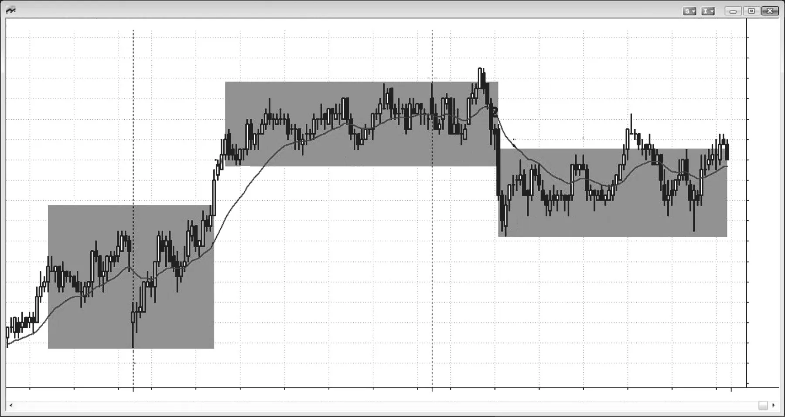
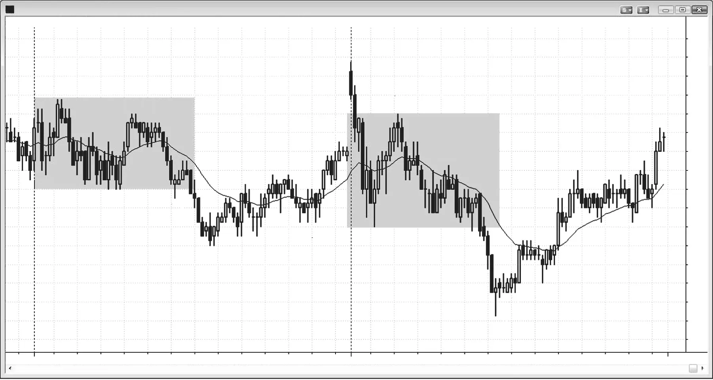
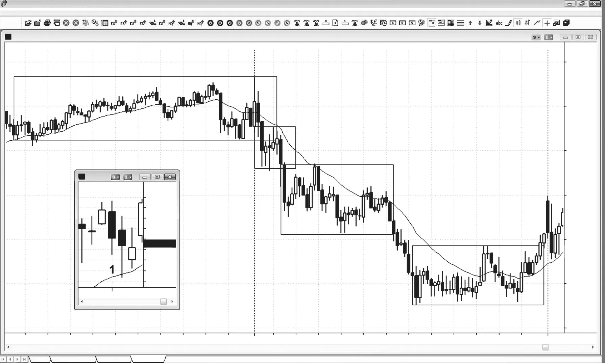
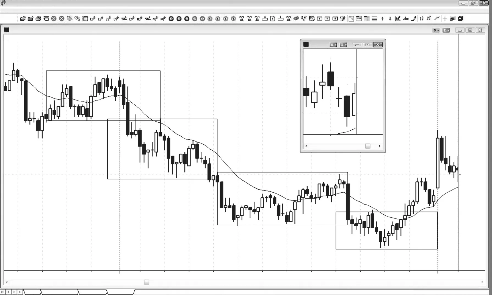
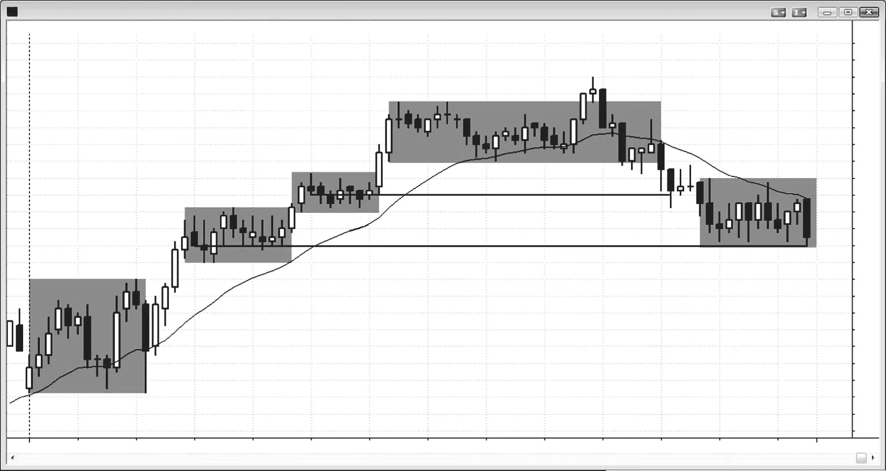
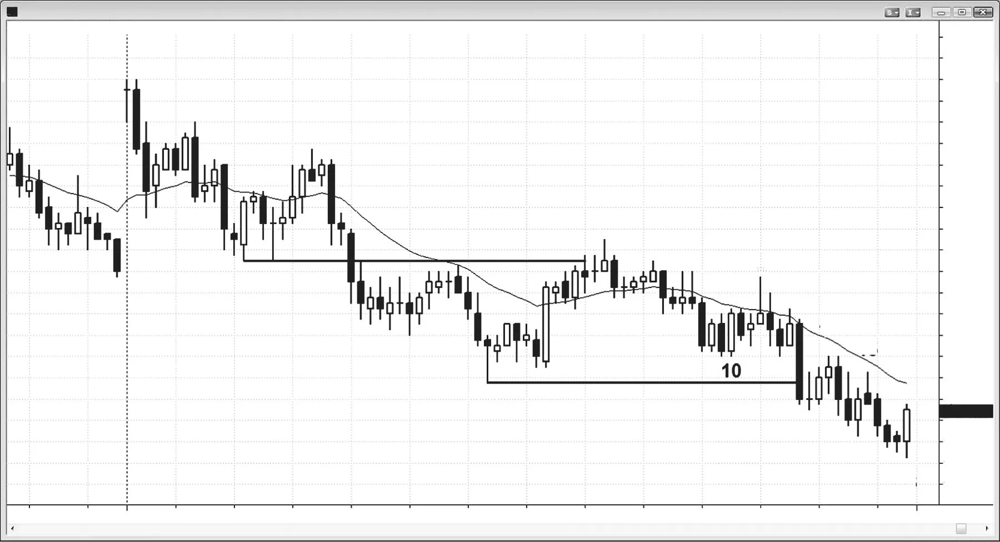
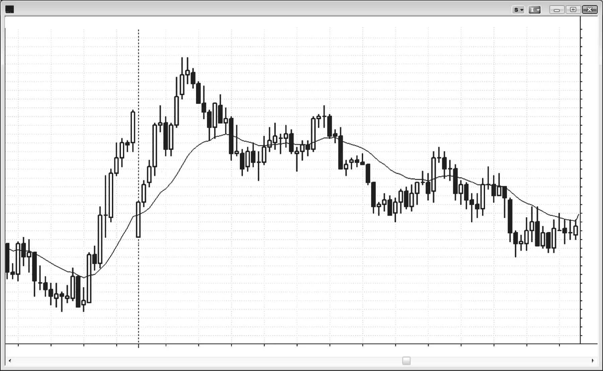
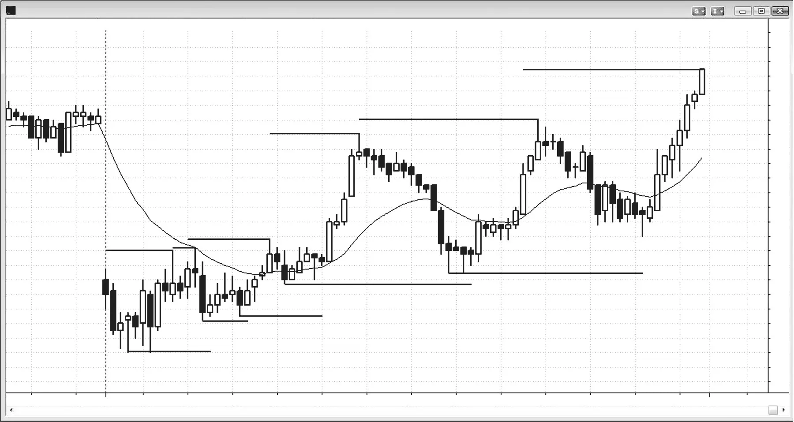
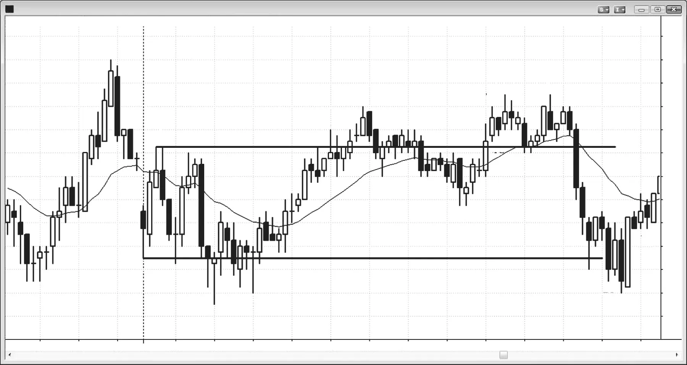
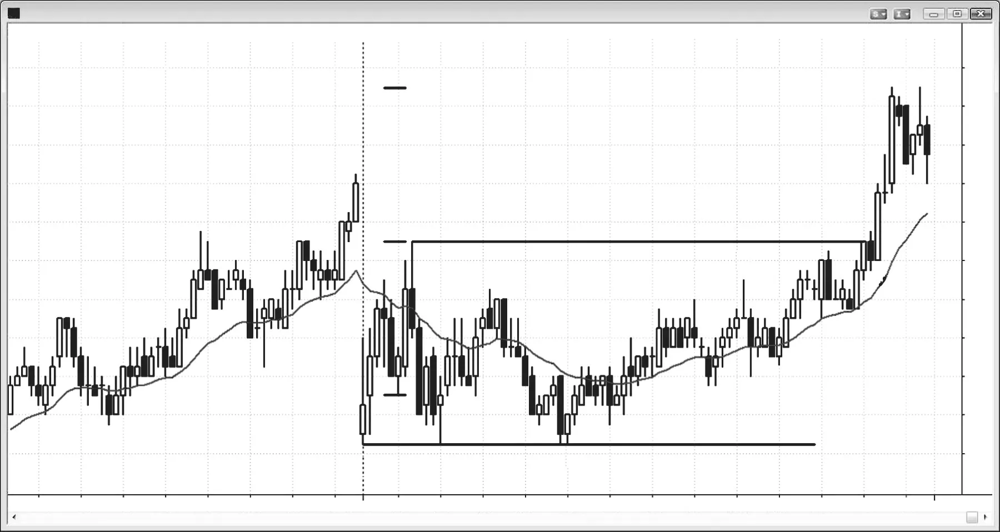

### 第22章 趋势型震荡日

<!-- English: CHAPTER 22 Trending Trading Range Days -->
<!-- Source PDF pages 391–414 -->

<!-- PDF page 391 -->

趋势型震荡日
趋势型震荡日的主要特征：
r 开盘区间大约是近期日子区间的三分之一至一半。
r 一两个小时后有突破，然后市场形成另一个震荡区间。
r 因为有震荡区间，通常有双向交易机会。
r 有时有多次突破和多个震荡区间，但当发生这种情况时，通常最好把该日看成更强类型的趋势日，只顺势交易。
r 在第二个震荡区间开始形成后，通常有回撤测试较早的震荡区间。
r 该测试常常突破回到较早区间。当它接近但未穿透此前区间时，趋势稍强一些。
r 有时市场一路穿越较早区间，该日变成反转日。
r 大多数反转日以趋势型震荡日开始。
r 当突破非常强时，该日更可能变成弱的尖峰与通道趋势。
由于每一个趋势都有回撤，而回撤是小震荡区间，某种形式的趋势型震荡日存在于每一个趋势日中，且趋势型震荡区间至少每周有几次成为主导特征。若开盘区间大约是近期平均日区间的三分之一至一半， <!-- PDF page 392 --> 则寻找突破以及日区间大约翻倍。这些趋势日通常由两个、偶尔更多个由短暂突破隔开的震荡区间构成，这些形态有时不易被看成震荡区间。然而，在日线图上，该日明显是趋势日，在K线一端附近开盘、另一端附近收盘。每当市场在创造趋势化的摆动，但该日看起来不像明确的趋势日时，它很可能是趋势型震荡日。此外，若当日第一或两个小时的区间只有近期日子平均区间的大约三分之一至一半，留意突破与大约等幅运动，然后在当日剩余时间形成第二个震荡区间。这种类型的趋势以某种形式每周出现几天，但常常更好地归类为另一种趋势类型甚至大震荡区间。
许多日子可被归类为尖峰与通道趋势日或趋势型震荡日，取决于其强度。趋势越强，该日就越会像尖峰与通道趋势日那样表现。试图区分它们的原因是它们应以不同方式交易。当某日更像尖峰与通道趋势日时，它是强趋势，交易者应专注于顺势交易和波段交易。除非有明确过渡到震荡区间或相反趋势，否则应避免逆势交易。当该日更像趋势型震荡日时，交易者通常可以双向交易，并寻找更多剥头皮。随着某日形成，有线索告诉交易者突破是更可能导致强趋势日，如尖峰与通道趋势日（甚至小回撤趋势日），还是趋势型震荡日。震荡区间比强趋势更常见，特别是趋势型震荡日大约是尖峰与通道趋势日的两倍常见，尽管每一天至少有一个尖峰与通道摆动。尖峰与通道趋势日中的尖峰最可能在日初开始，常常从第一根K线或大跳空高开或低开开始。此外，它通常要么突破昨日K线很远，要么从突破强反转，如大跳空低开日从第一根K线急剧上涨。趋势型震荡日中的尖峰是从震荡区间的突破，但通常仍在前一日的区间内。
开盘震荡区间常常持续一至三小时，可以大约是平均日区间的一半。这种缺乏紧迫感是该日不太可能变成强趋势日的迹象。此外，初始震荡区间像任何震荡区间一样有磁力吸引，这不利于突破走得太远，然后回撤并形成另一个震荡区间。尖峰与通道趋势日上的突破常常大而快。尖峰可以有三根或更多大实体、小影线、重叠很少的多头趋势K线。在趋势型震荡日上，尖峰通常只有一至三根K线，它们往往更小，有更大影线和更多重叠。若回撤只是单根K线，且回撤的突破是另一根尖峰，即使它更小且只有单根K线，该日 <!-- PDF page 393 --> 趋势型震荡日
更可能是尖峰与通道趋势日。若回撤横盘五至十根K线，或若回撤的突破是带有重叠K线和反方向趋势K线的弱通道，该日更可能是趋势型震荡日。若尖峰后的回撤强到足以使交易者对始终持仓方向不确定，则震荡区间比趋势通道更可能，因此寻找剥头皮而不是波段。
在任何震荡区间的突破上入场是低概率交易，特殊情况除外，这些在第2册关于震荡区间的部分讨论。通常更好是在突破回撤上入场，或在区间对侧的某个较早反转上入场，但若交易者确信该日可能正演化成趋势型震荡日且突破很强，交易者可以考虑在突破K线形成时入场，或在突破K线收盘附近，或在下一根K线收盘——若它也强。突破尖峰通常跟随通道，但它常常会在等幅运动区域附近停下，然后市场开始形成震荡区间。市场从一个区间突破，然后形成另一个。很少会在一天内形成三四个小震荡区间，但当发生时，该日可能应被看作并交易为更强类型的趋势日，如尖峰与通道或小回撤趋势日。交易者应更多甚至只专注于顺势形态。若市场后来回撤进入此前区间，它常常会一路回撤到该区间的另一侧。含义是市场在突破后在区间中整理。这意味着会有双向交易，测试新区间的顶部和底部，并可能在某个点向任一方向突破。一旦市场到达等幅运动区域，它很可能过渡到第二个震荡区间。交易者应随之从趋势式交易过渡到震荡区间交易。例如，若该日是多头趋势型震荡日，若趋势基于下部震荡区间高度而减弱，交易者应在大约等幅运动向上的区域获利。这是因为市场随后通常会向下测试进入突破区域，然后形成震荡区间。
一旦交易者认为市场处于趋势型震荡中，他们不应把保护性止损移到摆动低点下方跟踪，因为那些止损通常会被打到。更合理的是在市场形成上部区间时在强势中寻找离场，而不是在弱势中离场。记住，在震荡区间中，交易者应低买高卖。积极的交易者会在等幅运动目标区域逆势交易大趋势K线。例如，在多头趋势型震荡日中，一旦市场接近等幅运动目标，空头会寻找大多头趋势K线。若形成一根，他们常常会在其收盘或其高点上方做空，然后若市场走高则分批加仓更多空头。他们预期该大多头趋势K线是衰竭买盘高潮，会跟随最终向下测试进入缺口（形成下部震荡区间突破的两或三根多头趋势K线）， <!-- PDF page 394 --> 并可能到下部区间的顶部。由于他们预期会形成上部震荡区间，在市场很可能形成上部震荡区间顶部的区域、在多头尖峰顶部做空，给了他们出色的入场价。这在第二册关于震荡区间交易的部分有更多讨论。即使市场走高，概率非常高市场会回到他们入场价下方。若他们更高处分批加仓，他们可以在保本离场第一笔入场，然后把更高入场的止损移到保本，并持有以测试进入缺口。
由于全天有双向交易，该日在最后一两个小时中反转穿越至少一个震荡区间是常见的。由于每个震荡区间都有双向交易，它是多头和空头的舒适区，双方都把该区域看成价值。这创造磁力吸引，往往把突破拉回区间。
识别这类趋势日的重要性在于，这种反转是可靠的逆势交易，因为市场通常会形成突破回测。因此，一旦突破到达趋势交易者会获利的大约等幅运动目标，交易者会留意相反方向的交易，寻找在突破回测上离场。有经验的交易者会在等幅运动区域附近逆势交易强趋势K线，寻找回撤以测试突破缺口。例如，当Emini平均日区间约10点时，若有震荡区间持续几个小时，然后向上突破，强空头会在下部区间上方约四至六点开始分批加仓做空。他们寻找回撤进入突破区域，也许一路回到下部震荡区间顶部。若市场反转回到此前区间，它很可能测试此前区间中的逆势信号K线。例如，若空头趋势向上反转，它会试图到达此前失败多头信号K线的高点。若上涨延伸到上部震荡区间顶部或之上，且该日在那里收盘，该日在日线图上会是反转日。该日先卖出，然后向上反转并在接近高点处收盘。大多数反转日以趋势型震荡日开始（第3册关于反转日的部分有例子），因此每当交易者识别出该日是趋势型震荡日时，他们应始终为可能的晚期反转波段交易做好准备，这可能成为覆盖整个日区间的大日内趋势交易。
趋势型震荡日常常给出微妙线索，表明应预期突破。若你看到震荡日正在形成，但每个摆动高点都略高于前一个，每个摆动低点都高于前一个，市场可能已经在趋势中，即使它仍在震荡区间中。一旦足够多的参与者识别到这一点，市场就突破并快速移至更高水平，在那里它再次会变成双向并形成另一个震荡区间。

<!-- PDF page 395 -->

趋势型震荡日
当初始突破发生时，不要假定在市场试图增长到平均日区间时等幅运动有保证。大约三分之一的情况下，市场会突破一侧并略微扩大区间，然后反转并突破另一侧并再略微扩大区间，结果是安静的震荡日。
有时有一个高度大约是近期平均日区间一半的震荡区间，且区间保持很小直到最后一小时。例如，若Emini的日区间在市场进入最后一小时时只有五点，而近期平均区间是12点，且过去12个月中只有两天以五点或更小的区间收盘，要为日末突破做好准备。每一天在某个点都有五点的区间，哪怕只是第一分钟。大多数初始区间只有五点的趋势型震荡日在前两三个小时内有突破，但一年中有几次该日会保持很小直到最后一两个小时。当发生这种情况时，大多数时候会有扩大区间的突破，但通常不会一路到近期日平均。不要放弃该日并假定它最终只会是五点区间日，因为在90%的情况下区间会在收盘前扩大，你常常可以有利可图地交易短暂突破。因为突破发生得如此晚，通常没有足够时间形成多少震荡区间，但由于该日全天看起来可能是趋势型震荡日，在这里讨论它是合适的。

<!-- PDF page 396 -->

图 22.1

图 22.1
趋势型震荡日
趋势型震荡日常常在区间之间有单根大趋势K线。在图22.1中，市场在昨日最后几个小时从K线1到K线3处于震荡区间，震荡区间持续到今日前几个小时。K线10是大多头趋势K线，突破了震荡区间，并升破由K线5、7和9形成的楔形顶部。下一根是多头趋势K线，它确认了突破（它显著增加了更高价格和某种等幅运动向上的机会）。市场立即进入小震荡区间并持续到当日剩余时间。
该区间持续到第三天。任何震荡区间对市场都有磁力吸引，这使大多数突破尝试失败。从K线11到K线19的震荡区间是上涨中的最后多头旗形，向K线21的突破失败。市场随后以大K线22空头趋势K线跌破这个上部震荡区间。抛售测试了前一日区间的顶部并形成另一个震荡区间。K线29是下部区间顶部的失败突破和第三次向上推动，下部区间的拉力大于上部区间。市场回撤穿越下部区间，在K线32测试底部，然后在下部震荡区间顶部附近收盘。
从K线8到K线13的多头尖峰很大，但从K线12到K线17的跟随通道不成比例地小。下部震荡区间顶部（K线9）与上部震荡区间底部（K线12）之间的突破缺口， <!-- PDF page 397 --> 图 22.1
趋势型震荡日
相对于上部区间高度很大。这增加了市场会回到缺口中测试其强度的机会。从K线23到K线33的震荡区间大部分处于K线9与K线12之间的突破缺口内，这常常发生。
从K线4到K线9的初始区间大约是平均日的一半。因此交易者预期区间大约翻倍。当有大约是平均日区间一半的震荡区间时，区间扩大最常见的方式是突破并形成趋势型震荡日。
第三天从K线19到K线21的开盘区间大约是平均日的三分之一，交易者预期突破。由于他们也预期测试进入前一日的缺口，向下突破很可能，它跟随了试图突破区间顶部的失败尝试。向下到K线23的尖峰很强，该日本可能变成尖峰与通道空头趋势日，但K线23测试了昨日震荡区间提供的支撑（K线3、5和7的高点）。它大约是等幅运动向下，也测试了三日期趋势线（未显示）。这意味着抛售可能只是强多头和空头靠边站直到市场跌到支撑区所创造的卖盘真空，在那一点他们积极买入。从K线23、25和26向上的多头尖峰；K线25与26之间尖峰创造的双底多头旗形；以及K线28的双底回撤都代表增加的买盘压力，市场甚至在向上到K线29的尖峰上翻转为始终做多。这不是尖峰与通道空头趋势日中尖峰后回撤的典型情况，这使趋势型震荡更可能。若这要变成尖峰与通道空头趋势日，从K线23尖峰的回撤通常不会有与空头尖峰强度相比太多的买盘压力。买盘压力创造的不确定性增加了震荡区间而不是短暂回撤然后漫长空头通道的机会。不确定性是震荡区间的标志，而不是空头旗形（通向空头通道的回撤）的标志。
尖峰与通道趋势日与趋势型震荡日之间的区分并不总是清晰，有时并不重要。尽管在K线12开始的震荡区间使该日成为趋势型震荡日，它也有更高低点与更高高点，因此是弱多头通道。记住，通道只是倾斜的震荡区间，两者都是双向交易区域。它越不倾斜，就越表现得像震荡区间，交易者就越能安全地双向交易。

<!-- PDF page 398 -->

图 22.2

图 22.2
初始震荡区间大约是平均日区间的一半
如图22.2所示，在两天的前几个小时，区间大约是近期日子的一半。这提醒交易者可能有向任一方向的突破。当突破像这样在日中较晚开始、开盘区间中没有明确方向，且初始区间大约是平均日的一半时，突破通常不会导致强劲、无情的趋势，如尖峰与通道趋势。相反，它通常有回撤，然后市场形成更低的震荡区间。更低区间可能突破回到上部区间，也可能不，有时可能再次向下突破并形成第三或第四个震荡区间。由于更低震荡区间比强空头趋势更可能，交易应是双向的，市场通常会一路回到突破区域。一旦突破延伸到突破点下方大约平均区间的三分之一，交易者会开始寻找买入以波段向上到上部区间底部。他们会在K线11上方和K线28上方买入第二次试图向上反转。他们也会买入K线5的双底和K线29的更高低点。
一旦市场突破回到上部区间并在那里站稳，它常常向上测试接近上部区间顶部，如第二天那样。若该日在上部区间顶部附近或之上收盘，该日变成反转日。
积极的多头会买入K线27之前大多头趋势K线的收盘， <!-- PDF page 399 --> 图 22.2
趋势型震荡日
预期它是衰竭卖盘高潮，会导致向上测试到上部震荡区间底部。有些会在基于上部震荡区间高度的等幅运动向下处用限价单买入。他们会计算从K线22顶部向下到K线21或25底部的点数，然后从K线21或25的低点减去该数。他们会在该价格水平附近开始分批加仓，也许从上方一两点开始到下方几点。另一些会在双向交易的第一迹象买入，如K线27收盘，或当K线27从其低点反转时。假定平均日区间约10点，有些多头会在上部区间底部（K线25）下方四至六点分批加仓，寻找在回撤进入突破缺口（K线25下方的空头趋势K线）上赚三至六点。
尽管从K线19到K线21的抛售很急，向上到K线22的上涨也很急。这导致对开盘区间方向足够的不确定性，降低了尖峰与通道趋势日的机会，增加了趋势型震荡日的机会。

<!-- PDF page 400 -->

图 22.3

图 22.3
趋势型震荡区间创造趋势
有时某日可以大部分时间处于震荡区间中但仍然是趋势日。如图22.3所示，今天可能看起来不像趋势日，但它是，如日线缩略图可见（今天是K线1），它由一系列趋势化的小震荡区间构成。这些日子常常在最后几个小时反转，并至少回撤最后的震荡区间。
本图更深入讨论
有些日子一个小时或更长时间没有可靠形态。在图22.3中，今天在平缓均线处开盘，位于昨日最后一根K线的区间内，昨日最后一根K线处于小震荡区间，该区间持续到今日开盘的前两根K线。今日前两根K线相对于震荡区间高度很大，这使它们成为有风险的信号K线。尽管在第二根K线下方做空可以接受，因为它是两K线反转做空形态且是均线下方的楔形空头旗形，但入场会靠近震荡区间低点。更安全的是等待突破，然后若有突破回撤则做空。几根K线后出现了一个，但它处于小而紧的震荡区间中，K线有大影线，使 <!-- PDF page 401 --> 图 22.3
趋势型震荡日
其不那么可靠。更好的入场是在太平洋标准时间上午8:00的两K线反转下方以及回撤至均线，那是Low 2 做空。
太平洋时间11:45有均线缺口K线做空，对空头低点的测试以更高低点形式出现。也适合称它为双底多头旗形。
这是趋势型震荡日，因此一旦它开始在185美元水平附近筑底，交易者可以在该区域买入以测试刚好在186美元上方的上部区间底部。市场有两段式抛售向下到185美元水平，第二段是大约等幅运动。上午震荡区间的中点大约在当日高点下方2.00美元，上午10:15的大两K线反转大约低2.00美元，因此交易者会开始买入。空头在买回部分空头，多头在买入以测试上部震荡区间底部。市场进入紧震荡区间，有三次小向下推动，以上午11:05的大空头趋势K线结束。随后是上午11:30的更高低点，信号K线有多头实体。这个更高低点也是High 2，因为其前一根和再前两根有空头实体。这是微观分析，大多数交易者实时不会信任这个，但有经验的交易者总在寻找市场可能转折的迹象，这些微妙提示会帮助他们有信心做多。若他们在11:30低点上方买入，他们可以冒约50美分风险到该低点下方，目标是在测试上部震荡区间时赚约一美元。
尽管你永远无法确定等距移动的方向概率，每当你感觉有不平衡时，你应假定它至少是60%。这里，合理假定若你在185美元附近买入，在保护性止损被打到之前测试186美元的机会至少有60%，若你把该止损等距放在入场下方（有60%机会你在亏损一美元之前赚一美元）。你可以在上午11:40多头尖峰向上后的十字星内包K线上部分获利，并在突破失败时保本离场剩余。一旦市场在12:25双底，你可以再试同样的做多，你会成功。有从双底等幅运动向上到2.00美元利润的机会，但当日剩余时间如此之少，这不太可能。

<!-- PDF page 402 -->

图 22.4

图 22.4
第一个震荡区间可以形成于昨日
如图22.4所示，这是另一个趋势型震荡日，第一个震荡区间从昨日开始。日线缩略图显示它是空头趋势日（K线1）。
最后的震荡区间向上反转，市场在临近之前测试接近更高震荡区间的顶部。这常常发生，因为双向交易意味着趋势力量不像其他趋势日那样强。当某日不那么强时，它不太可能在低点收盘。交易者知道这一点，并寻找进入收盘的反转交易。
本图更深入讨论
在图22.4中，今天再次基本平开，靠近平缓均线。然而，三K线空头尖峰使空头趋势日很可能。尖峰跌破昨日最后一小时形成的震荡区间。该震荡区间也是两段式上涨，因此是空头旗形，所以突破可以看成对空头旗形底部多头趋势线的突破。交易者可以在第一次回撤下方做空，然后再次在均线测试下方做空，那也是向均线的两段式横盘调整以及大约双顶空头旗形形态。

<!-- PDF page 403 -->

图 22.5

趋势型震荡日
图 22.5
由突破隔开的震荡区间
如图22.5所示，第一小时包含在七点区间内，但近来平均区间约20点，因此交易者预期区间大约翻倍。每当趋势在日中一小时后开始，该日常常变成趋势型震荡日，部分因为按定义那第一小时显然是震荡区间。该日常常在日中较晚反转回到并有时穿越一个或多个更低的震荡区间，如此处所示。
本图更深入讨论
当该日如图22.5那样形成多个趋势型震荡区间时，交易者应专注于做顺势交易。交易者应只从K线2的两K线反转到K线9的20均线缺口K线High 2 寻找买入。他们应只在K线10最后旗形反转形态考虑做空。
许多多头会对其多头获利，积极的空头会在K线10之前多头趋势K线的收盘及其高点上方做空。市场有向上到K线3的尖峰，然后是通道或一系列小震荡区间，但在K线8开始的那个相对紧且水平。这是强双向交易区域，因此是磁铁，往往在突破后把市场拉回。

<!-- PDF page 404 -->

图 22.5
市场也常常在日中较晚回撤进入此前震荡区间，由于太平洋标准时间上午11:30是常见的反转时间，失败突破和最后旗形反转的概率很高。回撤本可以测试多头通道起点K线4，因此空头高兴在大多头趋势K线突破摆动高点和潜在最后旗形的高点做空。许多人会更高处分批加仓更多空头，相信市场有70%或更高机会在收盘前至少测试他们第一个做空入场价。这会使他们能够在保本离场原有空头，并决定是对更高处的空头获利离场，还是把保护性止损移到保本并波段持有交易向下。
K线2是从可能失败的Low 2（来自双底或三重底）向上两K线反转的第一根，以及多头趋势的起点。交易者意识到市场可能突破并奔跑。一旦市场突破，它从K线4到6形成更高区间，该区间包含两个小的紧震荡区间。K线5上方的High 2 做多是合理的突破回撤入场，尽管有铁丝网形态。突破既来自K线3到4的小多头旗形，也来自整个K线3到5震荡区间，那是对K线1上方突破的两段式横盘回撤。
市场突破到第三个区间，从K线8到9。当它再次突破时，在K线10失败（最后旗形反转）并回撤穿越第三个区间底部，最终到第二个区间底部。空头尖峰后在K线11下方有突破回撤做空，但铁丝网形态使它风险更高。在以K线12结束的形成尖峰的两根空头K线之后，在K线13下方有第二次突破回撤做空。
“区间”一词的含义是市场会在某个点测试区间低点，尽管它可能继续向上交易。当市场回撤强移动时，第一个目标始终是较早的逆势入场点。这里，市场突破顶部区间后最近的空头入场点是最近空头信号K线——K线6——的低点。市场突破顶部区间，然后突破进入下一个更低区间，并在K线13打掉该空头信号K线低点。
到收盘时，市场已测试第二个区间中最低空头信号K线——K线3——的低点。

<!-- PDF page 405 -->

图 22.6

趋势型震荡日
图 22.6
趋势日中的双向交易
尽管今天（见图22.6）在高点开盘、在低点收盘，是开盘即趋势的空头趋势日，前两小时有太多横盘行为，不能像那种日那样交易。开盘即趋势的趋势日通常没有许多显著的可交易逆势摆动，但趋势型震荡日有，且是更弱、更不可预测的趋势日类型。初始震荡区间在K线4向下突破进入更低区间，创造了趋势型震荡日。
直到K线3，日区间只有近期日子的大约一半，因此交易者意识到可能形成更低震荡区间。
K线6是回撤至均线的突破回撤，以及对上部区间底部K线2的突破回测，提供合理的做空入场。
K线9是上部区间的突破回测以及这个更低区间顶部的失败突破，设置了另一个做空。
K线12向下突破进入第三个区间，但当日剩余时间不足以向上测试区间顶部K线13。
本图更深入讨论
在图22.6中，昨日收在均线下方，今日开盘是对收盘和均线的多头突破。当日第一根K线是十字星，因此 <!-- PDF page 406 --> 图 22.6
不是可靠的做空信号K线。K线1强空头趋势K线是在其低点下方1个tick做空的合理信号K线，用于测试均线，也许是昨日收盘。由于大跳空开盘常常导致趋势，而这根空头K线是空头紧迫感的迹象，今天可能变成空头趋势日，交易者应尽早做空并波段持有部分，直到有强多头反转或直到当日收盘。
在两K线空头尖峰之后，交易者预期空头通道并开始做空回撤。第一个回撤做空是太平洋标准时间上午7:00刚过后向下外包K线触发的Low 2，下一个做空是在K线3空头反转K线下方。它是对决线做空形态，既与较早回撤形成双顶，也是楔形空头旗形（第一次向上推动是K线2之前两根）。
K线14是多头反转K线，但它与前两根K线重叠太多，不可靠。此外，它处于K线12空头尖峰后相对紧的通道内，因此在空头趋势中更好是等待突破回撤更高低点再做多。由于它是空头趋势中的弱买入形态，其失败很可能是良好的做空形态。K线15是失败的High 2，以及在空头趋势中靠近均线的带空头反转K线的Low 2，是非常高概率的做空形态，因为买入High 1和High 2趋势反转尝试的多头通常在Low 2离场。市场刚刚对当日新低做了两次反转尝试，这第二次在K线15做多后的那根K线上失败。当市场两次试图做某事都失败时，它通常然后朝相反方向运行。

<!-- PDF page 407 -->

图 22.7

趋势型震荡日
图 22.7
第一小时后开始的趋势往往较弱
每当市场在第一小时后开始趋势时，假定它会导致趋势型震荡日或表现得像一个，并寻找双向剥头皮。尽管图22.7中有开盘即趋势多头，它在K线5以尖峰与高潮结束，然后向下反转进入趋势型震荡空头趋势。它也可以看成尖峰与通道空头趋势，从K线5到K线6的移动是空头尖峰，从K线7到K线8的向下移动以及随后到K线10的三K线突破是额外尖峰。向下的通道足够宽，两次突破后的回撤与此前摆动低点重叠，以至于它也是空头阶梯形态。
本图更深入讨论
市场跳空向下到更高低点，在图22.7中形成可能的开盘即趋势多头。它是在强尖峰进入收盘后对均线的测试，以及对那个强多头通道下方失败突破。
两段式向上移动在K线5以最后旗形做空结束。随后是四K线空头尖峰，它成为以K线6结束的更大尖峰的一部分。这个移动 <!-- PDF page 408 --> 图 22.7
跌破从开盘上涨的多头趋势线，因此更低高点可能导致趋势反转向下。
两段式更低高点在K线7结束，提醒交易者可能继续向下。K线7是对决线形态。它与向下到K线6的楔形空头通道顶部形成双顶（该通道以K线5下方四K线空头尖峰后形成的小更低高点开始），它也是楔形空头旗形（第一次向上推动以K线6之前那根结束，K线7是第三次向上推动）。
市场在当日剩余时间表现得像趋势型震荡空头。向上到K线1以及再次向上到K线5的强多头动能是向上尖峰，可能在接下来一两天的某个点跟随多头通道。K线6、8和10创造了大楔形多头旗形，测试K线5高点是可能的。K线4也可以看成该空头通道的一部分。次日（未显示）实际上跳空高开接近K线7高点，并成为强开盘即趋势多头日。

<!-- PDF page 409 -->

图 22.8

趋势型震荡日
图 22.8
初始震荡区间常常预示另一个震荡区间
在图22.8中，前几个小时的区间大约是平均日区间的一半，这提醒交易者可能有突破并形成更高或更低震荡区间，以及创造趋势型震荡日。多头趋势在K线9突破之前已经明显。注意K线5摆动低点高于K线2低点，K线6低点高于K线5低点，K线8低点高于K线6低点。同样的事情发生在K线3、4和7的摆动高点上。即使市场在前两个半小时处于震荡区间，摆动高点和摆动低点都在向上趋势化，表明震荡区间内已经有多头趋势在进行。这提醒交易者留意突破，它发生在K线9。这个更高震荡区间持续到跟随K线13向上反转的突破。K线11和13都是突破回测。K线11的双底跌入下部震荡区间，但K线13低点精确到tick测试了下部震荡区间顶部K线7。当回撤不能跌破突破点时，它是多头力量的迹象。
本图更深入讨论
市场在图22.8中突破到昨日收盘下方，第一根K线有空头实体，因此该日可能变成开盘即趋势空头趋势日。然而， <!-- PDF page 410 --> 图 22.8
K线1上方和下方有影线，这增加了初始震荡区间的机会。交易者应等待。K线2是微型双底，但两根都是十字星，因此这不是强趋势的形态。即使K线4在均线处的楔形空头旗形也是弱形态，因为它是六K线紧震荡区间的一部分，且所有K线都有影线。这意味着有不确定性，那是震荡区间的标志。交易者本可以在跟随K线5的多头内包K线上方买入，但在那个K线4楔形空头旗形之后，市场应有第二次向下测试。这发生在K线6，与K线5形成双底，以及对当日低点双底（K线2和三根之后那根）的双底回撤。更安全的是等到有更多多头力量证据后再买入，如向上到K线7的四K线多头尖峰，但在K线2之后刚有几根强多头趋势K线，这是足够的力量迹象，可以开始在回撤上做多交易。那些大多头趋势K线是买盘压力的迹象，买盘压力是累积的。一旦有临界质量的买入，多头控制市场，市场走高。
在那个向上到K线7的多头尖峰之后，在跟随K线8的多头内包K线上方有突破回撤买入形态，那也是失败的Low 2 买入信号。四根K线后有High 2 做多形态，导致K线9强多头突破。

<!-- PDF page 411 -->

图 22.9

趋势型震荡日
图 22.9
初始震荡区间之后可以跟随震荡日
仅仅因为前几个小时的区间大约是平均日的一半，并不意味着会有突破进入趋势型震荡日。大约三分之一的情况下，区间通过突破当日高点和低点双方而扩大，如图22.9所示。市场在K线4和6从当日新低向上反转，在K线3、10、12、19和21从当日新高向下反转。开盘区间可能以从K线5向下反转结束，在那一点日区间大约是近期日子的一半。这提醒交易者可能向上或向下突破，然后是大约使日区间翻倍的等幅运动。然而，简单地在震荡区间突破上入场是亏损策略，因为市场始终有惯性，大多数从震荡区间变为趋势、或从趋势变为震荡区间的尝试都会失败。在K线6突破到当日新低后没有好的做空形成，事实上K线7在三次向下推动（K线2、4和6）后的更高低点，以及K线8突破回撤，是测试当日高点的合理买入信号。
K线10在突破到当日新高后向下反转，但市场处于紧多头通道中，因此这不是好的做空形态。向上动能不是特别强，因此买入K线11突破回撤充其量是剥头皮交易。市场在K线12以两K线反转再次向下转。震荡日上的第二次入场反转通常至少对剥头皮可靠。

<!-- PDF page 412 -->

图 22.9
市场在K线16楔形多头旗形后有向当日新高的运行，市场再次在K线19和21失败。一旦清楚向上突破不会成功，市场再次试图突破当日相反一端。如震荡日上常见的那样，市场在区间中部收盘。
当开盘区间的顶部和底部有几种可能时，通常你选择哪一个并不重要，因为没有共识。当寻找你可以获利的等幅运动目标时，最初使用开盘区间的最小可能，如K线2到K线3。若市场在该区域不停顿，则看下一个更大的可能，如K线3到K线4，或K线3到K线6。由于今天最终是震荡日而不是趋势型震荡日，明显的等幅运动目标未被达到。然而，每一次反转都是由于基于某种测量的计算机算法，方程中几乎总有某种等幅运动，即使不明显。

<!-- PDF page 413 -->

图 22.10

趋势型震荡日
图 22.10
晚期突破
有时初始震荡区间大约是平均日区间的一半，突破直到最后一小时才到来。在图22.10中，尽管没有足够时间形成多少上部区间，该日全天都是突破进入趋势型震荡日的形态。突破前的区间只有5.25点，过去11个月中只有两天以5.25点或更小的区间收盘。这意味着今年其他可能大部分时间有5.25区间的日子，到收盘时有更大区间，这使今天也很可能有晚期向上或向下突破。由于市场从K线7三重底和三角形以来一直在向上趋势，且K线9与12之间有多头实体的K线数量很多，买盘压力存在，向上突破很可能。交易者会在K线14突破K线4当日高点上方买入，在强K线14突破K线的收盘买入，并再次在其高点上方买入。
从K线3到K线4的初始空头尖峰产生了到当日高点的等幅运动。交易者永远不知道哪个可能的等幅运动目标会是多头获利的水平，但最好意识到这些可能，这样你也可以在市场向上奔跑时获利，而不是在抛售时低几点。市场也可能在基于K线1低点到K线2高点的等幅运动，或从K线5低点到K线4、6、10或12高点的等幅运动处见顶。

<!-- PDF page 414: no extractable text (likely figure-only) -->
