### 第23章 开盘即趋势与小回撤趋势

<!-- Source PDF pages 415–446 -->
<!-- CHAPTER 23 Trend from the Open and Small Pullback Trends -->

<!-- PDF page 415 -->

第 2 3 章
开盘即趋势
与小回撤
趋势
开盘即趋势日的主要特征：
r 多头趋势日的低点或空头趋势日的高点在当日最初几根K线内形成。
r 若当日开盘区间小于近期平均日波幅的25%，多头趋势日上可能有双底，或空头趋势日上可能有双顶（若开盘区间约为平均日波幅的50%，突破更可能导致趋势型震荡日）。
r 该日可能始于持续许多K线的强尖峰，也可能有小开盘区间。
r 若市场自第一根左右K线起趋势，且初始尖峰持续三根或更多K线，在第一次回撤时入场通常至少适合剥头皮。
r 若开盘有持续许多K线、覆盖许多点数的强尖峰，该日通常会成为尖峰与通道趋势日。
r 大幅跳空开盘常常导致开盘即趋势日，趋势可以朝任一方向。当有大幅向上跳空且形成开盘即趋势日时，约60%的时间该日是多头趋势日，40%的时间是空头趋势日。向下跳空开盘则相反。缺口越大，该日越可能是趋势日，趋势越可能朝缺口方向。
r 开盘即趋势日从一开始就有紧迫感和信念，通常是最强的趋势，回撤最小。
r 20缺口K线和均线缺口K线形态出现在趋势后期。

<!-- PDF page 416 -->

r 最强类型的开盘即趋势日和最强类型的趋势，是开盘区间很小，然后全天以小回撤无情趋势的日子。这是小回撤趋势日。例如，Emini中的回撤可能只有10到12个tick（平均日波幅的10%到30%）。当是这种情况时，通常在最后几小时有一次回撤，约为早期回撤规模的150%到200%，随后趋势恢复进入收盘。
r 对有经验的交易者来说，波段形态有70%或更高成功概率，即使对初学者来说它们从不看起来那么确定。许多信号K线看起来很差，如所有强趋势中的情况。大多数形态看起来只有50%或更低的成功概率。这使交易者不做这些交易，迫使他们追涨杀跌，或完全错过趋势。
r 常常有许多反向趋势K线，这是逆势压力的迹象，使初学者寻找反转而不是顺势交易。例如，在多头趋势中，会有许多空头趋势K线和许多两K线、三K线空头尖峰。初学者反复对它们做空并亏损。尖峰演化成看起来疲弱的多头旗形，这使初学者不愿买入它们。他们刚从亏损空头中出来，情绪上还没准备好再次冒险亏损，尤其是在看起来不强的形态上。每一个看起来很差的多头旗形都成功了，随后是另一个看起来很好却失败的做空形态。
r 趋势常常处于相对窄的通道中，回撤常常回到并触及保本止损，把交易者困出场。交易者需要在多头趋势中把止损移到摆动低点下方，或在空头趋势中移到摆动高点上方。若他们过于急于把止损移到保本，会被困出场。
由于几乎所有小回撤日都是开盘即趋势日，它们应被视为强变体。开盘即趋势日通常是最强形式的趋势形态，但仅在约20%的日子发展。这意味着在第一根K线上方买入或在其下方做空、预期它是强趋势的起点，是低概率交易。反转在第一个小时远更常见，如第3册讨论。在大幅跳空开盘的日子，若第一根K线是任一方向的强趋势K线，第一根K线成为当日高点或低点的机会可以是50%或更高。当日高点或低点在最初大约五根K线内形成约占50%的日子。然而，它在开盘区间内形成——开盘区间可以持续几小时——约占90%的日子。任何类型的趋势日都可以开盘即趋势。在开盘即趋势日中，市场在第一根或最初几根K线形成一端极值，然后全天趋势，常常在或靠近相反极值收盘。最初30分钟左右可能有小震荡区间然后突破，但当日开盘通常非常接近当日一端极值（多头趋势中的低点或

<!-- PDF page 417 -->

开盘即趋势与小回撤趋势
空头趋势中的高点）。这些日子常常以大幅跳空开盘，然后市场以任一方向继续趋势。换句话说，大幅向下跳空可以导致多头或空头开盘即趋势日。若形态形成于强磁体如趋势通道线（例如，形成楔形反转形态），或若它是反转形态的一部分，如昨日收盘最后旗形的反转，形态更可靠。
这类趋势可以如此之强，以致次日第一个或两个小时可以有跟随，所以交易者应在次日开盘后的回撤时寻找顺势入场。回撤常常足够强使交易者怀疑市场是否在反转，但它通常只是更高时间框架、两段式调整，如回撤至15分钟移动平均线。然而，大多数交易者会发现交易时只读一张图更容易，而回撤结束时总有5分钟形态。
当开盘即趋势日正在演化时，全天回撤常常非常小。当这种情况发生时，这是小回撤趋势日。这是最强类型的趋势日，每月仅形成一两次。这些日子中约三分之二在太平洋标准时间上午11:00之后有更大回撤。那次回撤常常约为自趋势在第一个小时开始以来最大回撤的两倍。它常常由相对较大、强的一两根顺势方向趋势K线预示，但代表高潮性衰竭。以小回撤多头趋势日为例，最大回撤一直是九个tick，市场全天在通道中上行。若在太平洋标准时间上午11:00至中午之间的某个时候，市场有两根相对较大的连续多头趋势K线突破至新高，该走势更可能是衰竭买盘高潮，而不是新腿的起点。高潮在第3册有更多讨论，但当趋势已持续很久然后有异常进一步强度时，它通常标志着暂时走势结束，以及开始约持续10根K线左右的两段式回撤。有经验的交易者预期三到五点的回撤，他们会退出多头。有些人甚至会在那第二根多头趋势K线收盘做空，或在其高点上方一两个tick做空，预期回撤。他们可能等待下一根收盘，若收盘在中部附近，他们可能在收盘做空。若它是空头反转K线，他们可能在其低点下方做空。若他们在空头反转K线下方入场，保护性止损会在其高点上方；但若他们在多头尖峰收盘市价入场，他们可能使用三或四点止损，并在高一或两点处分批加仓。即使他们错了、市场没有下跌几点，它也很可能进入震荡区间，他们应能在最后一小时内以小利润出场。
在趋势开始之前的第一个小时可能有略大的回撤，但只有趋势开始后的回撤是重要的。看它们的规模，若它们都非常小，且每一个后续的都保持在与第一个相同或更小的规模，该日是强趋势日。例如，在

<!-- PDF page 418 -->

Emini多头趋势中，平均日波幅一直约为12点，回撤可能都只有两或三点。多头想要更大回撤以便做多，希望风险更小。等待却得不到想要的之后，他们开始市价以及在小回撤时开小仓位。这全天的小买盘持续抬升市场。空头从不见到很好的做空，他们决定反而以更小仓位和更弱形态做空。没有跟随，他们被迫回补，这种买盘加剧了市场的缓慢上涨。动量交易者看到趋势，他们也全天买入。趋势通常全天以仅小回撤延续，但因为多头全天在买小仓位，他们从不必在恐慌中追高。此外，因为空头从没有重仓做空，没有强空头回补。结果是，即使该日是趋势日，它常常覆盖的点数不太多，多头不会获得意外暴利，即使他们站在强趋势的正确一侧。
太平洋标准时间上午7:00的报告常常可以导致反转K线、突破K线或大外包K线，成为可持续全天的强趋势起点。然而，计算机在报告上有巨大优势。它们即时接收数据，格式可处理以做出导致订单的决策。这一切在一秒内发生，给它们相对交易者显著优势。当计算机有大优势时，交易者处于劣势，因此很少应在报告发布的那一刻入场。计算机通常会在一两根K线内显示始终持仓交易是什么，或者会形成强反转。交易者届时概率在他们一边，可以寻找适当方向入场。导致趋势起点的强K线并不总是出现在报告上，可以在报告前或后数根K线形成。它在报告上发生得足够频繁，交易者应准备好它，然后在始终持仓仓位变得清晰时尽快入场。
有时，在约30分钟小区间之后，在太平洋标准时间上午7:00左右有对开盘的测试，通常与报告重合。虽然这导致小震荡区间，突破的趋势远比趋势型震荡日上看到的更强；它与开盘即趋势日相同，应被视为变体。
即使最好的形态，约40%的时间仍不能做你预期的事。若市场到第三或第四根K线还不停顿，它可能走得太远太快，这增加了市场会反转而不是趋势的机会。
每一天在最初几根K线内都始于开盘即趋势日。一旦一根K线移到前一根高点上方，该日就是开盘即趋势多头趋势日，至少在那一刻。若它反而交易到第一根低点下方，它就是开盘即趋势空头趋势日。在大多数日子，该走势

<!-- PDF page 419 -->

开盘即趋势与小回撤趋势
没有太多跟随，有反转，该日演化成其他类型的日子。然而，当前一根的突破成长为更大尖峰时，强开盘即趋势趋势日的概率显著增加，交易者应开始把该日当作强趋势日交易。
若市场趋势四根或更多K线而没有回撤，甚至两根大趋势K线，该走势应被视为强尖峰。尖峰是一个区域，多头和空头都同意应发生很少交易，因此市场需要快速移到另一个价格水平。当尖峰在最初几根K线期间开始时，该日是开盘即趋势日。它可能全天保持如此，但有时市场很快反转并向另一方向突破。这可以导致相反方向的趋势，如尖峰与通道趋势或趋势型震荡日，或只是震荡日。
与任何强尖峰一样，早期买入的多头会在某个点部分止盈，造成小回撤（如先前趋势部分所讨论）。错过走势的其他多头会积极买入回撤，想要更大仓位的多头也会。多头会在前一根低点处及下方用限价单买入，希望当前K线跌破前一根，让他们买得稍低。其他多头会在回撤K线高点上方用止损单买入（High 1买入信号）。
尖峰通常跟随三件事之一。第一，市场可能走得太远太快，正在经历衰竭高潮行为。例如，若随后有停顿或回撤如内包K线或小楔形旗形，这可以成为最后旗形，并在小突破后导致反转，反转可以持续数小时。或者，市场可能在窄幅震荡区间中横盘数小时，随后趋势恢复进入收盘，导致趋势恢复日。这种小横盘运动在无情的五到十K线尖峰后很常见。第三也是最常见的结果，当尖峰没有大到衰竭时，是形成趋势通道，该日然后成为尖峰与通道趋势日。
在强第一腿后的第一次回撤时入场，只是利用强走势测试极值的倾向。大多数强走势至少有两段，所以在第一次回撤时入场有很好机会导致盈利交易。若你错过了原始入场，这个入场在开盘即趋势日上尤其重要。在强趋势中，什么构成第一次回撤并不总是清晰，因为趋势常常有两三根横盘K线，不突破有意义的趋势线，因此实际上不足以构成“回”撤。然而，即使没有回撤、价格没有真正回撤，停顿是横盘修正，是回撤的变体。
交易这些非常强的趋势日最困难的部分是，当它们形成时趋势看起来并不特别强。通常没有令人印象深刻的尖峰或容易、高概率的回撤至移动平均线。相反，市场每隔几根K线就有回撤，以及许多

<!-- PDF page 420 -->

反向趋势K线。它常常处于看起来疲弱的通道中。初学者未能看到的是，回撤都很小，市场似乎从不到达移动平均线，价格持续缓慢离开开盘。有经验的交易者把所有这些看作多头趋势非常强的迹象，这给他们做波段交易的信心。他们正确地知道，虽然K线看起来像疲弱通道的一部分，因此应创造低概率形态，但当它们出现在小回撤多头趋势日中时，它们形成高概率波段形态。开盘即趋势日中的所有回撤都是极好的顺势入场，即使它们几乎总是看起来疲弱。即使回撤最终突破有意义的趋势线后，交易者仍可继续有信心顺势入场。在强多头趋势中，寻找在前一根低点、或其低点下方一两个tick买入，或在High 1和High 2形态上方一tick用止损单买入。看自趋势开始以来回撤的规模。例如，在小回撤多头趋势中，若过去几小时最大回撤只有八个tick，用限价单在当日高点下方五到七个tick买入。在强空头趋势中，交易者会做相反的事，在前一根高点或其上方一两个tick做空，在Low 1和Low 2信号K线下方一tick用止损单做空，以及在任何约为平均K线规模的反弹时做空。
市场有惯性，结束趋势的第一次尝试通常失败。一旦趋势线已被突破且有显著回撤，趋势的第一段很可能已结束。即使如此，趋势线的第一次突破有很高概率形成导致第二趋势腿和趋势新极值的顺势入场。
回撤常常有弱信号K线，以及许多逆势趋势K线。例如，在强多头趋势中，大多数买入信号K线可能是小空头趋势K线或十字星K线，几根入场K线可能是小实体的向上外包K线。它们常常跟随两或三根连续空头趋势K线或空头微型通道。这种持续卖压使许多交易者寻找卖出信号，把他们困出多头趋势。卖出信号从不看起来相当强，但交易者还是卖，因为它们看起来比买入信号更好，他们想交易。他们看到几乎每一个买入信号后都有回撤回来触及保本止损，认为这是疲弱多头趋势的迹象。他们看到它是多头趋势并想做多，但想不出如何做，因为他们认为每一个买入信号看起来都差。回撤太小，形态太弱。此外，由于这些日子每月只发生几次，他们被其他日子条件化，那些日子卖压通常导致可交易的做空，所以他们继续做空看起来不太对的卖出形态。它们看起来不对，因为它们是多头旗形的起点，不是反转。然而，当有经验的交易者看到多头趋势有小回撤、无法跌破移动平均线，以及许多空头趋势K线和弱买入信号时，他们理解正在发生什么。

<!-- PDF page 421 -->

开盘即趋势与小回撤趋势
他们看到交易者被困出多头并被愚弄不断寻找顶部，知道这个多头趋势特别强。有经验的交易者知道太多交易者会做他们应做之事的反面，将被迫退出亏损空头并追高市场。这在上行创造无情的张力，许多交易者想买却不买，而有经验的交易者无情买入并有非常盈利的一天。
这些日子通常处于相对窄的通道中，若交易者想波段交易，他们不应过于急于把止损移到保本。当趋势处于窄通道时，它通常会在到达新趋势极值之前回到入场价，没有经验、恐惧的交易者会错误地让自己被困出强趋势。例如，若有强多头趋势，市场常常在五到十根K线内回到信号K线高点的入场价，并常常下探一两个tick。这会使初学者紧张。他们已有足够利润做剥头皮，但由于该日是趋势日，他们想波段交易以求更大利润。现在，一小时后，市场回到入场价。他们担心了一小时，因为市场没有涨得远高于入场价，他们现在害怕赢家会变成输家。他们再也受不了痛苦，以小利润或亏损出场。几根K线后，他们沮丧，因为市场现在在新高，他们在场外，被困出一笔出色交易，等待买入下一次回撤。他们应只在市场回撤至信号K线高点区域然后反弹至新高之后，才把保护性止损移到最近摆动低点下方。趋势倾向于有趋势性的高点和低点，所以一旦多头趋势创出新高，交易者会把保护性止损上移到最近摆动低点正下方。由于他们预期趋势性低点，他们希望下一次回撤保持在上一次上方。若市场开始进入震荡区间，回撤会跌破先前更高低点，他们随后调整为震荡区间交易风格（在第2册讨论）。
若跳空开盘超过仅仅几个tick，且第一根是强趋势K线（小影线、大小不错的K线），交易其任一方向突破通常是好交易。每一天的第一根K线都是开盘即趋势多头日和开盘即趋势空头日的信号K线，取决于该K线突破方向。若你入场且保护性止损在下一根被触及，考虑翻仓做波段交易，因为市场通常会移动超过你在第一次入场上亏损的tick数，且总有可能它发展成开盘即趋势日。
即使没有跳空开盘，第一根是趋势K线也是交易的好形态；但若有缺口，成功机会更高，因为市场更过度，任何走势都倾向于更强。

<!-- PDF page 422 -->

图 23.1

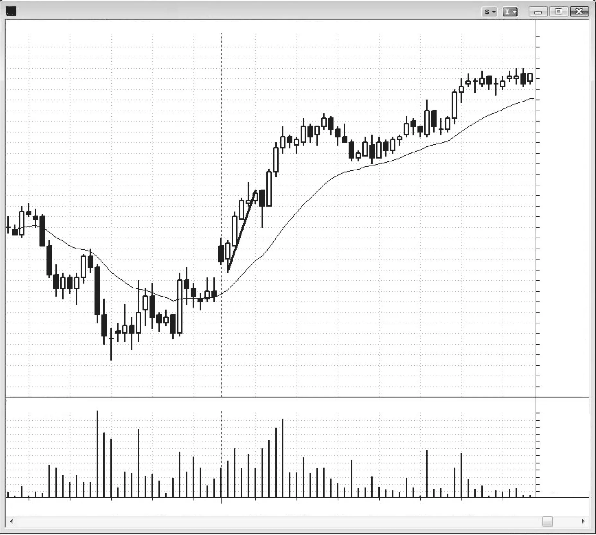

图 23.1
在强趋势中买入第一次回撤
图23.1中市场形成开盘即趋势多头趋势，K线2跌破趋势线是第一次回撤。交易者在其高点上方一tick用止损单买入，即使它是弱信号K线（空头收盘，但至少收盘在中点上方）。激进的多头在K线2之前那根的低点用限价单买入，预期失败的微型通道突破和更高价格。
在当日第一根下方做空是合理但激进的，因为它是空头趋势K线且有向上跳空，并有空间到移动平均线和昨日收盘。

<!-- PDF page 423 -->

图 23.1
开盘即趋势与小回撤趋势
然而，昨日在最后一小时以几根强多头趋势K线结束，这是买盘压力的迹象。当有任何怀疑时，尤其在开盘，最好等待更多信息或直到一方被困。这个初始做空的问题是，大多数交易者无法足够快地改变心态以在K线2上方翻多。他们会被困出场；大多数会等待第一次回撤上方再买入，而那较晚的入场会让他们损失几个点的利润。

<!-- PDF page 424 -->

图 23.2

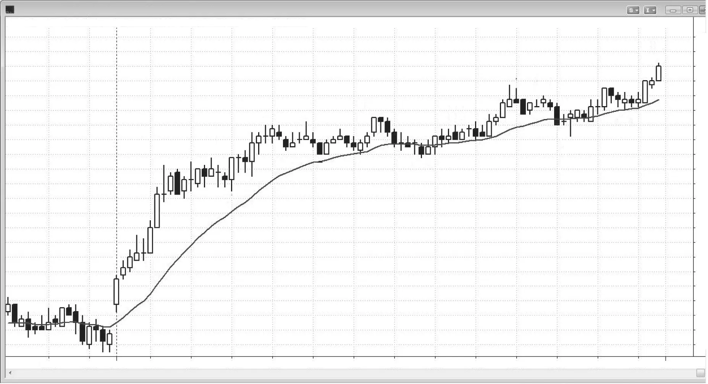

图 23.2
小回撤多头趋势日
开盘即趋势日是最强类型的趋势日，小回撤日是最强类型的开盘即趋势日。开盘即趋势日大约每周发生一两次，但小回撤日（见图23.2）每月仅形成一两次。Emini平均日波幅一直约为12点，到K线9时当日最大回撤只有九个tick。回撤至K线11只有11个tick。聪明的多头看到这一点，因此下限价单从最近高点下方也许六到十个tick买入。他们的初始止损可能是几点。市场在下行至K线17的走势中试图创建更大回撤，但无法把市场压低超过14个tick。多头把K线14之前的大多头趋势K线看作可能的买盘高潮，许多人退出多头。很可能跟随回撤的突然冲刺是以很可能短暂的非常好价格出场的绝佳机会。其他有经验的交易者在该K线收盘以及K线14和下一根的收盘做空，因为它们顶部有影线，这是卖压迹象。这些交易者预期两段式回撤持续约10根K线，几乎肯定测试移动平均线，因为市场已在K线9和11测试过它。在小回撤趋势日上，市场通常在太平洋标准时间上午11:00之后某个时候有一次回撤，约为当日最大回撤的两倍。

<!-- PDF page 425 -->

图 23.2
开盘即趋势与小回撤趋势
K线9上方有20缺口K线做多，多头在K线8、9、11、13、17和19买入移动平均线测试。全天没有强卖出信号，但激进的空头可以在K线14之后的内包K线下方剥头皮。然而，大多数交易者反而会寻找买入回撤而不是做空新高，因为这是如此强的多头趋势日。
市场自K线2有强多头尖峰上行，然后当日余下是多头通道。交易者在K线2或随后的强多头趋势K线上变成始终做多。通道的大部分是略微向上倾斜的窄幅震荡区间，价格涨幅很小，这在小回撤日上常常是情况。当日高点只比上午8:25的K线5高点高四点。
如所有强趋势中的情况，大多数买入信号K线看起来很差。这使多头不买入，把他们困出场，他们最终不得不追高市场。这也使空头不退出，他们被困入越来越大的亏损。还有许多空头趋势K线和空头尖峰。这种卖压使初学者寻找反转形态而不做买入信号。有经验、冷静的交易者理解，在回撤非常小的趋势日中，差的买入信号K线和空头趋势K线是非常强多头趋势的迹象。他们确保尽管形态弱也买入。他们在K线2突破十字星High 1信号K线高点上方时买入。他们再次在K线4向上反转成外包K线时买入，此前它与七根之前的多头反转K线形成双底。他们买入K线8上方的High 2以及其后多头K线上方，后者创建了两K线反转。
K线9是多头趋势日中的三角形（K线6和8是前两次向下推动），因此是多头旗形买入形态。他们在收盘低于移动平均线的K线11空头趋势K线上方买入，因为它是K线8和9双底下方失败的一tick突破。它也是三角形至K线10突破的回撤。此时，市场处于震荡区间，所以大多数多头不会在下方突破时退出。他们知道大多数突破尝试会失败，多头趋势中的大多数震荡区间是多头旗形，最终会从区间顶部突破。大多数多头要么会在K线10之后的空头K线下方退出多头，要么会用最近多头尖峰的底部作保护性止损。例如，他们可能把止损放在K线4下方一tick，或三根之后形成的向上外包K线下方。
通常，当有空头微型通道时，如自K线10至K线11的那个，最好买入突破的回撤，但当趋势强时有紧迫感，聪明的交易者不愿意等待完美，因为他们不想冒险错过走势。他们也在K线13之后的空头K线上方买入，即使它有空头实体。它是High 2买入形态（High 1是K线12之后的多头K线），以及自K线10起空头微型通道上方突破的第二次入场突破回撤买入形态（High 1

<!-- PDF page 426 -->

图 23.2
是第一次形态）。他们再次在K线17成为向上外包K线时买入，即使它跟随小十字星和大空头趋势K线。移动平均线持续包容所有下跌。他们在K线17多头十字星上方买入，以及其后多头K线上方。他们在K线19之后的空头K线上方买入，因为它是移动平均线处的另一个小High 2。它是空头K线，第一段下行由K线18之后的两根空头K线组成。其他人在K线19上方用止损单买入，因为它是强多头趋势中回撤至移动平均线的多头K线。
市场全天大部分时间试图向下反转，扫掉多头止损并把初学者困入亏损空头，但无情地形成更高高点和低点，在当日低点附近开盘、高点附近收盘。买入形态看起来都像低概率，这把没有经验的多头困出场。然而，有经验的交易者知道正在发生什么，全天买入每一次急剧下跌。他们意识到，尽管做多形态看起来很差，趋势如此之强，成功概率远高于看起来的样子。

<!-- PDF page 427 -->

图 23.3

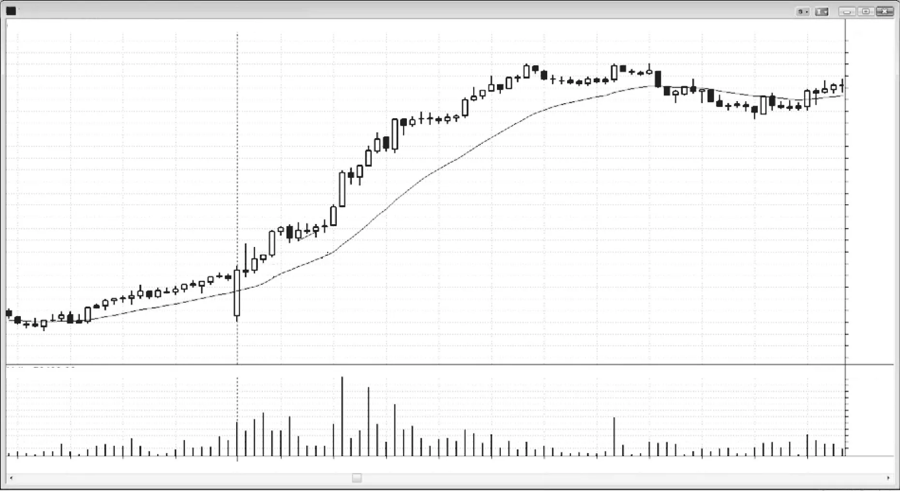

开盘即趋势与小回撤趋势
图 23.3
小回撤日是最强类型的趋势
当有开盘即趋势且所有回撤都小于近期平均日波幅的20%到30%时，该日是小回撤日，这是最强类型的趋势日。通常在当日晚些时候有一次回撤，约为早期回撤规模的150%到200%更大，OIH中就是这种情况（见图23.3）。任何横盘运动都是停顿和一种回撤，是买入形态。K线1的ii突破是良好入场，两段式横盘修正在K线3的突破是另一个。最后，有K线4的窄幅震荡区间突破。所有这些入场都应被视为第一上涨腿的一部分，而不是第一次回撤——第一次回撤出现在第一腿之后并形成第二腿。极少情况下，日子似乎就是不回撤，交易者被迫在即使短暂的横盘停顿的突破时入场。现实是，在像这样的强日上，你可以在任何点市价买入，相信即使有反转，压倒性的概率是市场会在回撤回撤很远之前再创高点。许多交易者在多头和空头趋势K线的收盘买入，以及在前一根低点处或下方买入。

<!-- PDF page 428 -->

图 23.4

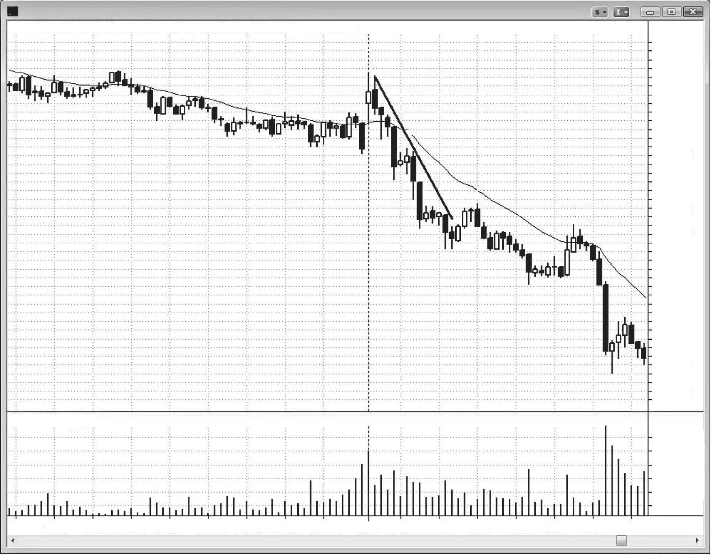

图 23.4
第一次趋势线突破通常失败
在强趋势中，确定哪次回撤是第一次显著回撤常常很难做。当是这种情况时，你的交易盈利的概率非常高，因为不清晰的回撤意味着逆势交易者非常弱。在图23.4中，K线2和3是微小回撤，没有突破有意义的趋势线。第一次突破趋势线的回撤是K线4。第一次趋势线突破有很好机会跟随另一趋势腿，因此是极好入场（如在K线4空头趋势K线下方做空）。今日是小回撤类型的开盘即趋势空头趋势日。

<!-- PDF page 429 -->

图 23.5

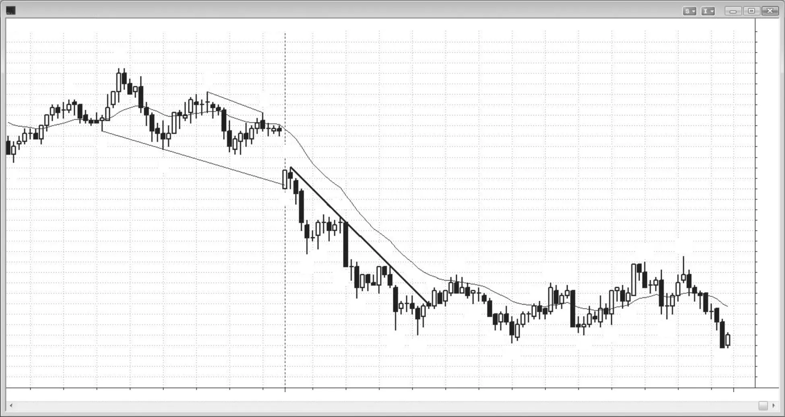

开盘即趋势与小回撤趋势
图 23.5
强第一根可以把交易者困在错误方向
有时当日第一根可以把交易者困入错误方向入场，然后该日可以成为相反方向的强趋势日。在图23.5中，市场向下跳空至昨日低点下方，并突破昨日后半段形成的大震荡区间（头肩顶空头旗形）。今日第一根K线9是多头趋势K线，通常会导致部分缺口回补甚至多头趋势。许多人在其高点上方一tick用止损单做多。然而，市场两根之后交易到其低点下方时困住了那些多头。那根多头趋势K线把多头困入、空头困出，因为交易者假定其强度是市场将试图回补缺口并可能成为多头趋势日的迹象。它试图自跌破昨日震荡区间下方以及跌破趋势通道线下方反转向上。
你必须在开盘非常灵活，并假定一分钟前你所相信的完全相反的事可以发生。你想尽可能早地看到正在发生什么，以便尽早入场。市场试图反转回趋势通道线上方并失败，这个两K线突破回撤可以导致某种向下等幅运动。若该日成为趋势日且你错过最早入场，全天都会有机会入场。

<!-- PDF page 430 -->

图 23.5
K线10提供了在K线9多头趋势K线低点下方一tick做空的极好机会，因为这是那些被困多头大多会出场、把市场压低的地方。此外，任何潜在买方会等待更多价格行为，所以市场中只有卖方，形成高概率做空。空头沿途在困住其他早期多头、让他们相信市场在筑底的空头旗形处加仓。
到K线11收盘时，交易者有信心市场始终做空，这确认了向下突破。许多交易者在K线11之前那根空头突破K线的收盘就对始终持仓交易有信心。
尽管有所有反转尝试，市场在低点收盘。这是很好的例子，说明当你看到强开盘即趋势日时，为什么重要的是尝试至少波段交易部分仓位。若你确实做多交易，你必须在退出多头时强迫自己回到空头一侧，因为你不想只为了抓住小多头而错过巨大做空。
对本图的深入讨论
图23.5中K线12是强多头反转K线，但它很大程度上重叠前两根，因此它是小震荡区间的一部分，尽管外表不像反转K线起作用。反转K线总是必须在背景中判断，当它们与前几根重叠太多时，它们是小震荡区间的一部分，在空头趋势中买入震荡区间上方是亏损策略。聪明的交易者做的恰恰相反。他们有限价单在前一根高点处及上方做空，即使该K线有强多头实体。
K线13是Low 2做空形态，但信号K线是小十字星。十字星是弱信号K线，弱形态常常意味着市场还没准备好突破。然而，在像这样的强空头趋势中，你可以出于任何理由做空，只是使用更宽止损。你也可以在K线12或K线11低点下方做空。在强空头趋势中，你可以在K线低点下方和摆动低点下方卖出，并预期获利。
K线14是失败Low 2后试图向上反转，因此是第三次向上推动。K线11之后的十字星是第一次推动，K线12是第二次。空头旗形中的第三次向上推动创建楔形空头旗形，所以在其低点下方做空是合理的。
这个K线14失败Low 2买入形态说明交易者能做的最糟事情之一，即在空头旗形中弱K线上方买入以求剥头皮利润。你不仅会在剥头皮上亏损，你的心态会是买方的。你不会在心理上准备好做空空头旗形的突破，而那有高得多的成功机会，更可能导致波段交易而不只是剥头皮。
K线15突破K线是强空头趋势K线，表明空头控制市场。当有像这样的强空头突破时，通常会至少还有两段下行，形式为空头通道，那两段额外

<!-- PDF page 431 -->

图 23.5
开盘即趋势与小回撤趋势
腿常常创建楔形空头旗形。这通常导致两段式调整，如此处反弹至K线22移动平均线一样。
K线22是移动平均线处的空头反转K线，也是Low 2做空。它也是20缺口K线做空和楔形空头旗形，其中上行至K线19是楔形中的第一腿上行。
市场下跌至K线25两K线反转处的新空头低点。它也是自单K线最后旗形的向上反转，以及正在形成的震荡区间底部的High 2买入信号。
K线27是强多头趋势K线，试图形成向上突破，但它与K线22形成双顶空头旗形。
K线28的ii形态成为最后旗形，因为市场自小K线29更低高点和均线缺口K线做空形态向下反转。
K线30是对空头低点的两段式更高低点测试。
空头反弹以K线35的楔形空头旗形结束，其中K线27和33是前两次向上推动。更高高点把多头困入、空头困出，但警觉的交易者为空头日恢复做好准备，他们注意到K线35如何错过了K线11下方空头的保本止损。这意味着最强的空头在重新主张自己。他们在强K线15空头尖峰上接管市场；他们坐在场外等待测试，然后他们不知从哪出现，把市场压入收盘。

<!-- PDF page 432 -->

图 23.6

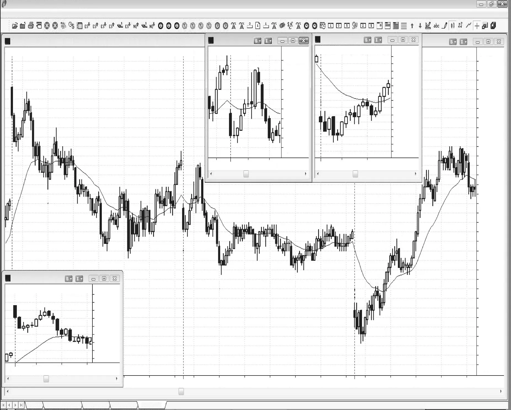

图 23.6
缺口可以导致向上或向下趋势
这里，在图23.6中，是三个连续跳空开盘但结果不同，即使每一天的第一根都是空头趋势K线。K线1和9在日线图上也是跳空开盘。
K线1顶部无影线、底部有小影线，是大空头趋势K线，这是大幅向上跳空开盘日上的良好做空形态。其后跟随强空头入场K线。若当日第一根是强趋势K线（见缩略图），通常会有跟随，当最初两根都强时，试图向上反转通常成为更低高点，如此处一样。大幅向上跳空配合强卖压通常成为开盘即趋势空头趋势日。有急剧反弹至K线3测试开盘，但这个失败的开盘反转导致更低高点或双顶，然后是漫长的下行。

<!-- PDF page 433 -->

图 23.6
开盘即趋势与小回撤趋势
K线2是试图形成昨日高点上方突破的突破回撤，但空头太强，反弹在K线3失败。
K线6之后两根是强多头反转K线，是开盘反转，此前开盘的空头趋势K线跌破了前一日最后两小时的多头通道。多头通道是空头旗形，K线6之后两根形成的多头反转K线是试图使空头旗形的突破失败。在当日第一根下方做空在这里有风险，即使它是空头趋势K线，因为该K线处于昨日结束时震荡区间的水平，在震荡区间底部做空通常是亏损策略，尤其在没有明确方向的市场中（震荡区间）。
急剧反弹上行至K线7测试前一日收盘，形成更低高点或双顶。空头信号K线使这成为良好做空。回撤发生在多头止盈时。为什么交易者在趋势很强时还要止盈？因为无论趋势多么强，它都可以有深回撤，让交易者能以好得多的价格再次入场，有时趋势可以反转。若他们至少不部分止盈，他们就会看着大利润消失甚至变成亏损。
K线9向下跳空至前一日低点下方并形成空头趋势K线，但它有大影线，表明交易者在该K线收盘附近买入。第二根是收盘在低点的空头趋势K线，表明空头很强，但随后是强多头趋势K线，形成反转。虽然做多没有触发，这再次是空头缺乏紧迫感的证据。当缺口如此大时，每个人都知道行为是极端的，若没有立即跟随，市场会快速反转以消除这种极端情况。
K线10是大空头趋势K线，因此是卖盘高潮。下一根是内包K线，这创造了突破模式情形。若没有立即跟随卖压，空头会积极开始回补空头并寻找更高处卖出，多头会买入，希望是当日低点。市场已在大空头通道中运行了几天，处于通道底部，所以有很好机会向上反转，有较小机会跌破空头通道底部并形成更陡的空头趋势。通道线未显示，但空头趋势线在K线1和K线7高点上方，空头趋势通道线是可以沿K线4和K线8低点画出的最佳拟合线。多头也会在多头趋势K线上方买入，如K线10之前的多头趋势K线上方以及K线10之后两根形成的多头趋势K线上方。他们也会在K线12之后的小内包K线上方买入，因为那会是失败Low 2。由于这是自当日低点和两日多头旗形底部（空头通道是多头旗形）可能向上反转，它是良好买入形态。

<!-- PDF page 434 -->

图 23.7

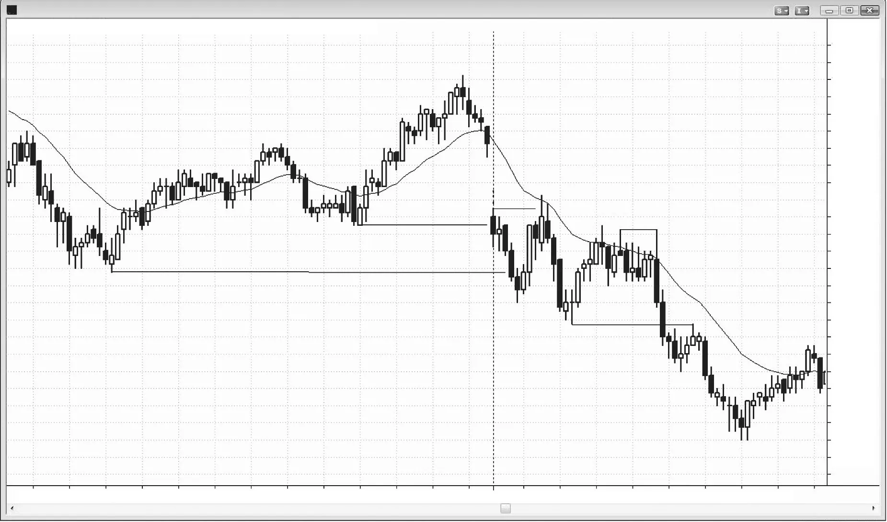

图 23.7
跳空日的第一根常常指向趋势方向
图23.7中市场以中等向下跳空开盘，这可以靠近当日高点或低点。K线3是第一根，它是空头趋势K线，可能是开盘即趋势空头趋势的起点。市场未能反转昨日的K线2摆动低点，所以很可能测试昨日下一支撑位，即其低点K线1。交易者会下限价单在K线3低点下方一tick做空。一旦市场跌破昨日低点，它很可能至少短暂再次试图向上反转，所以交易者会用止损单在第一根良好信号K线上方一tick做多。虽然有些交易者会在K线4上方买入，但它是收盘低于中部的空头趋势K线。更安全的是等待下一根收盘，看是否会发展更好形态。该K线有大小不错的多头实体，与K线4形成两K线反转。入场在其高点上方。总体而言，买入多头趋势K线上方总是更好，尤其在逆势交易时。
若买单没有成交且下一根有更低低点，交易者会尝试在其高点上方买入，因为他们在寻找昨日低点下方失败突破形成开盘反转。然而，若市场进一步大幅下跌而没有良好买入形态，交易者应只交易做空，直到反弹突破趋势线之后。

<!-- PDF page 435 -->

图 23.7
开盘即趋势与小回撤趋势
市场做出小两段式反弹至移动平均线和当日高点上方，在移动平均线处形成双顶空头旗形。突破K线4反转上方的大多头趋势K线之后是空头K线，这是差的跟随，是市场可能在形成震荡区间而不是多头趋势的信号。市场继续在震荡区间中运行直到中午。到那时，区间约为平均日波幅的一半。这提醒交易者有突破、区间大约翻倍、以及形成趋势型震荡日的可能。突破始于自K线10起的强向下尖峰。虽然未显示，该日以强反转结束，这在趋势型震荡日上常常是情况，它收回到始于K线7的窄幅震荡区间。窄幅震荡区间是磁体，倾向于把突破拉回其中。

<!-- PDF page 436 -->

图 23.8

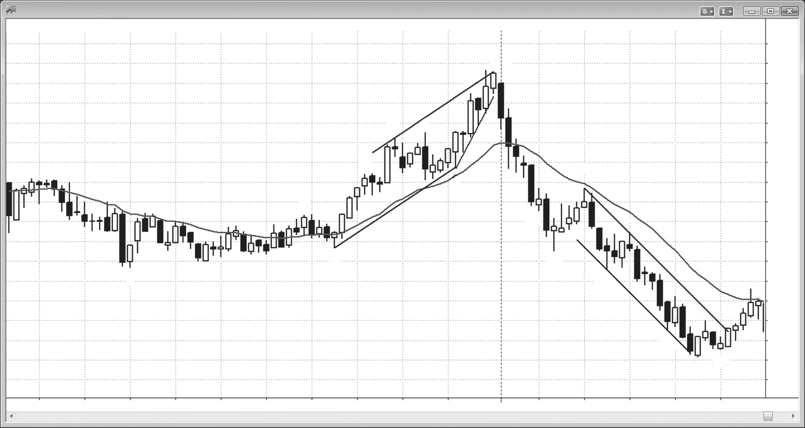

图 23.8
在当日最高tick开盘
有时，开盘即趋势日在当日最高tick开盘。在图23.8中，K线12是当日第一根，它在最高tick开盘，并突破昨日收盘楔形下方。大多数交易者不会足够灵活以在昨日结束的内包K线下方卖出，但在第一根收盘卖出小仓位是合理的。若你错过第一次入场，你可以看1分钟图寻找小回撤（有许多）做空，或简单等待5分钟形态。当有开盘即趋势时，卖出第一次回撤是高概率交易，即使它很难做，因为在这个案例中你是在大幅下行接近低点处卖出。K线15是那第一次回撤做空的信号K线，它也是刚在移动平均线下方反转向下的回撤。空头如此急于入场，他们在移动平均线下方卖出，不等待市场实际触及移动平均线。有些交易者会害怕在五根有多头实体的K线后做空，但实体很小，这是强空头尖峰后的第一次回撤，因此是可靠的Low 1做空形态。它也是移动平均线测试和与K线13高点的双顶空头旗形。
该日成为尖峰与通道空头，空头通道始于K线15也始于K线17，结束于K线19。市场反弹进入收盘，没有在低点收盘。

<!-- PDF page 437 -->

图 23.8
开盘即趋势与小回撤趋势
对本图的深入讨论
图23.8中有其他尖峰与通道行为，如大多数日子的情况。K线12及其后那根形成尖峰，K线13和K线14之前那根也是，整个下行至K线14是尖峰。K线15之后两根形成另一个尖峰，随后是始于K线17 Low 2、结束于K线19的通道。
K线16也是跌破K线14和K线1下方突破的突破回撤。它也足够接近跌破昨日低点下方，以像实际突破的回撤一样起作用（接近就足够接近）。空头做空的急切防止了那第一次回撤到达移动平均线。他们害怕它可能到不了那里，因此在接近时如此重仓做空，以致它从未到达移动平均线目标。当回撤刚在移动平均线下方转回下行时，空头非常激进并有紧迫感。他们非常急于做空，即使在相对低的价格，所以更低价格很可能跟随。
K线19是向上尖峰，通道上行始于K线20更高低点。K线20之后那根也是尖峰，结束于图表上最后一根K线21的三K线通道。
昨日也有尖峰与通道活动，如上行至K线2的尖峰和始于K线3或K线5的通道。自K线5至K线6的走势是另一个尖峰，K线7之前那根也是。两者的通道始于K线8低点。自K线5至K线7的整个上行可能在更高时间框架图上是尖峰。
昨日进入收盘的多头通道戳到趋势通道线上方，该线是自K线5至K线9多头趋势线的平行线。一旦市场在当日第一根K线12反转回通道内，它至少很可能戳穿通道底部。下一个目标是使用通道垂直高度的向下等幅运动，再下一个目标是昨日通道底部，即K线8低点。由于上行至K线11有楔形形状，且市场测试到楔形起点下方，下一个下行目标是向下等幅运动。使用楔形高度（K线11高点减去K线8低点）并从楔形底部K线8减去该数。这个目标在K线17下方的下跌期间被超越。
K线19是自第二次跌破空头趋势通道线（画为K线15至K线17趋势线的平行线）下方的向上反转，所以两段上行很可能。K线18试图自趋势通道线下方的微小戳穿向上反转，但市场从未越过两K线反转的高点，所以没有做多入场。
重要的是要认识到，虽然昨日以楔形顶部结束，但仍有强多头趋势进入收盘。这使初学者在今日开盘寻找额外反弹，并否认正在展开的反转。总是准备好可能看起来可能的事情的反面，因为它约40%的时间会发生。

<!-- PDF page 438 -->

图 23.9

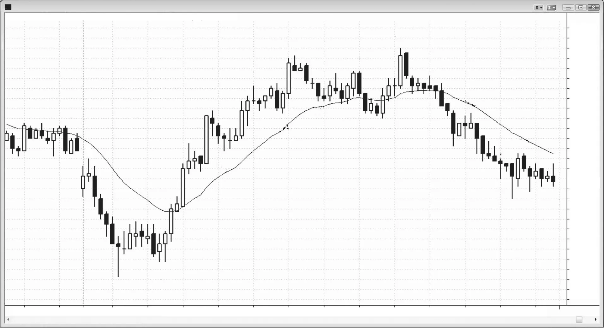

图 23.9
开盘即趋势后的反转
并非所有始于开盘即趋势日的日子都会导致初始趋势方向的强趋势日。在图23.9中，该日始于开盘即趋势空头趋势。它向下跳空至昨日低点下方，但随后回撤并几乎回补缺口，K线1成为突破回撤做空形态。市场下跌五根K线并在K线3下方形成第一次回撤做空，但随后进入窄幅震荡区间而不是立即触发做空。虽然剥头皮是可能的，市场在K线4更高低点向上反转。
对本图的深入讨论
在图23.9中，K线1是昨日收盘震荡区间下方突破后的突破回撤做空。初始下跌下行至K线2约为12点，这是近期平均日波幅左右。一旦市场反转回开盘高点上方并向上突破，向上等幅运动很可能。有时市场会做出等于当日开盘至当日低点的向上等幅运动，然后回落到开盘附近收盘，在日线图上创造十字星日。另一些时候，向上等幅运动约等于整个初始下行腿的高度。当日高点K线17比那个等幅运动目标低三个tick。那个开盘区间上方的向上反转在日线图上创造了大底部影线。当

<!-- PDF page 439 -->

图 23.9
开盘即趋势与小回撤趋势
市场自大开盘区间约等幅运动上行处转下时，它常常回落，该日收在区间中部某处，如此处一样。
自K线4至K线5的向上尖峰也是等幅运动的良好基础，但这里没有发生。相反，市场比腿1=腿2运动高一tick，其中腿1是自K线4至K线5，腿2是自K线6低点至当日高点K线17。进入收盘的下跌也是对尖峰上行之后多头通道底部K线6的测试。
自K线15起的两K线向下尖峰之后是回撤至K线17更高高点，那是空头通道的起点。有时向下尖峰后的回撤可以是更高高点，但当是这样时，回撤后通常还有另一个向下尖峰。这里，K线17之后的大空头内包K线是向下尖峰，自K线18起的下行形成另一个向下尖峰，大空头趋势K线影响最大。下行至K线13的三K线走势也是空头尖峰，因此可能对最终跟随的下跌有一些影响。当市场开始形成许多空头趋势K线时，它在积累卖压，常常最终能够压倒多头，如此处一样。

<!-- PDF page 440 -->

图 23.10

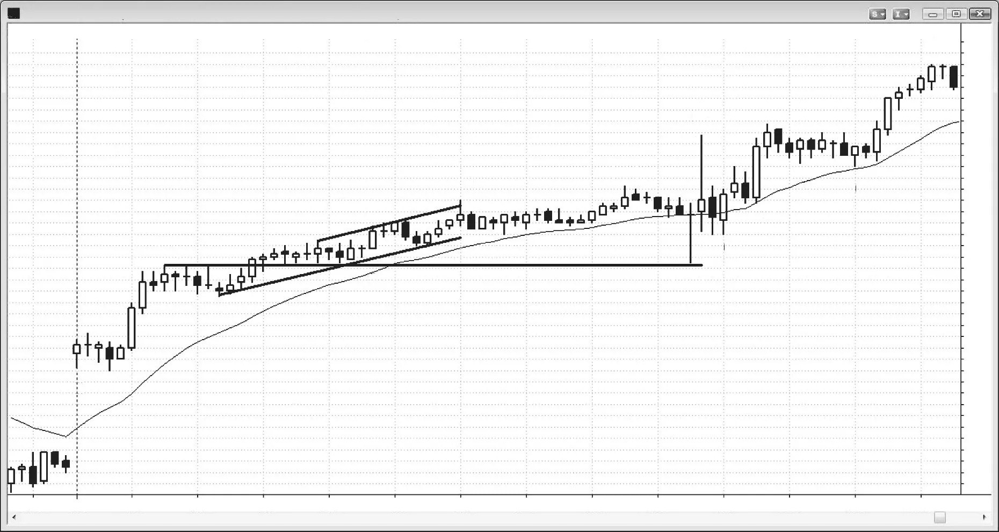

图 23.10
强趋势有弱形态
图23.10显示开盘即趋势多头趋势日，但为什么最好的趋势如此难交易？因为大多数顺势入场看起来疲弱，有许多小回撤把交易者困出场。这些回撤都不会触及两点资金止损，这通常是强趋势中使用的最佳止损。有如此多小横盘K线，前一根低点下方的价格行为止损被触及太频繁，更合理的是依赖原始两点止损。当趋势强时，你需要做你能做的一切以保持做多。强、无情的趋势常常由有影线和大量重叠但回撤非常小、大多是横盘停顿的小K线组成。
开盘大幅向上跳空，概率偏向向上或向下趋势日，而像这样的更大缺口使多头趋势更可能。因为最初几根没有显著卖压，有开盘即趋势多头的可能，所以交易者必须寻找做多。市场全天安静上行，因为机构有买单要成交，他们在日间分批成交，因为他们害怕回撤可能不会来而他们需要买入。他们持续的买盘防止了显著回撤形成。他们不一次全部买入，因为他们可能创造衰竭买盘高潮和显著反转至远低于买入价。此外，当市场上行时，他们全天收到额外买单，因为投资者变得更有信心。

<!-- PDF page 441 -->

图 23.10
开盘即趋势与小回撤趋势
对本图的深入讨论
在如图23.10所示的强趋势中，你可以出于任何理由、在任何时间买入。在回撤K线上方买入是可靠的，但你也可以下限价单在前一根低点处或下方买入。在K线下方做空是失败者策略。若你要寻找做空，你应只在K线高点上方或强多头趋势K线收盘处做空。当一日如此之强时，大多数交易者不应做空，因为做空可能会是干扰，导致错过买入形态，而那些是强趋势中的波段交易，因此比剥头皮更有利可图。
K线3是两K线向上尖峰的第一根，市场在窄幅震荡区间中横盘修正，然后通道上行开始。最强的趋势往往全天创造反转形态，但它们不知何故看起来不太对。然而，它们不断把早期空头困入做空，认为小K线意味着小风险，但在四五次小亏损后，他们落后如此之多以至于永远赶不上。你不能仅仅因为风险小就做交易。你还需要考虑成功概率和利润目标大小。
空头把K线5、7和9看作三推形态因此是楔形变体，他们然后把K线7、9和10看作另一个楔形。当楔形的调整是横盘而不是下行时，你应得出结论趋势非常强；停止寻找反转，只顺势交易。
K线14与联邦公开市场委员会（FOMC）报告重合，市场急剧下跌但在差一个tick未到K线5高点后立即向上反转。
进入收盘时，有几个两K线多头尖峰（K线16、17和21是每个尖峰两根中的第一根）。
像这样的强趋势全天形成反转，但形态从不相当对，它们几乎总是失败。结束于K线9的楔形处于几乎完全由多头趋势K线组成的窄多头通道中。市场超过两小时没有触及移动平均线。概率很高那里会有买方，所以做空没什么可获的。K线10突破趋势通道线上方但它有多头实体。同样，通道非常窄，没有先前空头强度。你只能做空第二次信号，且只有在有一些先前空头强度时，如五到十K线回撤至移动平均线。在没有那些的情况下，任何做空都是押注市场会做它全天没做过的事。全天最大回撤只有九个tick。若你在一根K线下方做空，你的入场约在下方五个tick，你需要市场再下跌五个tick才能做一点剥头皮。由于市场反复试图回撤且不能下跌超过九个tick，押注你的做空现在会成功是非常低概率交易。你可以剥头皮一点并冒六或七个tick的风险，只有在成功概率是60%或更高时，所以你不能做空这个市场。你可以争辩说上行至K线12突破了

<!-- PDF page 442 -->

图 23.10
多头趋势线，因此在K线13更高高点做空是可接受的，但市场仍尚未回撤至移动平均线，它就在下方仅六个tick，那里肯定会有买方。此外，K线13是第五根连续多头实体，那代表太多强度，不宜做空。
在大多数强趋势日上，通常在太平洋标准时间上午11:00至中午之间有急剧、短暂的反转，震出弱势多头并困住过于急切、希望弥补早期亏损的空头。它总是被归因于某个新闻事件，但那不相关。重要的是它通常为那些不被向下尖峰吓到的人形成买入机会。
今日，上午11:15有FOMC报告。当报告出来时，K线14短暂是有大空头实体的空头趋势K线。若你在该K线收盘前做空，相信市场会因报告而硬下跌，你忽视了一条非常重要的规则：你应等待K线收盘，因为在K线进行到四分钟时看起来像大空头趋势K线的东西，到K线收盘时可以变成十字星K线甚至多头反转K线。
K线16是自K线14底部至K线15顶部反弹后的更高低点，随后是K线17突破回撤做多入场。所有尖峰都应被看作尖峰、高潮和突破，所以始于K线16的两K线尖峰是突破，K线17是回撤的入场。
K线19是双顶空头旗形，但没有先前强向下尖峰，所以市场更可能只是在K线17向上尖峰后横盘。
K线20是多头反转K线和High 2做多，K线21——入场K线之后那根——交易到入场K线下方并困住多头出场。然而，由于自K线20起的上行只走了一个tick，保护性止损在K线20信号K线下方，你不应过早收紧它。强趋势日不断诱使交易者过早退出多头并做空。空头必须回补空头，这增加买压并至少在一两根K线内移除空头的额外做空。他们刚亏损，需要恢复后才会再寻找做空。此外，刚被困出场的多头会在市场上行时追涨，增加买盘。

<!-- PDF page 443 -->

图 23.11

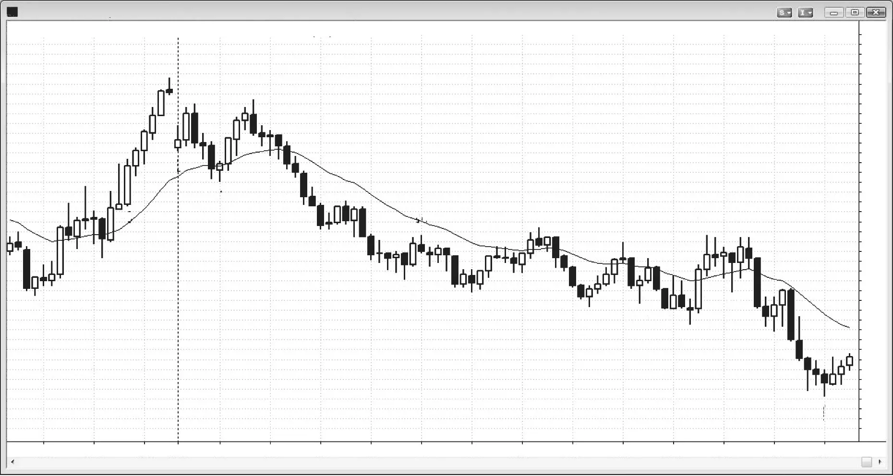

开盘即趋势与小回撤趋势
图 23.11
强空头日中的双顶
开盘即趋势可以在强趋势开始前有双顶或双底。在图23.11中，K线7试图形成开盘即趋势空头趋势，但高点在上午7:00报告时被测试，这很常见。即使市场形成小震荡区间上行至K线9，你总是必须考虑市场只是在等待报告然后释放其力量的可能。
开盘区间小于近期日波幅的三分之一，这使市场处于突破模式。一旦第一根之后有向下尖峰和向上尖峰（向下反转然后向上反转），有些交易者会在突破时入场，预期区间会增加数倍。在市场跌破K线7两K线反转下方后，K线7向下反转成为摆动高点。在市场越过K线8上方后，K线8成为摆动低点和向上反转。这些交易者在K线7尖峰顶部上方一tick下限价买单，在K线8尖峰底部下方一tick下限价卖单。一旦买单在K线9移到K线7高点上方时成交，他们把K线8下方卖单的规模加倍。当那第二个订单成交时——如在跌破K线8下方的走势中一样——他们被止损出多头并翻空。这是这个形态的传统方法，但通常更好的是更激进。更好的方法

<!-- PDF page 444 -->

图 23.11
会是交易者在K线7两K线反转下方做空并剥头皮部分，然后收紧保护性止损。接下来，他们可以在移动平均线处的K线8 High 2翻多。他们可以剥头皮部分并收紧止损。他们可以在K线9向下外包空头K线下方翻空，因为有被困的多头突破交易者，且市场与K线7形成双顶空头旗形。他们可以剥头皮部分，收紧止损，并波段交易余额直到有清晰买入信号；若没有，他们可以持空进入收盘。若他们确实在也许K线15、18或21低点买入，他们必须在止盈时翻空。若他们无法做到，他们应要么继续持空，要么在那些次要买入信号上出场并寻找反弹做空。
即使该日始于小震荡区间，有些交易者可能称之为趋势型震荡日或空头趋势恢复日，当回撤如此小时，你面对的是非常强的空头趋势。当是这种情况时，更好的是确保你全天大部分或全部时间做空。把这想成趋势型震荡日会使你做多并常常错过做空。始于K线15的回撤约为自趋势在K线9开始以来早期回撤的两倍。该日不是经典的小回撤趋势日，因为那些日子通常直到当日晚些时候——如太平洋标准时间上午11:00之后——才有更大回撤，但今日仍是强空头趋势日。
对本图的深入讨论
图23.11中K线11、13和15形成楔形，但由于市场约20根K线没有触及移动平均线且空头通道很窄，这很可能导致测试移动平均线，空头会在那里积极做空。多头能够生成两段上行至K线17，那是均线缺口K线。空头趋势中的第一次均线缺口K线常常导致更大向上调整之前的最后一段下行。
由于上行至均线缺口K线的腿几乎总是突破显著空头趋势线，对空头低点的更高低点或更低低点测试通常导致延长的向上调整甚至反转。市场试图在K线18向上反转，再次在结束于K线21的小楔形处。市场创建强两K线多头尖峰上行至K线22，把多头困入、空头困出，但有经验的交易者知道市场在趋势日太平洋标准时间上午11点后常常有强逆势走势，他们会准备好做空失败，如K线24的小双顶。信号K线有空头内包K线，K线22和24双顶与K线17形成更大双顶空头旗形。下行至K线25的尖峰之后是几根强多头趋势K线，形成K线26突破回撤做空，用于进入收盘的下跌。K线25处的反转尝试是扩展三角形底部的信号K线，其中K线18、21和25是三个低点。相反，

<!-- PDF page 445 -->

图 23.11
开盘即趋势与小回撤趋势
底部失败，K线26成为突破回撤做空入场K线。失败楔形常常导致向下等幅运动，进入收盘的下跌接近目标。
这使该日变成趋势恢复空头，其中有初始空头趋势下行至K线13，然后持续几小时至K线24的震荡区间，然后进入收盘的另一空头腿。

<!-- PDF page 446: no extractable text (likely figure-only) -->
