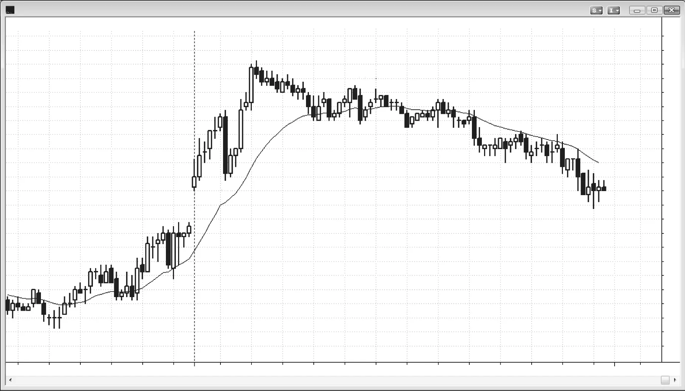
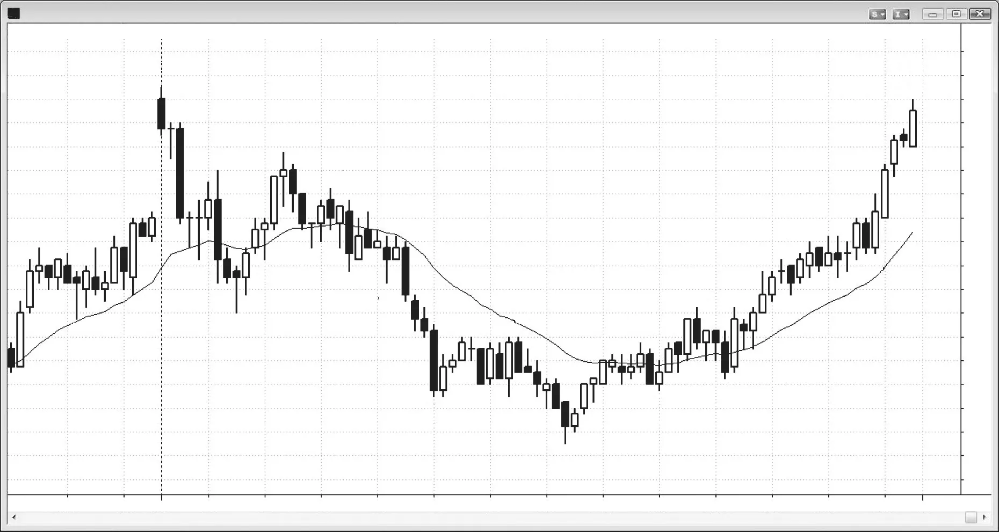
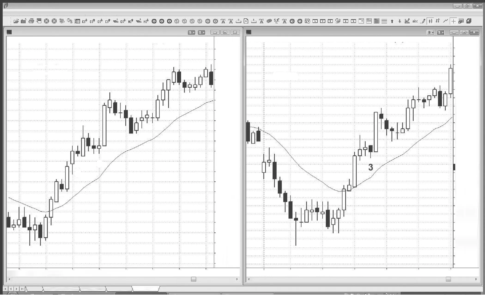

### 第24章 反转日

<!-- Source PDF pages 447–454 -->
<!-- English: CHAPTER 24 Reversal Day -->

<!-- PDF page 447 -->

反转日的主要特征：
r 当日先朝一个方向趋势运动，然后朝相反方向趋势运动直至收盘。
r 大多数反转日以趋势型震荡日开始。
r 若反转在最后一两个小时开始且很强，通常次日会有跟随，并且经常持续数日。
有些最强的趋势从当日中段或尾段开始。有时它们源于震荡区间突破或高潮式趋势反转，通常被归咎于某则新闻，但这并不重要。无论哪种情况，市场都可能进入失控趋势模式，无情地趋势运行，只有小回撤。有大的趋势K线，重叠很少，影线大多很小。这是突破，也是明确的始终持仓方向翻转。你必须迅速入场，即使新趋势看起来像高潮且过度延伸（确实如此，但它很可能还会变得更加过度！），并做波段持有大部分仓位。你应积极交易这些突破尖峰，并确保至少持有一个小仓位，因为行情可能走得很远。交易强尖峰在第二本书关于突破的部分有详细描述，反转在第三本书中有详细讨论。
在另一些时候，市场在趋势运行，然后开始回撤，但回撤无休止地扩大，变成相反方向的趋势通道。在通道开始之前几乎总是至少有一根逆势尖峰，因此每当你看到回撤中有强的逆势尖峰时，要意识到趋势可能在反转。例如，若市场有一波强劲的下跌，持续 <!-- PDF page 448 --> 最初一两个小时，你认为可能有两段式反弹到均线，但该回撤以一根相当强的多头趋势K线开始，一定要考虑这根K线可能是多头尖峰，随后可能是无情的多头通道，而不是小型空头旗形。到当日结束时，回撤可能变得比之前的空头趋势还大，当日在日线图上可能成为一根多头反转K线。如果你很早识别出这种行为，就应把自己的交易限制为只做多，因为你在做空上会亏钱——同时还绝望地希望第一小时的空头趋势会恢复。这些日子中有许多也可以归类为其他类型的趋势日，它们通常是趋势型震荡日。事实上，大多数反转日以趋势型震荡日开始。对于开盘时空头趋势反转成无情空头通道的情况，道理也相反。

<!-- PDF page 449 -->

图 24.1

图 24.1
强趋势也可能失败
强趋势可以在当日任何时候开始，即使当日最初有相反方向的强趋势。如图 24.1 所示，第一个小时有两段式急升，随后是紧贴均线的窄通道回撤。市场随后横盘超过两小时，最终在 K线 9 向下突破进入更低的区间。最后一个有利可图的做多入场是在太平洋时间上午 8:50 的 K线 5。如果你继续做多剥头皮，最终会意识到每笔交易都在亏损，这是市场正在朝错误方向趋势运行的确切信号——要么你没看出来，要么你不相信。
当趋势很强时，回撤发生在多头止盈时。为什么交易者在趋势很强时还会止盈？因为无论趋势多强，都可能出现深回撤，使交易者能以好得多的价格再次入场，有时趋势甚至会反转。如果他们至少不部分止盈，就会看着自己的大利润消失，甚至变成亏损。
对本图的深入讨论
图 24.1 中的市场向上突破了昨日最后一小时的震荡区间。第一根K线顶部的大影线表明卖方相当强 <!-- PDF page 450 --> 图 24.1
，因此在其上方买入是有风险的。市场上涨了六根K线，并在 K线 2 期间猛烈反转向下，推测是受到上午 7:00 报告的影响。在报告之前有多头动能，且没有顶部或买盘高潮的迹象，不宜在这波反弹顶部K线下方做空。这是开盘即趋势多头趋势中的第一次回撤，是做多形态。然而，若当日要成为多头趋势日，K线 2 空头尖峰的强度就不寻常。
K线 3 低点（K线 2 的底部）与 K线 1 低点形成可能的双底。跳空高开日常见回撤测试开盘低点，然后成为多头趋势日。由于开盘区间大于最近数日平均波幅的大约 30%，开盘区间不是好的突破模式形态。多头突破后出现强劲、无情趋势的可能性较低。若市场要成为多头趋势日，更可能是较弱版本，也许像趋势型震荡日。K线 3 之后的多头 ii 形态是不错的做多信号，但由于强多头趋势不太可能，多头应在大约 2 到 4 个点利润后至少平掉一半。K线 3 的强空头尖峰也可能在回撤后跟随空头通道。这里回撤到了 K线 4 的更高高点，之前是其前一根及再前两根的买盘高潮K线。连续买盘高潮通常导致至少两段式调整，持续约 10 根K线。由于这不是明确的多头趋势日，且 K线 3 有强卖压，这根空头反转K线是可接受的 Low 2 做空形态。
回撤到 K线 5 突破了多头趋势线，K线 6 的更低高点为收盘前的空头趋势日奠定了舞台。K线 6 是两K线空头尖峰的第一根，提醒交易者可能随后出现向下通道。K线 5 前一根是空头尖峰，非常大的 K线 3 空头趋势K线也是。随着空头通道推进还有其他空头尖峰，市场在 K线 8 前一根之后无法收在均线上方。
与大多数强趋势通道一样，做波段比剥头皮赚得更多，因为频繁的回撤会打掉即使是顺势剥头皮的止损（如从 K线 8 和 10 的做空），造成亏损。更好的做法是把止损拖在前一个摆动高点上方。
K线 9 向下突破上方震荡区间的尖峰之后，出现了完美的等幅运动直至收盘。K线 9 是突破缺口，缺口位于上方区间底部与 K线 10 突破回撤之间。该缺口的中点是从 K线 4 到当日收盘前低点向下运动的中点。
在日线图上，这将是一根实体很小、顶部有大影线的十字星K线；若它处于图表上可能出现空头反转的区域，它可能是日线图上做空交易的好信号K线。
注意，市场在 K线 5 到 K线 9 之间形成更低高点和更低低点，暗示空头趋势可能正在进行。

<!-- PDF page 451 -->

图 24.2

图 24.2
大多数反转以趋势型震荡日开始
大多数反转日以趋势型震荡日开始，如图 24.2 所示；这一天也是尖峰与通道空头趋势日，以及开盘即趋势空头日。它在三段向下推动（K线 8、15 和 17）之后反转向上，成为趋势上涨至收盘的多头反转日。这在趋势型震荡日中很常见。
对本图的深入讨论
大跳空开盘后常跟随任一方向的趋势，而由于图 24.2 中当日第一根K线是强空头趋势K线，空头趋势的概率更大。这是失败突破形态，交易者会在其低点下方做空，以期待开盘即趋势空头日。
K线 4 和 5 是大空头趋势K线，因此是空头尖峰和卖盘高潮。一对连续高潮通常至少跟随数根K线的停顿或回撤，如这里所发生的（回撤到 K线 7 高点）。K线 7 随后是第三次卖盘高潮，第三次连续卖盘高潮通常跟随更大的调整。跌至 K线 8 的运动是尖峰与高潮型空头趋势，随后反弹到 K线 10，测试了向下通道到 K线 8 的起点 K线 7。这形成了双顶空头旗形，并最终出现大致到当日低点的等幅运动向下。

<!-- PDF page 452 -->

图 24.2
整个跌至 K线 8 的运动处于窄通道中，因此是更大的尖峰。
大型楔形底部之后，市场通常至少有两段式反弹来测试楔形顶部（这里是 K线 10 高点），且调整中的K线数通常至少约为楔形中K线数的三分之一。这个大型楔形也是从 K线 4 到 K线 8 的空头尖峰之后的空头通道，这也是测试 K线 10 高点的理由（通道起点通常会被测试）。测试可能突破该高点上方，但更常形成双顶空头旗形，如这里所做。
当出现楔形反转时，通常更安全的是在像 K线 19 这样的更高低点之后，或在 K线 22 失败 Low 2 上方买入。你可以看到那里有大的多头尖峰入场K线，这是交易者相信反弹不再只是空头旗形、市场可能等幅运动向上并进入上方震荡区间的信号。这是复杂的一天，楔形反转也可以被视为趋势型震荡日中下方震荡区间的底部。若足够多的交易者相信是这种情况，在 K线 17 之后的内包K线上方买入第一次入场是合理的，预期测试上方震荡区间的底部。
K线 11、13 和 14 形成了楔形多头旗形，但市场向下突破而非反转向上。当这种情况发生时，市场通常会跌到大约从楔形顶部到底部的等幅运动。K线 10 是楔形顶部，跌至 K线 15 超过了等幅运动目标。当这种情况发生时，回撤之后通常还有另一段向下，如这里所发生。
虽然上涨到 K线 18 有两段，但这次反弹的K线数太少，不足以充分修正那个大型楔形底部。而且它处于窄通道中，因此可能只是两段或更多段向上中的第一段。有第二段上涨到 K线 20，但问题相同。从 K线 17 到 K线 20 的运动K线数太少，不足以修正如此大的楔形，且仍处于相对窄的通道中。这造成不确定性，并增加市场需要更大的第二段向上来说服交易者楔形已得到充分修正的概率。
从 K线 21 到 K线 25 的运动可能足以让交易者满意，认为充分的两段式调整已完成，但市场随后以三根多头尖峰K线上涨到 K线 27 向上突破。由于空头在从 K线 17 到 K线 25 的通道中无法产生多大的向下突破，从未形成明确的两段式向下运动。第一段向上之后没有任何明确回撤，这是多头强度的信号。

<!-- PDF page 453 -->

图 24.3

图 24.3
更小时间框架上的强趋势入场
在失控的多头趋势中，3 分钟图上的做多机会比 5 分钟图更多（见图 24.3）。K线 1 和 2 是左侧 3 分钟图上的小逆势内包K线，构成 High 1 做多，但在 5 分钟图上不是明确信号。K线 3 的做多在两张图上都存在（在 5 分钟图上，它是强多头尖峰中的 High 1 做多，尽管它有空头实体）。

<!-- PDF page 454: no extractable text (likely figure-only) -->
