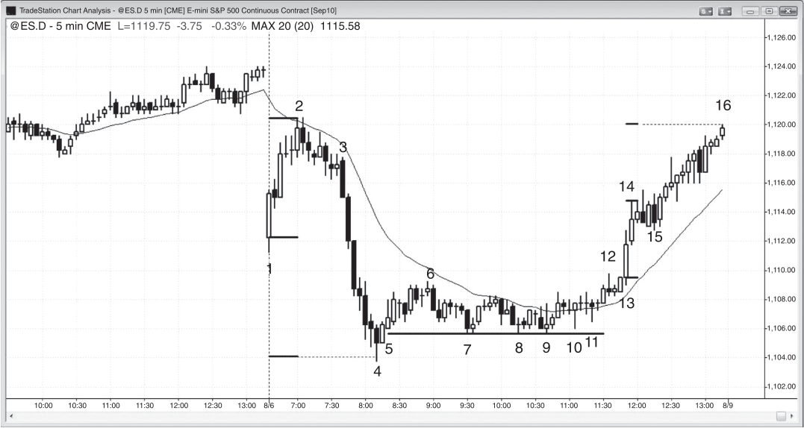
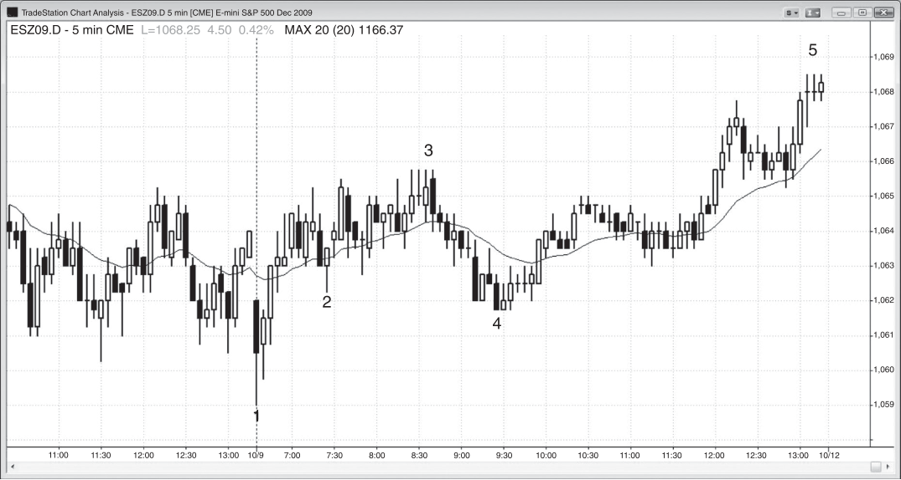
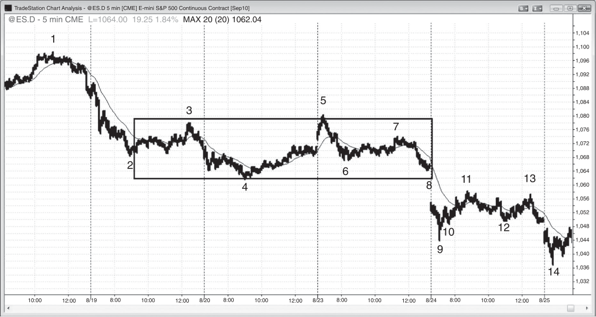

### 第25章 趋势恢复日

<!-- Source PDF pages 455–462 -->
<!-- English: CHAPTER 25 Trend Resumption Day -->

<!-- PDF page 455 -->

趋势恢复日的主要特征：
r 当日在最初一小时左右有强趋势，然后进入震荡区间。
r 震荡区间持续数小时，常使交易者以为当日会安静到收盘。
r 趋势在最后一两个小时恢复。
r 第二段常常与第一段规模大致相当。
r 冗长的震荡区间常常是非常窄幅的震荡区间。
r 常在当日较晚时从震荡区间出现突破，试图反转趋势，但通常是陷阱。市场随后反转并朝相反方向突破直至收盘。当震荡区间异常窄时，陷阱更可能发生。
r 对那些未更早入场或未在突破时入场的交易者，常有突破回撤入场。
有时最初一小时左右会有强趋势，然后市场横盘数小时。每当发生这种情况——尤其是若横盘处于非常窄幅的震荡区间中——当日很可能正在成为趋势恢复日。不要对无聊的午盘震荡区间放弃希望，因为最后一小时左右可能有强趋势。突破通常与较早趋势同向，但有时可能反向，使当日变成反转日。例如，若开盘即趋势是空头趋势，通常会有从震荡区间向下的迟突破，且当日 <!-- PDF page 456 --> 常在高点附近开盘、低点附近收盘。经常在太平洋时间上午 11 点到中午之间出现短暂的一到两根强反转突破K线，但会失败，把交易者困在错误（做多）方向，通常随后朝另一方向突破。这发生得很快，但如果你有所预期，就有机会抓住收盘前的大空头行情。较少情况下，反转突破成功，最后一小时的趋势（若有）可能回撤开盘空头趋势的全部或部分。
午盘的横盘不必是窄幅震荡区间，它常常有双向可交易的段落。有时有三段逆势、懒散的推动，形成楔形旗形。另一些时候第三段未能超过第二段，形成头肩旗形（大多数头肩反转形态失败并成为延续形态）。由于该形态常有三段而非两段推动，它会把交易者从开盘仓位中困出局，使其以为这波逆势行情实际上可能是新的、相反的趋势。然而，不要让自己被困出局，并准备在看到好的形态时入场，方向与上午趋势相同。
交易者在双向分批加仓，在某一点许多人达到最大仓位。一旦出现突破，亏损一方不能再加仓，他们的选择只剩希望和被止损出局。例如，若上午有强空头趋势，然后市场横盘，多头和空头都会在接下来数小时的震荡区间中继续加仓，许多人会达到愿意持有的最大规模。一旦市场开始向下突破，多头不能再继续买入。随着大量多头不再能买入，空头没有对手。随着市场下跌，它常会加速，因为越来越多的多头放弃并卖出亏损的多单，加剧收盘前的崩跌。这类日子的难点在于，安静的午盘横盘常让交易者放弃当日，而事实上他们应把这视为机会。只需准备好入场。该形态的最佳形态每月只出现几次。
除了午盘震荡区间之外，市场有时会形成持续数小时的弱趋势逆势运动，让交易者怀疑当日是反转日而非趋势恢复日。可能正在形成的是弱的趋势恢复日，感觉更像震荡日，但最终一端开盘、另一端收盘。留意开盘趋势在最后一小时恢复，并准备入场。例如，若开盘有强劲抛售，然后是较低动能的三段向上反弹，回撤了最初抛售的部分甚至全部，要准备好突破该多头通道下方并恢复空头趋势直至收盘。若多头通道顶部突破后反转回落，这可能是收盘前趋势的好波段做空入场。或者，可能有看起来像在通道下方突破时风险较低的好做空形态。

<!-- PDF page 457 -->

否则，你可以等待空头趋势恢复，然后在突破回撤或均线附近回撤时寻找入场。尽管 5 分钟图可能看起来像震荡区间，在更高时间框架图上可能像 ABC，若市场在低点附近收盘，当日将在日线图上形成空头趋势K线。
趋势恢复形态常常跨越两天或更多天。虽然 5 分钟图在那些日子里可能看起来有巨大波动，它们可能在 60 分钟图上形成简单的 ABC。例如，若昨日有持续数小时的强多头尖峰，然后进入震荡区间，且该震荡区间今日又持续数小时，昨日的趋势可能在任何时点恢复。如果你意识到这一点，你更可能愿意把仓位的更大一部分做波段，以捕捉可能的大行情。

<!-- PDF page 458 -->

图 25.1

图 25.1
跳空高开后的缺口测试
在大跳空日，市场常在趋势开始前测试开盘。在图 25.1 中，市场大幅跳空高开，然后出现对低点的双底测试，随后大涨至 K线 3。从那里起，它在窄区间中交易超过三小时，使交易者以为好交易已经结束。K线 6 从空头趋势通道线下方的一次刺穿反转向上，也比 K线 4 信号K线高点低 1 个 tick。这困住了一些做空的空头，并把许多多头困在其多单之外。收盘前上涨的信号K线是当日第一根均线缺口K线。
还有几次其他做多机会，如在 K线 7、9 和 10 从微型趋势线下方的失败突破反转向上。
对本图的深入讨论
在图 25.1 中，K线 7 是 High 2 入场，也是对小型多头趋势线一次 1 tick 突破的向上反转。K线 1 是 High 1 入场。
K线 8 是 High 2 变体（空-多-空K线：K线 7 后的第一根有空头实体，因此是第一次向下推动；下一根有多头实体，因此向上交易；随后一根再次有空头实体，为第二次向下推动）。

<!-- PDF page 459 -->

图 25.2

图 25.2
窄幅震荡区间然后反转
有时强趋势之后的窄幅震荡区间可能导致反转而非趋势恢复。在图 25.2 中，今日从 K线 3 有强劲抛售，然后进入窄幅震荡区间数小时。这常常导致收盘前空头趋势恢复，最终抛售常常与最初的一样大。在最终空头段开始之前，常有区间顶部的失败突破。K线 12 是波段做空的完美形态，因为它是一根在当日较晚时突破窄幅震荡区间顶部的空头反转K线。然而，下一根不是大空头行情的入场K线，而是小的多头内包K线，因此是突破回撤做多形态。K线 12 突破了，而这根内包K线是停顿，停顿是一种回撤。
对本图的深入讨论
在图 25.2 中，当日大幅跳空低开并有强多头反转K线，构成失败突破做多以及可能的开盘即趋势多头日。
K线 13 和 14 是大的多头趋势K线，形成两K线突破。任何突破之后常跟随基于尖峰的等幅运动。通常基于尖峰第一根K线的开盘或低点到最后一根K线的收盘或高点的高度。当日收盘高点位于从 K线 13 开盘到 K线 14 高点的等幅运动处。

<!-- PDF page 460 -->

图 25.2
大多数趋势恢复空头日开盘没有大反弹，而那次大反弹表明多头今日愿意积极买入。即使日中完美地设置了收盘前大抛售，你也永远不能确定，总有大约 40% 的概率会发生完全相反的情况。另一个可能反弹测试当日开盘的线索是：当日低点几乎是从当日开盘到最初反弹顶部的完美等幅运动向下。这意味着当日开盘处于当日波幅的中部。若市场能回到那里，当日可能接近十字星日，这相当常见。注意市场反复精确测试 K线 7 低点处的支撑线，并持续找到买家。在 K线 8 之后的内包K线、K线 9 之后的内包K线，以及 K线 9 和 11 的更高低点处，有双底回撤做多形态。
该支撑线在预期的卖盘高潮回撤的最初 K线 5 入场K线下方 1 个 tick。K线 5 是当日低点两K线反转形态上方的入场K线。市场把该入场K线下方的止损打掉了 1 个 tick，但尽管多次尝试，它无法再往下走。这是强多头在运作的信号。买盘和卖盘程序在整个窄幅震荡区间中持续存在，但最终买盘程序压倒了卖盘程序。所有这些空头都必须买回，这增加了买盘压力。此外，许多卖盘程序反转为买盘程序，进一步增加了买盘。K线 14 和 15 向上尖峰之后，是进入收盘的通道。

<!-- PDF page 461 -->

图 25.3

图 25.3
趋势恢复
即使最初的反弹可能只有几根强趋势K线，看起来像在通向震荡日，趋势恢复仍然可能很强。在图 25.3 中，市场从扩张三角形底部和对昨日低点的失败突破向上反弹时，成为开盘即趋势多头趋势。它随后运行了两根K线，但在昨日震荡区间中部停滞。任何三段推动形态之后的反弹通常至少带来两段向上，这里最终确实发生了。K线 2 是突破回撤，导致另一小段反弹，但随后市场失去动能。它继续在均线上方弱趋势运行，直到 K线 3。此时，显然有些不对。开盘即趋势多头趋势是最强的趋势形式之一，但这显然没有强趋势。这意味着交易者很快会决定当日不是他们所想的那样，他们会退出并等待。他们随后会寻找震荡日和可能的当日新低。K线 2 低点之后可能形成双底多头旗形，但在缺乏早期强多头的情况下，空头会积极推动当日新低，K线 2 低点很可能失败。K线 4 是 K线 2 下方第二次小推动，随后是趋势运行至收盘，形成趋势恢复多头日——尽管偏弱——并给出了从扩张三角形底部预期的第二段向上。K线 4 是对开盘即趋势信号K线高点的精确突破回测。

<!-- PDF page 462 -->

图 25.4

图 25.4
数日之后的趋势恢复
趋势恢复可以跨越数日发生。在图 25.4 中，市场强劲下跌至 K线 2，然后进入持续两天半的震荡区间。震荡区间可以持续很久，但通常朝趋势方向突破。空头趋势恢复，并从 K线 5 到 K线 14 出现第二段向下，发生在第一段下跌五天之后。
从 K线 5 到 K线 6 的空头段之后是震荡区间，第二段向下在次日开盘 K线 9 处结束。
从 K线 7 到 K线 9 的抛售之后是到 K线 13 的震荡区间，空头趋势恢复以跌至 K线 14 的运动发生。这是一个为期三天的趋势恢复形态。
