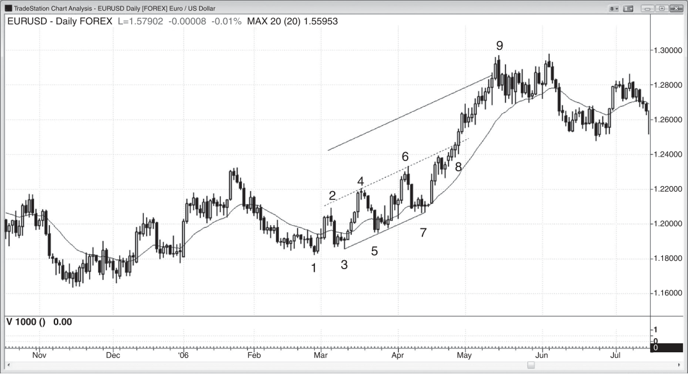
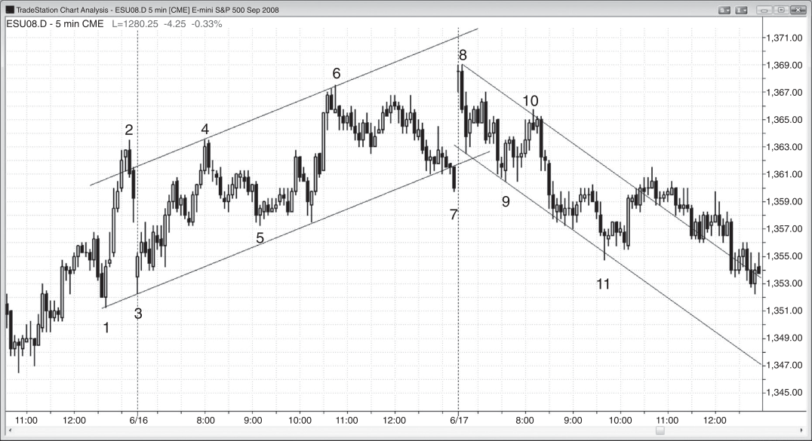

### 第26章 阶梯：宽通道趋势

<!-- Source PDF pages 463–468 -->
<!-- English: CHAPTER 26 Stairs: Broad Channel Trend -->

<!-- PDF page 463 -->

阶梯日的主要特征：
r 阶梯日是趋势型震荡日的一种变体，其中至少有三个震荡区间。
r 当日波动幅度较大，但高点和低点呈趋势排列。
r 由于波动较大，交易者通常可以双向交易，但应尽量把顺势交易的部分或全部仓位做波段。
r 几乎每一次突破之后都会出现回撤（突破回测），使相邻摆动之间出现一定重叠。例如，在宽幅空头通道中，每一次创新低的突破之后都会有一波反弹，回到突破点上方，但仍低于最近的摆动高点。不过有时会有一两次摆动略微超过前一个摆动高点。这会让一些交易者怀疑市场是否在反转，但趋势通常很快就会恢复。
r 如果每一次突破都比前一次略小，则为收缩阶梯形态，是动能减弱的信号，可能导致更大级别的调整。
当市场出现一系列三个或更多、类似轻微倾斜震荡区间或通道的趋势摆动时，多头和空头都在积极交易，但一方控制力稍强。每一次回撤都会回撤超过其突破点，使每一次突破尖峰与随后的回撤之间出现重叠。宽通道内存在双向交易，因此交易者可以寻找双向入场。如果突破越来越小，则 <!-- PDF page 464 --> 这就是收缩阶梯形态，表明动能在减弱。它经常导致两段式反转和趋势线突破。许多三段推动反转符合阶梯或收缩阶梯趋势失败并反转的情形。阶梯常常只是更高时间框架趋势中的回撤或旗形，很常见的是在当日最后一两个小时出现阶梯，然后在次日开盘时旗形突破。例如，今日的宽幅多头通道可能只是一个大型空头旗形，空头趋势可能在明日突破。
或者，某一级阶梯可能突然加速，并顺势突破趋势通道。若随后反转，这种超调与反转很可能至少带来两段运动。若不反转，突破很可能再延续至少两段，或至少大约等于通道高度的不精确等幅运动（通道外的距离应与通道内的距离大致相同）。
交易者会关注突破越过最近摆动点多少个 tick，然后用该数字去逆势交易后续突破，预期出现突破回测。例如，若最近一个摆动低点跌到前一个摆动低点下方约 14 个 tick，交易者会从最近摆动低点下方约 10 个 tick 附近开始分批做多，该位置通常就在趋势通道线附近。如果最近一次突破后的回撤约为 15 个 tick，他们会在低点上方约 10 到 15 个 tick 附近止盈，该位置通常就在趋势线（空头通道顶部）附近。

<!-- PDF page 465 -->

图 26.1

图 26.1
空头阶梯
空头阶梯形态是一个向下倾斜的通道，每一次创新低的突破之后都会有回撤回到突破点上方。例如，在图 26.1 中，K线 6 下方下破至 K线 9 的突破段之后，出现了回到 K线 7 低点上方的回撤；跌破 K线 9 下至 K线 13 的一段之后，回撤又回到 K线 9 突破点上方，与前一区间重叠。
一些交易者在趋势通道线附近做多，在趋势线附近做空。另一些交易者关注突破走多远之后才出现回撤。例如，K线 5 的低点大约在 K线 3 低点下方 4 个点。激进的多头在 K线 5 低点下方约 3 到 4 个点处挂限价买单。在跌至 K线 7 时他们没有成交。然而，当市场跌破 K线 7 时，他们再次在下方 3 到 4 个点挂限价买单，并在跌至 K线 9 时成交，K线 9 的低点在 K线 7 低点下方 4 个点。由于之前的反弹大约是 4 个点，他们在入场上方约 3 个点处止盈。在跌至 K线 11 和 K线 16 时他们做了同样的事。在跌至 K线 13 时他们也尝试了，但市场跌得不够深，订单未能成交。空头则相反。他们看到过去的反弹大约是 4 到 6 个点，于是在最近摆动低点上方约 3 到 5 个点处分批做空，该区域就在空头趋势 <!-- PDF page 466 --> 图 26.1
线附近。这种交易方式只适合有经验的交易者。初学者应只使用止损入场，这样市场已经朝其方向运动（第二本书中会讨论）。
K线 7 是第三次向下推动，也是一个收缩阶梯（它在 K线 5 下方延伸的幅度小于 K线 5 在 K线 3 下方延伸的幅度）。通道线按最佳拟合线画出，以突出市场正在下跌并处于通道中。这里显然存在双向交易，当交易者看到合适的形态时，应在低点买入、在高点卖出。
对本图的深入讨论
在图 26.1 中，市场在昨日开始的空头通道底部附近开盘，并向下突破该通道。突破以两K线反转失败，随后出现四根多头尖峰K线。在测试空头趋势线（按最佳拟合趋势通道线的平行线画出）的双顶之后，市场尖峰下跌至 K线 13。在多头与空头尖峰并存的情况下，双方在争夺预期通道的方向。多头开启了一个通道，但在趋势线处失败，并反转向下进入空头通道。市场在测试趋势通道线时反转向上，K线 16 的低点未能触及该线。这是积极买盘的信号。K线 16 的两K线反转也是来自 K线 15 四根最后旗形K线的最后旗形做多形态。三段向下推动并不保证趋势反转。跌至 K线 7 的过程中买盘压力非常小。没有大的多头趋势K线，也没有强的高潮反转。从 K线 7 向上的运动也并不特别强。这不是强反转通常的样子，因此没有吸引足够强的多头来反转市场。相反，市场形成了楔形空头旗形（K线 6 以及从 K线 7 向上的两段小推动构成三次推动）和更低高点（尽管反弹超过了 K线 6，因此是某种强度的信号，但仍低于 K线 4），随后空头趋势恢复。

<!-- PDF page 467 -->

图 26.2

图 26.2
阶梯加速成强趋势
阶梯形态可以加速成更强的趋势（见图 26.2）。到 K线 7 时，EUR/USD 外汇图表已在通道中形成三个更高高点和更高低点，因此构成了阶梯型多头趋势。
K线 8 是一根突破通道顶部的多头趋势K线，随后出现一根从未触发做空的空头反转K线。突破应延伸到大约等幅运动至一条平行线，该线到中线的距离约等于中线到底线的距离（安德鲁干草叉式运动），而市场确实做到了。当楔形顶部失败时，这种向上加速很典型。到 K线 6 结束时有三段向上推动，但如果你从到 K线 4 的强多头尖峰重新计数，也可以把 K线 8 之前的小摆动高点视为第三次向上推动。失败的楔形之后出现了大约等于楔形高度（K线 6 高点到 K线 3 或可能 K线 1 低点）的等幅运动向上。

<!-- PDF page 468 -->

图 26.3

图 26.3
收缩阶梯
当每一次突破都比前一次更小时，趋势动能在减弱，更深的回撤或反转可能即将出现。图 26.3 显示了一个多头阶梯形态，有三个或更多趋势性的更高高点与更高低点，大致包含在一条粗略画出的通道内。K线 4、6 和 8 形成了收缩阶梯，代表多头动能丧失，并预示反转。该通道功能像一个大型空头旗形，空头突破发生在 K线 9。
K线 9 突破之后，出现了到 K线 10 的更低高点突破回撤，并形成了阶梯式空头趋势。K线 10 与跌至 K线 9 过程中第一次回撤的高点大致构成双顶空头旗形。
K线 11 向下超调空头通道，并导致一个小的两段式向上反转，以及预期中的对通道顶部的穿透。
一旦市场开始形成向下的阶梯，你通常可以在每一根强趋势K线突破的收盘处做逆势剥头皮。对每一根收盘低于前一级空头阶梯的空头趋势K线做多剥头皮。同样，在多头阶梯中，你可以在任何超过前一级阶梯高点的趋势K线收盘处剥头皮做空。不过总的来说，更安全的是在市场反转时用止损入场（例如，若市场从通道底部反转向上，在前一根K线上方用止损买入）。
